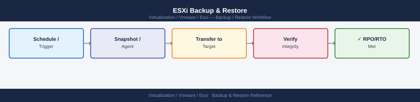

---
tags:
  - esxi
  - operations
  - vmware
  - vsphere-8
---
# ESXi Backup & Restore

ESXi backup and restore: VM-level backup via vStorage APIs for Data Protection, ESXi host config backup with `vim-cmd hostsvc/firmware/backup_config`, and restore procedure.

*Applies to: vSphere 7.x / 8.x*

ESXi Backup & Restore Flow

The configuration bundle includes network settings, storage policies, service state, and advanced settings. It does not include VMFS datastores or VM data.

## Before you begin

- **Access:** vCenter read-only minimum; Administrator role for remediation steps
- **Timing:** safe to run during business hours unless a step is marked ⚠ (causes interruption)
- **Dependencies:** no active upgrades or migrations on the same infrastructure
- **Logging:** capture command output — paste into the change record on completion

---

## VM-Level Backup

VM backup is handled by the backup solution (e.g., Veeam Backup & Replication) using VMware VADP. See the [integration page](../architecture/integrations.md) for transport mode details.

Key requirements:
- Changed Block Tracking (CBT) enabled on VMs
- Snapshot quiescing configured for consistent backups of databases
- Backup proxy with sufficient throughput for the backup window

---

## See also

- [ESXi — Procedures](../procedures/)
- [ESXi — Common Issues](../../troubleshooting/common-issues/)
- [ESXi — Health Checks](../health-checks/)

## Verify

- **Alarms:** vSphere Client → Home → Alarms — no new critical alarms after the operation
- **Events:** monitor the vCenter Events view for the affected object for 5 minutes
- **Health check:** run the morning health-check sequence for the affected product tier
