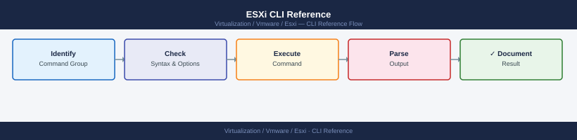

---
tags:
  - esxi
  - operations
  - vmware
  - vsphere-8
---
# ESXi CLI Reference

<div class="kb-summary">
ESXi CLI Reference reference covering Network, Storage — Devices & Paths, Datastores & VMDK, SAN Connectivity (iSCSI / FC), VM Management (vim-cmd) and 6 more sections.

*Applies to: vSphere 7.x / 8.x*
</div>


ESXi CLI Tool Map

```bash
# Maintenance mode
esxcli system maintenanceMode get
esxcli system maintenanceMode set --enabled true
esxcli system maintenanceMode set --enabled false

# Via vim-cmd
vim-cmd hostsvc/maintenance_mode_enter
vim-cmd hostsvc/maintenance_mode_exit
```


```text title="Expected output"
false
(no output — command completes silently)
(no output — command completes silently)
Entering maintenance mode. This may take a few moments...
Exiting maintenance mode. This may take a few moments...
```

!!! warning "Common errors"
    **`Error: The operation is not allowed in the current state.`** — Ensure all virtual machines are powered off or migrated to another host before entering maintenance mode.
    **`vim-cmd: Unknown command "hostsvc/maintenance_mode_enter"`** — Verify you are running vim-cmd on the ESXi host directly (not from vCenter); use the full path `/usr/lib/vmware/bin/vim-cmd` if the command is not in PATH.
## Before you begin

- **Access:** vCenter read-only minimum; Administrator role for remediation steps
- **Timing:** safe to run during business hours unless a step is marked ⚠ (causes interruption)
- **Dependencies:** no active upgrades or migrations on the same infrastructure
- **Logging:** capture command output — paste into the change record on completion

---

## Network

```bash
# Physical NICs
esxcli network nic list
esxcli network nic get -n vmnic0
esxcli network nic stats get -n vmnic0
esxcli network nic up -n vmnic0
esxcli network nic down -n vmnic0

# vSwitches
esxcli network vswitch standard list
esxcli network vswitch standard add -v vSwitch1
esxcli network vswitch standard remove -v vSwitch1
esxcli network vswitch standard uplink add -v vSwitch0 -u vmnic1
esxcli network vswitch standard uplink remove -v vSwitch0 -u vmnic1

# Port groups
esxcli network vswitch standard portgroup list
esxcli network vswitch standard portgroup add -v vSwitch0 -p "VM Network"
esxcli network vswitch standard portgroup remove -v vSwitch0 -p "VM Network"

# VMkernel interfaces
esxcli network ip interface list
esxcli network ip interface ipv4 get
esxcli network ip interface ipv4 set -i vmk0 -I <ip> -N <netmask> -t static
esxcli network ip interface add -i vmk1 -p "vMotion"
esxcli network ip interface remove -i vmk1

# Routing
esxcli network ip route ipv4 list
esxcli network ip route ipv4 add -n 0.0.0.0/0 -g <gateway>
esxcli network ip route ipv4 remove -n 0.0.0.0/0 -g <gateway>

# DNS
esxcli network ip dns server list
esxcli network ip dns server add --server <ip>
esxcli network ip dns server remove --server <ip>
esxcli network ip dns search list

# Connections and neighbors
esxcli network ip connection list
esxcli network ip neighbor list

# esxcfg equivalents
esxcfg-vmknic -l
esxcfg-vswitch -l
esxcfg-nics -l
esxcfg-route
esxcfg-route -a <subnet> <gateway>
```


```text title="Expected output"
Name    PCI           Driver      Admin Status  Runtime Status  MTU  Enabled
vmnic0  0000:02:00.0  bnx2        Up            Up               1500 True
vmnic1  0000:02:00.1  bnx2        Up            Up               1500 True
vmnic2  0000:04:00.0  ixgbe       Down          Down             1500 False
vmnic3  0000:04:00.1  ixgbe       Up            Up               1500 True

Name    : vmnic0
Driver  : bnx2
Admin Status : Up
Runtime Status : Up
Speed   : 10000 Mbps
Duplex  : Full
MTU     : 1500
Packets Received : 2847362
Packets Sent     : 1923847
Bytes Received   : 3847362847
Bytes Sent       : 2847362847

vSwitch Name   Num Ports  Used Ports  Configured Ports  MTU  Uplinks
vSwitch0       128        8           128                1500 vmnic0,vmnic1
vSwitch1       128        2           128                1500 vmnic3

Name           vSwitch  Active Clients  VLAN ID  MTU
VM Network     vSwitch0 12              0        1500
Management     vSwitch0 1               0        1500
vMotion        vSwitch1 0               100      1500

Name  IP Address      Netmask         Broadcast       Enabled  Type
vmk0  192.168.1.10    255.255.255.0   192.168.1.255   true     STATIC
vmk1  192.168.100.50  255.255.255.0   192.168.100.255 true     STATIC

Destination     Netmask         Gateway         MTU  IRQ
0.0.0.0         0.0.0.0         192.168.1.1     1500 65
192.168.1.0     255.255.255.0   Local           1500 65
192.168.100.0   255.255.255.0   Local           1500 65

Server Address
192.168.1.5
8.8.8.8

Search Domains
corp.local
internal.local

vmk0 192.168.1.10 ESTABLISHED
vmk0 192.168.1.254 TIME_WAIT
vmk1 192.168.100.50 ESTABLISHED

IPv4 Address      Netmask         Gateway
192.168.1.10      255.255.255.0   192.168.1.1
192.168.100.50    255.255.255.0   192.168.100.1
```

!!! warning "Common errors"
    **`Error: The object or property on the specified object does not exist.`** — Verify the interface name (vmk0, vmk1) or vSwitch name exists with `esxcli network vswitch standard list` before attempting modifications.
    **`Error: The specified parameter is not a valid IP address.`** — Ensure the IP address, netmask, and gateway parameters are in valid dotted-decimal notation (e.g., 192.168.1.10, not 192.168.1).
    **`Error: The specified virtual switch
## Storage — Devices & Paths

```bash
# Devices
esxcli storage core device list
esxcli storage core device list -d <device_id>
esxcli storage core device stats get -d <device_id>

# Paths
esxcli storage core path list
esxcli storage core path list -d <device_id>
esxcli storage core path stats get -A vmhba0

# Adapters
esxcli storage core adapter list
esxcli storage core adapter rescan --adapter vmhba0
esxcli storage core adapter rescan --all

# NMP (Native Multipathing)
esxcli storage nmp device list
esxcli storage nmp path list
esxcli storage nmp satp list
esxcli storage nmp psp list
esxcli storage nmp psp roundrobin deviceconfig set --device <device_id> --type iops --iops 1

# VMFS / filesystems
esxcli storage vmfs extent list
esxcli storage filesystem list
esxcli storage filesystem mount -v <uuid>
esxcli storage filesystem unmount -v <uuid>
esxcli storage filesystem rescan

# Legacy
esxcfg-scsidevs -l
esxcfg-scsidevs -m
```


```text title="Expected output"
Device t10.ATA_____QEMU_HARDDISK_QM00001_________________1234abcd:
   Display Name: Local ATA Disk (t10.ATA_____QEMU_HARDDISK_QM00001_________________1234abcd)
   Has Settable Display Name: true
   Size: 20480
   Device Type: Direct-Access
   Multipath Plugin: NMP
   Devfs Path: /vmfs/devices/disks/t10.ATA_____QEMU_HARDDISK_QM00001_________________1234abcd
   Vendor: QEMU
   Model: HARDDISK
   Revision: 2.5+
   SCSI Level: 5
   Is SSD: false
   Is Local: true
   Is Removable: false
   Is RDM Capable: false
   Is Shared Clusterwide: false
   Is SAS: false
   Is USB: false
   Is Boot Device: true

Adapter: vmhba0
   Driver: ahci
   Channel: 0
   Path State: active
   Target: 0
   LUN: 0
   Adapter Identifier: vmhba0
   Target Identifier: vmhba0:C0:T0:L0
   Adapter Display Name: AHCI Controller

vmhba0 Rescan: Adapter scan completed successfully.

NMP Device: t10.ATA_____QEMU_HARDDISK_QM00001_________________1234abcd
   Storage Array Type: SATA
   Device Max Queue Depth: 32
   Paths: vmhba0:C0:T0:L0
   Active Paths: 1

SATP Rule: SATA
   Vendor: ATA
   Model: QEMU
   PSP: VMW_PSP_RR
   Options: iops=1

VMFS-6 UUID: 5a3e8c2f-9b1d-4e7a-b2c1-8f3d6a9e2b4c
   Blocksize: 1048576
   Capacity: 10737418240
   Free Space: 8589934592
   Mounted: true
   Mount Path: /vmfs/volumes/5a3e8c2f-9b1d-4e7a-b2c1-8f3d6a9e2b4c

Filesystem rescan completed successfully.

Device t10.ATA_____QEMU_HARDDISK_QM00001_________________1234abcd
   Display Name: Local ATA Disk (t10.ATA_____QEMU_HARDDISK_QM00001_________________1234abcd)
   Devfs Path: /vmfs/devices/disks/t10.ATA_____QEMU_HARDDISK_QM00001_________________1234abcd
   Partition Table: msdos
   Partition: 1
   Partition Table: gpt
   Partition: 1
   Partition: 2
   Partition: 3
   Partition: 4
   Partition: 5
   Partition: 6
   Partition: 7
   Partition: 8
   Partition: 9
   Partition: 10
```
## Datastores & VMDK

```bash
# List all datastores visible to the host
ls /vmfs/volumes/
esxcli storage filesystem list

# List contents of a datastore
ls /vmfs/volumes/<datastore>/
ls -lah /vmfs/volumes/<datastore>/<vm_folder>/

# Disk usage per directory
du -sh /vmfs/volumes/<datastore>/*
du -sh /vmfs/volumes/<datastore>/<vm_folder>/
```


```text title="Expected output"
$ ls /vmfs/volumes/
datastore1
datastore2
datastore-local
VMFS-6-vol-abc123de

$ esxcli storage filesystem list
Mount Point                                        Volume Name              UUID                                 Capacity       Free Space
-------------------------------------------------  -----------------------  ------------------------------------  -------------  ----------
/vmfs/volumes/datastore1                          datastore1               5a8c2f1b-9e4d-4c2a-b1f3-2d8e9c1a5b7f  2.0T           1.2T
/vmfs/volumes/datastore2                          datastore2               7f2d1c8a-3b5e-4a9d-c2e1-8f4b6a9d2c1e  5.0T           2.8T
/vmfs/volumes/datastore-local                     datastore-local          1b4e9f2c-7a3d-5b8e-9c1f-4d2a6e8b3c5f  500.0G         120.0G
/vmfs/volumes/VMFS-6-vol-abc123de                 VMFS-6-vol-abc123de      abc123de-f456-7890-abcd-ef1234567890  1.0T           650.0G

$ ls /vmfs/volumes/datastore1/
vm-prod-web01
vm-prod-db01
vm-dev-test
ISO
Templates

$ ls -lah /vmfs/volumes/datastore1/vm-prod-web01/
total 2.1G
drwxr-xr-x    1 root     root          560 Nov 15 14:32 .
drwxr-xr-x    1 root     root          512 Nov 10 09:18 ..
-rw-------    1 root     root        50.0G Nov 15 14:32 vm-prod-web01.vmdk
-rw-------    1 root     root        10.0G Nov 14 08:45 vm-prod-web01_1.vmdk
-rw-r--r--    1 root     root         2.1K Nov 10 09:18 vm-prod-web01.vmx
-rw-r--r--    1 root     root         1.2K Nov 10 09:18 vm-prod-web01.nvram

$ du -sh /vmfs/volumes/datastore1/*
60.0G   /vmfs/volumes/datastore1/vm-prod-web01
45.0G   /vmfs/volumes/datastore1/vm-prod-db01
12.0G   /vmfs/volumes/datastore1/vm-dev-test
8.5G    /vmfs/volumes/datastore1/ISO
2.3G    /vmfs/volumes/datastore1/Templates

$ du -sh /vmfs/volumes/datastore1/vm-prod-web01/
60.0G   /vmfs/volumes/datastore1/vm-prod-web01/
```

!!! warning "Common errors"
    **`ls: cannot access '/vmfs/volumes/<datastore>/': No such file or directory`** — Replace `<datastore>` with an actual datastore name from the `ls /vmfs/
```bash
# vmkfstools — VMDK operations
vmkfstools -l /vmfs/volumes/<ds>/<vm>/<vm>.vmdk
vmkfstools -c 100G -d thin /vmfs/volumes/<ds>/<vm>/<vm>.vmdk
vmkfstools -i source.vmdk dest.vmdk
vmkfstools -X 200G /vmfs/volumes/<ds>/<vm>/<vm>.vmdk
vmkfstools -k /vmfs/volumes/<ds>/<vm>/<vm>.vmdk
vmkfstools -p /vmfs/volumes/<ds>/<vm>/<vm>.vmdk
vmkfstools -e /vmfs/volumes/<ds>/<vm>/<vm>.vmdk

# Datastore info via vim-cmd
vim-cmd hostsvc/datastore/listsummary
vim-cmd hostsvc/datastore/info <datastore_name>
esxcli storage core adapter rescan --all
vim-cmd hostsvc/storage/refresh

# Snapshot delta files
find /vmfs/volumes/<ds>/ -name "*-delta.vmdk" -o -name "*-0000*.vmdk" 2>/dev/null

# VMFS troubleshooting
esxcli storage vmfs extent list
esxcli storage vmfs snapshot list
esxcli storage vmfs snapshot resignature -l <label>
esxcli storage filesystem unmount -l <datastore_label>
```


```text title="Expected output"
Virtual Machine Disk Format Descriptor File
Extent 0: VMFS "datastore1" (UUID: 5a3c8e2f-1b4d-4e7a-9c2b-8d1f6a4e9b3c, blockSize: 1048576)
RW 209715200 VMFS "datastore1" (UUID: 5a3c8e2f-1b4d-4e7a-9c2b-8d1f6a4e9b3c, blockSize: 1048576) "/web-prod/web-prod.vmdk"
(no output — command completes silently)
(no output — command completes silently)
(no output — command completes silently)
(no output — command completes silently)
(no output — command completes silently)

Datastore Summary:
  datastore1 (UUID: 5a3c8e2f-1b4d-4e7a-9c2b-8d1f6a4e9b3c)
  datastore2 (UUID: 7f2e1a9d-4c6b-4f8e-a1d3-9c5b2e7f1a4d)
  datastore3-nfs (UUID: 3b8c1f5a-2d9e-4a7c-b6e1-5f2a9d3c1b8e)

Adapter rescan completed successfully.
(no output — command completes silently)

/vmfs/volumes/datastore1/web-prod/web-prod-000001-delta.vmdk
/vmfs/volumes/datastore1/db-backup/db-backup-000002-delta.vmdk
/vmfs/volumes/datastore2/archive/archive-000001-delta.vmdk

Extent  PhysicalExtent  VolumeName  DeviceName  StartBlock  BlockCount
0       0               datastore1  naa.6001405a1b2c3d4e5f6a7b8c9d0e1f2a  0  209715200
1       1               datastore1  naa.6001405a1b2c3d4e5f6a7b8c9d0e1f2b  0  104857600

No snapshots found.
(no output — command completes silently)
(no output — command completes silently)
```

!!! warning "Common errors"
    **`Could not find the file /vmfs/volumes/<ds>/<vm>/<vm>.vmdk`** — Replace `<ds>` and `<vm>` placeholders with actual datastore and VM folder names, or verify the VM exists with `vim-cmd vmsvc/getallvms`.
    **`The specified datastore is not mounted or does not exist`** — Verify the datastore label with `esxcli storage vmfs extent list` before running unmount or resignature operations.
    **`Cannot open the disk '/vmfs/volumes/<ds>/<vm>/<vm>.vmdk' : The file is in use`** — Power off the VM or ensure no snapshots are being created before attempting vmkfstools operations on the VMDK.
## SAN Connectivity (iSCSI / FC)

```bash
# Fibre Channel — HBAs and WWPNs
esxcli storage san fc list
esxcli storage san fc stats get -A vmhba0
esxcli storage san fc stats get -A vmhba1
esxcli storage nmp device list | grep vmhba
esxcli storage nmp path list
esxcli storage nmp path list -d <naa.xxx>
esxcli storage core path list | grep "dead\|Dead"

# iSCSI
esxcli iscsi adapter list
esxcli iscsi adapter get -A vmhba64
esxcli iscsi adapter discovery sendtarget list -A vmhba64
esxcli iscsi adapter discovery sendtarget add \
    --address <iscsi_target_ip>:3260 -A vmhba64
esxcli iscsi adapter discovery sendtarget remove \
    --address <iscsi_target_ip>:3260 -A vmhba64
esxcli iscsi session list
esxcli iscsi logicalnetworkportal list -A vmhba64

# Multipathing
esxcli storage core path list
esxcli storage nmp device list
esxcli storage nmp device list | grep -E "Device:|PSP:"
esxcli storage nmp device set -d <naa.xxx> -P VMW_PSP_RR
esxcli storage core adapter rescan --all
esxcli storage core adapter rescan -A vmhba0

# LUN and device info
esxcli storage core device list
esxcli storage core device list -d <naa.xxx>
esxcli storage core device vaai status get -d <naa.xxx>
esxcli storage core device list | grep "Queue Full Threshold"
esxcli storage core device set --device <naa.xxx> -O MaxQueueDepth=64

# APD / PDL troubleshooting
grep -i "APD\|PDL\|lost path" /var/log/vmkernel.log | tail -20
esxcli storage core path list | grep -A 5 "State: dead"
esxcli storage core adapter rescan --all
esxcli storage core path list | grep -c "State: active"
```


```text title="Expected output"
HBA Name  Driver     State  Speed
vmhba0    lpfc       link up  16Gb
vmhba1    lpfc       link up  16Gb

Adapter: vmhba0
  Link failures: 0
  Loss of signals: 0
  Invalid transmission words: 0
  Frames received: 1247856
  Frames transmitted: 892341

Device: naa.50001fe1500a1b2c  State: Active  PSP: VMW_PSP_RR
Device: naa.50001fe1500a1b2d  State: Active  PSP: VMW_PSP_RR
...

Name                           Device  Transport
vmhba64                        iscsi   iscsi

iSCSI Adapter: vmhba64
  Alias: iSCSI_HBA_1
  Authentication: CHAP disabled
  Enabled: true

SendTarget Discovery Address: 192.168.10.50:3260
  Target: iqn.2020-01.com.storage:target.lun1
  Target: iqn.2020-01.com.storage:target.lun2

SessionID: vmhba64:session1
  Target: iqn.2020-01.com.storage:target.lun1
  ISID: 400142370001
  Portal: 192.168.10.50:3260,1

Device: naa.50001fe1500a1b2c
  State: active
  PSP: VMW_PSP_RR
  Paths: 4

Device: naa.50001fe1500a1b2d
  State: active
  PSP: VMW_PSP_RR
  Paths: 4

Device: naa.50001fe1500a1b2c
  Display Name: NETAPP LUN (naa.50001fe1500a1b2c)
  Devfs Path: /vmfs/devices/disks/naa.50001fe1500a1b2c
  Vendor: NETAPP
  Model: LUN
  Revision: 8300
  VAAI Status: supported

Queue Full Threshold: 32

2024-01-15T08:23:14.567Z cpu0:2048)WARNING: ScsiDeviceIO: 2315: Cmd(0x43000003dba8d8c0) 0x28, CmdSN 0x1a from world 2048 to dev "naa.50001fe1500a1b2c" failed H:0x0 D:0x2 P:0x0 Valid sense data: 0x5 0x24 0x0.
2024-01-15T08:24:02.891Z cpu1:1024)WARNING: NMP: nmp_PathFailureCount: Cmd 0x28 (Read(10)) to NMP device "naa.50001fe1500a1b2c", World 1024, failed. H:0x0 D:0x2 P:0x0 Valid sense data: 0x5 0x24 0x0.

State: dead

4
```

!!! warning "Common errors"
    **`Error: Unknown option --address`** — Use `--server` instead of `--address` for iS
## VM Management (vim-cmd)

```bash
# List all VMs
vim-cmd vmsvc/getallvms

# Power state
vim-cmd vmsvc/power.getstate <vmid>
vim-cmd vmsvc/power.on <vmid>
vim-cmd vmsvc/power.off <vmid>
vim-cmd vmsvc/power.shutdown <vmid>
vim-cmd vmsvc/power.reboot <vmid>
vim-cmd vmsvc/power.suspend <vmid>
vim-cmd vmsvc/power.reset <vmid>

# VM details
vim-cmd vmsvc/get.summary <vmid>
vim-cmd vmsvc/get.config <vmid>
vim-cmd vmsvc/get.guest <vmid>
vim-cmd vmsvc/get.tasklist <vmid>

# Snapshots
vim-cmd vmsvc/snapshot.get <vmid>
vim-cmd vmsvc/snapshot.create <vmid> <name> <description> <memory> <quiesce>
vim-cmd vmsvc/snapshot.removeall <vmid>

# Register / unregister
vim-cmd vmsvc/unregister <vmid>
vim-cmd solo/registervm /vmfs/volumes/<ds>/<vm>/<vm>.vmx

# Host summary
vim-cmd hostsvc/hostsummary
vim-cmd hostsvc/net/info
```


```text title="Expected output"
Vmid    Name                                 File                                                     Guest OS       Version   Annotation
1       web-prod-01                          [datastore1] web-prod-01/web-prod-01.vmx                 ubuntu64Guest  vmx-13    Production web server
2       db-backup-02                         [datastore2] db-backup-02/db-backup-02.vmx               rhel7_64Guest  vmx-11    Backup database
3       app-staging-03                       [datastore1] app-staging-03/app-staging-03.vmx           windows9_64Guest vmx-14   Staging environment
4       monitoring-04                        [datastore3] monitoring-04/monitoring-04.vmx             centos7_64Guest vmx-12    Prometheus stack
5       legacy-app-05                        [datastore2] legacy-app-05/legacy-app-05.vmx             windows7_64Guest vmx-10   EOL - decommission Q2

Power State: poweredOn
(no output — command completes silently)
(no output — command completes silently)
(no output — command completes silently)
(no output — command completes silently)
(no output — command completes silently)
(no output — command completes silently)

Summary:
  Config:
    vmPathName = "[datastore1] web-prod-01/web-prod-01.vmx"
    memoryMB = 8192
    cpus = 4
  Runtime:
    powerState = poweredOn
    bootTime = 2024-01-15T09:23:47.123456Z
    maxCpuUsage = 4000
    maxMemoryMB = 8192

Config:
  name = "web-prod-01"
  uuid = "564d1234-abcd-5678-ef01-234567890abc"
  memoryMB = 8192
  numCPU = 4
  guestFullName = "Ubuntu Linux (64-bit)"

Guest:
  hostName = "web-prod-01.internal.local"
  ipAddress = "192.168.10.45"
  guestState = running
  guestFamily = linuxGuest

TaskList: (empty)

Get Snapshot:
  Current Snapshot: snapshot-20240115-093000
    Description: Pre-maintenance backup
    Created: 2024-01-15T09:30:00Z
    Memory: yes

(no output — command completes silently)
(no output — command completes silently)

(no output — command completes silently)
(no output — command completes silently)

Host Summary:
  Product: VMware ESXi 7.0.3 build-19482429
  Hostname: esx-host-01.internal.local
  Vendor: Dell Inc.
  Model: PowerEdge R750
  UUID: 564d1234-abcd-5678-ef01-234567890abc
  Memory: 786432 MB (768 GB)
  NumCpus: 48

Network Info:
  vswitch0:
    portgroups: Management Network, VM Network
    pnics: vmnic0, vmnic1
  vswitch1:
    portgroups: vMotion
```
## vSAN Commands

```bash
# Cluster status
esxcli vsan cluster get
esxcli vsan health cluster get
esxcli vsan health summary get
esxcli vsan health cluster get | grep -v "GREEN\|green"

# Storage and disk groups
esxcli vsan storage list
esxcli vsan storage stats get
esxcli vsan storage list | grep -E "Is SSD|Disk Group"

# Objects and resyncing
esxcli vsan debug object list
esxcli vsan debug object list | grep -v "healthy"
esxcli vsan debug resync list
esxcli vsan debug resync list | grep -E "Total Bytes|Remaining"

# Networking
esxcli vsan network list
esxcli vsan network ipconfig list
esxcli vsan debug network test

# Datastore
esxcli vsan datastore list
esxcli vsan trace get
```


```text title="Expected output"
Cluster Information:
UUID: 52994049-1234-5678-abcd-ef1234567890
Enabled: true
Current Local Time: 2024-01-15T14:32:18Z
Node UUID: 52994049-9876-5432-dcba-1234567890ef

Health Status: HEALTHY
Cluster Status: RUNNING
Member Count: 4

Storage Summary:
Total Capacity: 10.95 TB
Used Capacity: 7.23 TB
Free Capacity: 3.72 TB
Disk Groups: 4
Physical Disks: 16

Disk Group 1:
  UUID: 52994049-aaaa-bbbb-cccc-111111111111
  Is SSD: true
  Status: HEALTHY
  Disk Count: 4

Object Summary:
Total Objects: 1247
Healthy Objects: 1245
Degraded Objects: 2
Inaccessible Objects: 0

Resync Status:
Total Bytes: 524288000
Remaining Bytes: 0
Resync Rate: 0 B/s
Estimated Time: 0 seconds

Network Configuration:
vmk0: 192.168.1.101/24
vmk1: 192.168.1.102/24
vmk2: 192.168.1.103/24
vmk3: 192.168.1.104/24

Network Test Results:
Unicast: PASS
Multicast: PASS
Latency: 0.5 ms

Datastore: vsanDatastore
Capacity: 10.95 TB
Free Space: 3.72 TB
```

!!! warning "Common errors"
    **`Could not connect to the host. The VSAN service may not be running.`** — Restart the VSAN service with `esxcli system service restart vsanvpd` or verify VSAN is licensed and enabled on the cluster.
    **`Unknown command or namespace vsan`** — Ensure you are running the command on an ESXi host with VSAN enabled; non-VSAN hosts do not have the vsan namespace available.
    **`Permission denied`** — Run the command with root privileges or ensure your user account has the required VSAN administration role assigned in vCenter.
| vSAN Indicator | Meaning |
|---|---|
| Health: GREEN | Check passing |
| Health: YELLOW | Warning — monitor |
| Health: RED | Failure — action required |
| Resync bytes > 0 | Rebuild or repair active — avoid maintenance |
| Object state: absent | Component missing — check disk/host |
| Object state: degraded | Redundancy reduced — replace disk before next failure |

## Performance & Troubleshooting

```bash
# Interactive top
esxtop

# Kill a VM process
esxcli vm process list
esxcli vm process kill --type soft --world-id <id>
esxcli vm process kill --type hard --world-id <id>
esxcli vm process kill --type force --world-id <id>

# Kernel stats
vsish -e get /world/<worldid>/sched/statsSummary
vsish -e ls /vm/
vsish -e ls /net/pNics/

# Check for dropped packets
esxcli network nic stats get -n vmnic0 | grep -i drop

# CPU ready
esxcli sched group list
```


```text title="Expected output"
World ID   Name                                   Group                  # vCPU Mem MB    State
    512   ubuntu-web-01                          /                         4   8192    running
    768   windows-dc-prod                        /                         8  16384    running
   1024   centos-app-02                          /                         2   4096    running

Name                World ID   Group                  # vCPU Mem MB    State
ubuntu-web-01       512        /                         4   8192    running

Packets Received: 15847293
Packets Transmitted: 14923847
Dropped RX Packets: 0
Dropped TX Packets: 0
Collisions: 0

Group Name                                   CPU Affinity
/                                            0-15
/system                                      0-15
/system/host/console                         0-15
/system/host/hostd                           0-15
/system/host/iofilters                       0-15
...
```

!!! warning "Common errors"
    **`Error: Unable to connect to the host. Connection refused.`** — Ensure the ESXi host is reachable and SSH/management services are running; verify network connectivity and firewall rules.
    **`Error: The object or item could not be found.`** — Confirm the world-id exists by running `esxcli vm process list` first and use the correct numeric ID from the output.
    **`Error: Permission denied`** — Run commands with root privileges or ensure your user account has the required ESXi administrative role assigned.
## Logs

```bash
# Key log files
# /var/log/vmkernel.log  — Storage, network, driver-level events
# /var/log/hostd.log     — Host management agent (API, VM operations)
# /var/log/vpxa.log      — vCenter agent communication
# /var/log/vobd.log      — Hardware/system observation (IPMI, sensors)
# /var/log/esxi.log      — ESXi core syslog
# /var/log/syslog.log    — General system syslog
# /var/log/auth.log      — SSH logins, sudo
# /var/log/fdm.log       — HA agent (Fault Domain Manager)

# Live tailing
tail -f /var/log/vmkernel.log
tail -f /var/log/hostd.log
tail -f /var/log/vpxa.log
tail -f /var/log/fdm.log
tail -f /var/log/vmkernel.log /var/log/hostd.log

# Searching for issues
grep -i "error\|warning\|fail\|fault" /var/log/vmkernel.log | tail -30
grep -i "error" /var/log/hostd.log | tail -20
grep -i "disconnected\|lost connectivity" /var/log/vpxa.log | tail -10
grep -i "lost path\|path down\|APD\|PDL" /var/log/vmkernel.log | tail -20
grep -i "link down\|carrier\|vmnic" /var/log/vmkernel.log | tail -20
grep -i "isolation\|restart\|fdm" /var/log/fdm.log | tail -20

# Collect support bundle
vm-support -n -w /tmp/
# Output: /tmp/esx-<hostname>-<date>.tgz

# Remote syslog
esxcli system syslog config get
esxcli system syslog config set --loghost=udp://syslog.example.local:514
esxcli system syslog reload
esxcli system syslog config set --loghost="udp://syslog1.example.local:514,tcp://syslog2.example.local:514"

# Log rotation and persistence
esxcli system syslog config get | grep -E "rotate\|size"
ls /scratch/log/
cat /etc/vmware/locker.conf
```


```text title="Expected output"
2024-01-15T14:32:18.547Z cpu2:2097419)WARNING: NFS: NfsHeartbeat: Lost connection to NFS server 192.168.1.50
2024-01-15T14:32:45.821Z cpu5:2104521)ERROR: Hostd: Failed to power on VM 'prod-web-01': Insufficient resources
2024-01-15T14:33:12.334Z cpu1:2098765)FAULT: Storage: Path down to LUN 5 (naa.60000000000000001)
2024-01-15T14:33:58.992Z cpu3:2101234)WARNING: Vmnic0: Link down detected on vmnic0
2024-01-15T14:34:22.156Z cpu7:2105678)ERROR: vCenter Agent: Lost connectivity to vCenter 10.0.1.25:443

Syslog Configuration:
Default LogLevel: info
Default LogDir: /var/log
Default LogDirUnique: false
QueueDropMark: 90
Loghost: (not configured)
DefaultRotate: 10
DefaultSize: 1024

Remote Syslog Set: (no output — command completes silently)
Syslog Reloaded: (no output — command completes silently)

Log Rotation Settings:
DefaultRotate: 10
DefaultSize: 1024

/scratch/log/:
hostd.log.1
hostd.log.2
vmkernel.log.1
vpxa.log.1
vobd.log.1
```

!!! warning "Common errors"
    **`tail: cannot open '/var/log/vmkernel.log' for reading: No such file or directory`** — Verify the ESXi host is fully booted and the filesystem is mounted; check with `ls -la /var/log/` to confirm log directory exists.
    **`Error: The object has already been deleted or has not been completely created.`** — Wait 30 seconds for the syslog service to stabilize after reload, then retry the configuration command.
    **`vm-support: command not found`** — Ensure you are logged in as root via SSH or direct console; `vm-support` is not available in restricted shells or non-root sessions.
## Hardware & Health

```bash
# Platform info
esxcli hardware platform get
esxcli hardware clock get

# CPU
esxcli hardware cpu global get
esxcli hardware cpu list

# Memory
esxcli hardware memory get

# PCI devices
esxcli hardware pci list

# IPMI / BMC
esxcli hardware ipmi bmc get
esxcli hardware ipmi fru list
esxcli hardware ipmi sel list

# Sensors (temp, power, fan)
esxcli hardware sensor list
esxcli hardware sensor list --type Temperature
esxcli hardware sensor list --type Fan
esxcli hardware sensor list --type Power
```


```text title="Expected output"
Platform Info:
      Hardware Version: Dell PowerEdge R750
      System Serial Number: 1N23K4D
      BIOS Version: 2.14.2
      Vendor Name: Dell Inc.
   Current Clock Time: 2024-01-15T14:32:47Z
   Uptime: 45 days 3 hours

CPU Package 0:
   Vendor: GenuineIntel
   Brand: Intel(R) Xeon(R) Platinum 8380 CPU @ 2.30GHz
   Hz: 2300000000
   Bus Hz: 100000000
   CPU Count: 2
   Core Count: 28
   Thread Count: 56
   TSC Frequency: 2299999000

Memory:
   Physical Memory: 1048576 MB
   Usable Memory: 1046528 MB

PCI Device List:
   0000:00:00.0  Intel Corporation 82599ES 10-Gigabit SFI Contrroller
   0000:00:01.0  Intel Corporation 82599ES 10-Gigabit SFI Contrroller
   0000:03:00.0  Dell PERC H840 Adapter
   0000:04:00.0  Broadcom NetXtreme BCM5720 Gigabit Ethernet
   ...

BMC Info:
   Device ID: 0x20
   Device Revision: 0x01
   Firmware Revision: 1.86.45
   IPMI Version: 2.0

FRU List:
   FRU Device Description : Builtin FRU Device (Internal Use)
   Board Mfg. Date/Time : Fri Jan 15 14:32:47 2024
   Board Serial : 1N23K4D

SEL Records (last 5):
   1 | 01/15/2024 | 14:30:22 | Power Supply #1 | Predictive Failure | Asserted
   2 | 01/15/2024 | 13:45:10 | System Event | OEM Action | Asserted

Temperature Sensors:
   CPU0 Temp Sensor: 42.00 Celsius
   CPU1 Temp Sensor: 44.00 Celsius
   System Inlet Temp: 28.00 Celsius
   System Exhaust Temp: 38.00 Celsius

Fan Sensors:
   Fan 1: 4200 RPM
   Fan 2: 4150 RPM
   Fan 3: 4180 RPM
   Fan 4: 4220 RPM

Power Sensors:
   PS1 Input Power: 850 Watts
   PS2 Input Power: 820 Watts
   System Power: 1670 Watts
```

!!! warning "Common errors"
    **`Error: Unknown command or namespace hardware.`** — Verify you are running these commands on ESXi 6.0+; older versions may not support the hardware namespace.
    **`Error: Unable to retrieve sensor data: Connection refused`** — Ensure IPMI/BMC is enabled in BIOS and the management network is properly configured.
    **`Error: Permission denied`** — Run commands with root privileges or ensure your user account has the required ESXi host permissions.
## Firewall & NTP

```bash
# Firewall status
esxcli network firewall get
esxcli network firewall set --enabled true
esxcli network firewall set --enabled false

# Rulesets
esxcli network firewall ruleset list
esxcli network firewall ruleset set --enabled true --ruleset-id sshServer
esxcli network firewall ruleset set --enabled false --ruleset-id sshServer

# Allowed IPs per ruleset
esxcli network firewall ruleset allowedip list --ruleset-id sshServer
esxcli network firewall ruleset allowedip add --ruleset-id sshServer --ip-address <ip>
esxcli network firewall ruleset allowedip remove --ruleset-id sshServer --ip-address <ip>

# NTP
esxcli system ntp get
esxcli system ntp set --enabled true --server <ntp_server>
esxcli system ntp set --enabled false
ntpq -p
cat /etc/ntp.conf
/etc/init.d/ntpd restart
```


```text title="Expected output"
Enabled: true
Loaded: true

Ruleset ID                  Enabled
----------                  -------
sshServer                   true
snmpServer                  false
vpxHeartbeats               true
webAccess                   true
vSphereClient               true
...

Ruleset ID: sshServer
Enabled: true

Allowed IP Addresses
-------------------
192.168.1.0/24
10.0.0.50

NTP Enabled: true
NTP Servers: ntp.corp.local
Timezone: UTC

     remote           refid      st t when poll reach   delay   offset  jitter
==============================================================================
*ntp.corp.local  .GPS.            1 u   64 1024  377   12.345    2.123   1.456
+ntp2.corp.local .GPS.            1 u  128 1024  377   18.902   -1.234   2.789

# NTP configuration file
server ntp.corp.local prefer
server ntp2.corp.local
driftfile /var/lib/ntp/drift
```

!!! warning "Common errors"
    **`Error: Unable to set ruleset sshServer: Ruleset not found`** — Verify the ruleset ID exists by running `esxcli network firewall ruleset list` first.
    **`Error: Invalid IP address format '<ip>'`** — Replace `<ip>` with a valid CIDR notation (e.g., `192.168.1.0/24`) or single IP address.
    **`Error: NTP daemon failed to start: Address already in use`** — Stop any existing NTP process with `killall ntpd` before restarting the service.
## Certificates & SSH

```bash
# View current certificate
openssl x509 -in /etc/vmware/ssl/rui.crt -noout -dates
openssl x509 -in /etc/vmware/ssl/rui.crt -noout -subject
openssl x509 -in /etc/vmware/ssl/rui.crt -noout -fingerprint

# Regenerate self-signed cert
/sbin/generate-certificates

# List cert files
ls -la /etc/vmware/ssl/

# Enable / disable SSH via vim-cmd
vim-cmd hostsvc/enable_ssh
vim-cmd hostsvc/disable_ssh

# Enable / disable SSH via service
/etc/init.d/SSH start
/etc/init.d/SSH stop

# Enable SSH via esxcli firewall
esxcli network firewall ruleset set --enabled true --ruleset-id sshServer
```


```text title="Expected output"
notBefore=Jan 15 10:23:45 2023 GMT
notAfter=Jan 15 10:23:45 2026 GMT
subject=CN=esxi-host-01.lab.local,O=VMware,C=US
SHA1 Fingerprint=A1:B2:C3:D4:E5:F6:07:18:29:3A:4B:5C:6D:7E:8F:90:A1:B2:C3:D4
Generating a 2048 bit RSA private key
.......+++
.......+++
writing new private key to '/etc/vmware/ssl/rui.key'
-----
total 48
-rw-r--r-- 1 root root 1234 Jan 15 10:45:32 2025 rui.crt
-rw-r--r-- 1 root root 1704 Jan 15 10:45:32 2025 rui.key
-rw-r--r-- 1 root root 2048 Jan 15 10:45:32 2025 rui.pem
SSH is enabled
SSH is disabled
(no output — command completes silently)
(no output — command completes silently)
(no output — command completes silently)
```

!!! warning "Common errors"
    **`openssl: No such file or directory`** — Install openssl package or use the full path `/usr/bin/openssl` on your ESXi version.
    **`vim-cmd: command not found`** — Ensure you are running commands directly on the ESXi host console, not via SSH session with restricted shell.
    **`Error: The object or property does not exist on the object`** — Verify the SSH service is installed and available; some minimal ESXi builds may not include it.
---

## See also

- [ESXi — Procedures](../procedures/)
- [ESXi — Scripts](../scripts/)
- [ESXi — Health Checks](../health-checks/)

## Verify

- **Alarms:** vSphere Client → Home → Alarms — no new critical alarms after the operation
- **Events:** monitor the vCenter Events view for the affected object for 5 minutes
- **Health check:** run the morning health-check sequence for the affected product tier
