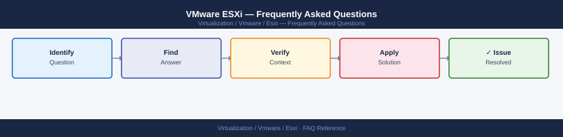

---
tags:
  - esxi
  - faq
  - operations
---
# VMware ESXi — Frequently Asked Questions

<div class="kb-summary">
Common questions about VMware ESXi operations, configuration, and troubleshooting. For step-by-step procedures, see the <a href="index.md">Operations</a> section.
</div>



```d2
direction: right

hub: "ESXi\nOperations" {shape: hexagon}
general: "General" {shape: rectangle}
configuration: "Configuration" {shape: rectangle}
operations: "Operations" {shape: rectangle}
troubleshooting: "Troubleshooting" {shape: rectangle}
backup_and_recovery: "Backup and Recovery" {shape: rectangle}

hub -> general
hub -> configuration
hub -> operations
hub -> troubleshooting
hub -> backup_and_recovery
```

## General

**Q: What ESXi version is recommended for new deployments?**
A: ESXi 8.0 Update 3 is the current recommendation. Check: `vmware -v` from ESXi shell or vCenter → Host → Summary → ESXi Version. Always align with the vCenter compatibility matrix.

**Q: How do I check the current VMware ESXi version?**
A: `vmware -v`

## Configuration

**Q: What is the default SSH service configuration and when should it change?**
A: SSH is disabled by default on ESXi. Enable only for troubleshooting: Host → Configuration → Security Profile → SSH → Start. Disable immediately after use. Use host profiles to enforce this policy fleet-wide.

**Q: How do I enable ESXi host profiles for configuration compliance?**
A: In vCenter, create a host profile from a reference host: Host Profiles → Extract Profile. Attach the profile to target hosts. Run compliance check. Remediate non-compliant hosts (requires maintenance mode for some settings).

## Operations

**Q: How do I patch ESXi hosts in a cluster without downtime?**
A: Use vSphere Lifecycle Manager (vLCM): Cluster → Updates → Remediate All. vLCM puts each host into maintenance mode (migrating VMs via vMotion), applies patches, and reboots. Process repeats per host. Requires DRS enabled.

**Q: What is the correct procedure to add a new host to a vSphere cluster?**
A: vCenter → Datacenter → Add Host. Enter the host FQDN/IP and root credentials. Add to the target cluster. vCenter validates the host, applies the cluster's host profile, and makes it available for VM placement.

## Troubleshooting

**Q: ESXi shows 'Host in disconnected state' in vCenter. What does it mean?**
A: vCenter cannot communicate with the host's management agent (hostd). SSH to the host directly and run `service.sh restart`. If SSH is unavailable, reboot via iDRAC/IPMI. Check management network connectivity and firewall rules.

**Q: VM CPU ready time is high on a specific ESXi host — where do I start?**
A: Check host CPU utilisation in vCenter → Host → Monitor → Performance. High CPU ready indicates overcommitment. Use DRS to migrate VMs to less-loaded hosts. Review NUMA topology — cross-NUMA memory access adds latency.

## Backup and Recovery

**Q: How often should I back up ESXi host configuration?**
A: Weekly via PowerCLI: `Get-VMHostFirmware -VMHost <host> -BackupConfiguration -DestinationPath ./`. Or via host profile compliance. Back up before any patch or upgrade. Store configs in version control.

**Q: Can I restore a single ESXi host configuration without rebuilding?**
A: Yes — restore from firmware backup: `Set-VMHostFirmware -VMHost <host> -Restore -SourcePath ./configBundle.tgz`. This restores network, storage, and firewall config. Test on a spare host first.

## See Also

- [VMware ESXi Operations](index.md)
- [VMware ESXi Troubleshooting](../../../troubleshooting/index.md)
