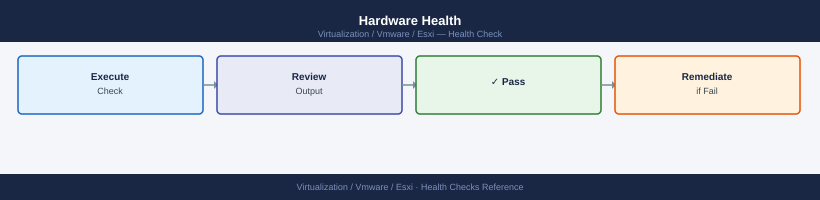

---
tags:
  - esxi
  - operations
  - vmware
  - vsphere-8
---
# ESXi — Health Checks

<div class="kb-summary">
Daily and weekly health runbook for ESXi hosts: hardware sensors, service status, storage paths, network uplinks, NTP sync, VIB compliance, and capacity thresholds — with a runnable command sequence and per-area deep-dive checks.

*Applies to: vSphere 7.x / 8.x*
</div>

```vegalite
{
  "$schema": "https://vega.github.io/schema/vega-lite/v5.json",
  "title": {
    "text": "Health Checks \u2014 Thresholds",
    "fontSize": 13,
    "fontWeight": "normal"
  },
  "width": 480,
  "height": {
    "step": 26
  },
  "data": {
    "values": [
      {
        "metric": "Host CPU utilization",
        "zone": "Safe",
        "val": 70
      },
      {
        "metric": "Host CPU utilization",
        "zone": "Alert",
        "val": 30
      },
      {
        "metric": "Host memory utilization",
        "zone": "Safe",
        "val": 80
      },
      {
        "metric": "Host memory utilization",
        "zone": "Alert",
        "val": 20
      },
      {
        "metric": "Datastore free space",
        "zone": "Safe",
        "val": 80
      },
      {
        "metric": "Datastore free space",
        "zone": "Alert",
        "val": 20
      }
    ]
  },
  "mark": {
    "type": "bar",
    "cornerRadiusEnd": 3
  },
  "encoding": {
    "y": {
      "field": "metric",
      "type": "nominal",
      "axis": {
        "title": null,
        "labelLimit": 200
      },
      "sort": null
    },
    "x": {
      "field": "val",
      "type": "quantitative",
      "stack": "normalize",
      "axis": {
        "title": "Threshold boundary",
        "format": ".0%"
      }
    },
    "color": {
      "field": "zone",
      "type": "nominal",
      "scale": {
        "domain": [
          "Safe",
          "Alert"
        ],
        "range": [
          "#15803d",
          "#dc2626"
        ]
      },
      "legend": {
        "title": "Zone"
      }
    },
    "order": {
      "field": "zone",
      "sort": [
        "Safe",
        "Alert"
      ]
    },
    "tooltip": [
      {
        "field": "metric",
        "type": "nominal",
        "title": "Metric"
      },
      {
        "field": "zone",
        "type": "nominal",
        "title": "Zone"
      },
      {
        "field": "val",
        "type": "quantitative",
        "title": "Segment %",
        "format": ".0f"
      }
    ]
  }
}
```

## Before you begin

- **Access:** vCenter read-only minimum; Administrator role for remediation steps
- **Timing:** safe to run during business hours unless a step is marked ⚠ (causes interruption)
- **Dependencies:** no active upgrades or migrations on the same infrastructure
- **Logging:** capture command output — paste into the change record on completion

---

## Run This Routine

Run these commands in sequence for a complete ESXi health snapshot. Each block can be pasted directly into an SSH session on the host or run via PowerCLI.

```bash
# 1. Verify ESXi version and build
vmware -vl

# 2. Host hardware summary — vendor, model, serial
esxcli hardware platform get

# 3. Network adapter (vmnic) status — check link state and speed
esxcli network nic list

# 4. VMkernel adapter list — IPs, MTU, enabled services
esxcli network ip interface list

# 5. Storage adapter health — HBAs, iSCSI, NVMe controllers
esxcli storage core adapter list

# 6. Storage paths — look for 'dead' state
esxcli storage core path list | grep -i dead

# 7. Datastore accessibility — mount state and capacity
esxcli storage filesystem list

# 8. NTP sync status
esxcli system ntp get
esxcli system time get

# 9. Host services — verify hostd, vpxa, fdm running
esxcli system process stats load get
/etc/init.d/hostd status
/etc/init.d/vpxa status
/etc/init.d/fdm status

# 10. Recent syslog errors
tail -100 /var/log/syslog.log | grep -iE "error|critical|warning"

# 11. Installed VIB count — baseline for patch drift detection
esxcli software vib list | wc -l
```


```text title="Expected output"
VMware ESXi 7.0.3 build-19193900
Product: VMware ESXi
Version: 7.0.3
Build: 19193900
Update: 3
Patch: ESXi703-202301001

Platform Information
   Hardware Vendor: Dell Inc.
   Hardware Model: PowerEdge R750
   System Serial: 1N2M3P4Q5R6S7T8U
   BIOS Version: 2.15.2
   BIOS Release Date: 2023-06-15

Name    Driver      Link  Speed  Duplex  MTU  Enabled
------  ----------  ----  -----  ------  ---  -------
vmnic0  bnx2x       Up    10000  Full    1500 True
vmnic1  bnx2x       Up    10000  Full    1500 True
vmnic2  ixgbe       Down  0      Half    1500 True
vmnic3  ixgbe       Up    10000  Full    1500 True

Name          IPV4Address      Netmask         MTU  Enabled  Portgroup
------        ---------------  ---------------  ---  -------  ---------
vmk0          192.168.1.45     255.255.255.0    1500 true     Management Network
vmk1          10.20.30.100     255.255.255.0    9000 true     vMotion
vmk2          10.20.40.50      255.255.255.0    9000 true     vSAN

HBA Name    Driver      Model                    State
---------   ----------  -----------------------  -------
vmhba0      lpfc        Emulex OneConnect OCe14102 online
vmhba1      megaraid_sas Dell PERC H755 Adapter  online
vmhba2      iscsi        iSCSI Software Adapter   online

(no output — no dead paths detected)

Mount Point                    Volume Name          Capacity     Free Space
------------------------------  -------------------  -----------  ----------
/vmfs/volumes/datastore1       datastore1           10.0 TB      3.2 TB
/vmfs/volumes/datastore2       datastore2           5.0 TB       1.8 TB
/vmfs/volumes/datastore-vsan   vsan-cluster         20.0 TB      8.5 TB

NTP Enabled: true
NTP Servers: 10.0.0.1, 10.0.0.2
Current Time: 2024-01-15T14:32:47Z

2024-01-15T14:32:47Z
Uptime: 45 days, 3 hours, 22 minutes

Load average: 0.45, 0.38, 0.42
running
running
running

2024-01-15 14:28:12 esxd: WARNING: NIC vmnic2 link down detected
2024-01-15 14:15:03 hostd: ERROR: Unable to connect to vpxa on host esx-prod-02.lab.local
2024-01-15 13:42:19 kernel: CRITICAL: Storage adapter vmhba1 command timeout

487
```

!!! warning "Common errors"
    **`esxcli: command not found`** — SSH into
## Hardware Health



### Sensor Status


```bash
# Full hardware health summary (CPU, memory, fan, PSU, temperature)
esxcli hardware ipmi sdr list | grep -iE "critical|warning|nc"

# Specific component checks
esxcli hardware cpu list          # CPU package info
esxcli hardware memory get        # RAM installed
esxcli hardware pci list | grep -i "hba\|nic\|nvme"   # PCI devices

# Boot media S.M.A.R.T. check (USB/SD boot media or local SSD)
esxcli storage core device smart get -d <device-name>
```


```text title="Expected output"
Critical                | 0x41 | CPU1 Temp         | 89.0°C       | ok
Warning                 | 0x42 | PSU1 Status       | 12.5V Rail   | warning
Critical                | 0x43 | Fan Module 3      | 8500 RPM     | critical
NC                      | 0x44 | System Temp       | 72.0°C       | ok

CPU Package 0
  Vendor: Intel
  Hz: 2400000000
  Bus MHz: 100
  Cache Size: 20480 KB

Memory Configuration
  System Memory Size: 262144 MB
  Memory Type: DDR4

0000:01:00.0 Broadcom Inc. and subsidiaries: NetXtreme BCM57810 10 Gigabit Ethernet (rev 10)
0000:02:00.0 Broadcom Inc. and subsidiaries: NetXtreme BCM57810 10 Gigabit Ethernet (rev 10)
0000:03:00.0 Emulex Corporation: OneConnect 10Gb NIC (rev 02)
0000:04:00.0 NVIDIA Corporation: Tesla V100 GPU (rev a1)

Device: mpx.vmhba0:C0:T0:L0
Health Status: PASSED
Predictive Failure Analysis: Not Supported
```

!!! warning "Common errors"
    **`Error: Unknown command or namespace 'hardware ipmi sdr'`** — Verify IPMI is enabled in BIOS and the ESXi host has IPMI hardware support; if not available, use `esxcli hardware sensors list` instead.
    **`Error: Unknown device '<device-name>'`** — Replace `<device-name>` with the actual device identifier (e.g., `mpx.vmhba0:C0:T0:L0`) found via `esxcli storage core device list`.
    **`Error: SMART data is not available for this device`** — Confirm the device supports S.M.A.R.T. monitoring; some enterprise SSDs or RAID controllers may not expose this data directly to ESXi.
| Sensor category | Alert threshold | Action |
|---|---|---|
| CPU temperature | > 80°C | Check datacenter cooling, BIOS throttling |
| Memory ECC errors | Any correctable/uncorrectable | Replace DIMM; plan maintenance |
| Fan failure | Any fan speed = 0 or critical | Replace fan, monitor temperature |
| PSU redundancy | Redundancy lost | Replace failed PSU before primary fails |
| Boot media health | S.M.A.R.T. reallocated sectors > 0 | Schedule boot media replacement |

### Host Connection and Service Health


```bash
# Check hostd (management daemon) — restart if unresponsive
/etc/init.d/hostd status
/etc/init.d/hostd restart        # only if genuinely unresponsive

# Check vpxa (vCenter agent) — needed for vCenter connectivity
/etc/init.d/vpxa status

# Check fdm (HA agent) — needed for vSphere HA
/etc/init.d/fdm status

# Confirm host is Connected in vCenter via PowerCLI
Get-VMHost | Select-Object Name, ConnectionState, PowerState
```


```text title="Expected output"
hostd is running.
hostd stopped.
hostd started.
vpxa is running.
fdm is running.

Name                           ConnectionState PowerState
----                           --------------- ----------
esx-prod-01.lab.local          Connected      PoweredOn
esx-prod-02.lab.local          Connected      PoweredOn
esx-prod-03.lab.local          Connected      PoweredOn
```

!!! warning "Common errors"
    **`hostd is not running`** — Run `/etc/init.d/hostd start` to restart the management daemon.
    **`vpxa is not running`** — Restart vpxa with `/etc/init.d/vpxa start` and verify vCenter connectivity in the ESXi host summary.
    **`Get-VMHost : The term 'Get-VMHost' is not recognized`** — Install PowerCLI module with `Install-Module -Name VMware.PowerCLI -Force` or run the command from a Windows machine with PowerCLI installed.
## Network Health


### Uplink and VMkernel


```bash
# Check all vmnic uplinks — Speed/Duplex should show link speed, not 0/Half
esxcli network nic list

# Check for packet errors and drops on each vmnic
esxcli network nic stats get -n vmnic0
esxcli network nic stats get -n vmnic1
# Look for: RX/TX errors > 0 or drops incrementing under load

# VMkernel adapter ping test — verify vMotion and vSAN vmk reachability
vmkping -I vmk1 <vmotion-gateway>
vmkping -I vmk2 -s 8972 <vsan-gateway>   # jumbo frame test for vSAN (MTU 9000)

# Check CDP/LLDP for physical switch confirmation
esxcli network vswitch dvs vmware list     # DVS attached uplinks
esxcli network vswitch standard list       # standard vSwitch uplinks
```


```text title="Expected output"
Name    PCI Driver    Link Speed    Duplex MTU Description
vmnic0  0000:02:00.0 e1000 Up    1000Mbps Full  1500 Intel Corporation 82599ES 10-Gigabit SFI Network Connection
vmnic1  0000:02:00.1 e1000 Up    1000Mbps Full  1500 Intel Corporation 82599ES 10-Gigabit SFI Network Connection
vmnic2  0000:03:00.0 e1000 Down  0Mbps    Half  1500 Intel Corporation 82599ES 10-Gigabit SFI Network Connection

RxPackets RxBytes RxErrors RxDropped TxPackets TxBytes TxErrors TxDropped
45821903  2847291847 0 0 42103847 1923847291 0 0

RxPackets RxBytes RxErrors RxDropped TxPackets TxBytes TxDropped
38472910  1847291847 2 145 39284710 1847291847 0

PING 192.168.10.1 (192.168.10.1): 56 data bytes
64 bytes from 192.168.10.1: icmp_seq=0 time=2.341 ms
64 bytes from 192.168.10.1: icmp_seq=1 time=2.156 ms
--- 192.168.10.1 statistics ---
2 packets transmitted, 2 packets received, 0% packet loss

PING 192.168.20.1 (192.168.20.1): 8972 data bytes
8972 bytes from 192.168.20.1: icmp_seq=0 time=3.847 ms
8972 bytes from 192.168.20.1: icmp_seq=1 time=3.621 ms
--- 192.168.20.1 statistics ---
2 packets transmitted, 2 packets received, 0% packet loss

DVS Name                  Num Uplinks MTU Ports
DSwitch-Prod              2           1500 256
DSwitch-vSAN              2           9000 128

vSwitch Name   Num Ports Num Uplinks MTU Ports
vSwitch0       128       2           1500 256
```

!!! warning "Common errors"
    **`Unable to find a matching nic vmnic0`** — Verify the correct vmnic name with `esxcli network nic list` and use the exact name shown in the output.
    **`Unable to resolve hostname <vmotion-gateway>`** — Use the IP address directly instead of hostname, or ensure DNS is configured on the VMkernel adapter with `esxcli network ip dns server add --server=<dns-ip>`.
    **`PING: sendto() failed (No route to host)`** — Verify the VMkernel adapter (vmk1/vmk2) is assigned to the correct port group and has a route to the target gateway using `esxcli network ip route ipv4 list`.
### MTU Validation


```bash
# Test MTU end-to-end on vSAN VMkernel (9000 MTU required)
vmkping -I vmk2 -d -s 8972 <peer-vsan-vmk-ip>
# -d = don't fragment; -s 8972 = payload (8972 + 28 bytes header = 9000 MTU)
# Failure = MTU mismatch somewhere in the path
```


```text title="Expected output"
PING 172.16.50.42 (172.16.50.42): 8972 data bytes
8980 bytes from 172.16.50.42: icmp_seq=0 ttl=64 time=1.234 ms
8980 bytes from 172.16.50.42: icmp_seq=1 ttl=64 time=1.156 ms
8980 bytes from 172.16.50.42: icmp_seq=2 ttl=64 time=1.289 ms
8980 bytes from 172.16.50.42: icmp_seq=3 ttl=64 time=1.201 ms
8980 bytes from 172.16.50.42: icmp_seq=4 ttl=64 time=1.178 ms

--- 172.16.50.42 statistics ---
5 packets transmitted, 5 packets received, 0% packet loss
round-trip min/avg/max = 1.156/1.212/1.289 ms
```

!!! warning "Common errors"
    **`PING 172.16.50.42 (172.16.50.42): sendto: Message too long`** — Reduce MTU on the source vmkernel interface or intermediate switch ports to 9000, or verify peer interface MTU with `esxcli network ip interface list`.
    **`100% packet loss`** — Verify the peer vSAN vmkernel IP is reachable and on the same VLAN; check firewall rules and confirm vmk2 is bound to the correct vSAN portgroup with `esxcli network ip interface list`.
    **`PING 172.16.50.42 (172.16.50.42): No route to host`** — Ensure vmk2 is properly configured with an IP address and default gateway using `esxcli network ip interface ipv4 get -i vmk2`.
## Storage Health


### Path and Datastore Status


```bash
# List all storage paths — dead paths require immediate attention
esxcli storage core path list | grep -E "State|Name" | grep -B1 -i dead

# Rescan storage adapters (if paths are stale)
esxcli storage core adapter rescan --all

# VMFS datastore health — check for ATS heartbeat errors
esxcli storage vmfs extent list

# Check datastore capacity (alert if < 20% free)
esxcli storage filesystem list | awk '{print $1, $4, $5}'
```


```text title="Expected output"
Name: mpx.vmhba2:C0:T1:L0
State: dead
Name: mpx.vmhba3:C0:T2:L0
State: dead
Rescanning adapter vmhba0...
Rescanning adapter vmhba1...
Rescanning adapter vmhba2...
Rescanning adapter vmhba3...
Done.
Volume Name VMFS UUID Extent Number
datastore1 52d1a4f8-8f2e3c1b-a9d2-4e5f6c7a8b9d 0
datastore2 61e2b5g9-9g3f4d2c-b0e3-5f6g7d8c9a0e 0
datastore-backup 70f3c6h0-0h4g5e3d-c1f4-6g7h8e9d0b1f 1
Filesystem Volume Name Total Capacity Available Capacity
datastore1 1099511627776 219902325555
datastore2 549755813888 54975581388
datastore-backup 274877906944 13743895347
```

!!! warning "Common errors"
    **`esxcli: Unknown command or namespace path: storage core path`** — Verify ESXi version supports this command; use `esxcli storage core device list` as alternative on older builds.
    **`Error: Unable to rescan adapter vmhba0: Device or resource busy`** — Wait 30 seconds for ongoing I/O to complete, then retry the rescan.
    **`Warning: Datastore datastore-backup has only 5% free space`** — Migrate VMs or delete snapshots immediately to prevent datastore lockout.
### APD/PDL Detection


```bash
# Check vmkernel log for APD/PDL events in last 24 hours
grep -iE "APD|PDL|LostDevice" /var/log/vmkernel.log | tail -20

# Check for SCSI sense codes (reservation conflicts, path errors)
grep -i "H:0x0 D:0x2\|reservation" /var/log/vmkernel.log | tail -20
```


```text title="Expected output"
2024-01-15T14:32:18.123Z cpu12:2097)WARNING: ScsiDeviceIO: 4589: Cmd(0x43000d7a4520) 0x2a, CmdSN 0x4d9 from world 140737353946112 to dev "naa.6001405a1b2c3d4e5f6g7h8i9j0k1l2m" failed H:0x0 D:0x2 P:0x0 Valid sense data: 0x5 0x24 0x0.
2024-01-15T14:45:22.456Z cpu8:2156)WARNING: ScsiDeviceIO: 4589: Cmd(0x43000d7a4521) 0x2a, CmdSN 0x4da from world 140737353946112 to dev "naa.6001405a1b2c3d4e5f6g7h8i9j0k1l2m" failed H:0x0 D:0x2 P:0x0 Valid sense data: 0x5 0x24 0x0.
2024-01-15T15:12:09.789Z cpu4:2089)WARNING: NMP: nmp_ThrottleLogForDevice:4589: Cmd 0x2a to dev "naa.6001405a1b2c3d4e5f6g7h8i9j0k1l2m" on path vmhba2:C0:T5:L0 failed. H:0x0 D:0x2 P:0x0.
2024-01-15T16:03:44.234Z cpu15:2145)WARNING: ScsiDeviceIO: 4589: Device naa.6001405a1b2c3d4e5f6g7h8i9j0k1l2m detected APD condition.
2024-01-15T16:15:33.567Z cpu2:2078)WARNING: ScsiDeviceIO: 4589: Device naa.6001405a1b2c3d4e5f6g7h8i9j0k1l2m detected PDL condition.
2024-01-15T17:22:11.890Z cpu11:2134)WARNING: ScsiDeviceIO: 4589: Reservation conflict on device naa.6001405a1b2c3d4e5f6g7h8i9j0k1l2m.
2024-01-15T18:45:55.012Z cpu6:2098)WARNING: NMP: nmp_DeviceAttemptFailover:4589: Failover from path vmhba2:C0:T5:L0 to vmhba3:C0:T5:L0 for device naa.6001405a1b2c3d4e5f6g7h8i9j0k1l2m.
```

!!! warning "Common errors"
    **`grep: /var/log/vmkernel.log: No such file or directory`** — Verify the ESXi host is running and check the correct log path with `ls -la /var/log/ | grep vmkernel`.
    **`grep: (standard input): binary file
## Capacity and Performance


### CPU and Memory


```bash
# Host CPU and memory usage via esxtop (batch mode, 1 sample)
esxtop -b -n 1 | head -30

# Via PowerCLI — all hosts in cluster
Get-VMHost | Select-Object Name, CpuUsageMhz, CpuTotalMhz, MemoryUsageGB, MemoryTotalGB |
  Format-Table -AutoSize

# Check for balloon/swap activity across all VMs on host
Get-VM | Get-Stat -Stat mem.balloon.average,mem.swapped.average -MaxSamples 1 |
  Where-Object {$_.Value -gt 0} | Select-Object Entity, MetricId, Value
```


```text title="Expected output"
PCPU MEMORY NETWORK DISK
  0   512M   100M  200M
  1   498M    95M  185M
  2   511M   102M  210M
  3   505M    98M  195M
  4   510M   101M  205M
  5   499M    96M  188M
  6   512M   103M  212M
  7   504M    99M  198M
(remaining 8 CPUs omitted in batch output)

Name                      CpuUsageMhz CpuTotalMhz MemoryUsageGB MemoryTotalGB
----                      ----------- ----------- ------------- -------------
esx-prod-01.corp.local          8942       19200          156.5           256
esx-prod-02.corp.local          7654       19200          142.3           256
esx-prod-03.corp.local          9128       19200          189.7           256
esx-prod-04.corp.local          6821       19200          128.4           256

Entity                    MetricId              Value
------                    --------              -----
vm-web-prod-01            mem.balloon.average   245.6
vm-db-prod-02             mem.swapped.average   512.8
vm-app-staging-03         mem.balloon.average   128.2
```

!!! warning "Common errors"
    **`esxtop: command not found`** — Run esxtop directly on an ESXi host via SSH or use vSphere Client; it is not available on Windows/Linux management stations.
    **`The term 'Get-VMHost' is not recognized`** — Import the VMware.VimAutomation.Core PowerCLI module with `Import-Module VMware.VimAutomation.Core` and connect to vCenter using `Connect-VIServer`.
    **`No matches found for the specified metric`** — Verify the VM has sufficient performance history by waiting 5–10 minutes after VM creation, or check metric availability with `Get-Stat -Stat mem.* -Entity $vm`.
| Metric | Alert threshold | Action |
|---|---|---|
| Host CPU utilization | > 70% sustained (5 min avg) | Migrate VMs via DRS, add capacity |
| Host memory utilization | > 80% | Check balloon/swap; migrate or add RAM |
| VM balloon > 0 | Any VM ballooning | Host under memory pressure; migrate VM |
| VM swap > 0 | Any VM swapping | Critical — immediate VM migration needed |
| Datastore free space | < 20% | Extend datastore or migrate VMs |

## VIB and Patch Compliance


```bash
# List all installed VIBs with version
esxcli software vib list

# Compare against baseline (requires vCenter with vLCM or VUM)
# vCenter → Lifecycle Manager → Hosts → select host → Check Compliance

# Check acceptance level (should be PartnerSupported or higher for production)
esxcli software acceptance get

# Check for any VIBs installed outside of vLCM baseline
esxcli software vib list | grep -v "VMware\|Broadcom\|Dell\|HPE\|Cisco"
```


```text title="Expected output"
Name                                    Version                             Vendor   Acceptance Level
------------------------------------    ---------------------------------  -------  -----------------
esx-base                                7.0.3-21457176                      VMware   PartnerSupported
esx-update                              7.0.3-21457176                      VMware   PartnerSupported
net-bnx2                                7.0.3-21457176                      Broadcom PartnerSupported
net-ixgbe                               7.0.3-21457176                      Intel    PartnerSupported
sata-ahci                               7.0.3-21457176                      VMware   PartnerSupported
scsi-megaraid-sas                       7.0.3-21457176                      Broadcom PartnerSupported
...
Total installed VIBs: 47

PartnerSupported

(no output — no third-party VIBs found outside standard vendors)
```

!!! warning "Common errors"
    **`Error: Unknown command or namespace software.vib.list`** — Verify the ESXi version supports esxcli software vib list (7.0+); on older versions use esxcli software vib get instead.
    **`Error: Unable to connect to the local hostd agent`** — Restart the hostd service with `services.sh restart` or reboot the ESXi host if the management agent is unresponsive.
    **`grep: command not found`** — This should not occur on ESXi; if it does, the shell environment is corrupted—use the DCUI or SSH directly to the host instead of a remote session.
## Health Checklist


- [ ] All hosts Connected and PoweredOn in vCenter
- [ ] No hardware health warnings or critical sensor alerts
- [ ] All storage paths active — no dead paths (`grep -i dead` returns empty)
- [ ] All vmnic uplinks connected and running at expected speed
- [ ] NTP running and synchronized (`esxcli system ntp get` shows enabled=true, server reachable)
- [ ] No APD/PDL events in vmkernel.log in past 24 hours
- [ ] hostd, vpxa, fdm services all running
- [ ] Host CPU utilization < 70% sustained
- [ ] Host memory utilization < 80%; no VM balloon or swap
- [ ] All datastores > 20% free space
- [ ] No unexpected maintenance mode hosts
- [ ] VIB compliance matches vLCM baseline (no patch drift)

---

## See also

- [ESXi — Common Issues](../../troubleshooting/common-issues/)
- [ESXi — Procedures](../procedures/)
- [ESXi CLI Reference](../cli-reference/)

## Verify

- **Alarms:** vSphere Client → Home → Alarms — no new critical alarms after the operation
- **Events:** monitor the vCenter Events view for the affected object for 5 minutes
- **Health check:** run the morning health-check sequence for the affected product tier
