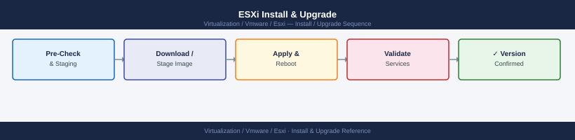

---
tags:
  - esxi
  - operations
  - vmware
  - vsphere-8
---
# ESXi Install & Upgrade

ESXi Install & Upgrade reference covering vSphere Update Manager (VUM) — Legacy, Host Upgrade Procedure, ESXi Patch Application (Manual / Standalone), Upgrade and Patching Readiness Checklist, Driver and Firmware Lifecycle and 1 more sections.

*Applies to: vSphere 7.x / 8.x*

## Before you begin

- **Access:** vCenter read-only minimum; Administrator role for remediation steps
- **Timing:** safe to run during business hours unless a step is marked ⚠ (causes interruption)
- **Dependencies:** no active upgrades or migrations on the same infrastructure
- **Logging:** capture command output — paste into the change record on completion

---

!!! warning "Host enters maintenance mode"
    ESXi remediation puts hosts into maintenance mode, triggering DRS evacuation. Confirm DRS is Fully Automated and HA admission control is satisfied before starting.

## Upgrade and Patching Readiness Checklist

### Current State
- Confirm current ESXi version and build on all hosts
- Note any hosts on a different version than the cluster standard

### Target Image or Baseline
- Identify the target ESXi image or patch baseline
- Confirm the image is compatible with the hardware (HCL)
- Confirm driver and firmware compatibility for NIC, HBA, and storage adapters

### Cluster Capacity
- Confirm the cluster has sufficient headroom to evacuate one host at a time
- Confirm DRS is enabled and set to at least Partially Automated

### Backup and Config Export
- Confirm vCenter file-based backup is current
- Export ESXi host configuration if required for the change record

### Remediation Order

For clusters with multiple hosts:
1. Patch one host at a time
2. Wait for each host to return from maintenance mode and vSAN to stabilize before patching the next
3. Do not patch all hosts simultaneously

### Post-Patch Validation
- Confirm host is Connected in vCenter
- Confirm ESXi version matches the target
- Confirm no new hardware or service alerts
- Confirm vSAN health is green if vSAN is used
- Confirm VMs are running normally

## Driver and Firmware Lifecycle

ESXi drivers (NIC, HBA, RAID) must match the versions in the VMware HCL for the ESXi version in use. Driver updates are delivered as:

- **VIBs** within the ESXi patch bundle
- **Vendor Add-on** packages in vLCM (e.g., Dell OpenManage, HPE SPP)
- **Async driver release** — standalone VIB from vendor (e.g., Broadcom bnxt_en, Intel igbn)

Firmware updates (BIOS, NIC firmware, HBA firmware) are handled out-of-band via:
- Dell iDRAC / Repository Manager
- HPE iLO / SPP (Service Pack for ProLiant)
- Server management tools (Lenovo XClarity, Cisco UCS Manager)

## Rollback Considerations

ESXi does not support in-place downgrade. Options if a patch causes issues:

1. **Stateless ESXi (Auto Deploy)**: Re-deploy with previous image profile — fast rollback
2. **Stateful ESXi**: Restore from ESXi backup (not standard) or reinstall — time-consuming
3. **vLCM**: Remove the new component/VIB from the cluster image and remediate — reverts the specific change

For vSAN clusters: if ESXi 8.x is rolled back, vSAN on-disk format may need downgrade — contact VMware Support before attempting.

---

## See also

- [ESXi — Health Checks](health-checks/)
- [ESXi — Common Issues](../troubleshooting/common-issues/)
- [ESXi — Procedures](procedures/)

## Verify

- **Alarms:** vSphere Client → Home → Alarms — no new critical alarms after the operation
- **Events:** monitor the vCenter Events view for the affected object for 5 minutes
- **Health check:** run the morning health-check sequence for the affected product tier
