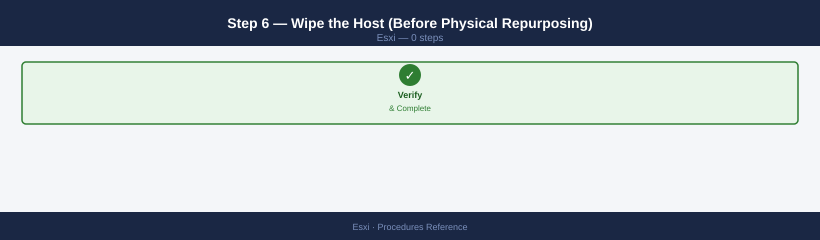
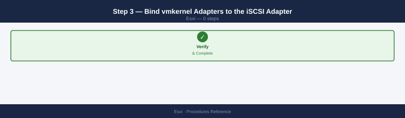
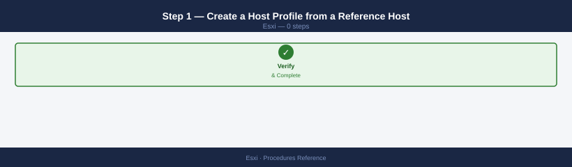

---
tags:
  - esxi
  - operations
  - vmware
  - vsphere-8
---
# ESXi — Procedures

<div class="kb-summary">
Procedures reference covering Change Readiness, Maintenance Window, Post-Change Validation, Incident Triage, Networking, Storage, Security and Hardening, and Lifecycle and Patching.

*Applies to: vSphere 7.x / 8.x*
</div>

## Before you begin

- **Access:** vCenter read-only minimum; Administrator role for remediation steps
- **Timing:** safe to run during business hours unless a step is marked ⚠ (causes interruption)
- **Dependencies:** no active upgrades or migrations on the same infrastructure
- **Logging:** capture command output — paste into the change record on completion

---

## Change Readiness

- [ ] vMotion tested and working between affected hosts before any maintenance
- [ ] Host not in maintenance mode — no other concurrent work on same host
- [ ] HA admission control checked: cluster has capacity to tolerate host loss
- [ ] All storage paths healthy and no dead paths: `esxcli storage core path list | grep dead`
- [ ] vCenter backup is current (file-based backup or VAMI snapshot taken recently)
- [ ] DRS is enabled and configured to fully automated — VMs will migrate automatically
- [ ] Change window approved and communicated; storage and compute teams notified

| Item | Status | Notes |
|---|---|---|
| vMotion tested | | Test migration successful |
| HA admission control OK | | Cluster has failover capacity |
| Storage paths healthy | | `grep dead` returns 0 |
| vCenter backup current | | Backup timestamp |
| Change window approved | | Ticket reference |

## Maintenance Window

1. Confirm host is healthy and not already in maintenance mode: `Get-VMHost | Select Name,ConnectionState`
2. Check HA admission control — ensure cluster can tolerate one less host during maintenance
3. Put host into maintenance mode: `Set-VMHost -VMHost <hostname> -State Maintenance`
4. Wait for all VMs to vMotion off the host — monitor via vCenter Tasks pane
5. Confirm zero VMs running on the host: `Get-VM -Location <host> | Where-Object {$_.PowerState -eq "PoweredOn"}`
6. Perform the required maintenance work (patching, hardware replacement, config change)
7. Exit maintenance mode: `Set-VMHost -VMHost <hostname> -State Connected`
8. Validate host is Connected, all storage paths active, NTP in sync, and VMs have migrated back

## Post-Change Validation

- [ ] Host shows Connected and PoweredOn in vCenter
- [ ] No hardware health alarms triggered: `esxcli hardware health get`
- [ ] All storage paths active, no dead paths: `esxcli storage core path list | grep dead`
- [ ] All vmnic uplinks connected: `esxcli network nic list`
- [ ] VMs running correctly on the host or successfully migrated back
- [ ] NTP synchronized: `esxcli system ntp get` confirms `Running: true`
- [ ] No new vCenter alarms or vmkernel errors introduced by the change
- [ ] Close change ticket with validation evidence attached

## Incident Triage

- [ ] Check host connection state in vCenter — Connected, Disconnected, or Not Responding?
- [ ] Run `esxcli hardware health get` — identify any hardware component in Warning or Error state
- [ ] Check storage paths: `esxcli storage core path list | grep dead`
- [ ] Check network uplinks: `esxcli network nic list` — look for down links
- [ ] Review vmkernel log: `tail -500 /var/log/vmkernel.log`
- [ ] Check NTP status — a drifted clock can cause certificate and auth failures
- [ ] Review vCenter events for the affected host around the incident time
- [ ] If host is Not Responding, attempt IPMI/iDRAC/iLO console access

| Question | Answer |
|---|---|
| Host connection state? | Connected / Disconnected / Not Responding |
| Hardware health alerts? | `esxcli hardware health get` |
| Dead storage paths? | `esxcli storage core path list \| grep dead` |
| vmnic uplinks down? | `esxcli network nic list` |
| vmkernel.log at incident time? | `/var/log/vmkernel.log` — SCSI, NMP, network errors |

---

## Add a VMkernel Adapter (vmk)

A VMkernel adapter (vmk) carries ESXi management, vMotion, vSAN, or NFS traffic. Add a new vmk when you are separating traffic types onto dedicated VLANs or adding a second vMotion path.

**Prerequisites:** target vSwitch or dvSwitch port group already exists; IP subnet and VLAN confirmed with the network team.

1. Identify the target vSwitch and port group:

    ```bash
    esxcli network vswitch standard list
    esxcli network vswitch standard portgroup list
    ```

2. Add the VMkernel adapter with a static IP:

    ```bash
    esxcli network ip interface add --interface-name vmk1 --portgroup-name "vMotion"
    esxcli network ip interface ipv4 set --interface-name vmk1 --ipv4 192.168.10.11 --netmask 255.255.255.0 --type static
    ```

3. Enable the appropriate traffic tag (vMotion in this example):

    ```bash
    esxcli network ip interface tag add --interface-name vmk1 --tagname VMotion
    ```

    Valid tag names: `Management`, `VMotion`, `vSAN`, `faultToleranceLogging`, `vSphereReplication`.

4. Verify the adapter is up and the IP is set:

    ```bash
    esxcli network ip interface list
    esxcli network ip interface ipv4 get --interface-name vmk1
    ```

5. Test connectivity from the host to a remote vmk on the same subnet:

    ```bash
    vmkping -I vmk1 192.168.10.12
    ```

---

## Configure a vSS Port Group

A standard switch (vSS) port group defines the VLAN tag and policy that VMs or VMkernel adapters on that switch use. Add or modify port groups to extend VLAN access or change security policy without touching the uplinks.

1. List existing port groups and switches:

    ```bash
    esxcli network vswitch standard portgroup list
    ```

2. Add a new port group to the target vSwitch:

    ```bash
    esxcli network vswitch standard portgroup add --vswitch-name vSwitch0 --portgroup-name "VLAN20-App"
    ```

3. Set the VLAN ID:

    ```bash
    esxcli network vswitch standard portgroup set --portgroup-name "VLAN20-App" --vlan-id 20
    ```

4. (Optional) Override security policy on the port group:

    ```bash
    esxcli network vswitch standard portgroup policy security set \
      --portgroup-name "VLAN20-App" \
      --allow-promiscuous false \
      --allow-mac-change false \
      --allow-forged-transmits false
    ```

5. Verify the port group is visible:

    ```bash
    esxcli network vswitch standard portgroup list | grep "VLAN20-App"
    ```

---

## Change vSwitch MTU (Jumbo Frames)

Raising MTU to 9000 (jumbo frames) reduces CPU overhead for vSAN and NFS workloads. The physical switches and all vmk adapters on that vSwitch must also be set to 9000 before enabling — a mismatch causes silent packet fragmentation.

**Prerequisites:** physical switch ports already configured for MTU 9000; change window in place.

1. Check the current MTU on all vSwitches:

    ```bash
    esxcli network vswitch standard list | grep -E "Name|MTU"
    ```

2. Set the vSwitch MTU to 9000:

    ```bash
    esxcli network vswitch standard set --vswitch-name vSwitch1 --mtu 9000
    ```

3. Update each VMkernel adapter on that vSwitch to match:

    ```bash
    esxcli network ip interface set --interface-name vmk2 --mtu 9000
    ```

4. Verify the change took effect:

    ```bash
    esxcli network vswitch standard list | grep -A5 "vSwitch1"
    esxcli network ip interface list | grep -E "Name|MTU"
    ```

5. Validate end-to-end with a large-frame ping (do-not-fragment):

    ```bash
    vmkping -I vmk2 -s 8972 -d 192.168.20.12
    ```

    Packet size 8972 = 9000 − 28 bytes (IP + ICMP headers). A successful reply confirms the physical path supports jumbo frames.

---

## Rescan Storage Adapters

Run a rescan after adding new LUNs, zoning changes, or after plugging in a new HBA so ESXi discovers new devices and paths without a reboot.

1. List available storage adapters:

    ```bash
    esxcli storage core adapter list
    ```

2. Rescan all adapters (recommended — covers HBA and software iSCSI):

    ```bash
    esxcli storage core adapter rescan --all
    ```

3. To rescan a specific adapter only:

    ```bash
    esxcli storage core adapter rescan --adapter vmhba1
    ```

4. Verify new devices are visible:

    ```bash
    esxcli storage core device list | grep -E "Display Name|Size"
    ```

5. Check all paths are active:

    ```bash
    esxcli storage core path list | grep -v "active" | grep -v "^$"
    ```

    No output means all paths are active. Dead or standby paths will appear here.

---

## Mount/Unmount a Datastore

Unmount a datastore before decommissioning a LUN or performing storage maintenance. Mount to bring a new NFS share or VMFS volume into inventory.

!!! danger "Data corruption risk"
    Unmounting a VMFS datastore while VMs are still registered to it — even powered-off VMs — causes immediate data corruption. Confirm zero VMs are registered before unmounting. If VMs exist, unregister or migrate them first.

**Unmount (VMFS or NFS):**

1. Confirm no VMs are registered on the datastore:

    ```bash
    esxcli storage filesystem list
    ```

2. Identify the datastore UUID:

    ```bash
    esxcli storage filesystem list | grep "DatastoreName"
    ```

3. Unmount the datastore:

    ```bash
    esxcli storage filesystem unmount --uuid <datastore-uuid>
    ```

**Mount an NFS datastore:**

1. Mount the NFS share:

    ```bash
    esxcli storage nfs add --host 192.168.30.10 --share /vol/nfs_ds01 --volume-name NFS_DS01
    ```

2. Verify it appears in the filesystem list:

    ```bash
    esxcli storage filesystem list | grep NFS_DS01
    ```

**Mount an existing VMFS volume (after rescan):**

After a rescan the volume usually auto-mounts. If it does not:

```bash
esxcli storage filesystem mount --uuid <datastore-uuid>
```

---

## Enable Lockdown Mode

Lockdown mode prevents direct root login to the ESXi host — all management must go through vCenter. Enable it to reduce the attack surface in production clusters.

!!! danger "Host lockout risk"
    If vCenter becomes unavailable after lockdown mode is enabled, and no Exception Users are configured, there is no way to log in to the host — not even via SSH or the DCUI. Physical console access to disable lockdown via DCUI is the only recovery. Before enabling, add at least one Exception User (a break-glass local account) and confirm vCenter HA or a backup vCenter is available.

**Note:** before enabling, ensure at least one Exception User is configured in DCUI access, and confirm vCenter is reachable and healthy. Lockdown mode cannot be toggled from the host CLI after it is enabled.

1. Enable normal lockdown mode from the DCUI or vCenter:

    - **vCenter UI path:** Host → Configure → Security Profile → Lockdown Mode → Edit → Normal
    - **PowerCLI:**

    ```powershell
    $vmhost = Get-VMHost -Name "esxi01.corp.local"
    $vmhost.ExtensionData.EnterLockdownMode()
    ```

2. Verify lockdown mode is active:

    ```powershell
    Get-VMHost -Name "esxi01.corp.local" | Select Name, @{N="Lockdown";E={$_.ExtensionData.Config.LockdownMode}}
    ```

3. To disable lockdown mode (requires vCenter access or physical DCUI access):

    ```powershell
    $vmhost.ExtensionData.ExitLockdownMode()
    ```

4. Add exception users (accounts that can still log in directly during lockdown):

    - vCenter UI path: Host → Configure → Security Profile → Lockdown Mode → Exception Users → Add

---

## Configure ESXi Firewall Rules

The ESXi firewall controls which services are reachable on the management vmk. Restrict allowed IP ranges on each service to limit exposure.

1. List all firewall rules and their current state:

    ```bash
    esxcli network firewall ruleset list
    ```

2. Enable a specific ruleset (e.g., syslog outbound):

    ```bash
    esxcli network firewall ruleset set --ruleset-id syslog --enabled true
    ```

3. Restrict a ruleset to specific source IPs only:

    ```bash
    esxcli network firewall ruleset allowedip add --ruleset-id syslog --ip-address 192.168.1.50
    esxcli network firewall ruleset set --ruleset-id syslog --allowed-all false
    ```

4. Remove a previously allowed IP:

    ```bash
    esxcli network firewall ruleset allowedip remove --ruleset-id syslog --ip-address 192.168.1.50
    ```

5. Refresh the firewall to apply changes:

    ```bash
    esxcli network firewall refresh
    ```

6. Verify the ruleset's allowed IPs:

    ```bash
    esxcli network firewall ruleset allowedip list --ruleset-id syslog
    ```

---

## Change the Root Password

Rotate the root password after any personnel change, as part of a quarterly credential rotation policy, or after a security incident.

**Via esxcli (SSH session on the host):**

```bash
passwd root
```

Enter the new password twice when prompted. ESXi enforces password complexity — minimum 7 characters with a mix of character classes.

**Via PowerCLI (requires existing vCenter session):**

```powershell
$vmhost = Get-VMHost -Name "esxi01.corp.local"
$esxcli = Get-EsxCli -VMHost $vmhost -V2
$esxcli.system.account.set.Invoke(@{id="root"; password="NewP@ssw0rd!"; passwordconfirmation="NewP@ssw0rd!"})
```

**Post-rotation:**

1. Verify login works with the new password before closing the SSH session.
2. Update the credential vault or password manager entry immediately.
3. If the host is managed by vCenter with stored credentials (e.g., host profile), update the profile or re-enter the password in the host's credential store.
4. Log the rotation in the change management system with timestamp and operator.

---

## Enable and Configure Syslog

Forwarding ESXi logs to a central syslog server (e.g., Syslog-NG, Graylog, vRealize Log Insight) is required for security audit trails and incident investigation across multiple hosts.

1. Set the remote syslog target:

    ```bash
    esxcli system syslog config set --loghost=udp://192.168.1.50:514
    ```

    Supported protocols: `udp://`, `tcp://`, `ssl://`. Use TCP or SSL for reliable delivery.

2. Reload the syslog service to apply the change:

    ```bash
    esxcli system syslog reload
    ```

3. Open the syslog firewall ruleset to allow outbound traffic:

    ```bash
    esxcli network firewall ruleset set --ruleset-id syslog --enabled true
    esxcli network firewall refresh
    ```

4. Verify the configuration:

    ```bash
    esxcli system syslog config get
    ```

5. Send a test message to confirm delivery at the syslog server:

    ```bash
    esxcli system syslog mark --message="ESXi syslog test from esxi01"
    ```

6. On the syslog server, confirm the test message was received. If not, check:
    - UDP/TCP 514 is open between the host management vmk and the syslog server
    - Firewall ruleset `syslog` shows `Enabled: true` and the correct allowed IPs

---

## Apply a Patch Bundle via esxcli (Offline)

Use this procedure when the host has no internet access and patches are delivered as `.zip` bundles from the VMware patch depot or a local repository.

!!! warning "Host reboot required"
    Applying an ESXi patch requires a full host reboot. All VMs must be migrated off the host (maintenance mode) before applying the patch. Applying on a host with running VMs will either fail at apply time or cause an unplanned outage when the host reboots. Ensure HA admission control confirms the cluster can tolerate this host being offline.

**Prerequisites:** patch bundle `.zip` transferred to a datastore the host can access; host in maintenance mode.

1. Put the host in maintenance mode (see Maintenance Window procedure above).

2. Copy the patch bundle to a local datastore. From a management machine:

    ```bash
    scp VMware-ESXi-7.0U3n-patch.zip root@esxi01:/vmfs/volumes/datastore1/patches/
    ```

3. SSH to the host and verify the bundle:

    ```bash
    esxcli software sources profile list --depot=/vmfs/volumes/datastore1/patches/VMware-ESXi-7.0U3n-patch.zip
    ```

4. Perform a dry run to check for conflicts:

    ```bash
    esxcli software profile update \
      --depot=/vmfs/volumes/datastore1/patches/VMware-ESXi-7.0U3n-patch.zip \
      --profile=ESXi-7.0U3n-20842819-standard \
      --dry-run
    ```

5. Apply the patch:

    ```bash
    esxcli software profile update \
      --depot=/vmfs/volumes/datastore1/patches/VMware-ESXi-7.0U3n-patch.zip \
      --profile=ESXi-7.0U3n-20842819-standard
    ```

6. Reboot the host for the patches to take effect:

    ```bash
    reboot
    ```

7. After reboot, verify the build number matches the expected patch level:

    ```bash
    esxcli system version get
    ```

8. Exit maintenance mode and run Post-Change Validation.

---

## Enable Quick Boot

Quick Boot allows ESXi to restart without a full hardware POST, reducing patch reboot time from ~15 minutes to ~2–3 minutes. It is supported on hardware that passes VMware's compatibility check.

1. Check whether the hardware supports Quick Boot:

    ```bash
    /usr/lib/vmware/loadesx/bin/loadESXCheckCompat
    ```

    A return code of `0` means Quick Boot is supported. Any other code means the hardware is incompatible (often due to BIOS or NIC firmware).

2. Enable Quick Boot:

    ```bash
    esxcli system settings kernel set --setting=quickBoot --value=1
    ```

3. Verify the setting:

    ```bash
    esxcli system settings kernel list | grep quickBoot
    ```

4. Quick Boot takes effect on the next restart triggered by `esxcli system shutdown reboot`. It does not apply to cold power cycles (full POST still runs on power-on from off).

5. To disable Quick Boot:

    ```bash
    esxcli system settings kernel set --setting=quickBoot --value=0
    ```

---

## Put Host in Image-Based Management (vLCM)

vSphere Lifecycle Manager (vLCM) image-based management replaces baseline patching with a declarative desired-image model. All hosts in a vLCM-managed cluster must use the same image; the cluster cannot mix baseline and image management.

!!! warning "All hosts in the cluster will reboot"
    Switching a cluster to vLCM and remediating moves every host through maintenance mode and reboots it in sequence. For a 4-node cluster with DRS, this takes 30–60 minutes. Verify HA admission control before starting — if a host is already degraded, vLCM remediation can exceed the cluster's failover capacity and block VM migrations. Firmware packages (if included in the image) may add additional driver reloads that extend the reboot time.

**Prerequisites:** vCenter 7.0 U1+ with Lifecycle Manager; cluster currently using baselines; all hosts on a compatible hardware/driver matrix for the target image.

1. In vCenter, navigate to: **Menu → Lifecycle Manager → Clusters**.

2. Select the cluster and choose **Manage with a Single Image**.

3. vLCM will import the current host's software profile as the initial desired image. Review and confirm the image components (base ESXi version, vendor add-ons, firmware packages if using Broadcom/Dell/HPE integrations).

4. Remediate all hosts in the cluster to bring them to the desired image:

    - **vCenter UI path:** Cluster → Updates → Image → Remediate All

5. Monitor remediation tasks in the vCenter Tasks pane. Each host will enter maintenance mode, apply the image, and reboot automatically.

6. Verify all hosts show **Compliant** in the Image Compliance column after remediation.

7. Confirm the build version on each host matches the image:

    ```bash
    esxcli system version get
    ```

8. Once all hosts are compliant, the cluster is fully under vLCM image management. Future patching is done by editing the desired image and re-remediating.

---

## Configure NTP

Accurate time is required for SSO Kerberos, vSAN consensus, certificates, and HA heartbeats.

```bash
# Set NTP servers (replace existing config)
esxcli system ntp set --server ntp1.example.local --server ntp2.example.local

# Enable the NTP client service
esxcli system ntp set --enabled true

# Verify NTP sync status
esxcli system ntp get
# Look for: NTP Service: Running, Sync: Yes

# Manual time sync if NTP is syncing but host time has drifted
ntpq -p    # run from ESXi shell; shows stratum and offset
```

Verify from vCenter: **Host → Configure → Time Configuration** — confirm NTP service running and servers listed.

---

## Configure Hostname and DNS

```bash
# Set the hostname
esxcli system hostname set --fqdn esxi-01.example.local

# Set DNS servers
esxcli network ip dns server add --server-address 10.0.0.10
esxcli network ip dns server add --server-address 10.0.0.11

# Set DNS search domain
esxcli network ip dns search add --domain example.local

# Verify hostname and DNS
esxcli system hostname get
esxcli network ip dns server list
esxcli network ip dns search list

# Confirm forward/reverse DNS resolution
nslookup esxi-01.example.local
nslookup 10.0.1.20   # host management IP
```

---

## Join ESXi Host to Active Directory

AD join allows AD users and groups to authenticate to the ESXi host and enables LDAP-based lockdown mode.

```bash
# Join domain from ESXi shell
esxcli system secpolicy domain join --domain EXAMPLE.LOCAL \
    --username administrator --password '<password>'

# Verify domain join status
esxcli system secpolicy domain list
# Expect: Domain: EXAMPLE.LOCAL, Joined: true
```

Assign AD group to ESXi Administrator role after joining:
- vCenter → **Host → Configure → Authentication Services** → confirm domain status
- vCenter → **Host → Configure → Host Users/Groups** → add the AD group

---

## Configure SNMP

```bash
# Enable SNMP service
esxcli system snmp set --enable true

# Set SNMP community string (SNMPv1/v2c)
esxcli system snmp set --communities <community-string>

# Configure trap targets (NMS IP + community)
esxcli system snmp set --targets <nms-ip>@161/<community>

# Verify configuration
esxcli system snmp get

# Test SNMP (send a test trap)
esxcli system snmp test
```

---

## Configure a Coredump Target

Required for support bundle generation and post-crash analysis.

```bash
# List available disk partitions for coredump
esxcli system coredump partition list

# Set the coredump partition (use a small dedicated partition)
esxcli system coredump partition set --partition /vmfs/devices/disks/naa.xxx:9

# Enable coredump to network (coredump collector) — preferred for diskless hosts
esxcli system coredump network set --interface-name vmk0 \
    --server-ip <coredump-collector-ip> --server-port 6500
esxcli system coredump network set --enable true

# Verify coredump configuration
esxcli system coredump partition get
esxcli system coredump network get
```

---

## Decommission and Remove an ESXi Host

Use when permanently removing a host from the environment — for hardware retirement, site consolidation, or replacing a node with newer hardware.

!!! warning "Evacuate all VMs and vSAN objects before removing the host"
    Removing a host from vCenter without first evacuating VMs and vSAN data will leave VMs in an invalid state and may cause vSAN object loss if FTT is already at its limit.

### Step 1 — Migrate All VMs Off the Host


```powershell
# PowerCLI — vMotion all powered-on VMs to other hosts in the cluster
$host = Get-VMHost "esxi-host-04.example.local"
Get-VM -Location $host | Where-Object {$_.PowerState -eq "PoweredOn"} |
  ForEach-Object {
    $dest = Get-VMHost -Location (Get-Cluster -VMHost $host) |
            Where-Object {$_.Name -ne $host.Name -and $_.ConnectionState -eq "Connected"} |
            Get-Random
    Move-VM -VM $_ -Destination $dest
  }
```

For powered-off VMs: move their home datastore registration to another host via vCenter → right-click VM → **Migrate → Change Storage Only**.

### Step 2 — Evacuate vSAN Data (If vSAN Cluster)


Put the host in maintenance mode with **Full data migration**:

```powershell
Set-VMHost -VMHost (Get-VMHost "esxi-host-04.example.local") `
           -State Maintenance -VsanDataMigrationMode Full -Confirm:$false
```

Wait for resync = 0 before proceeding:

```bash
esxcli vsan debug resync list
```

### Step 3 — Enter Maintenance Mode (Non-vSAN)


For non-vSAN clusters, enter standard maintenance mode:

```powershell
Set-VMHost -VMHost (Get-VMHost "esxi-host-04.example.local") -State Maintenance -Confirm:$false
```

### Step 4 — Remove the Host from vCenter


In vCenter: right-click the host → **Remove from Inventory**

If the host is in a cluster: right-click → **Disconnect**, then right-click the disconnected host → **Remove from Inventory**

```powershell
# PowerCLI
$host = Get-VMHost "esxi-host-04.example.local"
Remove-VMHost -VMHost $host -Confirm:$false
```

### Step 5 — Clean Up DNS and IPAM


- Remove the host's A and PTR DNS records
- Release the management IP, vMotion IP, and storage IPs from IPAM
- If the host is in the SAN zone configuration (Brocade/Cisco), remove its WWN from the zone

### Step 6 — Wipe the Host (Before Physical Repurposing)



If the hardware is being repurposed or returned:

```bash
# Boot from ESXi installer ISO and select "Install" → manually partition
# Or use RASR/factory reset tools if VxRail

# Wipe all data with esxcli (from ESXi shell, if still running):
esxcli storage filesystem unmount -l /vmfs/volumes/datastore-name
esxcli storage core device setconfig -d naa.<id> --perennially-reserved false
```

---

## Configure Software iSCSI Initiator

Used when connecting ESXi hosts to iSCSI storage arrays (NetApp, Pure FlashArray, Dell PowerStore, EMC, etc.). The software iSCSI initiator creates a vmkernel adapter for iSCSI traffic.

### Step 1 — Add a VMkernel Adapter for iSCSI


iSCSI traffic should run on a dedicated VMkernel adapter (not the management vmk0):

1. vCenter → host → **Configure → Networking → VMkernel Adapters → Add**
2. Create a new port group on a storage-dedicated vSwitch or VDS port group
3. Assign an IP in the iSCSI VLAN (e.g., 10.0.50.x), no default gateway needed if the iSCSI target is on the same L2
4. Enable only **Storage (iSCSI)** in the Services checkbox — do not enable Management on this vmk

For multipath iSCSI, create two vmkernel adapters on different uplinks (vmk2 on vmnic2, vmk3 on vmnic3).

### Step 2 — Enable the Software iSCSI Adapter


1. vCenter → host → **Configure → Storage → Storage Adapters → Add Software Adapter → Add iSCSI Adapter**
2. Note the IQN of the new software adapter (format: `iqn.1998-01.com.vmware:<hostname>-<random>`)

### Step 3 — Bind vmkernel Adapters to the iSCSI Adapter



Network binding ensures iSCSI traffic from each adapter uses the correct physical uplink:

1. Select the iSCSI software adapter → **Network Port Binding** tab → **Add**
2. Add both iSCSI vmkernel adapters (vmk2, vmk3) to the binding

### Step 4 — Add Target Discovery


**Dynamic Discovery (Send Targets — recommended):**

1. iSCSI adapter → **Dynamic Discovery** tab → **Add**
2. Enter the iSCSI target IP (the array's iSCSI port IP) and port (3260)
3. Click **OK** → **Rescan** — ESXi queries the target and discovers all LUNs the host's IQN is zoned to

**Static Discovery (explicit target):**

1. iSCSI adapter → **Static Discovery** tab → **Add**
2. Enter the target IQN and IP directly

### Step 5 — Register the Host IQN on the Array


On the storage array, create an initiator group / host record using the ESXi host's IQN noted in Step 2, and map the target LUNs to that initiator group.

### Step 6 — Rescan and Verify


```bash
# Rescan all storage adapters
esxcli storage core adapter rescan --adapter vmhba65

# List visible iSCSI targets and LUNs
esxcli iscsi session list
esxcli storage core path list | grep -i iscsi
```

In vCenter: **Configure → Storage → Storage Adapters → iSCSI adapter → Paths** — should show active paths for each mapped LUN. ALUA or Round Robin multipathing should activate automatically.

---

## Apply a Host Profile and Check Compliance

Host Profiles enforce a standardised ESXi configuration baseline across all hosts in a cluster — NTP servers, syslog, lockdown mode, network settings, and more.

### Step 1 — Create a Host Profile from a Reference Host



1. vCenter → **Home → Policies and Profiles → Host Profiles → Create Profile**
2. Select **Create profile from existing host** → choose the reference host (the most recently configured, known-good host in the cluster)
3. Name the profile (e.g., `prod-esxi-baseline-2026`) and save

### Step 2 — Attach the Profile to a Cluster


1. Right-click the target cluster → **Host Profiles → Attach/Detach Host Profile**
2. Select the profile → **Attach** → all hosts in the cluster are now associated with this profile

### Step 3 — Check Compliance


1. Select the cluster → **Configure → Host Profiles → Check Compliance**
2. vCenter compares each host's running configuration against the profile
3. Non-compliant settings are listed per host with a description of the drift

```powershell
# PowerCLI — check compliance for all hosts in a cluster
$profile = Get-VMHostProfile -Name "prod-esxi-baseline-2026"
$cluster = Get-Cluster "Production-Cluster"
Test-VMHostProfileCompliance -VMHost (Get-VMHost -Location $cluster) -VMHostProfile $profile |
  Select-Object VMHost, ComplianceStatus, IncomplianceDescription | Format-Table -AutoSize
```

### Step 4 — Remediate Non-Compliant Hosts


1. Select non-compliant hosts in the compliance report → **Remediate**
2. Hosts that require a reboot (e.g., NTP or network changes): schedule during a maintenance window
3. Apply remediation one host at a time to avoid cluster instability

!!! warning "Remediation may reboot hosts without additional warning"
    Profile remediation applies changes immediately. For settings that require a reboot (network, storage adapter config), the host will enter maintenance mode and reboot as part of remediation. Confirm the cluster has sufficient capacity to absorb the host's workload before remediating.

---

## See also

- [ESXi — Health Checks](health-checks/)
- [ESXi — Common Issues](../troubleshooting/common-issues/)
- [ESXi CLI Reference](cli-reference/)

## Verify

- **Alarms:** vSphere Client → Home → Alarms — no new critical alarms after the operation
- **Events:** monitor the vCenter Events view for the affected object for 5 minutes
- **Health check:** run the morning health-check sequence for the affected product tier
