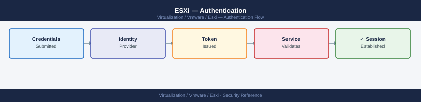

---
tags:
  - esxi
  - security
  - vmware
  - vsphere-8
---
# ESXi — Authentication

<div class="kb-summary">
Authentication reference covering Create a Break-Glass Local Account, Password Policy, Active Directory Integration, Authentication Hardening, Login Banner and 2 more sections.

*Applies to: vSphere 7.x / 8.x*
</div>


ESXi Authentication Paths

## Local Account Management

### List and Remove Unused Local Accounts

```bash
# View all local accounts
esxcli system account list

# Remove an account
esxcli system account remove -i <username>
```

---

## Before you begin

- **Access:** vCenter Administrator role
- **Change management:** security changes require CAB approval in most environments
- **Rollback plan:** document current state before any security control change
- **Testing:** validate in a non-production environment first where possible

---

## Password Policy

Apply the following via host profile or ESXCLI on each host.

| Parameter | Recommended Value | ESXCLI Path |
|---|---|---|
| Minimum password length | 12 characters | `Security.PasswordQualityControl` |
| Complexity | Upper, lower, digit, and special | `Security.PasswordQualityControl` |
| Password history | Last 5 passwords | `Security.PasswordHistory` |
| Failed login lockout threshold | 5 attempts | `Security.AccountLockFailures` |
| Lockout duration | 15 minutes | `Security.AccountUnlockTime` |
| Root password expiry | 365 days (or manage manually) | Managed via `chage` in ESXi Shell |

Configure via advanced settings:

```bash
# View current password quality settings
esxcli system settings advanced get -o /Security/PasswordQualityControl

# Set password complexity requirements
esxcli system settings advanced set \
  -o /Security/PasswordQualityControl \
  -s "similar=deny retry=3 min=disabled,disabled,disabled,7,7"

# Failed login lockout
esxcli system settings advanced set -o /Security/AccountLockFailures -i 5
esxcli system settings advanced set -o /Security/AccountUnlockTime -i 900
```

Or via Host Profile: **Policies and Profiles → Host Profile → Security → Security Settings → Login Banner / Password Policy**

---

## Active Directory Integration

### Join ESXi Host to Active Directory Domain

> **Note**: Joining ESXi directly to AD is supported but not the recommended pattern for most environments. The preferred approach is to use vCenter as the AD identity broker and maintain lockdown mode on hosts. Only join ESXi hosts to AD if there is a specific operational requirement.

```bash
# Via ESXi Shell (or ESXCLI from vCenter)
esxcfg-auth --enablead --addomain=corp.local --addc=dc01.example.local

# Or via ESXCLI
esxcli system module parameters set -m lsass -p "ad_domain=corp.local ad_server=dc01.example.local"

# Verify join status
esxcli system module parameters get -m lsass
```

Via vSphere Client: **Host → Configure → System → Authentication Services → Change**

After joining, AD users can be assigned roles in vCenter on this host. AD group `ESX Admins` is automatically granted administrator access — rename or disable this group if it exists in AD but should not have host access.

### ESX Admins Group (Security Note)

When an ESXi host is joined to AD, the AD group `ESX Admins` is granted full administrator access by default. This is a significant risk if the group exists in AD:

```bash
# Rename or disable the automatic ESX Admins privilege
esxcli system settings advanced set \
  -o /Config/HostAgent/plugins/hostsvc/esxAdminsGroupAutoAdd \
  -i 0

# Or change which AD group gets auto-admin rights
esxcli system settings advanced set \
  -o /Config/HostAgent/plugins/hostsvc/esxAdminsGroup \
  -s "ESX-Controlled-Access-Group"
```

---

## Authentication Hardening

### Disable PAM Telnet and FTP (If Enabled)

```bash
# Check if telnet or FTP is enabled
esxcli network firewall ruleset list | grep -E "telnet|ftp"

# Disable them
esxcli network firewall ruleset set --enabled false --ruleset-id ftpClient
esxcli network firewall ruleset set --enabled false --ruleset-id ftpServer
```

### SSH Key-Based Authentication

For break-glass SSH access, prefer key-based authentication over passwords:

```bash
# On the ESXi host — create authorized_keys directory
mkdir -p /etc/ssh/keys-root
# Add the public key
chmod 600 /etc/ssh/keys-root/authorized_keys
chown root:root /etc/ssh/keys-root/authorized_keys

# Verify key is loaded
ssh -i ~/.ssh/id_rsa root@<esxi-host> "esxcli system version get"
```

Keys are not persisted across reboots on stateless ESXi (Auto Deploy) without configuration in the host profile.

### SSH Hardening (ESXi SSHD)

If SSH must remain enabled temporarily, review `/etc/ssh/sshd_config`:

```bash
# View current SSH config
cat /etc/ssh/sshd_config | grep -v "^#" | grep -v "^$"

# Key hardening settings to verify:
# PermitRootLogin yes          (required for break-glass on ESXi)
# PasswordAuthentication yes   (ESXi default; disable if using key-only)
# ClientAliveInterval 300      (disconnect idle sessions after 5 minutes)
# ClientAliveCountMax 0        (strict: no keepalive retries before disconnect)
# AllowTcpForwarding no        (disable port forwarding)
# X11Forwarding no             (disable X11)
```

Note: `/etc/ssh/sshd_config` changes do not persist across reboots unless stored in a persistent config location or enforced via host profile.

---

## Login Banner

Display a legal / unauthorised access warning banner on SSH and DCUI logins:

```bash
# Set login banner
esxcli system settings advanced set \
  -o /Config/Etc/issue \
  -s "AUTHORISED USERS ONLY. This system is monitored. Unauthorised access is prohibited."

# Verify
esxcli system settings advanced get -o /Config/Etc/issue
```

The banner appears on SSH login and in the DCUI. Configure via Host Profile to enforce consistently.

---

## Authentication Audit

### Events to Monitor

Forward `/var/log/auth.log` and `/var/log/shell.log` to SIEM. Alert on:

| Event | Alert Priority |
|---|---|
| Multiple failed SSH logins (>3 in 1 minute) | High — brute force attempt |
| Successful root SSH login | Medium — unusual; should be near zero |
| Shell commands executed as root | High — log all commands |
| Account locked out (PAM lockout) | Medium |
| Local account added | High — unexpected account creation |

```bash
# View recent authentication failures
grep "Failed\|Invalid\|Authentication failure" /var/log/auth.log | tail -20

# View shell commands
grep -v "^#" /var/log/shell.log | tail -50

# View DCUI logins
grep "dcui\|DCUI\|login" /var/log/vobd.log | tail -20
```

### Verify Logs Are Forwarding

```bash
# Confirm syslog configuration
esxcli system syslog config get

# Confirm log forwarding is working (check SIEM for recent ESXi entries)
# Or generate a test entry
logger -t esxi-auth-test "Test auth log entry $(date)"
```
---

## Related Reference

- [Standard LDAP Integration](../../../../security/ldap-integration/index.md) — field reference, service account standards, TLS requirements, and connectivity testing
- [Standard SAML Configuration](../../../../security/saml-configuration/index.md) — SP/IdP setup, Azure AD and Okta steps, attribute mapping, and security requirements

## See also

- [ESXi Access Control](access-control/)
- [ESXi — Hardening](hardening/)
