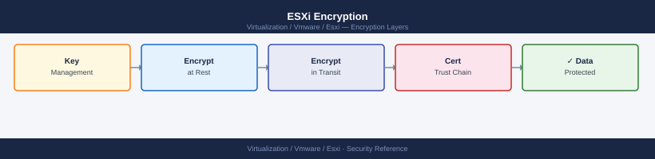

---
tags:
  - esxi
  - security
  - vmware
  - vsphere-8
---
# ESXi Encryption

<div class="kb-summary">
ESXi Encryption reference covering Encrypt a VM, vSAN Encryption, ESXi Host Encryption — Secure Boot and TPM, ESXi SSL/TLS Certificate Management, Encrypted vMotion and 1 more sections.

*Applies to: vSphere 7.x / 8.x*
</div>


ESXi Encryption Stack

The VM must be powered off or in a compatible state. Encryption processes each VMDK in-place.

## VM Encryption Operations

### Verify VM Encryption Status

```powershell
# Check encryption status for all VMs
Get-VM | Select-Object Name,
    @{N="Encrypted"; E={$_.ExtensionData.Config.KeyId -ne $null}} | 
    Where-Object {$_.Encrypted -eq $true}
```

### VM Encryption Key Operations

```bash
# Check if a VM is encrypted and get key ID (ESXCLI on host)
esxcli vm process list | grep -A10 <vm-name>

# Or via vim-cmd
vim-cmd vmsvc/get.config <vmid> | grep -i encrypt
```

---

## Before you begin

- **Access:** vCenter Administrator role
- **Change management:** security changes require CAB approval in most environments
- **Rollback plan:** document current state before any security control change
- **Testing:** validate in a non-production environment first where possible

---

## vSAN Encryption

vSAN provides two encryption modes:

| Mode | Layer | Key Requirement |
|---|---|---|
| Data-at-Rest Encryption | vSAN datastore | KMS or NKP |
| Data-in-Transit Encryption | vSAN network | No external KMS needed |

### Data-at-Rest Encryption

Enable during vSAN cluster configuration or on an existing cluster (requires full data rebuild):

vCenter: **Cluster → Configure → vSAN → Services → Encryption → Edit**

```powershell
# Enable vSAN encryption (PowerCLI)
$cluster = Get-Cluster "CL-PROD"
Set-VsanClusterConfiguration -Cluster $cluster -EncryptionEnabled $true
```

**Warning**: Enabling vSAN encryption on an existing cluster triggers a full disk reformat. All data is re-written with encryption. Schedule a maintenance window and confirm data is protected by backups before enabling.

### Data-in-Transit Encryption

Encrypts vSAN traffic between hosts on the vSAN network. Does not require a KMS. Can be enabled without a full rebuild:

vCenter: **Cluster → Configure → vSAN → Services → Encryption → In-Transit Encryption → Enable**

```powershell
# Check in-transit encryption status
Get-VsanClusterConfiguration -Cluster "CL-PROD" | Select-Object EncryptionEnabled, InTransitEncryptionEnabled
```

---

## ESXi Host Encryption — Secure Boot and TPM

### UEFI Secure Boot

Secure Boot verifies the ESXi bootloader signature before allowing execution. Prevents unsigned code from loading at boot.

**Prerequisites**: UEFI firmware (not legacy BIOS), TPM 2.0 module present.

Enable Secure Boot in the server firmware/BIOS settings before installing ESXi.

Verify Secure Boot is active on a running host:

```bash
/usr/lib/vmware/secureboot/bin/secureBoot.py -s
# Expected output: Secure Boot: ENABLED

# Detailed status
/usr/lib/vmware/secureboot/bin/secureBoot.py --status
```

```powershell
# PowerCLI — check Secure Boot across all hosts
Get-VMHost | ForEach-Object {
    $sb = $_.ExtensionData.Config.BootOptions.BootRetryEnabled
    $secBoot = $_.ExtensionData.Config.HyperThread.Active
    [PSCustomObject]@{
        Host     = $_.Name
        SecureBoot = ($_.ExtensionData.Config.BootOptions | Select-Object -ExpandProperty EfiBootSupported)
    }
}
```

### TPM 2.0 Attestation

When a TPM 2.0 is present, vSphere 7.0+ can perform host attestation — verifying the host's boot measurement matches a known-good state. This detects tampering of the boot chain.

View TPM status: **vCenter → Host → Configure → System → TPM**

```powershell
# Check TPM attestation status across cluster
Get-VMHost | Select-Object Name,
    @{N="AttestationStatus"; E={$_.ExtensionData.Runtime.TpmPcrValues}}
```

---

## ESXi SSL/TLS Certificate Management

ESXi hosts present a TLS certificate for HTTPS (vSphere Client, API, NFC). The default certificate is self-signed with an auto-generated key.

### View Current Certificate

```bash
# On ESXi host (SSH)
openssl x509 -in /etc/vmware/ssl/rui.crt -noout -dates -subject -issuer -fingerprint

# Example output:
# notBefore=May  1 00:00:00 2025 GMT
# notAfter=May  1 00:00:00 2027 GMT
# subject=/CN=esxi-01.example.local
# issuer=/O=VMware/CN=CA
```

### Certificate Modes (vCenter Managed)

vCenter Certificate Authority (VMCA) manages ESXi host certificates automatically. When a host is added to vCenter, VMCA signs its certificate. Certificates are renewed automatically before expiry.

| Mode | Description | When to Use |
|---|---|---|
| VMCA (default) | vCenter CA signs host certs | Most deployments |
| External CA | Corporate CA signs host certs | PCI/HIPAA compliance requirements |
| Thumbprint | Self-signed; vCenter trusts by thumbprint | Legacy; avoid for new deployments |

### Replace Certificate with CA-Signed (External CA Mode)

```bash
# Step 1 — Generate a CSR on the ESXi host
# /sbin/generate-certificates regenerates the key and self-signed cert
# For CA-signed certs, generate the CSR externally or via vCenter

# Step 2 — Via vCenter: replace the host certificate
# vCenter → Host → Configure → System → Certificate → Renew/Import

# Step 3 — Verify the new certificate is applied
openssl s_client -connect esxi-01.example.local:443 2>/dev/null | \
  openssl x509 -noout -dates -subject -issuer
```

### Certificate Expiry Monitoring

```powershell
# Check certificate expiry on all ESXi hosts
Get-VMHost | ForEach-Object {
    $h = $_
    $certInfo = $h.ExtensionData.Config.Certificate
    if ($certInfo) {
        $cert = [System.Security.Cryptography.X509Certificates.X509Certificate2]::new($certInfo)
        $daysLeft = ($cert.NotAfter - (Get-Date)).Days
        [PSCustomObject]@{
            Host       = $h.Name
            Expiry     = $cert.NotAfter.ToString("yyyy-MM-dd")
            DaysLeft   = $daysLeft
            Status     = if ($daysLeft -lt 30) {"CRITICAL"} elseif ($daysLeft -lt 60) {"WARNING"} else {"OK"}
        }
    }
} | Sort-Object DaysLeft
```

---

## Encrypted vMotion

vMotion traffic can be encrypted to protect VM memory during live migration. Configure per-VM:

```powershell
# Enable Encrypted vMotion on a VM
$vm = Get-VM "db-server-01"
$spec = New-Object VMware.Vim.VirtualMachineConfigSpec
$spec.MigrateEncryption = "required"   # Options: disabled, opportunistic, required
($vm | Get-View).ReconfigVM($spec)
```

| Mode | Behaviour |
|---|---|
| `disabled` | vMotion never encrypted |
| `opportunistic` | Encrypted if both hosts support it (default for new VMs in vSphere 6.5+) |
| `required` | vMotion refused if encryption not available on either host |

Set `required` only for VMs that handle sensitive data. `opportunistic` is the safe default for all VMs in a vSphere 7/8 environment.

---

## Encryption Checklist

- [ ] NKP backup downloaded and stored securely (passphrase stored separately in vault)
- [ ] VM Encryption applied to all VMs handling regulated data (PCI, HIPAA scope)
- [ ] vSAN data-at-rest encryption enabled if vSAN is used
- [ ] vSAN in-transit encryption enabled on production vSAN clusters
- [ ] ESXi Secure Boot confirmed enabled on all production hosts
- [ ] TPM 2.0 attestation configured (vSphere 7.0+ with TPM hardware)
- [ ] ESXi host certificates valid (>60 days remaining)
- [ ] Encrypted vMotion set to `opportunistic` or `required` for sensitive VMs
- [ ] NKP health checked: `vCenter → Configure → Key Providers` — shows green

## See also

- [ESXi — Hardening](hardening/)
- [ESXi — Health Checks](../operations/health-checks/)
