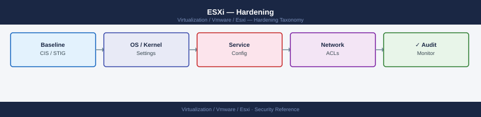

---
tags:
  - esxi
  - security
  - vmware
  - vsphere-8
---
# ESXi — Hardening


<div class="kb-summary">
Hardening reference covering Firewall Hardening, Advanced Security Settings, Secure Boot, Audit Logging, Host Profile Enforcement and 2 more sections.

*Applies to: vSphere 7.x / 8.x*
</div>



ESXi Host Hardening Layers

Configure via vCenter: **Host → Configure → Security Profile → Lockdown Mode → Exception Users**

---

```d2
direction: down

external: External / Untrusted {shape: rectangle}
firewall_hardening: "Firewall Hardening" {shape: rectangle}
advanced_security_settings: "Advanced Security Settings" {shape: rectangle}
secure_boot: "Secure Boot" {shape: rectangle}
audit_logging: "Audit Logging" {shape: rectangle}
host_profile_enforcement: "Host Profile Enforcement" {shape: rectangle}
vib_acceptance_level_policy: "VIB Acceptance Level Policy" {shape: rectangle}
core: "ESXi Core" {shape: hexagon}

external -> firewall_hardening: traffic in
firewall_hardening -> advanced_security_settings
advanced_security_settings -> secure_boot
secure_boot -> audit_logging
audit_logging -> host_profile_enforcement
host_profile_enforcement -> vib_acceptance_level_policy
vib_acceptance_level_policy -> core: secured path
```

## Before you begin

- **Access:** vCenter Administrator role
- **Change management:** security changes require CAB approval in most environments
- **Rollback plan:** document current state before any security control change
- **Testing:** validate in a non-production environment first where possible

---

## Firewall Hardening

```bash
# Check firewall is enabled
esxcli network firewall get
# Expected: Enabled: true, Default Action: DROP

# List all rulesets and their state
esxcli network firewall ruleset list

# Show allowed IPs for a specific ruleset
esxcli network firewall ruleset allowedip list --ruleset-id sshServer

# Restrict SSH access to admin subnet
esxcli network firewall ruleset set --ruleset-id sshServer --allowed-all false
esxcli network firewall ruleset allowedip add --ruleset-id sshServer --ip-address 10.0.1.0/24

# Restrict vSphere Client access
esxcli network firewall ruleset set --ruleset-id webAccess --allowed-all false
esxcli network firewall ruleset allowedip add --ruleset-id webAccess --ip-address 10.0.1.0/24

# Disable unused rulesets (examples)
esxcli network firewall ruleset set --enabled false --ruleset-id ftpClient
esxcli network firewall ruleset set --enabled false --ruleset-id ftpServer
```

### Minimum Required Rulesets

| Ruleset | Port | Required For |
|---|---|---|
| `vpxHeartbeats` | TCP 80 | vCenter HA heartbeat |
| `vSphereClient` | TCP 443, 902 | vCenter API and management |
| `ntpClient` | UDP 123 | NTP time sync |
| `syslog` | UDP/TCP 514 | Log forwarding |
| `DHCPv6` | — | Disable if not using IPv6 |
| `vSANTransport` | Various | vSAN cluster traffic (if vSAN enabled) |

Disable all rulesets not in the above list.

---

## Advanced Security Settings

Configure via `esxcli system settings advanced set` or via Host Profile.

| Setting | Recommended Value | ESXCLI Option Path |
|---|---|---|
| Shell idle timeout | 600 seconds | `/UserVars/ESXiShellTimeOut` |
| Shell interactive timeout | 300 seconds | `/UserVars/ESXiShellInteractiveTimeOut` |
| Failed login lockout threshold | 5 attempts | `/Security/AccountLockFailures` |
| Account unlock time | 900 seconds (15 min) | `/Security/AccountUnlockTime` |
| Login banner | Legal warning text | `/Config/Etc/issue` |
| Suppress hyperthreading warning | false | (Leave unset) |

```bash
# Apply security settings
esxcli system settings advanced set -o /UserVars/ESXiShellTimeOut -i 600
esxcli system settings advanced set -o /UserVars/ESXiShellInteractiveTimeOut -i 300
esxcli system settings advanced set -o /Security/AccountLockFailures -i 5
esxcli system settings advanced set -o /Security/AccountUnlockTime -i 900
esxcli system settings advanced set -o /Config/Etc/issue \
  -s "AUTHORISED USERS ONLY. Unauthorised access to this system is prohibited."

# Verify
esxcli system settings advanced get -o /Security/AccountLockFailures
esxcli system settings advanced get -o /UserVars/ESXiShellTimeOut
```

---

## Secure Boot

UEFI Secure Boot verifies the bootloader and VIBs are signed by VMware before loading. It prevents unsigned kernel modules from running.

```bash
# Verify Secure Boot is active
/usr/lib/vmware/secureboot/bin/secureBoot.py -s
# Expected: Enabled

# Detailed check
/usr/lib/vmware/secureboot/bin/secureBoot.py --status
```

If Secure Boot reports `Disabled`, check the server BIOS/UEFI settings. Secure Boot must be enabled before installing ESXi — it cannot be turned on retroactively on a running host without a clean installation.

VIB acceptance levels must be VMwareCertified or VMwareAccepted when Secure Boot is enabled — CommunitySupported and PartnerSupported VIBs are rejected:

```bash
esxcli software acceptance get
# Must return: VMwareCertified or VMwareAccepted (not CommunitySupported)
```

---

## Audit Logging

All ESXi security-relevant events must be forwarded off-host. Logs are stored in ramdisk and are **lost on reboot** without syslog forwarding.

| Log | Path | Security-Relevant Content |
|---|---|---|
| auth.log | `/var/log/auth.log` | SSH logins, PAM failures |
| shell.log | `/var/log/shell.log` | ESXi Shell commands |
| hostd.log | `/var/log/hostd.log` | API calls, vCenter agent actions |
| vobd.log | `/var/log/vobd.log` | DCUI logins, hardware events |

### Configure Syslog Forwarding

```bash
# Configure syslog target
esxcli system syslog config set --loghost="tcp://syslog.example.local:514"

# Multiple targets
esxcli system syslog config set \
  --loghost="tcp://syslog1.example.local:514,udp://syslog2.example.local:514"

# Apply config
esxcli system syslog reload

# Verify
esxcli system syslog config get
```

Configure via Host Profile to apply uniformly across all cluster hosts.

---

## Host Profile Enforcement

Host Profiles enforce the security baseline across all cluster hosts. Deviations are reported as non-compliant.

Security settings captured in a Host Profile:
- SSH and ESXi Shell service state and startup policy
- Firewall ruleset state and allowed IPs
- Advanced settings (shell timeout, lockout thresholds, banner text)
- NTP configuration
- Syslog target
- VIB acceptance level
- Lockdown mode

```powershell
# Create a host profile from the hardened reference host
New-VMHostProfile -Name "Cluster-Security-Profile" \
    -ReferenceHost (Get-VMHost "esxi-01.example.local") \
    -Description "Production security baseline — v1.2"

# Attach profile to all hosts in cluster
Get-Cluster "CL-PROD" | Get-VMHost | ForEach-Object {
    Set-VMHost -VMHost $_ -Profile (Get-VMHostProfile "Cluster-Security-Profile")
}

# Check compliance — identify drifted hosts
Get-Cluster "CL-PROD" | Get-VMHost | ForEach-Object {
    Test-VMHostProfileCompliance -VMHost $_ |
        Where-Object {$_.ComplianceStatus -ne "Compliant"} |
        Select-Object VMHost, ComplianceStatus, IncomplianceDescription
}
```

Run **Check Compliance** after every change to a host. Non-compliant hosts should be remediated within the change window.

---

## VIB Acceptance Level Policy

ESXi enforces VIB (driver/plugin) signing requirements through acceptance levels:

| Level | Signing | Production Use |
|---|---|---|
| VMwareCertified | VMware tested and certified | Approved |
| VMwareAccepted | Partner signed; VMware accepted | Approved |
| PartnerSupported | Vendor signed only | Review case-by-case |
| CommunitySupported | No signing | Not in production |

Enforce minimum acceptance level:

```bash
# Check current acceptance level
esxcli software acceptance get

# Set minimum to VMwareAccepted
esxcli software acceptance set --level=VMwareAccepted

# List all installed VIBs and their acceptance level
esxcli software vib list | awk '{print $1, $4}' | sort
```

Any VIB with `CommunitySupported` acceptance level in production should be removed or replaced with a supported alternative.

---

## TPM 2.0 and Attestation

vSphere 7.0+ supports TPM 2.0 host attestation, which verifies the ESXi host's boot measurements have not changed since the last known-good state.

Requirements:
- Physical TPM 2.0 chip in the server
- UEFI Secure Boot enabled
- vSphere Trust Authority (optional — adds attestation enforcement)

```bash
# Check TPM status from ESXi Shell
esxcli system settings advanced get -o /UserVars/TpmBiosDeviceEnabled

# View TPM details
cat /var/run/tpm/tpminfo.json 2>/dev/null
```

View in vCenter: **Host → Configure → System → TPM**

If TPM attestation fails, investigate recent firmware or BIOS changes. A failed attestation indicates the host's boot chain has changed — investigate before trusting the host.

## See also

- [ESXi Access Control](access-control/)
- [ESXi — Authentication](authentication/)
- [ESXi — Health Checks](../operations/health-checks/)
