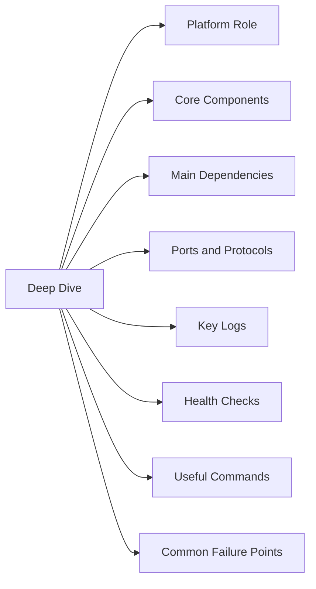

# ESXi Technical Deep Dive

## Overview

ESXi is part of the virtualization platform. This page is for technical operations, troubleshooting, upgrade planning, and support handoff.

## Platform Role

ESXi is the hypervisor layer that runs virtual machines and connects workloads to CPU, memory, network, and storage resources.

## Core Components

- VMkernel
- Host management agents
- Standard switches
- Distributed switch membership
- VMkernel adapters
- Datastore paths
- Hardware sensors
- Local services
- Host firewall

## Main Dependencies

- DNS resolution
- NTP/time sync
- Authentication source
- Management network
- Storage access
- Certificate trust
- Monitoring
- Backup/recovery process
- Vendor support access

## Ports and Protocols

| Use | Protocol | Port |
|-----|----------|------|
| Host management | HTTPS | 443 |
| vMotion | TCP | 8000 |
| NFC / file copy | TCP | 902 |
| Syslog | UDP/TCP | 514 |
| DNS | TCP/UDP | 53 |
| NTP | UDP | 123 |

## Key Logs

- `/var/log/hostd.log`
- `/var/log/vmkernel.log`
- `/var/log/vpxa.log`
- `/var/log/esxupdate.log`
- `/var/log/syslog.log`

## Health Checks

- Confirm management access.
- Review current alarms.
- Review recent failed tasks.
- Validate DNS and NTP.
- Confirm certificate status.
- Check service health.
- Check capacity and performance.
- Confirm monitoring data is current.
- Review recent changes.

## Useful Commands

~~~bash
esxcli system version get
esxcli hardware platform get
esxcli network ip interface list
esxcli network nic list
esxcli storage core path list
esxcli storage filesystem list
esxcli system ntp get
/etc/init.d/hostd status
/etc/init.d/vpxa status
~~~

## Common Failure Points

- Management vmkernel issue
- DNS or NTP issue
- Host agents stopped
- Storage path loss
- NIC/uplink failure
- Failed maintenance mode
- Hardware warning
- Patch failure

## Troubleshooting Workflow

1. Confirm the impact and scope.
2. Check recent changes.
3. Review alerts, tasks, and events.
4. Validate DNS, NTP, authentication, and certificates.
5. Check service status.
6. Check storage and network dependencies.
7. Review logs.
8. Capture screenshots, timestamps, errors, and task IDs.
9. Escalate with clean evidence if needed.

## Upgrade and Compatibility Notes

- Check product interoperability before upgrades.
- Confirm supported version path.
- Confirm backup or rollback method.
- Confirm maintenance window.
- Run pre-checks before change work.
- Validate health after the change.
- Document version before and after.

## Best Practices

| Recommendation | Detail |
|---|---|
| Keep versions aligned. | Keep versions aligned. |
| Keep certificates tracked. | Keep certificates tracked. |
| Keep DNS and NTP clean. | Keep DNS and NTP clean. |
| Keep alerting actionable. | Keep alerting actionable. |
| Document support ownership. | Document support ownership. |
| Avoid undocumented changes. | Avoid undocumented changes. |
