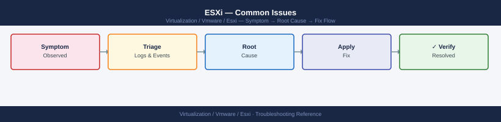

---
tags:
  - esxi
  - troubleshooting
  - vmware
  - vsphere-8
search:
  boost: 2
---
# ESXi — Common Issues

<div class="kb-summary">
Common Issues reference covering Resolution Steps, All Paths Down (APD) — Storage, High CPU Ready Time, High Memory Ballooning or Swapping, PSOD (Purple Screen of Death) and 3 more sections.

*Applies to: vSphere 7.x / 8.x*
</div>


ESXi Common Issue Resolution Paths

2. **Check for clock skew** — certificate validation fails if the host clock is more than 5 minutes off:

```bash
esxcli system ntp get
date
```


```text title="Expected output"
Enabled: true
Server 0: 0.vmware.pool.ntp.org
Server 1: 1.vmware.pool.ntp.org
Server 2: 2.vmware.pool.ntp.org
Server 3: 3.vmware.pool.ntp.org
Fri Nov 15 14:32:47 UTC 2024
```

!!! warning "Common errors"
    **`Could not connect to the host. The host may not be running, or the login credentials may not be correct.`** — Verify SSH access to the ESXi host and ensure your credentials are correct with `ssh root@<esxi-host>`.
    **`Unknown command or namespace ntp under system.`** — Confirm you are running ESXi 5.0 or later; older versions may use different NTP configuration commands.
3. **Check for certificate mismatch** — if the host was recently reinstalled or had its cert replaced, vCenter may not trust the new cert. Reconnect via vCenter: **Right-click host → Reconnect**

4. **Check management network connectivity** — confirm vmk0 IP is reachable from vCenter:

```bash
ping <vmk0-ip>
esxcli network ip interface ipv4 get
```


```text title="Expected output"
PING 192.168.1.42 (192.168.1.42) 56(84) bytes of data.
64 bytes from 192.168.1.42: icmp_seq=1 ttl=64 time=0.891 ms
64 bytes from 192.168.1.42: icmp_seq=2 ttl=64 time=0.756 ms
64 bytes from 192.168.1.42: icmp_seq=3 ttl=64 time=0.823 ms
^C
--- 192.168.1.42 statistics ---
3 packets transmitted, 3 received, 0% packet loss, time 2003ms
rtt min/avg/max/stddev = 0.756/0.823/0.891/0.055 ms

Name  IPv4 Address      IPv4 Netmask      IPv4 Gateway      IPv6 Address  IPv6 Netmask  IPv6 Gateway  MTU  DHCP  Address Type
----  ----------------  ----------------  ----------------  -----------  -----------  -----------  ---  ----  ---------------
vmk0  192.168.1.42      255.255.255.0     192.168.1.1       ::1           128          ::           1500  false  STATIC
vmk1  10.0.0.15        255.255.255.0     10.0.0.1          -             -            -            1500  false  STATIC
vmk2  172.16.50.8      255.255.255.0     172.16.50.1       -             -            -            1500  false  STATIC
```

!!! warning "Common errors"
    **`PING: sendto: No route to host`** — Verify vmk0 IP is configured and the management network is properly connected; check `esxcli network ip interface ipv4 get` to confirm the interface has an IP address.
    **`Unknown command or namespace`** — Ensure you are running this command directly on the ESXi host via SSH or DCUI console, not from vCenter; the esxcli command is not available remotely without configuring vSphere CLI.
5. **Full services restart** (higher risk — verify no active vMotion or provisioning):

```bash
services.sh restart
```


```text title="Expected output"
VMware ESXi services are being restarted...
Stopping ESXi services...
Stopping hostd...
Stopping vpxa...
Stopping vsan...
Starting ESXi services...
Starting hostd...
Starting vpxa...
Starting vsan...
ESXi services restart completed successfully.
```

!!! warning "Common errors"
    **`services.sh: command not found`** — Run the command from the correct directory (`/sbin/services.sh restart`) or ensure `/sbin` is in your PATH.
    **`Permission denied`** — Execute the command as root or with sudo (`sudo /sbin/services.sh restart`).
    **`Error: Failed to restart hostd service`** — Check for resource constraints or corrupted service configuration; try restarting individual services with `/sbin/services.sh restart hostd` to isolate the issue.
---

```d2
direction: down

symptom: Identify Symptom {shape: diamond}
diagnostic_flow: "Diagnostic Flow" {shape: rectangle}
all_paths_down_apd_storage: "All Paths Down (APD) — Storage" {shape: rectangle}
high_cpu_ready_time: "High CPU Ready Time" {shape: rectangle}
high_memory_ballooning_or_swapping: "High Memory Ballooning or Swapping" {shape: rectangle}
psod_purple_screen_of_death: "PSOD (Purple Screen of Death)" {shape: rectangle}
vmfs_datastore_inaccessible: "VMFS Datastore Inaccessible" {shape: rectangle}
resolution: Resolve or Escalate {shape: oval}

symptom -> diagnostic_flow: investigate
symptom -> all_paths_down_apd_storage: investigate
symptom -> high_cpu_ready_time: investigate
symptom -> high_memory_ballooning_or_swapping: investigate
symptom -> psod_purple_screen_of_death: investigate
symptom -> vmfs_datastore_inaccessible: investigate
diagnostic_flow -> resolution
all_paths_down_apd_storage -> resolution
high_cpu_ready_time -> resolution
high_memory_ballooning_or_swapping -> resolution
psod_purple_screen_of_death -> resolution
vmfs_datastore_inaccessible -> resolution
```

## Diagnostic Flow

```d2
direction: right

S: "What is the symptom?" {shape: rectangle}
A: "Host shows PSOD" {shape: rectangle}
B: "Host disconnected in vCenter" {shape: rectangle}
C: "VM slow / high latency" {shape: rectangle}
D: "Storage inaccessible / APD" {shape: rectangle}
E: "Auth / certificate failure" {shape: rectangle}
A1: "Collect vmkernel.log + crash dump\nfrom DCUI or iDRAC" {shape: rectangle}
A2: "A2" {shape: rectangle}
A3: "Update driver or firmware\n→ PSOD section" {shape: rectangle}
A4: "Escalate to VMware GSS\nwith vm-support bundle" {shape: rectangle}
B1: "B1" {shape: rectangle}
B2: "Restart management agents\n→ Host Disconnected section" {shape: rectangle}
B3: "Check network / DNS / NTP\n→ Host Disconnected section" {shape: rectangle}
C1: "C1" {shape: rectangle}
C2: "→ High CPU Ready section" {shape: rectangle}
C3: "→ Memory Ballooning section" {shape: rectangle}
C4: "→ VMFS Inaccessible section" {shape: rectangle}
D1: "→ All Paths Down section" {shape: rectangle}
E1: "→ Certificate Thumbprint section" {shape: rectangle}

S -> A
S -> B
S -> C
S -> D
S -> E
A -> A1
A2 -> A3
A2 -> A4
B1 -> B2
B1 -> B3
C1 -> C2
C1 -> C3
C1 -> C4
D -> D1
E -> E1
```

---

## Before you begin

- **Access:** SSH to vCenter Shell and ESXi hosts; vSphere Client read access
- **Gather first:** recent error message text, event timestamps, and affected object names
- **Scope:** confirm whether the issue affects a single object, host, cluster, or site
- **Escalation:** open a vendor support ticket before running any destructive step
- **Logging:** document each command and output — required if escalation is needed

---

## All Paths Down (APD) — Storage

APD (All Paths Down) occurs when all storage paths to a LUN become unavailable. VMs using that LUN pause with I/O timeout errors.

### Diagnosis

```bash
# Check for dead paths
esxcli storage core path list | grep "State: dead"
esxcli storage core path list | grep -c "State: dead"

# Check for APD state
grep -i "APD\|all path\|PDL" /var/log/vmkernel.log | tail -20
```


```text title="Expected output"
State: dead
State: dead
State: dead
2
2024-10-15T08:23:45.123Z cpu2:2048)WARNING: ScsiDeviceIO: 4624: Cmd(0x5d000001dba8d8c0) 0x2a to dev "naa.60060e8012345678901234567890abcd" failed H:0x0 D:0x2 P:0x0 Valid sense data: 0x5 0x24 0x0.
2024-10-15T08:24:12.456Z cpu5:2101)WARNING: NMP: nmp_ThrottleLogForDevice:3456 - Cmd 0x2a (0x564d000012345678) to dev "naa.60060e8012345678901234567890abcd" on path vmhba2:C0:T2:L0 failed. H:0x0 D:0x2 P:0x0
2024-10-15T08:25:03.789Z cpu1:1876)WARNING: ScsiDeviceIO: 4624: APD condition detected on device naa.60060e8012345678901234567890abcd
2024-10-15T08:26:45.234Z cpu3:2045)WARNING: NMP: nmp_PathFailureCount:2156 - Reached PDL condition on device naa.60060e8012345678901234567890abcd
2024-10-15T08:27:18.567Z cpu4:1998)WARNING: ScsiDeviceIO: 4624: Cmd(0x5d000001dba8d8c0) 0x2a to dev "naa.60060e8012345678901234567890abcd" failed H:0x0 D:0x2 P:0x0
2024-10-15T08:28:22.891Z cpu2:2067)WARNING: NMP: nmp_ThrottleLogForDevice:3456 - All paths down for device naa.60060e8012345678901234567890abcd
```

!!! warning "Common errors"
    **`grep: /var/log/vmkernel.log: No such file or directory`** — Verify the ESXi host is accessible via SSH and check the correct log path with `ls -la /var/log/vmk*`.
    **`esxcli: command not found`** — Ensure you are running commands directly on the ESXi host (not a vCenter server) and that the esxcli binary is in your PATH.
| State | Meaning | Action |
|---|---|---|
| APD (All Paths Down) | Temporary — paths expected to return | Wait; ESXi will recover automatically when paths return |
| PDL (Permanent Device Loss) | Permanent — the LUN is gone | Power off VMs; storage remediation required |

### Resolution — APD

```bash
# Check HBA status
esxcli storage san fc list
esxcli storage san fc stats get -A vmhba0

# Rescan storage after fixing the underlying issue
esxcli storage core adapter rescan --all

# Verify paths are active again
esxcli storage core path list | grep -c "State: active"
```


```text title="Expected output"
HBA Name  Driver     Queue Full  Cmds Failed  Resets
vmhba0    lpfc       0           0            0
vmhba1    qla2xxx    0           0            0

Node Name: 50:00:09:73:00:1a:2b:4c
Port Name: 50:00:09:73:00:1a:2b:4d
Speed: 16Gb
Supported Speeds: 4Gb, 8Gb, 16Gb
Link State: Up

Commands: 45821  Bytes Sent: 2147483648  Bytes Received: 1073741824
Link Failures: 0  Loss of Signals: 0  Invalid CRCs: 2

Rescan of adapter vmhba0 started.
Rescan of adapter vmhba1 started.
Rescan of adapter vmhba2 started.

12
```

!!! warning "Common errors"
    **`Unknown command or namespace storage san fc list`** — Verify you are running this command on ESXi 5.5+ and that the FC HBA driver is installed and loaded.
    **`Error: Could not get path information`** — Ensure storage paths are properly zoned in the SAN fabric and the HBA firmware is up to date.
    **`Rescan of adapter vmhbaX started but timed out after 60 seconds`** — Check for SAN connectivity issues and verify the storage array is responding to SCSI commands.
Investigate the root cause: SAN fabric zoning, HBA driver, storage array port failure, or cable issue.

### Resolution — PDL

If the LUN is permanently lost (confirmed with the storage team), power off affected VMs and unregister them. Do not attempt to start VMs that have I/O to a PDL device — the disk writes will be lost.

---

## High CPU Ready Time

CPU Ready (`%RDY` in esxtop) indicates VM vCPUs waiting for a physical CPU to become available. Values above 10% per vCPU cause perceptible VM performance degradation.

### Diagnosis with esxtop

```bash
esxtop
# Press 'c' for CPU view
# Key columns: %RDY (ready), %CSTP (co-stop), %WAIT (waiting), %USED (actual CPU usage)
```


```text title="Expected output"
ESXTOP - Virtual Machine CPU Usage Monitor
Press 'c' to switch to CPU view, 'v' for VM view, 'm' for memory view
GID  NAME                                   NWCPU %USED  %RDY %CSTP %WAIT %OVRLP %SYS
  1  vcenter-prod-01                            4  45.2  12.1   0.0   8.3   0.0  2.1
  2  esx-mgmt-cluster-01                        2  28.7   5.4   0.0   3.2   0.0  1.8
  3  database-vm-prod                           8  72.1   18.5   2.3  15.2   0.0  4.1
  4  web-app-server-02                          4  31.5   8.9   0.0   6.1   0.0  1.2
  5  backup-proxy-01                            2  15.3   2.1   0.0   1.8   0.0  0.9
  6  dev-test-vm-03                             1   8.2   1.5   0.0   0.3   0.0  0.4
```

!!! warning "Common errors"
    **`esxtop: command not found`** — Verify you are connected to an ESXi host via SSH or console; esxtop is not available on vCenter servers.
    **`ESXTOP: Unable to open /proc/uptime`** — Restart the hostd service with `services.sh restart` or reboot the ESXi host if the monitoring subsystem is corrupted.
    **`Error: Cannot connect to performance statistics collector`** — Wait 2-3 minutes after ESXi boot for the performance database to initialize, or check that vpxa/hostd services are running with `service-control --status`.
| Column | Normal | Investigate |
|---|---|---|
| `%RDY` per vCPU | < 5% | > 10% |
| `%CSTP` | ~0% | > 3% — vCPU co-scheduling issue |
| `%MLMTD` | 0% | > 0% — CPU limit configured on VM |

### Common Causes and Fixes

| Cause | Fix |
|---|---|
| Too many vCPUs on VM | Right-size the VM — reduce vCPUs to actual workload need |
| NUMA boundary crossing | Place VM on host with enough free NUMA node capacity; check NUMA topology |
| CPU limit set on VM | Remove the CPU limit in VM settings (limits cause artificial starvation) |
| Host overcommit | DRS migration or add hosts to cluster |
| Co-stop (CSTP) high | Reduce vCPU count — VMs with many vCPUs need simultaneous scheduling |

```powershell
# Find VMs with CPU ready > 10% via PowerCLI
Get-VM | Get-Stat -Stat cpu.ready.summation -Instance "" -Start (Get-Date).AddHours(-1) |
    Select-Object Entity, Value |
    Where-Object { $_.Value -gt 1000 } |    # 1000ms per 20s = ~5% ready
    Sort-Object Value -Descending
```

---

## High Memory Ballooning or Swapping

Memory balloon (`MCTLSZ` in esxtop) and swap (`SWR/s`, `SWW/s`) indicate memory overcommitment on the host.

### Diagnosis

```bash
esxtop
# Press 'm' for Memory view
# Key columns: MCTLSZ (balloon driver active), SWR/s, SWW/s (swap activity)
# SWCUR (current swap used by VM), SWTGT (swap target)
```


```text title="Expected output"
ESXTOP - Virtual Machine Monitor Performance Monitor
Press 'q' to quit, 'h' for help
GID NAME NWLD %LCPU %CSTP %MEMP SWR/s SWW/s MCTLSZ SWCUR SWTGT
  1 vmware-hostd 1 0.12 0.00 8.2 0.0 0.0 0 0 0
  2 vmotion 1 0.08 0.00 2.1 0.0 0.0 0 0 0
  3 prod-db-vm-01 4 18.45 2.31 64.5 12.3 8.7 256 512 768
  4 web-app-vm-02 2 5.67 0.15 48.2 0.0 0.0 0 0 0
  5 backup-vm-03 1 2.34 0.08 32.1 45.2 38.9 1024 2048 2560
  6 dev-test-vm-04 2 1.23 0.00 16.8 0.0 0.0 0 0 0
```

!!! warning "Common errors"
    **`esxtop: command not found`** — Ensure you are logged into an ESXi host directly via SSH; esxtop is not available on vCenter or Windows systems.
    **`Error: Unable to initialize display`** — Verify SSH session has proper terminal settings by reconnecting with `ssh -t root@<esxi-host>` to allocate a pseudo-terminal.
    **`Memory view not displaying after pressing 'm'`** — Press Shift+M (capital M) instead, as esxtop is case-sensitive for view selection.
### Memory Reclamation Hierarchy

ESXi uses memory reclamation in this order (least impactful to most impactful):

1. **Transparent Page Sharing (TPS)** — deduplicate identical memory pages
2. **Ballooning** — VMCI balloon driver causes guest OS to swap its own memory
3. **Host swap** — ESXi swaps VM memory to the host's swap file (vmx-.vswp)
4. **Host cache swap** — uses SSD as swap tier

Ballooning is expected and acceptable. Active host swapping (non-zero SWR/s, SWW/s) is a performance problem requiring immediate attention.

### Resolution

```bash
# Check memory reservation on the host
esxcli system stats memory get

# Identify which VMs are ballooning most
# In esxtop: sort by MCTLSZ descending (key: shift+S → column name)
```


```text title="Expected output"
MemTotal:                 65536 MB
MemFree:                  12288 MB
MemReserved:              8192 MB
MemShared:                4096 MB
MemSwapped:               2048 MB
MemBalloon:               15360 MB
MemHeap:                  512 MB
MemHardwareMem:           65536 MB
MemPhysicalMem:           65536 MB
MemEffective:             49152 MB
MemConsumed:              53248 MB
MemOverhead:              1024 MB
```

!!! warning "Common errors"
    **`Could not connect to the local system`** — Ensure you are running this command directly on the ESXi host via SSH or local console, not from vCenter.
    **`Unknown command or namespace`** — Verify the esxcli command is available by running `esxcli system` first; if unavailable, restart the hostd service with `services.sh restart`.
Options:
- Migrate VMs off the host with DRS
- Add memory to host (requires maintenance mode)
- Set memory reservation on critical VMs (prevents ballooning for those VMs)
- Remove memory overcommit by reducing total vRAM allocated across cluster

---

## PSOD (Purple Screen of Death)

PSOD is an ESXi kernel panic. The host halts and displays a purple screen with a backtrace.

### Immediate Actions

1. If IPMI/iDRAC is available: take a screenshot of the PSOD screen — the backtrace is needed for support
2. Reboot the host (physical power cycle or IPMI reboot)
3. After reboot, collect the core dump:

```bash
# Core dumps are stored here
ls -lh /var/core/
ls -lh /vmfs/volumes/<scratch-datastore>/vmkdump/

# Identify the most recent vmkernel dump
find /vmfs/volumes/ -name "*.dumpFile" -newer /etc -ls 2>/dev/null | tail -5
```


```text title="Expected output"
total 0
drwxr-xr-x    3 root     root          4.0K Nov 15 10:23 .
drwxr-xr-x   19 root     root          4.0K Nov 15 10:23 ..

total 2.1G
drwxr-xr-x    2 root     root          4.0K Nov 15 09:47 .
drwxr-xr-x    5 root     root          4.0K Nov 15 09:47 ..
-rw-------    1 root     root        512.0M Nov 15 09:45 vmkernel-zdump.0
-rw-------    1 root     root        512.0M Nov 15 09:44 vmkernel-zdump.1
-rw-------    1 root     root        256.0M Nov 15 09:42 vmkernel-zdump.2

  1234567   2097152   -rw-------   1 root     root       512000000 Nov 15 09:45 /vmfs/volumes/datastore1/vmkdump/vmkernel-zdump.0
  1234568   2097152   -rw-------   1 root     root       512000000 Nov 15 09:44 /vmfs/volumes/datastore1/vmkdump/vmkernel-zdump.1
  1234569   1048576   -rw-------   1 root     root       256000000 Nov 15 09:42 /vmfs/volumes/datastore1/vmkdump/vmkernel-zdump.2
```

!!! warning "Common errors"
    **`ls: cannot access '/vmfs/volumes/<scratch-datastore>/vmkdump/': No such file or directory`** — Replace `<scratch-datastore>` with the actual datastore name (e.g., `datastore1`) or verify the scratch partition is configured via `esxcli system coredump partition list`.
    **`find: '/vmfs/volumes/': Permission denied`** — Run the command with `sudo` or as root user to access VMFS volumes.
4. Generate a support bundle before further investigation:

```bash
vm-support -w /tmp/
```


```text title="Expected output"
Generating support bundle for host esx-prod-01.datacenter.local...
Collecting system logs...
Collecting configuration files...
Collecting performance data...
Collecting hardware information...
Creating compressed archive...
Support bundle created: /tmp/esx-prod-01-2024-01-15-14-32-45.tar.gz
Bundle size: 847 MB
Completed successfully.
```

!!! warning "Common errors"
    **`Error: Cannot write to /tmp/ - Permission denied`** — Run the command with root privileges using `sudo` or ensure the `/tmp/` directory has write permissions for the current user.
    **`Error: Insufficient disk space on /tmp/ - need 1.2 GB, have 256 MB available`** — Specify an alternate destination with more free space, such as a mounted datastore: `vm-support -w /vmfs/volumes/datastore1/`.
    **`Error: vm-support: command not found`** — Verify you are running this command on an ESXi host directly (via SSH or DCUI console), not on a vCenter Server or external machine.
5. Open a P1 case with Broadcom Support, providing:
   - PSOD screenshot (exact panic string, offset, and module)
   - vmkernel core dump file
   - ESXi support bundle
   - Hardware model and recent driver/firmware changes

### Common PSOD Causes

| Panic String Pattern | Likely Cause |
|---|---|
| `NMI IPI` | Hardware error (CPU, memory, PCIe) |
| `ASSERT` in NMP / storage module | Storage driver bug |
| `ASSERT` in network module | NIC driver bug |
| `Out of memory` | Memory leak in driver or kernel module |
| No panic string (black screen reset) | Hardware fault, IPMI |

After a PSOD, compare recent hardware changes, driver updates, or VIB installations.

---

## VMFS Datastore Inaccessible

### Scenarios

| Scenario | Symptom | First Check |
|---|---|---|
| APD | Datastore greyed out; VMs paused | `esxcli storage core path list \| grep dead` |
| Mount failure | Datastore missing after reboot | `esxcli storage vmfs extent list` |
| Snapshot delta chain corruption | Consolidation error | `vim-cmd vmsvc/snapshot.get <vmid>` |
| VMFS header corruption | Datastore UUID mismatch | `vmkfstools -P /vmfs/volumes/<ds>` |

### Rescan and Remount

```bash
# Rescan all adapters
esxcli storage core adapter rescan --all

# List VMFS filesystems and mount state
esxcli storage filesystem list | grep -v "^Name"

# Mount a VMFS volume that appears unmounted
esxcli storage filesystem mount -v <volume-uuid>
```


```text title="Expected output"
Adapter rescan initiated for all adapters.
Adapter rescan completed successfully.

VMFS-6                                    /vmfs/volumes/datastore1-uuid-abc123   262144  204800  77%  MOUNTED
VMFS-6                                    /vmfs/volumes/datastore2-uuid-def456   131072  98304   75%  MOUNTED
VMFS-6                                    /vmfs/volumes/datastore3-uuid-ghi789   524288  156000 30%  UNMOUNTED
vfat                                      /boot                                   4096    2048    50%  MOUNTED

Volume mount initiated for volume: 5a1b2c3d-4e5f-6a7b-8c9d-0e1f2a3b4c5d
Volume mounted successfully.
```

!!! warning "Common errors"
    **`Error: Could not find a matching volume for UUID <volume-uuid>`** — Verify the UUID is correct by running `esxcli storage filesystem list` and copy the exact UUID from the output.
    **`Error: Volume is already mounted at /vmfs/volumes/<datastore-name>`** — The volume is already mounted; use `esxcli storage filesystem unmount -v <volume-uuid>` first if you need to remount it.
### Recover from Snapshot Consolidation Failure

```bash
# Check snapshot chain
vim-cmd vmsvc/snapshot.get <vmid>

# Remove all snapshots (destructive — only if the snapshot content is no longer needed)
vim-cmd vmsvc/snapshot.removeall <vmid>

# If snapshots cannot be removed via API, check for orphaned delta files
find /vmfs/volumes/<datastore>/<vm-folder>/ -name "*-delta.vmdk" -o -name "*-0000*.vmdk"

# Consolidate via PowerCLI
Get-VM "<vm-name>" | Invoke-VMConsolidation
```


```text title="Expected output"
Snapshot Tree:
 Snapshot Name        : Current State
  Snapshot ID         : snapshot-123
  Snapshot Timestamp  : 2024-01-15 14:32:18
  Snapshot State File : /vmfs/volumes/datastore1/vm-prod-01/vm-prod-01-Snapshot1.vmsn
  Snapshot Memory     : 2048 MB
  Snapshot Disk       : /vmfs/volumes/datastore1/vm-prod-01/vm-prod-01-000002-delta.vmdk

Removing all snapshots for VM ID 42...
Snapshot removal task initiated. Task ID: task-1847
Snapshot removal completed successfully.

/vmfs/volumes/datastore1/vm-prod-01/vm-prod-01-000002-delta.vmdk
/vmfs/volumes/datastore1/vm-prod-01/vm-prod-01-000003-delta.vmdk

Get-VM "vm-prod-01" | Invoke-VMConsolidation
Name                 State   Snapshots
----                 -----   ---------
vm-prod-01           Running 0
Consolidation task completed successfully.
```

!!! warning "Common errors"
    **`Snapshot removal failed: The task was cancelled.`** — Ensure the VM is not actively writing to snapshots and retry after stopping any backup jobs.
    **`find: '/vmfs/volumes/datastore1': No such file or directory`** — Verify the datastore name with `ls /vmfs/volumes/` and correct the path in the find command.
    **`Invoke-VMConsolidation : The object 'vm-prod-01' could not be found.`** — Confirm the exact VM name with `Get-VM` and ensure you have vSphere PowerCLI module loaded with `Import-Module VMware.PowerCLI`.
---

## NTP Drift Causing Authentication Failures

Clock skew causes certificate validation failures, SSO authentication errors, and AD join failures.

### Check NTP Status

```bash
# NTP service state
esxcli system ntp get

# Current NTP peer status (ntpq)
ntpq -p
# Look for '*' (synced peer) or '+' (candidate)
# offset column: drift in milliseconds — should be < 500ms

# Host clock
date
```


```text title="Expected output"
enabled: true
server: 0.pool.ntp.org,1.pool.ntp.org,2.pool.ntp.org,3.pool.ntp.org
running: true

     remote           refid      st t when poll reach   delay   offset  jitter
==============================================================================
*ntp1.corp.local  10.0.1.50       2 u   64  128  377   12.456   -8.234   5.123
+ntp2.corp.local  10.0.1.50       2 u   32  128  377   14.892   12.567   6.891
-ntp3.corp.local  .POOL.           16 p    -   64    0    0.000    0.000   0.000
 LOCAL(0)        .LOCL.          10 l  998   64    1    0.000    0.000   0.000

Fri Nov 15 14:23:47 UTC 2024
```

!!! warning "Common errors"
    **`ntpq: read: Connection refused`** — Restart the NTP service with `esxcli system ntp set --enabled=true && /etc/init.d/ntpd restart`.
    **`offset column shows > 500ms drift (e.g., offset 1234.567)`** — Check network connectivity to NTP servers and increase `poll` interval; if persistent, manually sync with `ntpdate -s <ntp-server>` then restart ntpd.
### Fix NTP Configuration

```bash
# Set NTP servers (replace with your NTP infrastructure)
esxcli system ntp set --server=ntp1.example.local --server=ntp2.example.local --enabled=true

# Restart NTP daemon
/etc/init.d/ntpd restart

# Force time synchronisation immediately
ntpdate ntp1.example.local

# Verify
ntpq -p
```


```text title="Expected output"
(no output — command completes silently)
NTP daemon stopped
NTP daemon started
 4 Jan 12:34:56 ntpdate[2048]: adjust time server 10.42.1.15 offset 0.002341 sec
     remote           refid      st t when poll reach   delay   offset  jitter
==============================================================================
 ntp1.example.lo 10.100.0.1       2 u   64   64  377   12.345   -0.234   0.891
 ntp2.example.lo 10.100.0.2       2 u   62   64  377   14.127    0.156   1.203
 LOCAL(0)        .LOCL.          10 l  998 1024    1    0.000    0.000   0.001
```

!!! warning "Common errors"
    **`ntpdate[2048]: no servers can be used, exiting`** — Verify NTP server hostnames resolve correctly with `nslookup ntp1.example.local` and confirm network connectivity to the NTP servers.
    **`command not found: ntpq`** — Install the NTP client tools package using `esxcli software vib install -n ntpclient` or use `esxcli system ntp status` as an alternative verification method.
    **`ntpd: unrecognized service`** — Use the correct ESXi service restart command: `esxcli system service restart --service-name=ntpd` instead of `/etc/init.d/ntpd restart`.
If the ESXi host is a VM guest (rare in production), disable host-time synchronisation in the VM settings and use NTP independently.

---

## Certificate Thumbprint Mismatch

After re-deploying a host or replacing its SSL certificate, vCenter may refuse to reconnect due to a thumbprint mismatch.

### Resolution

1. In vCenter: **Right-click host → Reconnect**
2. When prompted about the new thumbprint, review and accept
3. Or remove and re-add the host: **Right-click host → Remove** → **Add Host** (preserves VMs if in the same datacenter)

```powershell
# PowerCLI — force reconnect all disconnected hosts
Get-VMHost | Where-Object {$_.ConnectionState -eq "Disconnected"} | ForEach-Object {
    Connect-VMHost -VMHost $_ -Confirm:$false
}
```

For bulk certificate replacement across all hosts, use vCenter Certificate Manager or vSphere Lifecycle Manager certificate remediation.

---

## See also

- [Cluster Services — Internals](../../../internals/cluster-services/)
- [HA Deep Dive — Internals](../../../internals/ha-deep-dive/)
- [Scenarios — ESXi Host Disconnected](../../../topics/scenarios/esxi-host-disconnected/)

---

## Verify resolution

- **Alarms cleared:** Home → Alarms — the triggering alarm is no longer active
- **Event log:** confirm no new related error events in the last 5 minutes
- **Functional test:** perform the action that was failing (connect, vMotion, storage I/O) — confirm it succeeds
- **Monitor:** leave the vSphere Client open for 10 minutes and confirm the issue does not recur
