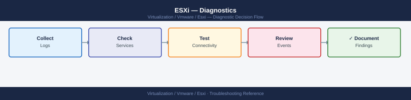

---
tags:
  - esxi
  - troubleshooting
  - vmware
  - vsphere-8
search:
  boost: 1.5
---
# ESXi — Diagnostics

<div class="kb-summary">
ESXi diagnostic commands: read vmkernel.log and hostd.log for errors, use esxcli for live storage and network state, run esxtop in batch mode to capture CPU/memory/disk/network metrics, restart hostd and vpxa, test connectivity to vCenter, and collect the vm-support bundle for VMware SRs.

*Applies to: vSphere 7.x / 8.x*
</div>



```mermaid
graph TD
    A([ESXi Issue]) --> B{What type of problem?}
    B -->|Host disconnected from vCenter| C[Check vpxa.log on host\nping vCenter from ESXi]
    B -->|VM won't power on or fails| D[Check vmkernel.log\nCheck hostd.log for VM task error]
    B -->|Storage I/O errors or latency| E[esxcli storage core path list\nesxtop -b DAVG check]
    B -->|Network connectivity issue| F[esxcli network ip interface list\nesxcli network vm list]
    B -->|High CPU or memory on host| G[esxtop interactive mode\nCheck CPU ready and balloon]
    B -->|HA or vMotion failure| H[Check fdm.log\nCheck cluster events in vCenter]
    C --> I{Management agent running?}
    I -->|Yes, but still disconnected| J[Check vCenter connectivity\nping vcenter-ip from ESXi]
    I -->|No| K[Restart management agents\n/etc/init.d/hostd restart\n/etc/init.d/vpxa restart]
    D --> L[tail /var/log/vmkernel.log | grep vm-name\ntail /var/log/hostd.log | grep ERROR]
    E --> M{Path state?}
    M -->|Dead paths| N[esxcli storage core path list | grep dead\nCheck storage network and switch zoning]
    M -->|Paths OK, latency high| O[Check storage array; check esxtop DAVG vs KAVG\nKAVG high = queue depth issue on host]
    F --> P[esxcli network vm list -w vm-name\nCheck vmkping to test VMkernel adapters]
    G --> Q[esxtop batch: esxtop -b -d 2 -n 30\nFilter CSV for %RDY > 10 or MCTLSZ > 0]
    H --> R[tail /var/log/fdm.log | grep -i error\nCheck HA heartbeat datastores]
    J --> S[Collect vm-support bundle\nvm-support -n -w /tmp/]
    K --> S
    L --> S
    N --> S
    O --> S
    P --> S
    Q --> S
    R --> S
    S --> T[Open VMware SR\nAttach bundle]

    classDef dark fill:#1e3a5f,color:#fff
    classDef action fill:#78350f,color:#fff
    classDef escalate fill:#991b1b,color:#fff
    class A,B,I,M dark
    class C,D,E,F,G,H,J,K,L,N,O,P,Q,R action
    class S,T escalate
```

```d2
direction: down

symptom: Identify Symptom {shape: diamond}
step_1_check_log_files: "Step 1 — Check log files" {shape: rectangle}
step_2_check_live_storage_state: "Step 2 — Check live storage state" {shape: rectangle}
step_3_check_network_state: "Step 3 — Check network state" {shape: rectangle}
step_4_performance_diagnostics_with_: "Step 4 — Performance diagnostics with esxtop" {shape: rectangle}
step_5_troubleshoot_host_disconnecti: "Step 5 — Troubleshoot host disconnection from vCenter" {shape: rectangle}
step_6_validate_storage_and_network_: "Step 6 — Validate storage and network before maintenance" {shape: rectangle}
resolution: Resolve or Escalate {shape: oval}

symptom -> step_1_check_log_files: investigate
symptom -> step_2_check_live_storage_state: investigate
symptom -> step_3_check_network_state: investigate
symptom -> step_4_performance_diagnostics_with_: investigate
symptom -> step_5_troubleshoot_host_disconnecti: investigate
symptom -> step_6_validate_storage_and_network_: investigate
step_1_check_log_files -> resolution
step_2_check_live_storage_state -> resolution
step_3_check_network_state -> resolution
step_4_performance_diagnostics_with_ -> resolution
step_5_troubleshoot_host_disconnecti -> resolution
step_6_validate_storage_and_network_ -> resolution
```

## Before you begin

- **Access:** SSH to the ESXi host (root); vSphere Client access to view events and alarms; the host management IP address
- **Gather first:** the specific symptom (VM fails to power on, host disconnected from vCenter, storage error), the host name, and the time the issue started
- **Scope:** confirm whether the issue affects one VM, one datastore, one VMkernel adapter, or the entire host

---

## Step 1 — Check log files

```bash
# SSH to the ESXi host
ssh root@<esxi-host-ip>

# Most recent vmkernel errors (storage, network, hardware)
tail -100 /var/log/vmkernel.log | grep -i "error\|warning\|fail\|SCSI\|NMP\|PSP"

# Most recent hostd errors (VM operations, config, snapshot)
tail -100 /var/log/hostd.log | grep -i "error\|exception\|fail"

# vCenter agent log (for host disconnection issues)
tail -100 /var/log/vpxa.log | grep -i "error\|disconnect\|timeout\|fail"

# HA agent log (for cluster membership and failover issues)
tail -100 /var/log/fdm.log | grep -i "error\|fail\|partition"

# Follow vmkernel.log in real time during a failing operation
tail -f /var/log/vmkernel.log

# Persistent log location (on hosts with scratch disk)
ls /scratch/log/
```

---

## Step 2 — Check live storage state

```bash
# List all storage paths and their state
esxcli storage core path list
# Key fields: Plugin=NMP, State=active/dead/standby, Is Local SAN=true/false
# Problem: State=dead for all paths to a LUN = SAN connectivity issue

# List dead paths only
esxcli storage core path list | grep -A5 "State: dead"

# Check NMP path selection policy and current path for each LUN
esxcli storage nmp device list

# Check VMFS datastores visible to this host
esxcli storage vmfs extent list
# Each datastore shows: partition, LUN UID, and datastore name

# List HBAs and their state
esxcli storage core adapter list
# Expected: LinkState=link-up for FC HBAs; Status=online

# Check storage SCSI error history
grep "SCSI\|NMP\|LUN" /var/log/vmkernel.log | tail -50
```

---

## Step 3 — Check network state

```bash
# List VMkernel adapters and their IPs
esxcli network ip interface list
# Shows: vmk0=management, vmk1=vMotion, vmk2=storage (typically)
# Expected: all required VMkernel adapters listed with correct IPs

# Test VMkernel adapter connectivity
vmkping -I vmk0 <gateway-ip>     # management network
vmkping -I vmk1 <vmotion-ip>     # vMotion network
vmkping -I vmk2 <storage-ip>     # storage network (NFS/iSCSI)

# List VMs and their network adapters (for per-VM network issues)
esxcli network vm list

# List port groups and their VLAN tags
esxcli network vswitch standard list

# Check uplink (physical NIC) state
esxcli network nic list
# Expected: Speed > 0 and Link=up for all active NICs

# Check for packet drops on NICs
esxcli network nic stats get -n vmnic0
```

---

## Step 4 — Performance diagnostics with esxtop

```bash
# Interactive mode — press keys to switch views
esxtop
# c = CPU view    m = Memory view    d = Disk view    n = Network view

# Batch mode — capture 30 samples at 2-second intervals to CSV
esxtop -b -d 2 -n 30 > /tmp/esxtop.csv

# Key thresholds to check in esxtop:
# CPU:     %RDY (ready time)  > 10% per vCPU = problem
#          %SWPWT              > 0            = swapping (memory pressure)
# Memory:  MCTLSZ (balloon)   > 0            = host under memory pressure
#          SZSWAP (swap)       > 0            = critical memory pressure
# Disk:    DAVG (device avg lat) > 25ms       = storage problem
#          KAVG (kernel avg lat) > 5ms        = ESXi queue depth issue
# Network: DRPTX / DRPRX      > 0            = packet drops; check NIC and switch

# Transfer the esxtop CSV for analysis
scp root@<esxi-host>:/tmp/esxtop.csv /local/path/
# Open in Performance Analyzer or Excel; filter by column headers
```

Key metrics thresholds:

| Metric | Normal | Caution | Problem |
|---|---|---|---|
| CPU Ready (%RDY) | < 5% | 5–10% | > 10% |
| Memory Balloon (MCTLSZ) | 0 | Any | Growing |
| Memory Swap (SZSWAP) | 0 | Any | Growing |
| Datastore Latency (DAVG) | < 10 ms | 10–25 ms | > 25 ms |
| Kernel Latency (KAVG) | < 2 ms | 2–5 ms | > 5 ms |

---

## Step 5 — Troubleshoot host disconnection from vCenter

```bash
# On the ESXi host — check vpxa (vCenter agent) status
/etc/init.d/vpxa status

# On the ESXi host — check hostd (host daemon) status
/etc/init.d/hostd status

# Restart management agents (safe — does not affect running VMs)
/etc/init.d/hostd restart
/etc/init.d/vpxa restart

# Verify vCenter is reachable from the ESXi management network
ping <vcenter-ip>
nc -zv <vcenter-ip> 443

# Check NTP sync (time drift > 5 minutes can cause cert failures)
esxcli system time get
date

# View recent vpxa errors
grep -i "error\|fail\|timeout" /var/log/vpxa.log | tail -30
```

---

## Step 6 — Validate storage and network before maintenance

```bash
# Confirm host has no active storage I/O errors
grep "SCSI\|I/O error\|NMP path" /var/log/vmkernel.log | tail -20

# Confirm VM count and state
esxcli vm process list | wc -l
# All VMs that will be vMotioned away during maintenance

# Check cluster can absorb workload (run from vCenter)
# vCenter → Cluster → Monitor → Resource Reservation

# Confirm vMotion VMkernel adapter is active
esxcli network ip interface list | grep -A5 vmk1
```

---

## Step 7 — Collect support bundle for VMware SR

```bash
# On the ESXi host
vm-support -n -w /tmp/
# Output: /tmp/esx-<hostname>-<date>.tgz
# -n = no interactive prompt; -w = output directory

# Transfer to a workstation
scp root@<esxi-host>:/tmp/esx-*.tgz /local/path/

# Alternative: vSphere Client
# Host → Actions → Export System Logs
# This downloads logs from vCenter for both the host and vCenter itself

# Include in VMware SR:
# - vm-support bundle .tgz
# - esxtop CSV if performance is involved
# - Specific error lines from vmkernel.log and hostd.log
# - Time window and VM/datastore names involved
```

---

## Log locations

| Log | Path | What to look for |
|---|---|---|
| VMkernel | `/var/log/vmkernel.log` | Storage SCSI errors, NMP path events, hardware faults |
| Host daemon | `/var/log/hostd.log` | VM power-on/off failures, snapshot errors, config |
| vCenter agent | `/var/log/vpxa.log` | Host disconnection from vCenter, agent crashes |
| HA agent | `/var/log/fdm.log` | Cluster partition, master election, failover events |
| Syslog | `/var/log/syslog.log` | OS-level and kernel boot events |
| Scratch | `/scratch/log/` | Persistent logs on hosts with scratch disk |

---

## See also

- [ESXi — Common Issues](common-issues/)
- [ESXi — Escalation](escalation/)

## Verify resolution

- `esxcli storage core path list` shows no dead paths for the affected storage
- The host shows Connected in vCenter with no alarms after management agent restart
- `esxtop` shows DAVG < 25ms for affected datastores and CPU %RDY < 10%
- The operation that was failing (VM power-on, vMotion, snapshot) completes successfully
