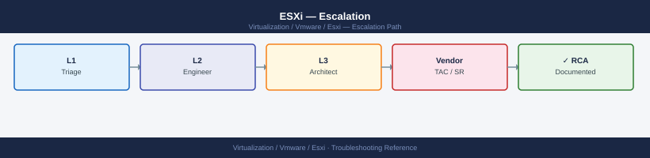

---
tags:
  - esxi
  - troubleshooting
  - vmware
  - vsphere-8
search:
  boost: 1.5
---
# ESXi — Escalation

<div class="kb-summary">
How to escalate ESXi host issues to Broadcom support: what data to collect, how to run the support bundle, step-by-step SR submission on the Broadcom portal, and the escalation path when progress stalls.

*Applies to: ESXi 7.x / 8.x*
</div>



---

## Before you begin

- **Access required:** SSH access to the ESXi host (root or equivalent); vSphere Client read access; Broadcom support account with entitlement to vSphere
- **Do this first:** collect all data below before touching anything. Broadcom will ask for the bundle and timeline in their first response
- **Do NOT reboot:** if the host has PSOD'd, leave it. A reboot overwrites the memory dump stored in `/vmfs/volumes/<local-ds>/vmkdump/`. Broadcom needs that dump to diagnose the crash
- **Do NOT enter maintenance mode** unless Broadcom specifically instructs you to — evacuating VMs may mask the issue or make diagnosis harder

---

## Pre-Escalation Self-Check

Run these before opening the SR. Many ESXi issues are resolvable without Broadcom.

| Check | Command | Expected result |
|---|---|---|
| ESXi version | `esxcli system version get` | Matches your change record |
| Host connectivity | `ping <host-mgmt-ip>` from management workstation | Replies received |
| Storage paths | `esxcli storage nmp path list \| grep -i dead` | Empty output (no dead paths) |
| vSAN health (if applicable) | `esxcli vsan health cluster list` | All checks GREEN |
| HA status | vSphere Client → Host → Summary → HA state | Connected and protected |
| HCL status | [https://compatibilityguide.broadcom.com](https://compatibilityguide.broadcom.com) | NIC/HBA on HCL for this ESXi build |
| Recent VIBs installed | `esxcli software vib list \| sort -k5 -r \| head -10` | No unexpected recent installs |
| Uptime | `esxcli system stats uptime get` | Consistent with known reboots |

---

## Step-by-Step Data Collection

Run all of these before opening the SR. SSH to the ESXi host as root.

### 1. Get the ESXi version and build number

```bash
# ESXi version — note the full build number, not just the release
esxcli system version get
# Example output:
#   Product: VMware ESXi
#   Version: 8.0.2
#   Build: Releasebuild-23305546

# Also get hardware info for the SR description
esxcli hardware cpu get | grep -E "CPU Packages|CPU Cores|Hyperthreading"
esxcli hardware memory get
```

### 2. Run the vm-support diagnostic bundle (takes 5–15 minutes)

```bash
# Generate the support bundle — run from ESXi SSH shell
vm-support

# The bundle is saved to /var/core/ or /scratch/
# Find it:
ls -lh /var/core/
# Example: vm-support-esx-hostname-2026-06-14--15.45.tar.gz

# If /var/core/ is full, specify an alternate location:
vm-support -w /vmfs/volumes/<datastore>/support-bundle/
```

Upload this tar.gz file to the Broadcom case. It contains all ESXi logs, configuration, and hardware info.

### 3. Capture PSOD information (if host has crashed)

If the host showed a Purple Screen of Death (PSOD) and is now running again after an automatic reboot:

```bash
# Find the memory dump file — this is the most valuable data for a PSOD crash
ls -lh /vmfs/volumes/*/vmkdump/
# Look for a .dumpfile or .zdumpfile with the timestamp of the crash

# Also check the vmkernel log for the panic line
grep -i "PSOD\|BUG\|panic\|backtrace" /var/log/vmkernel.log | tail -50

# Get the vmkernel log from the time of the crash (system log is persistent)
grep "$(date -d 'yesterday' '+%Y-%m-%d')" /var/log/vmkernel.log | grep -i "error\|fail\|panic" | head -50
```

Include the dump file path in your SR description. Broadcom will provide SFTP transfer instructions to upload it.

### 4. Capture esxtop performance data (for performance or APD issues)

```bash
# Batch esxtop — captures 5 snapshots at 2-second intervals
# Run during or immediately after the issue
esxtop -b -n 5 > /tmp/esxtop-$(date +%Y%m%d-%H%M).txt

# For storage-specific issues, add storage stats
esxtop -b -n 5 -s > /tmp/esxtop-storage-$(date +%Y%m%d-%H%M).txt

# Copy the file off the host (via scp from a jump box):
# scp root@<esxi-host>:/tmp/esxtop-*.txt ./
```

### 5. Collect storage path state (for APD or PDL issues)

```bash
# All storage paths and their state
esxcli storage nmp path list

# Devices in APD or PDL
esxcli storage nmp path list | grep -i "state\|dead\|error"

# HBA port status
esxcli storage san fc list        # Fibre Channel
esxcli storage san iscsi list     # iSCSI

# Datastore accessibility
esxcli storage filesystem list | grep -v "^[[:space:]]*$"
```

### 6. Write the timeline

Create a plain text file with this structure and paste it into the SR description:

```text
ESXi version: 8.0.2 build 23305546
Host: esxi-prod-01.corp.local
Issue first observed: 2026-06-14 14:30 UTC
Last known good state: 2026-06-14 10:00 UTC
Changes in the 24h before the issue:
  - 09:30: VUM patch applied (ESXi 8.0 U2c)
  - 14:25: Host showed storage APD for datastore vsanDatastore
Steps already taken:
  - Checked storage path count: currently 0 paths to vsanDatastore
  - Did NOT enter maintenance mode or reboot the host
  - Confirmed other hosts in cluster still show paths
Blast radius: VMs on this host have read/write I/O stalled
```

---

## How to Open the SR on Broadcom Support Portal

1. Go to **support.broadcom.com** and sign in with your Broadcom account. If you do not have an account, click **Register** and use your company email — entitlement is linked to your support contract.

2. Click **Open a New Case** in the top navigation.

3. Under **Select Product Family**, choose **VMware vSphere**.

4. Under **Product**, select **VMware ESXi** and choose your exact version from the drop-down.

5. Under **Request Type**, select **Technical**.

6. Under **Severity**, select:
   - **S1 — Critical**: Host is down (PSOD, unreachable), VMs are inaccessible, data is at risk, no workaround
   - **S2 — Major**: Host degraded (APD, high latency, HA not recovering), VMs running but at risk
   - **S3 — Minor**: Non-critical feature broken, single-host issue, cluster remains healthy
   - **S4 — General**: How-to question, pre-check, or non-urgent configuration question

7. In the **Summary** field, write one sentence: host + symptom + scope. Example: `ESXi 8.0.2 host esxi-prod-01 in APD state since 14:25 UTC — all VMs on this host have I/O stalled`.

8. In the **Description** field, paste:
   - The ESXi version and build number from Step 1
   - The timeline you wrote in Step 6
   - The storage path output if relevant
   - The PSOD dump file path if applicable
   - What you have already tried and what happened

9. Under **Attachments**, upload:
   - The vm-support tar.gz bundle from Step 2
   - The esxtop file from Step 4 (if collected)
   - The PSOD dump file (if applicable) — provide the file path in the description; Broadcom will send SFTP details for large files

10. Click **Submit**. You will receive a case number by email immediately.

11. **S1 only:** the case confirmation page shows a regional phone number. Call it immediately:
    - North America: shown on the confirmation page (typically +1-877-486-9273)
    - EMEA: shown on the confirmation page
    - State "Severity 1 — production host down" at the start of the call.

---

## Escalation Path

If progress stalls after initial assignment:

```text
Step 1 — Open case at support.broadcom.com with vm-support bundle attached (see above)
         ↓
Step 2 — T1 support acknowledges and confirms bundle received (typically 30 min–4 hr)
         ↓
Step 3 — If no meaningful progress in 4 hours for S1 or 1 business day for S2:
         → Reply in the case: "Requesting T2 ESXi Senior Engineer assignment"
         → State impact: "[X] VMs inaccessible / host offline / storage degraded"
         ↓
Step 4 — T2 Senior Engineer is assigned; they will schedule a live Zoom/Webex session
         → Have SSH access to ESXi host and vSphere Client ready for the call
         ↓
Step 5 — If T2 cannot resolve and issue requires kernel/driver-level investigation:
         → T2 escalates to T3 (engineering) — you do not need to initiate this
         ↓
Step 6 — For data loss risk, PSOD in production, or 24h+ with no resolution:
         → Request a Critical Situation (CritSit) engagement
         → Add to case: "Requesting CritSit — [reason: PSOD in prod / data at risk / 24h outage]"
```

---

## What NOT to Do

| Do NOT do this | Why | What to do instead |
|---|---|---|
| Reboot a host with a fresh PSOD | Overwrites the memory dump that Broadcom needs | Leave the host and collect the dump first; then discuss reboot with GSS |
| Enter maintenance mode on a degraded vSAN host | Evacuating objects may push below quorum | Wait for GSS to advise on safe maintenance window |
| Apply patches mid-incident | Adds variables; may reset the issue state | Freeze all changes until Broadcom gives the go-ahead |
| Replace hardware components without GSS guidance | May not fix root cause; voids diagnostic trail | Wait for GSS to confirm the failing component |
| Run `esxcli storage core claiming unclaim` | Unclaims all storage paths; can cause APD | Only run this if explicitly instructed by GSS |
| Open a case without the vm-support bundle | First GSS response will just ask for it — delays by hours | Always attach bundle at case creation |

---

## Useful Commands for Case Updates

Paste these into case replies to show Broadcom the current state.

```bash
# ESXi service status
/etc/init.d/hostd status
/etc/init.d/vpxa status

# Current host events
tail -100 /var/log/hostd.log
tail -100 /var/log/vmkernel.log

# Storage path count (paste full output)
esxcli storage nmp path list | grep -E "Runtime Name|State"

# vSAN health (if applicable)
esxcli vsan health cluster list

# HA agent status
/etc/init.d/fdm status

# Running VMs on this host
esxcli vm process list
```

---

## Support Portal and SLA Reference

| Severity | Definition | Initial Response SLA |
|---|---|---|
| S1 — Critical | Production host down; data loss; no workaround | 30 minutes (24×7) |
| S2 — Major | Host degraded; key feature broken; workaround exists | 4 hours |
| S3 — Minor | Non-critical issue; cluster still healthy | 1 business day |
| S4 — General | How-to, pre-check, feature request | 2 business days |

---

## See also

- [ESXi — Diagnostics](diagnostics/)
- [ESXi — Common Issues](common-issues/)

---

## Verify resolution

- Confirm the host shows "Connected" in vSphere Client and is no longer in warning or error state
- Run `esxcli storage nmp path list` and confirm all expected paths are active
- Run `vm-support` one more time after resolution and note in the case that issue is resolved
- Power on a test VM on the affected host and confirm I/O is healthy
- Monitor ESXi host for 15 minutes in vSphere Client and confirm no new alarms
