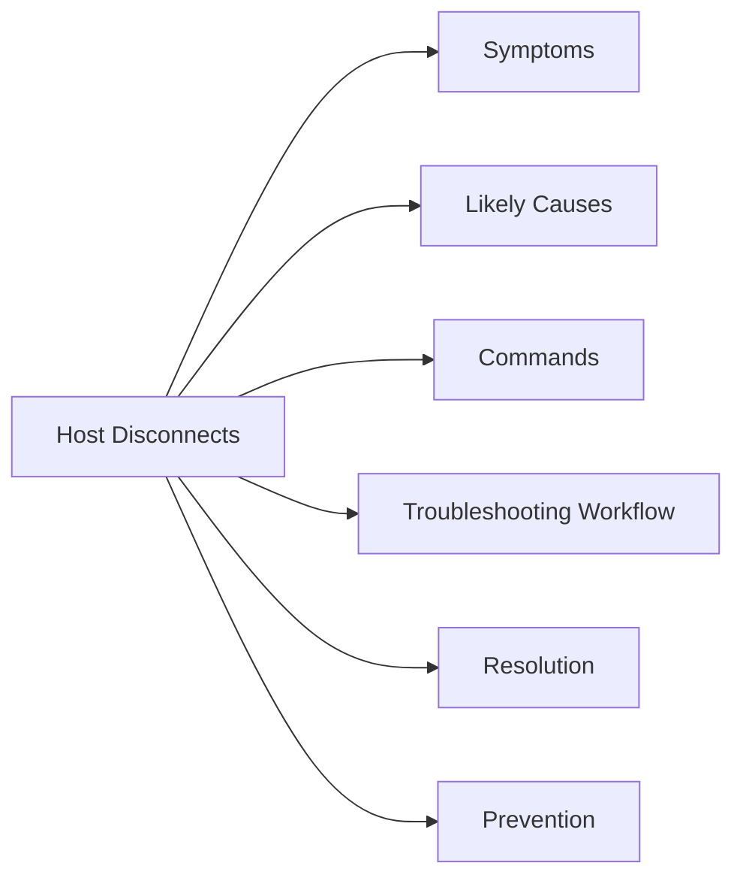

# ESXi Host Disconnects

> Part of the ESXi Troubleshooting reference.

## Symptoms

- ESXi host shows disconnected or not responding.
- vCenter cannot manage the host.
- Host tasks fail or timeout.
- VMs may still be running but management is degraded.

## Likely Causes

- Recent configuration change.
- DNS, certificate, or authentication issue.
- Resource pressure.
- Failed service.
- Storage or network dependency issue.
- Version or compatibility mismatch.

## Commands

~~~bash
# Add environment-specific commands here
~~~

## Troubleshooting Workflow

1. Confirm scope.
2. Check recent changes.
3. Review alarms and events.
4. Validate management connectivity.
5. Check logs.
6. Isolate the failing dependency.
7. Apply fix or escalate with evidence.

## Resolution

Document what changed, what fixed it, and how health was validated.

## Prevention

- Improve alerting.
- Add missing checks.
- Update the runbook.
- Capture known issue notes.
