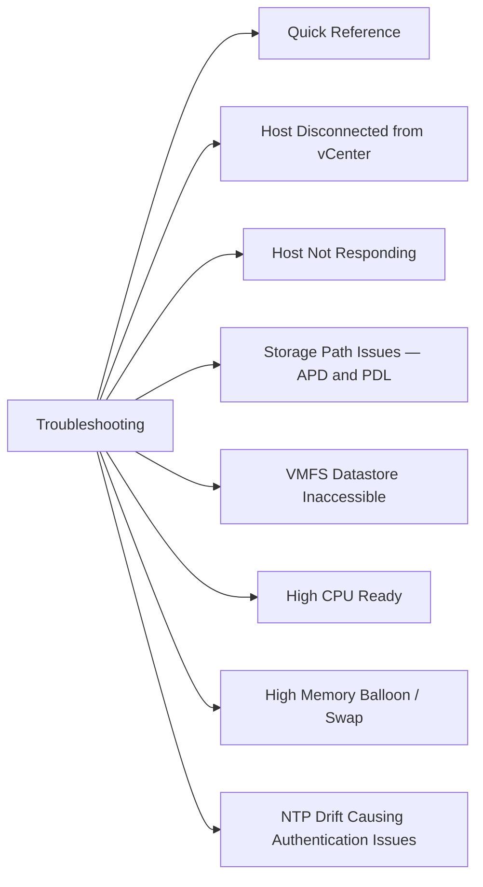

# Troubleshooting

> Part of the [ESXi](../) reference.


<div class="kb-grid kb-grid-1">

<a class="kb-card" href="host-disconnects/">
  <strong>Host Disconnects</strong>
  <span>Host Disconnects notes, checks, commands, and references.</span>
</a>

<a class="kb-card" href="maintenance-mode/">
  <strong>Maintenance Mode</strong>
  <span>Maintenance Mode notes, checks, commands, and references.</span>
</a>

</div>



## Quick Reference

| Symptom | First Check | Key Command |
|---|---|---|
| Host disconnected from vCenter | vpxa / hostd service | `/etc/init.d/vpxa restart` |
| Host not responding | PSOD, mgmt network partition | IPMI/iLO console access |
| All paths down (APD) | Storage fabric, HBA | `esxcli storage core path list` |
| VMFS datastore inaccessible | APD/PDL state, rescan | `esxcli storage core adapter rescan` |
| High CPU ready | NUMA, DRS, overcommit | `esxtop` — `%CSTP`, `%RDY` |
| High balloon / swap | Memory overcommit | `esxtop` — `MCTLSZ`, `SWR/s` |
| NTP drift | Clock skew, auth failures | `esxcli system ntp get` |
| PSOD | Hardware fault, driver bug | `/var/core/` vmss/vmem dumps |
| VM won't start | Config, resources, compat | `vmware.log` in VM directory |
| vSAN disk group unhealthy | Disk failure, network | `esxcli vsan storage list` |

---

## Host Disconnected from vCenter

### Symptoms
- Host shows **Disconnected** in vCenter inventory (grey icon).
- Management operations (vMotion, DRS) fail for VMs on the host.
- VMs continue running; only management plane is broken.

### Diagnosis

```bash
# From the ESXi host via SSH or DCUI
# Check vpxa (vCenter agent) status
/etc/init.d/vpxa status

# Check hostd (local management daemon) status
/etc/init.d/hostd status

# Test management network reachability from host
vmkping -I vmk0 <vCenter-IP>

# Verify management vmknic is up
esxcli network ip interface list

# Check for DNS resolution
nslookup <vcenter-fqdn>
```

### Resolution Steps

1. Verify network path: ping vCenter from the host (`vmkping`) and ping the host management IP from the vCenter VM.
2. If network is reachable, restart the vCenter agent on the host:

```bash
/etc/init.d/vpxa stop
/etc/init.d/vpxa start

# If vpxa restart alone does not work, restart hostd first
/etc/init.d/hostd restart
/etc/init.d/vpxa restart
```

3. If still disconnected, attempt a **Reconnect Host** action from vCenter (right-click host → Connect).
4. Check `/var/log/vpxa.log` and `/var/log/hostd.log` for authentication or certificate errors.

```bash
tail -100 /var/log/vpxa.log | grep -i "error\|fail\|ssl"
tail -100 /var/log/hostd.log | grep -i "error\|fail\|ssl"
```

5. If certificate mismatch is the cause, re-generate the host certificate from vCenter: **Host → Certificate → Renew**.

---

## Host Not Responding

### Symptoms
- Host shows **Not Responding** in vCenter (red icon).
- VMs on the host may be in an unknown power state.
- HA may trigger VM restarts on other hosts.

### Diagnosis Path

1. Determine if the host is truly down or just management-isolated:
   - Can you ping the management IP?
   - Is the IPMI/iLO/iDRAC accessible?
   - Is there a **Purple Screen of Death (PSOD)** visible on the console?

2. If the host is pingable but vCenter cannot reach it, it is likely a **management network partition** — check switches and VLANs.

3. If the host is not pingable, access the out-of-band console (iLO/iDRAC) to check for a hung kernel, PSOD, or hardware fault.

```bash
# From DCUI (F2 on console) or iLO/iDRAC KVM — check recent logs
tail -200 /var/log/vmkernel.log
tail -200 /var/log/hostd.log

# If host responds over SSH, check for hung processes
esxcli system process list
ps | grep -E "hostd|vpxa|vmx"
```

### Recovery

- **Management network partition only:** Fix the upstream switch/VLAN configuration and restart vpxa.
- **Hung kernel with console access:** If host is responsive on console but management network is down, check network config via DCUI (F2 → Configure Management Network).
- **True host failure (PSOD or no response):** Graceful recovery is not possible. Use iLO/iDRAC to perform a hard reset. Collect dumps from `/var/core/` after reboot.

---

## Storage Path Issues — APD and PDL

### All Paths Down (APD)

APD occurs when a storage device becomes inaccessible but the host cannot confirm whether the device is permanently gone.

```bash
# Identify APD state
esxcli storage core path list | grep -i "dead\|apd\|lost"

# Check NMP device state
esxcli storage nmp device list

# Look for APD messages in vmkernel log
grep -i "APD\|all paths down" /var/log/vmkernel.log | tail -50
```

**APD behaviour by default:** After 140 seconds the host enters APD timeout. VMs may be failed over by HA (if configured with APD responses).

**Resolution:**
1. Restore the storage fabric (check FC zoning, iSCSI network, HBA status).
2. Once paths are restored, trigger a path rescan:

```bash
esxcli storage core adapter rescan --all
esxcli storage core path list | grep -i state
```

### Permanent Device Loss (PDL)

PDL is signalled by the storage array via SCSI sense codes — the device is definitively gone.

```bash
# PDL devices show as "permanently dead" in path list
esxcli storage core path list | grep -i "permanently"

grep -i "PDL\|permanently lost" /var/log/vmkernel.log | tail -30
```

**Resolution:** PDL requires storage-side intervention (LUN re-presentation or replacement). After the storage is re-presented, rescan adapters and confirm paths are active.

---

## VMFS Datastore Inaccessible

```bash
# Rescan all HBA adapters
esxcli storage core adapter rescan --all

# List datastores and their accessibility
esxcli storage filesystem list

# Check for dead paths to the backing device
esxcli storage core path list | grep <device-name>

# vim-cmd datastore summary
vim-cmd hostsvc/datastore/listsummary
```

**Common causes:**
- APD/PDL on backing LUN — see above.
- VMFS signature mismatch after LUN copy/snapshot (resignature required).
- Stale NFS mount (for NFS datastores) — check network and NFS server.

To resignature a VMFS copy (use with caution — this changes the UUID):

```bash
esxcli storage vmfs snapshot list
esxcli storage vmfs snapshot resignature --volume-label=<label>
```

---

## High CPU Ready

CPU ready (`%RDY` in esxtop) indicates a VM's vCPUs are waiting for physical CPU time.

```bash
# Launch esxtop in batch mode — 5 iterations, 2s interval
esxtop -b -n 5 -d 2 > /tmp/esxtop_cpu.csv

# Interactive esxtop — press 'c' for CPU view
# Key columns: %RDY (ready), %CSTP (co-stop for SMP VMs), %USED
esxtop
```

**Thresholds:** `%RDY` consistently above 5% per vCPU warrants investigation; above 10% is impactful.

**Common causes and remediation:**

| Cause | Remediation |
|---|---|
| Too many vCPUs on the host | Reduce vCPU count on non-critical VMs |
| SMP VMs with co-stop (`%CSTP`) | Reduce vCPU count or enable DRS to migrate |
| NUMA imbalance | Check NUMA home node; avoid vCPU count > physical NUMA node size |
| DRS not balancing | Check DRS rules and thresholds; verify vMotion compatibility |

---

## High Memory Balloon / Swap

```bash
# Interactive esxtop — press 'm' for memory view
# Key columns: MCTLSZ (balloon), SWCUR (swap current), SWR/s (swap read rate)
esxtop

# Per-host memory stats
esxcli hardware memory get
vsish -e get /memory/comprehensive
```

**Balloon (`MCTLSZ` > 0):** VMware balloon driver is reclaiming guest memory. Indicates overcommit. The guest OS is aware and can respond.

**Swap (`SWCUR` > 0 or `SWR/s` high):** Host is swapping VM memory to disk. Severe performance impact — this is a critical condition.

**Remediation:**
1. Identify the top memory consumers:

```bash
# PowerCLI — top memory consumers by balloon
Get-VM | Sort-Object MemoryMB -Descending | Select -First 20 Name,MemoryMB
```

2. Add physical memory to the host if consistently overcommitted.
3. Ensure VM swap files (`.vswp`) are on fast storage — local SSD preferred over shared datastores.
4. Set memory reservations on critical VMs to prevent them from ballooning.
5. Migrate VMs off the most pressured host using DRS or manual vMotion.

---

## NTP Drift Causing Authentication Issues

Clock skew above 5 minutes breaks Kerberos authentication and can cause vCenter certificate validation failures and SSO login errors.

```bash
# Check NTP status on ESXi host
esxcli system ntp get

# Check time offset (requires ntpq, available via ESXi shell)
ntpq -p

# Verify current system time
date

# Configure NTP servers (if not set)
esxcli system ntp set --enabled=true --server=<ntp1> --server=<ntp2>

# Restart NTP service to force resync
/etc/init.d/ntpd restart
ntpq -p   # confirm offset is approaching 0
```

**If offset is very large (minutes):** ntpd will not step the clock by default. Force a one-time correction:

```bash
/etc/init.d/ntpd stop
ntpdate <ntp-server>
/etc/init.d/ntpd start
```

---

## Purple Screen of Death (PSOD)

A PSOD is a kernel panic. The host halts and displays a purple diagnostic screen.

### Immediate Actions

1. **Do not power off immediately** — the screen contains a backtrace needed for diagnosis.
2. Capture the PSOD screen via iLO/iDRAC KVM or photograph it physically.
3. Note the `BugNr`, `@BlueScreen` address, and first lines of the backtrace.
4. After collecting the screen, use iLO/iDRAC to perform a hard reset.

### Post-Reboot Data Collection

```bash
# Core dumps are written to /var/core/ or a configured dump partition
ls -lh /var/core/

# VMware support bundle (generates a zip with logs, dumps, config)
vm-support

# Key logs to review after reboot
tail -200 /var/log/vmkernel.log
tail -200 /var/log/vobd.log
grep -i "panic\|PSOD\|backtrace" /var/log/vmkernel.log
```

### Escalation

- Open a VMware GSS case if the PSOD recurs or if the backtrace implicates a VMware module.
- Provide: ESXi version (`esxcli system version get`), hardware model, driver versions (`esxcli software vib list`), and the core dump / vm-support bundle.
- Common root causes: faulty hardware (RAM, HBA, NIC), incompatible driver version, or VMware kernel bug.

---

## VM Not Starting

```bash
# List all VMs and their power states
vim-cmd vmsvc/getallvms
vim-cmd vmsvc/power.getstate <vmid>

# Attempt power on via vim-cmd
vim-cmd vmsvc/power.on <vmid>

# Check the VM's own log for errors
cat /vmfs/volumes/<datastore>/<vm-folder>/vmware.log | tail -100
```

**Common error categories:**

| Error | Cause | Fix |
|---|---|---|
| `Could not power on VM: No space left` | Datastore full | Free space or migrate VM |
| `VMX configuration error` | Corrupt or invalid `.vmx` | Edit or restore `.vmx` from backup |
| `Insufficient resources` | CPU/memory reservation not met | Reduce reservation or add resources |
| `Hardware version not supported` | VM version too new for host | Upgrade ESXi or downgrade VM compat |
| `File not found: .vmdk` | Missing or unregistered disk | Re-attach VMDK or restore from backup |

---

## vSAN Disk Group Health Issues

```bash
# List vSAN disk groups on this host
esxcli vsan storage list

# Check overall vSAN cluster health
esxcli vsan health cluster list

# List objects with degraded or absent components
esxcli vsan debug object list | grep -i "degraded\|absent\|stale"

# Check disk-level health
esxcli vsan storage check

# Review vSAN-specific log entries
grep -i "vsan\|LSOM\|DOM" /var/log/vmkernel.log | tail -100
```

**Common scenarios:**

| Symptom | Likely Cause | Action |
|---|---|---|
| Disk group shows degraded | Single disk failure | Replace failed disk; wait for resync |
| Objects absent | Host offline or network partition | Restore host connectivity |
| Resync stuck | Network bandwidth, capacity | Check network, ensure slack space > 25% |
| Disk group dismounted | Disk firmware bug, SMART failure | Replace disk; check `esxcli vsan storage list` |

After replacing a disk, vSAN will automatically begin resyncing. Monitor progress:

```bash
esxcli vsan debug resync summary list
```
