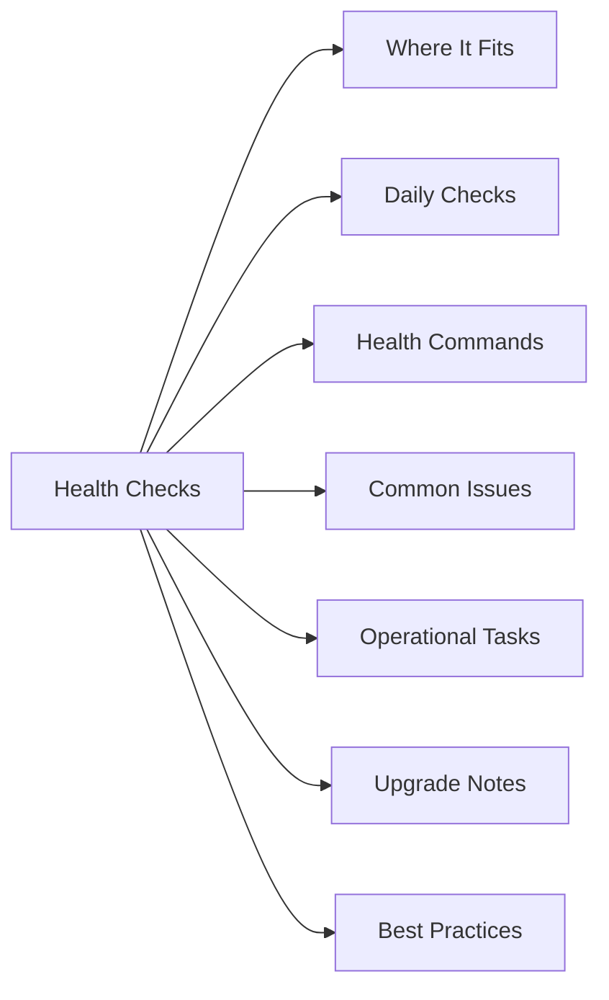

# VMware Health Checks

## Overview

VMware Health Checks notes for infrastructure operations, support, health checks, and troubleshooting.

## Where It Fits

Use this page for daily, pre-change, and post-change VMware validation.

## Daily Checks

| Check | Command | Notes |
|---|---|---|
| Review active alerts. |  |  |
| Confirm management access. |  |  |
| Check capacity, health, and recent task failures. |  |  |
| Review backup, replication, or protection status where applicable. |  |  |
| Confirm recent changes did not create new warnings. |  |  |

## Health Commands

~~~bash
# Add environment-specific commands here
~~~

## Common Issues

- Certificate or authentication problems.
- Capacity pressure.
- Failed or stuck tasks.
- Version mismatch after upgrades.
- Alert noise without clear ownership.
- Configuration drift from standards.

## Operational Tasks

| Task | Command |
|---|---|
| Check service health. |  |
| Review inventory and ownership. |  |
| Validate monitoring coverage. |  |
| Confirm backup or recovery posture. |  |
| Document changes after maintenance work. |  |

## Upgrade Notes

- Confirm compatibility before upgrade.
- Review release notes and known issues.
- Validate backups and rollback options.
- Confirm maintenance window.
- Run post-upgrade health checks.

## Best Practices

| Recommendation | Detail |
|---|---|
| Keep naming consistent. | Keep naming consistent. |
| Document ownership and support boundaries. | Document ownership and support boundaries. |
| Use least privilege access. | Use least privilege access. |
| Keep versions aligned. | Keep versions aligned. |
| Validate changes after implementation. | Validate changes after implementation. |
