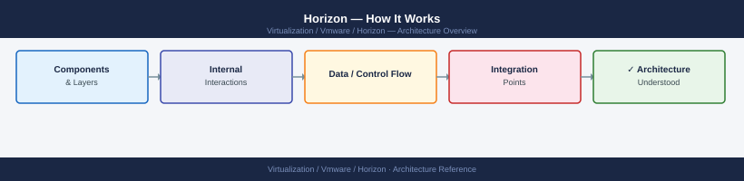
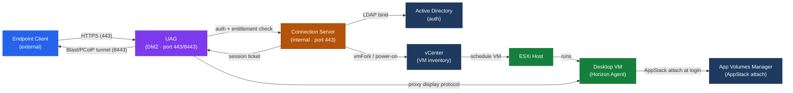

---
tags:
  - architecture
  - horizon
  - vmware
---
# Horizon — How It Works


<div class="kb-summary">
How It Works reference covering Component Overview, Connection Flow, Blast Extreme vs PCoIP, Session Broker Role, Security Server Deprecation and 1 more sections.

*Applies to: Horizon 8.x*
</div>



```d2
direction: right

center: "Horizon" {shape: hexagon}
component_overview: "Component Overview" {shape: rectangle}
blast_extreme_vs_pcoip: "Blast Extreme vs PCoIP" {shape: rectangle}
session_broker_role: "Session Broker Role" {shape: rectangle}
security_server_deprecation: "Security Server Deprecation" {shape: rectangle}
instant_clone_technology_detail: "Instant Clone Technology Detail" {shape: rectangle}

center -> component_overview
center -> blast_extreme_vs_pcoip
center -> session_broker_role
center -> security_server_deprecation
center -> instant_clone_technology_detail
```

## Component Overview

VMware Horizon is a broker-based VDI and published application delivery platform. The core components and their relationships:

| Component | Role | Location |
|---|---|---|
| Connection Server | Session broker, authenticates users, assigns desktops | Windows Server, domain-joined |
| Unified Access Gateway (UAG) | Reverse proxy for external access, terminates Blast/PCoIP | DMZ, Linux appliance |
| vCenter Server | VM lifecycle management (provision, power, snapshot) | Management network |
| Active Directory | User authentication, group policy, entitlement groups | Existing infrastructure |
| Horizon Agent | In-guest component enabling remoting protocols and redirection | Each desktop VM or RDS host |
| Horizon Client | End-user client connecting to desktops | Endpoint (Windows, macOS, Linux, mobile, HTML5) |
| App Volumes Manager | Application layering — attaches AppStacks (VMDKs) at login | Windows Server + SQL DB |
| DEM (Dynamic Environment Manager) | User environment management — policies, profile migration, drive maps | Windows Server, GPO-driven |
| Composer (deprecated) | Linked-clone pool management | Replaced by Instant Clone Engine |

### Component Interaction Diagram (text)


### External Client via UAG

```text
1. User opens Horizon Client → enters UAG external FQDN
2. Horizon Client → HTTPS (443) → UAG (DMZ)
3. UAG forwards authentication request → Connection Server (internal, 443)
4. Authentication + entitlement check on Connection Server
5. Connection Server returns session ticket to UAG
6. UAG returns connection details to client
7. Client establishes Blast Extreme (TCP 8443 / UDP 8443) → UAG
8. UAG proxies display protocol traffic → Horizon Agent in VM
   (UAG acts as a Blast/PCoIP proxy — client never directly reaches internal VM)
```



**Ports summary:**

| Port | Protocol | Purpose |
|---|---|---|
| 443 | TCP | HTTPS — client to Connection Server or UAG |
| 8443 | TCP/UDP | Blast Extreme (primary) |
| 4172 | TCP/UDP | PCoIP |
| 22443 | TCP/UDP | Blast Extreme (alternative, used via UAG) |
| 32111 | TCP | USB redirection (client to agent) |
| 9427 | TCP | MMR (Multimedia Redirection) and CDR (Client Drive Redirection) |

---

## Blast Extreme vs PCoIP

| Feature | Blast Extreme | PCoIP |
|---|---|---|
| Protocol basis | H.264 / H.265 / VP9 video codec over WebRTC-like transport | Proprietary VMware/Teradici codec |
| Transport | TCP 8443 or UDP 8443 (adaptive) | TCP 4172 + UDP 4172 |
| HTML5 browser client support | Yes (Horizon HTML Access) | No |
| Codec hardware acceleration | Yes (server-side and client-side GPU acceleration) | Limited |
| Bandwidth adaptability | Excellent — adapts to available bandwidth | Good |
| Latency sensitivity | Lower latency on UDP path | Higher latency than Blast UDP |
| 3D/OpenGL workloads | Supported with vGPU | Supported with vGPU |
| Recommended for | All new deployments | Legacy or where Teradici zero clients are in use |
| Encryption | AES-128 or AES-256 (configurable via GPO) | AES-128 via TLS |

**Blast Extreme adaptive transport:** When UDP 8443 is available, Blast uses UDP for lower latency. When UDP is blocked (e.g., strict firewalls), it falls back to TCP 8443 automatically. Configure via GPO: `VMware Blast > Enable H264 Encoding`, `Enable UDP`.

---

## Session Broker Role

The Connection Server is a stateful session broker. It maintains:

- **Session database** (stored in ADAM/AD LDS — a local LDAP instance on each Connection Server)
- **Pool and entitlement configuration**
- **vCenter connection state** — Connection Server polls vCenter for VM state
- **Persistent disk assignments** (for Full Clone and linked-clone pools with persistent disks)

Multiple Connection Servers in a pod **replicate** their ADAM database to each other automatically (AD LDS replication). A load balancer (hardware LB or DNS round-robin) distributes client connections across Connection Servers.

**Pod size limits:**
- Maximum 7 Connection Servers per pod
- Maximum 2,000 concurrent sessions per Connection Server (sizing guideline — actual depends on hardware)
- Maximum ~10,000 desktops per pod (recommended)

---

## Security Server Deprecation

The **Security Server** (an older reverse proxy component that ran on Windows, paired with a Connection Server) is deprecated as of Horizon 7.x and removed in later releases. **UAG (Unified Access Gateway)** is the supported replacement for all external access scenarios.

Differences:

| | Security Server (deprecated) | UAG |
|---|---|---|
| OS | Windows Server | Linux appliance (OVA) |
| Pairing | 1:1 with a Connection Server | Many:many (any UAG can reach any Connection Server) |
| Authentication | Forwarded to Connection Server | Can terminate RADIUS/SAML locally |
| Updates | Windows patching | OVA re-deploy or in-place upgrade |
| Scalability | Limited | Scale-out via load balancer |
| Smart card/cert auth | Limited | Full support |

---

## Instant Clone Technology Detail

### Parent VM Lifecycle

The parent VM is kept running at all times (idle, logged off). When a new desktop is requested:

1. `vmFork` API call to ESXi forks the parent VM at the memory and disk level
2. Child VM gets a unique UUID and MAC address
3. Post-customization script runs (hostname, domain join via pre-staged machine account)
4. VM appears as available in pool within ~30 seconds

### Customization Specifications

Instant Clone pools do **not** use traditional vCenter customization specs (sysprep). Instead, they use a **ClonePrep** process:

- A **domain-join account** is configured in the pool settings (must have rights to create/reset computer accounts in the OU)
- Computer accounts are pre-staged or created at clone time
- ClonePrep runs a PowerShell script in the guest post-fork

**ClonePrep log location (in guest):** `C:\Windows\Temp\vmware-viewcomposer-ga-new-*.log`

### Replica and Parent VM Naming

Horizon names these automatically:

```yaml
Replica:  <pool-name>-replica-<timestamp>
Parent:   <pool-name>-parent-<timestamp>
Desktop:  <naming-pattern>-{n}   (e.g., WIN10-{n} → WIN10-001, WIN10-002)
```

The replica and parent VMs consume resources on the ESXi host and datastore — size golden image appropriately and plan for replica storage overhead (one replica per datastore per pool).

## See also

- [Horizon — Design Standards](design-standards/)
- [Horizon — Deploy](../deploy/)
- [VMware Horizon — Integrations](integrations/)
