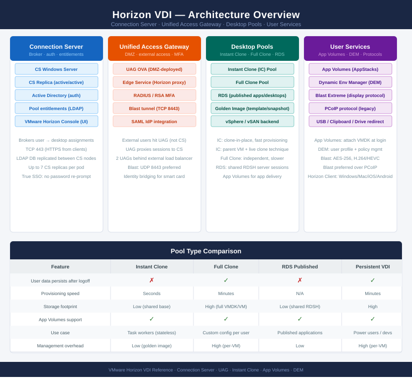

# Horizon (VDI) — Architecture

<div class="kb-summary">
VMware Horizon delivers virtual desktops and published applications through Connection Servers, Unified Access Gateways, and desktop pools backed by vSphere.
</div>

```
┌─────────────────────────────────────── Horizon — Architecture ────────────────────────────────────────┐
│                                                                                                       │
│   ┌───────────────────────────────────────────────────────────────────────────────────────────────┐   │
│   │      VMware Horizon = Connection Servers (HA pair+) + Unified Access Gateway (UAG) in DMZ     │   │
│   │   Desktop pools: instant clone (fast refresh) or full clone; RDS for published applications   │   │
│   │App Volumes delivers applications on-demand; Dynamic Environment Manager controls user settings│   │
│   │  UAG in DMZ proxies Blast Extreme and PCoIP protocols; Connection Server authenticates users  │   │
│   │ vGPU (NVIDIA) profiles attached to pools for 3D/graphics workloads; vCenter manages ESXi pools│   │
│   └───────────────────────────────────────────────────────────────────────────────────────────────┘   │
│                                                                                                       │
│    How-it-works defines broker and pool mechanics · integrations connect directory and vCenter        │
│                                                                                                       │
│                  ▼                                ▼                                ▼                  │
│                                                                                                       │
│   ┌─────────────────────────────┐  ┌─────────────────────────────┐  ┌─────────────────────────────┐   │
│   │         How It Works        │  │         Integrations        │  │       Design Standards      │   │
│   │     Connection Server HA    │  │      vCenter/ESXi pools     │  │        ≥2 CS per pod        │   │
│   │        UAG: DMZ proxy       │  │       Active Directory      │  │          UAG in DMZ         │   │
│   │        Desktop pools        │  │        WS1 Access SSO       │  │      vGPU profile size      │   │
│   │        RDS: pub apps        │  │         NSX microseg        │  │          Pool quota         │   │
│   │         App Volumes         │  │        vGPU (NVIDIA)        │  │        Image mgmt std       │   │
│   │         Dyn Env Mgr         │  │        Horizon Cloud        │  │       RDS session lim       │   │
│   └─────────────────────────────┘  └─────────────────────────────┘  └─────────────────────────────┘   │
│                                                                                                       │
│    How-it-works covers broker and pools · integrations connect vCenter and directory                  │
│                                                                                                       │
│                  ▼                                ▼                                ▼                  │
│                                                                                                       │
│   ┌───────────────────────────────────────────────────────────────────────────────────────────────┐   │
│   │   How It Works   │   Integrations   │    Design Stds    │    Deployment    │     Key Stds     │   │
│   │  Connection Svr  │  vCenter pools   │   ≥2 CS per pod   │    Single pod    │    CS sizing     │   │
│   │UAG reverse proxy │ Active Directory │     UAG in DMZ    │    Multi-pod     │    Pool quota    │   │
│   │  Instant clone   │    WS1 Access    │   vGPU profiles   │    Cloud pod     │    Image std     │   │
│   │   App Volumes    │   NSX microseg   │     RDS limits    │    Enterprise    │  Session limit   │   │
│   └───────────────────────────────────────────────────────────────────────────────────────────────┘   │
│                                                                                                       │
│  Physical Infrastructure (the hardware everything above runs on):                                     │
│  x86 ESXi hosts · GPU cards (NVIDIA) · RAM DIMMs · Network NICs · UAG appliance VMs · vCenter         │
│                                                                                                       │
│  Key terms:                                                                                           │
│                                                                                                       │
│  Connection Server  = Horizon broker VM; authenticates users, entitles desktops, manages sessions     │
│  UAG (Unified Access Gateway) = DMZ reverse proxy for Blast/PCoIP; replaces Security Server           │
│  Instant clone      = Desktop provisioning method; child VMs forked from parent snapshot at login     │
│  Full clone         = Independent desktop VM cloned from template; persists independently             │
│  RDS (Remote Desktop Services) = Windows Server role publishing apps or desktops via Horizon          │
│  App Volumes        = On-demand application delivery using AppStacks mounted at login                 │
│  Dynamic Environment Manager = Per-user Windows settings and policy management for Horizon desktops   │
│  Blast Extreme      = VMware display protocol; optimized for LAN and WAN; supports H.264/H.265        │
│  PCoIP              = PC-over-IP protocol; Teradici-based display protocol supported by Horizon       │
│  vGPU               = NVIDIA virtual GPU; shared GPU profile assigned to desktop pool VMs             │
│  Cloud Pod Architecture = Horizon feature linking multiple pods for global entitlements across sites  │
│  Entitlement        = Assignment of a user or group to a Horizon desktop or application pool          │
│                                                                                                       │
└───────────────────────────────────────────────────────────────────────────────────────────────────────┘
```
```text
┌─────────────────────────────────────── Horizon — Architecture ────────────────────────────────────────┐
│                                                                                                       │
│   ┌───────────────────────────────────────────────────────────────────────────────────────────────┐   │
│   │      VMware Horizon = Connection Servers (HA pair+) + Unified Access Gateway (UAG) in DMZ     │   │
│   │   Desktop pools: instant clone (fast refresh) or full clone; RDS for published applications   │   │
│   │App Volumes delivers applications on-demand; Dynamic Environment Manager controls user settings│   │
│   │  UAG in DMZ proxies Blast Extreme and PCoIP protocols; Connection Server authenticates users  │   │
│   │ vGPU (NVIDIA) profiles attached to pools for 3D/graphics workloads; vCenter manages ESXi pools│   │
│   └───────────────────────────────────────────────────────────────────────────────────────────────┘   │
│                                                                                                       │
│    How-it-works defines broker and pool mechanics · integrations connect directory and vCenter        │
│                                                                                                       │
│                  ▼                                ▼                                ▼                  │
│                                                                                                       │
│   ┌─────────────────────────────┐  ┌─────────────────────────────┐  ┌─────────────────────────────┐   │
│   │         How It Works        │  │         Integrations        │  │       Design Standards      │   │
│   │     Connection Server HA    │  │      vCenter/ESXi pools     │  │        ≥2 CS per pod        │   │
│   │        UAG: DMZ proxy       │  │       Active Directory      │  │          UAG in DMZ         │   │
│   │        Desktop pools        │  │        WS1 Access SSO       │  │      vGPU profile size      │   │
│   │        RDS: pub apps        │  │         NSX microseg        │  │          Pool quota         │   │
│   │         App Volumes         │  │        vGPU (NVIDIA)        │  │        Image mgmt std       │   │
│   │         Dyn Env Mgr         │  │        Horizon Cloud        │  │       RDS session lim       │   │
│   └─────────────────────────────┘  └─────────────────────────────┘  └─────────────────────────────┘   │
│                                                                                                       │
│    How-it-works covers broker and pools · integrations connect vCenter and directory                  │
│                                                                                                       │
│                  ▼                                ▼                                ▼                  │
│                                                                                                       │
│   ┌───────────────────────────────────────────────────────────────────────────────────────────────┐   │
│   │   How It Works   │   Integrations   │    Design Stds    │    Deployment    │     Key Stds     │   │
│   │  Connection Svr  │  vCenter pools   │   ≥2 CS per pod   │    Single pod    │    CS sizing     │   │
│   │UAG reverse proxy │ Active Directory │     UAG in DMZ    │    Multi-pod     │    Pool quota    │   │
│   │  Instant clone   │    WS1 Access    │   vGPU profiles   │    Cloud pod     │    Image std     │   │
│   │   App Volumes    │   NSX microseg   │     RDS limits    │    Enterprise    │  Session limit   │   │
│   └───────────────────────────────────────────────────────────────────────────────────────────────┘   │
│                                                                                                       │
│  Physical Infrastructure (the hardware everything above runs on):                                     │
│  x86 ESXi hosts · GPU cards (NVIDIA) · RAM DIMMs · Network NICs · UAG appliance VMs · vCenter         │
│                                                                                                       │
│  Key terms:                                                                                           │
│                                                                                                       │
│  Connection Server  = Horizon broker VM; authenticates users, entitles desktops, manages sessions     │
│  UAG (Unified Access Gateway) = DMZ reverse proxy for Blast/PCoIP; replaces Security Server           │
│  Instant clone      = Desktop provisioning method; child VMs forked from parent snapshot at login     │
│  Full clone         = Independent desktop VM cloned from template; persists independently             │
│  RDS (Remote Desktop Services) = Windows Server role publishing apps or desktops via Horizon          │
│  App Volumes        = On-demand application delivery using AppStacks mounted at login                 │
│  Dynamic Environment Manager = Per-user Windows settings and policy management for Horizon desktops   │
│  Blast Extreme      = VMware display protocol; optimized for LAN and WAN; supports H.264/H.265        │
│  PCoIP              = PC-over-IP protocol; Teradici-based display protocol supported by Horizon       │
│  vGPU               = NVIDIA virtual GPU; shared GPU profile assigned to desktop pool VMs             │
│  Cloud Pod Architecture = Horizon feature linking multiple pods for global entitlements across sites  │
│  Entitlement        = Assignment of a user or group to a Horizon desktop or application pool          │
│                                                                                                       │
└───────────────────────────────────────────────────────────────────────────────────────────────────────┘
```



<div class="kb-grid kb-grid-3">
<a class="kb-card" href="how-it-works/"><strong>How It Works</strong><span>Architecture overview, topology, and how it fits in the stack.</span></a>
<a class="kb-card" href="integrations/"><strong>Integrations</strong><span>Integration with other platforms and services.</span></a>
<a class="kb-card" href="design-standards/"><strong>Design Standards</strong><span>Naming conventions, design rules, and configuration baselines.</span></a>
</div>
