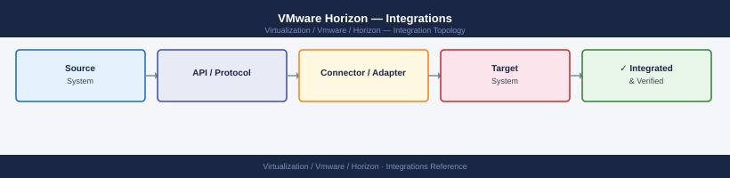

---
tags:
  - architecture
  - horizon
  - vmware
---
# VMware Horizon — Integrations


```powershell
# Verify domain join before CS install
[System.DirectoryServices.ActiveDirectory.Domain]::GetCurrentDomain()

# Check DNS resolves AD DCs
nslookup _ldap._tcp.dc._msdcs.<your-domain>
```

```cmd
dsacls "OU=Horizon-Desktops,DC=corp,DC=example,DC=com" /I:S /G "CORP\svc-horizon-ic:CCDC;Computer"
dsacls "OU=Horizon-Desktops,DC=corp,DC=example,DC=com" /I:S /G "CORP\svc-horizon-ic:WP;;Computer"
```
```powershell
# PowerCLI — create and assign the role
Connect-VIServer vcenter.corp.example.com

$privIds = @(
  "VirtualMachine.Snapshot.Create","VirtualMachine.Snapshot.RemoveAll",
  "VirtualMachine.Provisioning.Clone","VirtualMachine.Provisioning.DeployTemplate",
  "VirtualMachine.Interact.PowerOn","VirtualMachine.Interact.PowerOff",
  "VirtualMachine.Config.AddRemoveDevice","Datastore.AllocateSpace",
  "Network.Assign","Resource.AssignVMToPool","Host.Local.ReconfigVM","Global.DisableMethods"
)
New-VIRole -Name "Horizon-Service" -Privilege (Get-VIPrivilege -Id $privIds)
New-VIPermission -Entity (Get-Datacenter "DC-Production") `
  -Principal "CORP\svc-horizon-vc" -Role "Horizon-Service" -Propagate $true
```
```powershell
# Create a vSAN storage policy for desktop OS disks
$rule = New-SpbmRuleSet -AllOfRules @(
  New-SpbmRule -Capability (Get-SpbmCapability "VSAN.hostFailuresToTolerate") -Value 1,
  New-SpbmRule -Capability (Get-SpbmCapability "VSAN.stripeWidth") -Value 1
)
New-SpbmStoragePolicy -Name "Horizon-Desktop-OS-FTT1" -RuleSet $rule
```
```cmd
msiexec /i "App Volumes Agent.msi" /qn REBOOT=ReallySuppress ^
  CLOUDVOLUMES_MANAGER_ADDR=appvol-mgr.corp.example.com ^
  CLOUDVOLUMES_MANAGER_PORT=443
```
```text
[SAN-Datastore01] cloudvolumes/
  apps/
    Office365-2406.vmdk
    AdobeAcrobat-DC.vmdk
    AutoCAD-2025.vmdk
  writables/
    CORP_jsmith.vmdk
    CORP_jdoe.vmdk
```
```powershell
New-Item -ItemType Directory -Path "D:\DEMConfig"
New-SmbShare -Name "DEMConfig" -Path "D:\DEMConfig" `
  -ReadAccess "Domain Users" -FullAccess "CORP\svc-dem-admin","CORP\Horizon-Admins"
```
```text
CORP\Domain Users         — Read & Execute (This folder, subfolders, files)
CORP\svc-dem-admin        — Full Control
CORP\Horizon-Admins       — Full Control
SYSTEM                    — Full Control
```
```ini
[General]
name=uag-prod-01
deploymentOption=onenic
ds=SAN-Datastore01
netInternet=VLAN-100-DMZ
source=.\VMware-UAG-2312.0-23064540_OVF10.ova
diskMode=thin

[Horizon]
proxyDestinationUrl=https://cs01.corp.example.com
proxyDestinationUrlThumbprint=sha256:AABBCC...
blastExternalUrl=https://vdi.example.com:8443
pcoipExternalUrl=203.0.113.10
tunnelExternalUrl=https://vdi.example.com:443
```
```powershell
# Deploy
.\uagdeploy.ps1 -iniFile .\uag-prod.ini `
  -vCenterServer vcenter.corp.example.com `
  -vCenterUser administrator@vsphere.local `
  -vCenterPassword $vcPass
```
```text
443/TCP    — HTTPS + Horizon tunnel
8443/TCP   — Blast Extreme (TCP mode)
8443/UDP   — Blast Extreme (UDP/adaptive transport)
4172/TCP   — PCoIP (TCP)
4172/UDP   — PCoIP (UDP)
```
```powershell
# Verify Enrollment Server connectivity from Connection Server
Test-NetConnection -ComputerName enrollment-srv.corp.example.com -Port 32111
Test-NetConnection -ComputerName ca.corp.example.com -Port 135
```
```text
1. User hits IdP portal (e.g., Workspace ONE)
2. IdP authenticates user (MFA, LDAP, cert)
3. IdP issues signed SAML assertion → redirects to Connection Server / UAG
4. Connection Server validates assertion signature
5. True SSO issues short-lived cert → Windows session starts without password prompt
```
```text
C:\Program Files\VMware\VMware View\Agent\
C:\ProgramData\VMware\VDM\
C:\Windows\Temp\vmware-viewcomposer-ga-new-*
```
```text
\\?\Volume{*}\   (all volumes — or specifically App Volumes mount GUIDs)
```

## See also

- [Horizon — How It Works](../how-it-works/)
- [Horizon — Deploy](../deploy/)
