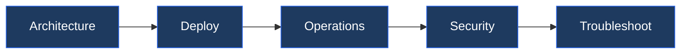

# Horizon — Learning Path

Recommended reading order for VMware Horizon (VDI). Follow these stages in order to build a complete mental model before working with it in production.

## Stage 1 — Architecture
**Goal**: Understand how Horizon components (Connection Server, UAG, agents, App Volumes) combine to deliver virtual desktops and published applications.
**Read in this order**:
- [How It Works](../architecture/how-it-works/) — Connection Server cluster, Unified Access Gateway (UAG), Blast/PCoIP protocol selection, instant clone lifecycle, and App Volumes attach sequence
- [Design Standards](../architecture/design-standards/) — Connection Server pod sizing, UAG placement (DMZ vs. internal), desktop pool design (instant clone vs. full clone), and DEM policy scope
- [Integrations](../architecture/integrations/) — vCenter and vSAN for desktop VMs, Active Directory for entitlements, App Volumes for app delivery, DEM for UEM policy, and ThinApp for legacy app packaging

**Why first**: Horizon's connection brokering, protocol handling, and app delivery involve multiple interdependent components; understanding how they interact prevents misrouting of user sessions and protocol selection errors.

---

## Stage 2 — Deployment
**Goal**: Deploy a Horizon pod with Connection Servers, UAG, and at least one instant-clone desktop pool available to entitled users.
**Read**:
- [Deploy](../deploy/) — Connection Server installation order, pod federation, UAG OVA deployment and tunnel configuration, and certificate binding
- [Install & Upgrade](../operations/install-upgrade/) — rolling Connection Server upgrade sequence, UAG upgrade, App Volumes upgrade, and agent update rollout via desktop pool maintenance mode

**Why second**: Certificate binding and UAG tunnel configuration must align before users connect; deploying pools before certificates are in place causes browser trust errors that erode confidence in the rollout.

---

## Stage 3 — Operations
**Goal**: Maintain desktop pool health, manage App Volumes assignments, and handle user session issues as routine tasks.
**Read in this order**:
- [Health Checks](../operations/health-checks/) — run the routine first on every shift
- [CLI Reference](../operations/cli-reference/) — vdmadmin and Horizon REST API commands for session management, pool refresh, and agent status queries
- [Procedures](../operations/procedures/) — instant clone parent image update workflow, App Volumes AppStack assignment, DEM policy targeting, desktop pool recompose, and bulk session logoff
- [Backup & Restore](../operations/backup-restore/) — Connection Server LDAP backup, App Volumes database backup, and restore sequence for Connection Server failure
- [Scripts](../operations/scripts/) — PowerCLI and Horizon REST API scripts for pool provisioning automation, session reporting, and agent version compliance checks

**Why third**: Pool management and App Volumes operations require a working Connection Server cluster and stable vCenter integration before any desktops are provisioned.

---

## Stage 4 — Security
**Goal**: Enforce smartcard/MFA authentication, restrict UAG access to entitled users, and protect desktop images from persistent malware.
**Read**:
- [Access Control](../security/access-control/) — entitlement assignment (users/groups to pools), administrator roles in Horizon Console, and delegated administration scopes
- [Authentication](../security/authentication/) — True SSO, smartcard passthrough, RADIUS/MFA integration with UAG, and Workspace ONE Access federation
- [Encryption](../security/encryption/) — Blast Extreme AES-128/256 session encryption, certificate chain for Connection Server and UAG, and App Volumes datastore encryption
- [Hardening](../security/hardening/) — disabling PCoIP where Blast suffices, instant clone ephemeral disk policy, Connection Server lockdown mode, and UAG external URL restrictions

**Why fourth**: Authentication and protocol security settings affect the client connection experience; they must be validated in a test pool before being applied to production entitlements.

---

## Stage 5 — Troubleshooting
**Goal**: Diagnose session launch failures, black screens, App Volumes attach errors, and UAG tunnel issues without impacting other users.
**Read**:
- [Common Issues](../troubleshooting/common-issues/) — blank screen on connect, App Volumes writable volume conflicts, DEM profile corruption, instant clone provisioning errors, and UAG certificate mismatch
- [Diagnostics](../troubleshooting/diagnostics/) — Connection Server event log, VMware View Agent log locations, UAG admin UI diagnostics, and Horizon helpdesk tool session detail
- [Escalation](../troubleshooting/escalation/) — GSS data requirements, log bundle collection (vdmadmin -A), and SR classification for protocol and agent-level failures

**Why last**: Troubleshooting makes most sense once you know the normal operating state.
