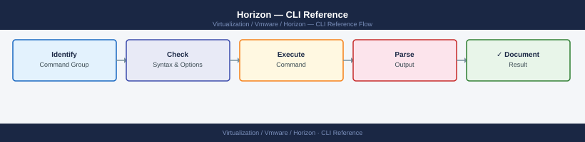

---
tags:
  - horizon
  - operations
  - vmware
---
# Horizon — CLI Reference

<div class="kb-summary">
CLI Reference reference covering Session Management, vdmexport / vdmimport, UAG CLI (hzedge), PowerShell — VMware.Hv.Helper, Horizon REST API.

*Applies to: Horizon 8.x*
</div>


  Horizon CLI Tools

## hvconfig CLI

### Desktop and Pool Operations

```cmd
:: List all pools
vdmadmin.exe -L -pools

:: List all desktops in a pool
vdmadmin.exe -L -desktops -poolid LON-KW-W11-IC

:: List desktops in error state
vdmadmin.exe -L -desktops -poolid LON-KW-W11-IC | findstr /i "error"

:: Reset a specific desktop (hard reset)
vdmadmin.exe -D -m <machine-name>

:: Remove a desktop from a pool (deletes the VM)
vdmadmin.exe -D -m <machine-name> -delete
```

### Entitlement Management

```cmd
:: List entitlements for a pool
vdmadmin.exe -L -entitlements -poolid LON-KW-W11-IC

:: Add AD group entitlement to a pool
vdmadmin.exe -A -entitlement -group "CN=VDI-LON-KW-Users,OU=Groups,DC=corp,DC=example,DC=com" -poolid LON-KW-W11-IC

:: Remove entitlement
vdmadmin.exe -R -entitlement -group "CN=VDI-LON-KW-Users,OU=Groups,DC=corp,DC=example,DC=com" -poolid LON-KW-W11-IC
```

### User Operations

```cmd
:: List assigned desktops for a user (Full Clone or persistent assignment)
vdmadmin.exe -L -assignments -u domain\username

:: Release a persistent desktop assignment (frees desktop for another user)
vdmadmin.exe -A -release -u domain\username -poolid LON-PW-W11-FC

:: Unlock a user account locked by too many failed logon attempts
vdmadmin.exe -N -unlock -u domain\username
```

### Connection Server Management

```cmd
:: List all Connection Servers in the pod
vdmadmin.exe -L -servers

:: Show Connection Server status and health
vdmadmin.exe -L -servers -verbose

:: List events from a Connection Server
vdmadmin.exe -L -events -n 100

:: List events filtered by severity
vdmadmin.exe -L -events -severity ERROR -n 50
```

---

## Before you begin

- **Access:** vCenter read-only minimum; Administrator role for remediation steps
- **Timing:** safe to run during business hours unless a step is marked ⚠ (causes interruption)
- **Dependencies:** no active upgrades or migrations on the same infrastructure
- **Logging:** capture command output — paste into the change record on completion

---

## vdmexport / vdmimport

These tools back up and restore the Connection Server LDAP configuration.

```cmd
:: Export (backup)
cd "C:\Program Files\VMware\VMware View\Server\tools\bin"

vdmexport.exe -f C:\Backups\cs-config-backup.ldif

:: Export verbose — shows what is being exported
vdmexport.exe -f C:\Backups\cs-config-backup.ldif -v

:: Import (restore) — overwrites existing config
vdmimport.exe -f C:\Backups\cs-config-backup.ldif

:: Import with update (doesn't fail on existing entries)
vdmimport.exe -f C:\Backups\cs-config-backup.ldif -u

:: Import verbose
vdmimport.exe -f C:\Backups\cs-config-backup.ldif -v
```

---

## UAG CLI (hzedge)

UAG is a Linux appliance — SSH access is available if enabled at deploy time. The `hzedge` command provides health and configuration queries.

```bash
# SSH to UAG
ssh admin@uag-prod-01.corp.example.com

# Check overall UAG health
hzedge gethealth

# Check Horizon Edge service status
hzedge getedgeconfigsummary

# List configured services (Horizon, reverse proxy, etc.)
hzedge getservices

# Check Blast Extreme gateway status
hzedge getblast

# Check PCoIP gateway status
hzedge getpcoip

# Check tunnel status
hzedge gettunnel

# View current authenticated sessions count
hzedge getsessioninfo
```


```text title="Expected output"
admin@uag-prod-01.corp.example.com's password: 
Connected to UAG instance uag-prod-01.corp.example.com

Health Status: HEALTHY
Overall CPU: 12%
Overall Memory: 68%
Disk Usage: 45%
Network Status: UP

Edge Configuration Summary:
  Version: 2309.1
  Build: 21.09.0.12345
  Deployment Mode: HA Primary
  Last Health Check: 2024-01-15 14:32:18 UTC

Services Status:
  Horizon Gateway Service: RUNNING
  Reverse Proxy Service: RUNNING
  Tunnel Service: RUNNING
  Security Gateway: RUNNING
  Load Balancer: RUNNING

Blast Extreme Gateway Status: ACTIVE
  Connections: 247
  Peak Throughput: 850 Mbps
  Latency: 12ms

PCoIP Gateway Status: ACTIVE
  Connections: 156
  Peak Throughput: 620 Mbps
  Latency: 8ms

Tunnel Status: CONNECTED
  Primary Tunnel: ESTABLISHED (uptime: 45d 3h 22m)
  Secondary Tunnel: ESTABLISHED (uptime: 45d 3h 18m)
  Tunnel Bandwidth: 95 Mbps

Authenticated Sessions: 403
  Blast Sessions: 247
  PCoIP Sessions: 156
  Session Timeout: 3600s
```

!!! warning "Common errors"
    **`Connection refused — Verify UAG hostname/IP is correct and SSH service is running on port 22.`** — Verify UAG hostname/IP is correct and SSH service is running on port 22.
    **`hzedge: command not found — SSH into the UAG appliance directly; these commands only work from the UAG console, not from a remote client.`** — SSH into the UAG appliance directly; these commands only work from the UAG console, not from a remote client.
    **`Health Status: DEGRADED — Check individual service status with hzedge getservices and review /var/log/horizon/edge.log for specific failures.`** — Check individual service status with hzedge getservices and review /var/log/horizon/edge.log for specific failures.
### UAG REST API (health check endpoint)

```bash
# From any machine — no authentication required for health endpoint
curl -sk https://uag-prod-01.corp.example.com/favicon.ico -o /dev/null -w "%{http_code}"
# Expect: 200

# Full UAG REST API health check (requires admin credentials)
curl -sk -u admin:<password> https://uag-prod-01.corp.example.com:9443/rest/v1/monitor/stats
```


```text title="Expected output"
200
{"monitorData":{"cpuUsage":42.3,"memoryUsage":58.7,"diskUsage":35.2,"activeConnections":1247,"tunnelConnections":89,"secureTunnelConnections":87,"uptime":2419200,"version":"8.10.0.1234","buildNumber":"20231015-001","lastHealthCheck":"2024-01-15T14:32:18Z","status":"HEALTHY","gatewayHealth":{"primary":"UP","secondary":"UP"},"loadBalancerStatus":"ACTIVE","certificateExpiry":"2025-03-22T00:00:00Z"}
```

!!! warning "Common errors"
    **`curl: (60) SSL certificate problem: self signed certificate`** — Add the `-k` flag to skip certificate verification, or install the UAG's CA certificate in your system trust store.
    **`curl: (7) Failed to connect to uag-prod-01.corp.example.com port 9443: Connection refused`** — Verify the UAG service is running with `systemctl status vmware-uag` and confirm the hostname/port are correct.
    **`{"error":"Unauthorized","code":401}`** — Ensure the admin credentials are correct and use the format `-u admin:password` without extra spaces or special characters that need escaping.
---

## PowerShell — VMware.Hv.Helper

`VMware.Hv.Helper` is the Horizon PowerShell module (community + VMware module). Install via PowerShell Gallery or from Horizon install media.

```powershell
# Install from PowerShell Gallery
Install-Module VMware.PowerCLI -Scope CurrentUser
Install-Module VMware.Hv.Helper -Scope CurrentUser

# Or import from local path (Horizon install media)
Import-Module "C:\Horizon\PowerShell\VMware.Hv.Helper.psm1"
```

### Connect to Horizon

```powershell
# Connect using Horizon REST or ADAM service
$cs = "cs01.corp.example.com"
$cred = Get-Credential  # Horizon Administrator account

Connect-HVServer -Server $cs -Credential $cred
```

### Pool Operations

```powershell
# List all pools
Get-HVPool

# Get specific pool details
Get-HVPool -PoolName "LON-KW-W11-IC"

# List pools with session counts
Get-HVPool | Select-Object @{N="Pool";E={$_.Base.Name}},
  @{N="Enabled";E={$_.Base.Enabled}},
  @{N="Type";E={$_.Type}}

# Disable a pool (stops new sessions)
Set-HVPool -PoolName "LON-KW-W11-IC" -Enable $false

# Enable a pool
Set-HVPool -PoolName "LON-KW-W11-IC" -Enable $true

# Get pool provisioning settings
(Get-HVPool -PoolName "LON-KW-W11-IC").AutomatedDesktopData.VmNamingSettings
```

### Desktop Operations

```powershell
# List all desktops in a pool
Get-HVMachine -PoolName "LON-KW-W11-IC"

# List desktops in ERROR state
Get-HVMachine -PoolName "LON-KW-W11-IC" | Where-Object { $_.Base.BasicState -eq "ERROR" }

# Get desktop by name
Get-HVMachine -MachineName "LON-KW-001"

# Reset a desktop (power reset)
$machine = Get-HVMachine -MachineName "LON-KW-001"
Reset-HVMachine -MachineId $machine.Id

# Delete a desktop from pool (and delete VM)
Remove-HVMachine -MachineId $machine.Id -DeleteFromDisk $true
```

### Session Operations

```powershell
# List all active sessions
Get-HVSession

# List sessions for a specific user
Get-HVSession | Where-Object { $_.NamesData.UserName -eq "CORP\jsmith" }

# List sessions in a specific pool
Get-HVSession | Where-Object { $_.NamesData.DesktopName -eq "LON-KW-W11-IC" }

# List disconnected sessions
Get-HVSession | Where-Object { $_.SessionData.SessionState -eq "DISCONNECTED" }

# Force logoff a session
$session = Get-HVSession | Where-Object { $_.NamesData.UserName -eq "CORP\jsmith" }
Send-HVSessionLogoff -HvSession $session

# Logoff all disconnected sessions older than 2 hours
$cutoff = (Get-Date).AddHours(-2)
Get-HVSession | Where-Object {
  $_.SessionData.SessionState -eq "DISCONNECTED" -and
  $_.SessionData.DisconnectTime -lt $cutoff
} | ForEach-Object { Send-HVSessionLogoff -HvSession $_ }

# Send message to all users in a pool
Get-HVSession | Where-Object { $_.NamesData.DesktopName -eq "LON-KW-W11-IC" } |
  ForEach-Object { Send-HVSessionMessage -HvSession $_ -MessageText "Maintenance in 30 minutes" -MessageType WARNING }
```

---

## Horizon REST API

Horizon exposes a REST API on each Connection Server. Authentication returns a JWT token used in subsequent calls.

**Base URL:** `https://<connection-server>/rest/`

### Authenticate

```powershell
$csUrl = "https://cs01.corp.example.com"
$body = @{
  username = "horizon-admin"
  password = "P@ssword123"
  domain   = "corp"
} | ConvertTo-Json

$authResponse = Invoke-RestMethod -Uri "$csUrl/rest/login" `
  -Method POST -Body $body -ContentType "application/json"

$token = $authResponse.access_token
$headers = @{ Authorization = "Bearer $token" }
```

### List Pools

```powershell
$pools = Invoke-RestMethod -Uri "$csUrl/rest/inventory/v1/desktop-pools" `
  -Method GET -Headers $headers

$pools | Select-Object id, display_name, type, enabled | Format-Table
```

### List Sessions

```powershell
$sessions = Invoke-RestMethod -Uri "$csUrl/rest/inventory/v1/sessions" `
  -Method GET -Headers $headers

$sessions | Select-Object id,
  @{N="User";E={$_.user_name}},
  @{N="Desktop";E={$_.machine_name}},
  @{N="State";E={$_.session_state}} | Format-Table
```

### Force Logoff via REST

```powershell
# Single session logoff
$sessionId = "session-id-from-list"
Invoke-RestMethod -Uri "$csUrl/rest/inventory/v1/sessions/$sessionId/action/logoff" `
  -Method POST -Headers $headers

# Bulk logoff (POST array of session IDs)
$body = @($sessionId1, $sessionId2) | ConvertTo-Json
Invoke-RestMethod -Uri "$csUrl/rest/inventory/v1/sessions/action/logoff" `
  -Method POST -Headers $headers -Body $body -ContentType "application/json"
```

### Rebalance Instant Clone Pool

```powershell
# Trigger a rebalance of Instant Clone desktops across datastores
$poolId = "pool-id-from-list"
Invoke-RestMethod -Uri "$csUrl/rest/inventory/v1/desktop-pools/$poolId/action/rebalance" `
  -Method POST -Headers $headers
```

### Refresh Pool (Push New Image)

```powershell
# Refresh all Instant Clone desktops — they will refresh on next logoff
$body = @{
  logoff_policy = "FORCE_LOGOFF_AFTER_TIMEOUT"
  stop_on_first_error = $false
} | ConvertTo-Json

Invoke-RestMethod -Uri "$csUrl/rest/inventory/v1/desktop-pools/$poolId/action/refresh" `
  -Method POST -Headers $headers -Body $body -ContentType "application/json"
```

### List Farms (RDS)

```powershell
$farms = Invoke-RestMethod -Uri "$csUrl/rest/inventory/v1/farms" `
  -Method GET -Headers $headers

$farms | Select-Object id, display_name, type, enabled | Format-Table
```

### Get Desktop Machine State

```powershell
# Get all machines in a pool with their state
$machines = Invoke-RestMethod -Uri "$csUrl/rest/inventory/v1/machines?desktop_pool_id=$poolId" `
  -Method GET -Headers $headers

$machines | Group-Object -Property basic_state | Select-Object Name, Count | Format-Table
```

---

## See also

- [Horizon — Procedures](../procedures/)
- [Horizon — Scripts](../scripts/)
- [VMware Horizon — Health Checks](../health-checks/)

## Verify

- **Alarms:** vSphere Client → Home → Alarms — no new critical alarms after the operation
- **Events:** monitor the vCenter Events view for the affected object for 5 minutes
- **Health check:** run the morning health-check sequence for the affected product tier
