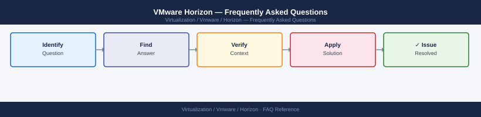

---
tags:
  - horizon
  - faq
  - operations
---
# VMware Horizon — Frequently Asked Questions

Common questions about VMware Horizon operations, configuration, and troubleshooting. For step-by-step procedures, see the <a href="index.md">Operations</a> section.

## General

**Q: What Horizon version is recommended for new deployments?**
A: Horizon 8 (2312 or latest CR) is recommended. Check via Horizon Administrator console → Help → About. Connection Server and Agents should be on matching major versions.

**Q: How do I check the current VMware Horizon version?**
A: `Horizon Administrator → Help → About`

## Configuration

**Q: What is the default session timeout and when should it change?**
A: Default idle session timeout is 10 minutes. Adjust per security policy: Global Settings → Global Policies → Session Timeout. For VDI desktops, 30-60 minutes is typical. For RDSH apps, 15 minutes is more appropriate.

**Q: How do I enable Horizon Smart Policies for per-user peripheral control?**
A: Install Horizon Dynamic Environment Manager (DEM). Create Smart Policies in DEM → Smart Policies. Policies can control USB redirection, clipboard, printing, and audio per AD group or condition.

## Operations

**Q: How do I upgrade Horizon Connection Servers without user disruption?**
A: Upgrade Connection Servers one at a time. Horizon supports mixed-version Connection Server pods temporarily. Upgrade the replica servers first, then the primary. Users connected to the upgraded server are not disconnected.

**Q: What is the correct procedure to add a new desktop pool?**
A: Horizon Administrator → Catalog → Desktop Pools → Add. Select pool type (Automated, Manual, or RDS). Configure the vCenter template, network, datastore, and desktop policy. Entitle the pool to AD groups.

## Troubleshooting

**Q: Horizon shows 'Agent Unreachable' for a desktop pool. What does it mean?**
A: Connection Servers cannot reach the Horizon Agent on the desktop VMs. Check VM power state. Verify Horizon Agent service is running. Check network connectivity from Connection Server to the desktop network. Review firewall rules for ports 4001, 4002, 443.

**Q: User desktop performance is poor — where do I start?**
A: Check vSphere host CPU ready and memory balloon on the hosting ESXi. Review Blast display protocol settings (reduce quality for bandwidth-limited clients). Check storage latency for the desktop datastore (IOPS-intensive VDI workloads).

## Backup and Recovery

**Q: How often should I back up Horizon Connection Server configuration?**
A: Daily LDAP backup: `vdmexport.exe -f backup.ldf` on the Connection Server. This exports the entire Horizon configuration. Store off-server. Test restore to a lab Connection Server quarterly.

**Q: Can I restore a single desktop pool configuration without a full Horizon restore?**
A: Not directly — Horizon configuration is stored in an ADAM (Active Directory Application Mode) database. Restore requires the full LDAP export. Individual pool settings can be reconfigured manually if the pool metadata is lost.

## See Also

- [VMware Horizon Operations](index.md)
- [VMware Horizon Troubleshooting](../../../troubleshooting/index.md)
