---
tags:
  - horizon
  - operations
  - vmware
---
# VMware Horizon — Health Checks

<div class="kb-summary">
Health checks for Horizon — Connection Server status, desktop pool availability, UAG gateway health, session counts vs licensed capacity, certificate expiry, and App Volumes / DEM component health.

*Applies to: Horizon 8.x*
</div>


```d2
direction: right

hub: "Horizon\nOperations" {shape: hexagon}
run_this_routine: "Run This Routine" {shape: rectangle}
session_count_and_pool_status: "Session Count and Pool Status" {shape: rectangle}
using_vmwarehvhelper_powershell_modu: "Using VMware.Hv.Helper PowerShell module" {shape: rectangle}
get_current_active_session_count: "Get current active session count" {shape: rectangle}
get_licensed_session_count_from_lice: "Get licensed session count from License page" {shape: rectangle}
horizon_console_settings_product_lic: "Horizon Console → Settings → Product Licensing and Usage" {shape: rectangle}

hub -> run_this_routine
hub -> session_count_and_pool_status
hub -> using_vmwarehvhelper_powershell_modu
hub -> get_current_active_session_count
hub -> get_licensed_session_count_from_lice
hub -> horizon_console_settings_product_lic
```

## Before you begin

- **Access:** vCenter read-only minimum; Administrator role for remediation steps
- **Timing:** safe to run during business hours unless a step is marked ⚠ (causes interruption)
- **Dependencies:** no active upgrades or migrations on the same infrastructure
- **Logging:** capture command output — paste into the change record on completion

---

## Run This Routine

1. **Connection Server service status** — run on or against each CS:
   ```powershell
   Get-Service -ComputerName cs-prod-01 -Name wsbroker | Select Status
   ```
2. **Horizon pod health** — Horizon Console → Dashboard → confirm all Connection Servers show green status.
3. **UAG health** — open UAG admin UI at `https://<uag>:9443/admin` → verify all edge services show **Up**.
4. **Desktop pool assignment** — via Horizon PowerCLI:
   ```powershell
   Get-Pool | Select pool_id,numMachines,numConnectedSessions
   ```
5. **Instant clone parent VM** — in vCenter, verify the parent VM and replica VMs exist for each pool under the correct folder.
6. **Active session count** — Horizon Console → Monitor → Sessions → note current count vs licensed capacity limit.
7. **Certificate expiry** — check Connection Server certificate:
   ```powershell
   Get-Certificate -DnsName <cs-fqdn>
   ```
   Or: Horizon Console → Settings → Servers → Connection Servers → select server → Certificates tab.
8. **vCenter connectivity** — Horizon Console → Settings → Servers → vCenter → confirm status shows **Connected**.
9. **Composer/Instant Clone health** — Horizon Console → Monitor → Events → filter by Error/Warning → confirm no provisioning errors.
10. **Blast gateway reachability** — from a client network:
    ```bash
    curl -sk https://<uag-external>:443/
    ```
    Expect an HTTP redirect (3xx) response; a connection refused or timeout indicates a gateway issue.

---

## Session Count and Pool Status


```powershell
## Using VMware.Hv.Helper PowerShell module

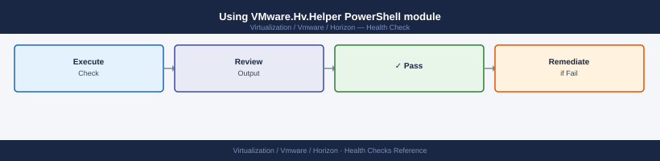
Connect-HVServer -Server horizon-cs01.example.local -Credential (Get-Credential)

## Get current active session count


$sessions = Get-HVLocalSession
Write-Host "Active sessions: $($sessions.Count)"

## Get licensed session count from License page

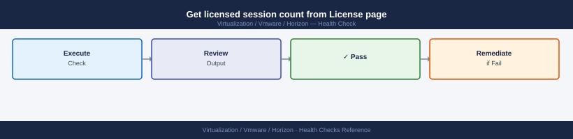
## Horizon Console → Settings → Product Licensing and Usage

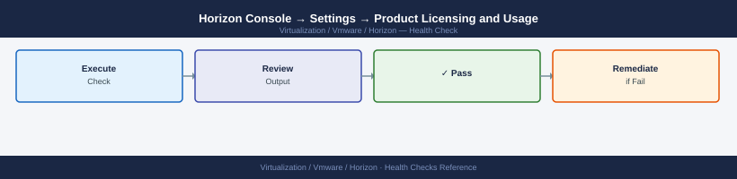
```
## UAG Health and Port Checks


```bash
# UAG exposes a health API endpoint
curl -sk https://uag.example.local/favicon.ico  # should return 200
curl -sk https://uag.example.local:9443/rest/v1/monitor/health \
  -u admin:<password> | python3 -m json.tool
## Look for "RUNNING" status on all services

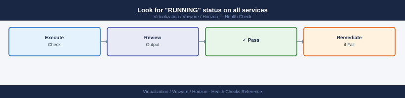

## Test Blast gateway reachability from external network

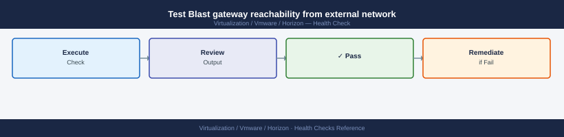
## Blast: TCP 8443 (HTTPS)


## PCoIP: TCP/UDP 4172


nc -vz uag.example.local 8443
nc -vz uag.example.local 4172
```
## App Volumes Health


App Volumes Manager UI → **Activity → Current Activity** — no stuck attachments or detachments.
App Volumes Manager UI → **Infrastructure → Managers** — all managers show Healthy.

```bash
# Test App Volumes Manager API
curl -sk https://appvol-mgr.example.local/cv_api/status
```
## DEM Agent Health

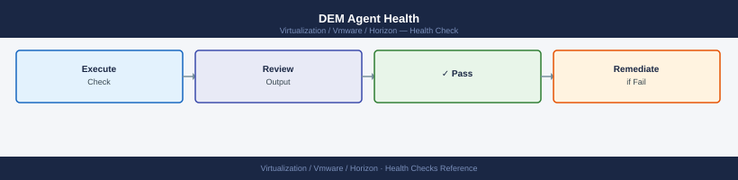

```powershell
# On a desktop VM or Connection Server:
Test-Path "\\fileserver.example.local\DEM-Config\General"
## Should return True

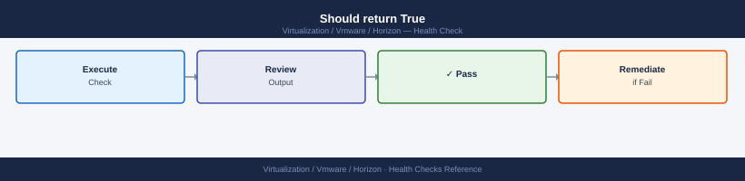

## Check DEM Agent service in a desktop VM

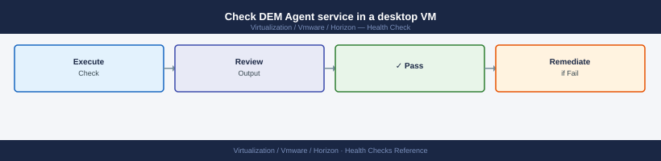
Get-Service -ComputerName <desktop-vm> -Name "User Environment Manager Agent"
```
## Certificate Expiry Checks


```bash
# Check Connection Server SSL certificate
echo | openssl s_client -connect horizon-cs01.example.local:443 -servername horizon-cs01.example.local 2>/dev/null \
  | openssl x509 -noout -dates

## Check UAG certificate


echo | openssl s_client -connect uag.example.local:443 -servername uag.example.local 2>/dev/null \
  | openssl x509 -noout -dates

## Check UAG Blast gateway cert (port 8443)

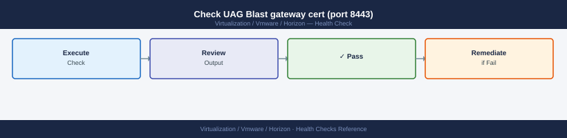
echo | openssl s_client -connect uag.example.local:8443 2>/dev/null \
  | openssl x509 -noout -dates
```
## Desktop Error State Cleanup


```powershell
Connect-HVServer -Server horizon-cs01.example.local -Credential (Get-Credential)

# Get desktops in error state
Get-HVDesktop | Where-Object { $_.Base.BasicState -eq "ERROR" } | 
  Select-Object -ExpandProperty Base | 
  Select-Object Name, BasicState, DesktopSummaryData

## Delete error-state desktops (they will be reprovisioned automatically)

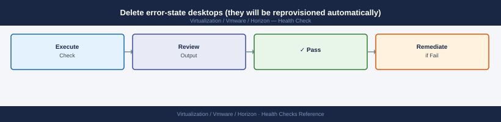
Get-HVDesktop | Where-Object { $_.Base.BasicState -eq "ERROR" } |
  Remove-HVDesktop -Confirm:$false
```
## External Connectivity Port Check


```bash
# Blast Extreme — TCP 8443 to UAG
nc -vz uag.public.corp.com 8443

## PCoIP — TCP 4172 and UDP 4172 to UAG

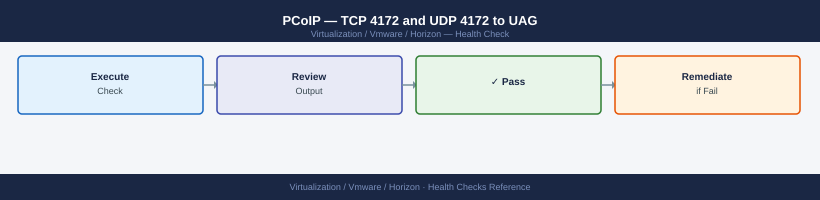
nc -vz uag.public.corp.com 4172

## HTTPS Tunnel — TCP 443 to UAG


nc -vz uag.public.corp.com 443
```

---

## See also

- [VMware Horizon — Common Issues](../troubleshooting/common-issues/)
- [Horizon — Procedures](procedures/)
- [Horizon — CLI Reference](cli-reference/)

## Verify

- **Alarms:** vSphere Client → Home → Alarms — no new critical alarms after the operation
- **Events:** monitor the vCenter Events view for the affected object for 5 minutes
- **Health check:** run the morning health-check sequence for the affected product tier
