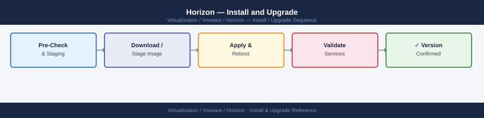

---
tags:
  - horizon
  - operations
  - vmware
---
# Horizon — Install and Upgrade


<div class="kb-summary">
Install and Upgrade reference covering Horizon Agent Installation in Golden Image, UAG Deployment, App Volumes Manager Installation, Upgrade Order, Upgrade a Connection Server (Rolling) and 2 more sections.

*Applies to: Horizon 8.x*
</div>



Key components:
- `Core` — required
- `BlastAgent` — Blast Extreme display protocol
- `PCoIP` — PCoIP display protocol (optional if Blast-only)
- `SVIAgent` — Instant Clone support (required for IC pools)
- `USB` — USB redirection
- `RTAV` — Real-Time Audio-Video

Shut down the VM and take a snapshot before creating a pool.

---

## Before you begin

- **Access:** vCenter read-only minimum; Administrator role for remediation steps
- **Timing:** safe to run during business hours unless a step is marked ⚠ (causes interruption)
- **Dependencies:** no active upgrades or migrations on the same infrastructure
- **Logging:** capture command output — paste into the change record on completion

---

!!! warning "Host enters maintenance mode"
    ESXi remediation puts hosts into maintenance mode, triggering DRS evacuation. Confirm DRS is Fully Automated and HA admission control is satisfied before starting.

## UAG Deployment

UAG is deployed from OVA. Use PowerShell for repeatable deployment:

```powershell
# Download UAG OVA and deploy-ova-uag.ps1 from VMware
# Edit uag.ini config file:
[General]
source=VMware-Unified-Access-Gateway-<version>.ova
target=vi://administrator@vsphere.local:password@vcenter.example.local/...
deploymentOption=onenic  # or twonic, threenic for DMZ placement
netInternet=VM Network
netManagementNetwork=VM Network
netBackendNetwork=VM Network

[Horizon]
proxyDestinationUrl=https://horizon-cs01.example.local:443
proxyDestinationUrlThumbprints=sha1:<cs01-thumbprint>

# Deploy
pwsh deploy-ova-uag.ps1 uag.ini
```

Post-deployment, configure Edge Service settings via UAG Admin UI (port 9443) or REST API.

---

## App Volumes Manager Installation

```powershell
# Deploy App Volumes Manager on Windows Server
App-Volumes-Manager-<version>.exe /silent /norestart

# Configure SQL database connection during wizard
# Default port: HTTPS 443

# After install, register Connection Servers:
# App Volumes Manager → Configuration → Managers → Register new
```

---

## Upgrade Order

Upgrade components in this strict order:

1. **vCenter** (if upgrading vSphere simultaneously)
2. **Connection Servers** — one at a time, verify health before proceeding to next
3. **UAG** — redeploy from new OVA (stateless appliance — redeploy is the upgrade path)
4. **Horizon Agent in golden image** — update snapshot, push to pools
5. **App Volumes Manager**
6. **App Volumes Agent** (in App Volumes VHD/AppStacks — update via App Volumes Manager)

> Never upgrade Connection Servers simultaneously — always rolling, one at a time.

---

## Upgrade a Connection Server (Rolling)

```powershell
# 1. Put the CS being upgraded into Quiesce mode (drains sessions)
#    Horizon Console → Settings → Servers → [CS] → Set Maintenance Mode: Quiesce

# 2. Wait for sessions to drain or force-migrate

# 3. Run the new installer (upgrade in-place)
VMware-Horizon-Connection-Server-x86_64-<new-version>.exe /silent

# 4. Verify service is running
Get-Service -Name "VMware Horizon View Connection Server"

# 5. Disable maintenance mode
#    Horizon Console → Settings → Servers → [CS] → Disable Maintenance Mode

# 6. Proceed to next Connection Server
```

---

## Version Compatibility Reference

Check the VMware Product Interoperability Matrix before upgrade:
- https://interopmatrix.vmware.com
- Key dependencies: Horizon ↔ vSphere ↔ App Volumes ↔ DEM ↔ vSAN

---

## Post-Install Verification

```powershell
# Verify all Connection Servers are healthy after upgrade
Get-HVLocalSession  # should return sessions from all CS nodes
# Horizon Console → Dashboard → all servers green

# Test desktop provisioning — create a test pool, provision 1 desktop, confirm it connects
```

---

## See also

- [VMware Horizon — Health Checks](health-checks/)
- [VMware Horizon — Common Issues](../troubleshooting/common-issues/)
- [Horizon — Procedures](procedures/)

## Verify

- **Alarms:** vSphere Client → Home → Alarms — no new critical alarms after the operation
- **Events:** monitor the vCenter Events view for the affected object for 5 minutes
- **Health check:** run the morning health-check sequence for the affected product tier
