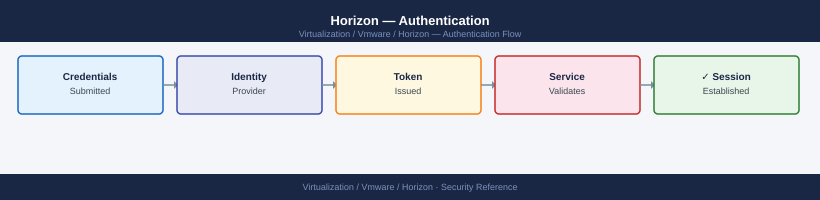

---
tags:
  - horizon
  - security
  - vmware
---
# Horizon — Authentication

<div class="kb-summary">
Authentication reference covering Two-Factor Authentication (RADIUS / RSA SecurID), SAML Authentication (Workspace ONE / vIDM), Smart Card / Certificate Authentication, True SSO, Unauthenticated Access (Kiosk Mode) and 3 more sections.

*Applies to: Horizon 8.x*
</div>


For RSA SecurID (hardware token):
```text
  2-Factor Authentication: SecurID
  Load RSA sdconf.rec (downloaded from RSA Authentication Manager)
```

---

## Before you begin

- **Access:** vCenter Administrator role
- **Change management:** security changes require CAB approval in most environments
- **Rollback plan:** document current state before any security control change
- **Testing:** validate in a non-production environment first where possible

---

## SAML Authentication (Workspace ONE / vIDM)

SAML enables IdP-initiated SSO — users authenticate to Workspace ONE/vIDM and are passed to Horizon:

```text
Horizon Console → Settings → Servers → Connection Servers → [CS] → Edit → Authentication
  Delegation of Authentication to VMware Identity Manager: Allowed or Required
  vIDM URL: https://vidm.example.local
  Token TTL: 300 seconds
```

SAML is required for:
- Passwordless authentication
- Biometric (FIDO2) authentication via vIDM
- True SSO (certificate-based silent desktop login)

---

## Smart Card / Certificate Authentication

```text
Horizon Console → Settings → Servers → Connection Servers → [CS] → Edit → Authentication
  Smart Card Authentication: Required or Optional
  Certificate Revocation: Use CRL / OCSP (recommended)
  Certificate Revocation URL: http://pki.example.local/crl/corp-ca.crl
```

Smart card authentication works with CAC, PIV, and software certificates. The client OS must have the certificate in the user's personal certificate store.

---

## True SSO

True SSO eliminates the password prompt for desktop login after initial UAG authentication:

```yaml
Requirements:
  - Microsoft Enterprise CA
  - Enrollment Server role (installed on same or separate Windows Server)
  - SAML authentication configured
  - Certificate template: Horizon Enrollment (key usage: Digital Signature, Key Encipherment)

Horizon Console → Settings → True SSO
  Enable True SSO
  Enrollment Server: <FQDN of Enrollment Server>
  Template: Horizon
```

When enabled: user authenticates once at UAG (AD/SAML/RADIUS), receives short-lived cert, desktop logs in automatically.

---

## Unauthenticated Access (Kiosk Mode)

For kiosk/shared terminals with no personal authentication:

```text
Horizon Console → Settings → Servers → Connection Servers → [CS] → Edit → Authentication
  Allow Unauthenticated Access: Enabled
```

Assign kiosk desktops to a dedicated pool with restricted internet access and no persistent profiles.

---

## Session Timeout and Reauthentication

```text
Horizon Console → Settings → Global Settings → General
  Session Timeout: 600 minutes (10 hours — adjust per policy)
  Disconnected Session Timeout: 60 minutes (log off disconnected sessions)
  Reauthentication on Reconnect: Enabled (require new auth after disconnect)
```

For high-security environments: set Reauthentication = Always and reduce timeout to 4 hours.

---

## UAG Identity Bridging

UAG can perform identity bridging for applications that require Kerberos authentication internally when users are authenticating externally via SAML:

```text
UAG Admin UI → Edge Service Settings → Horizon → Advanced
  Identity Bridging: Enable
  Principal Name: UPN (user@corp.local)
```

This allows external SAML-authenticated users to transparently access Kerberos-protected intranet applications through the desktop.
---

## Related Reference

- [Standard LDAP Integration](../../../../security/ldap-integration/index.md) — field reference, service account standards, TLS requirements, and connectivity testing
- [Standard SAML Configuration](../../../../security/saml-configuration/index.md) — SP/IdP setup, Azure AD and Okta steps, attribute mapping, and security requirements

## See also

- [Horizon — Access Control](access-control/)
- [Horizon — Hardening](hardening/)
