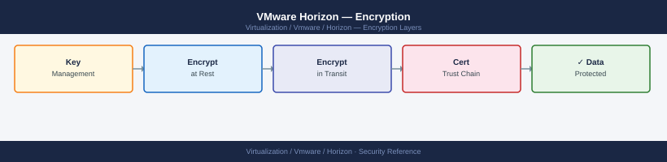

---
tags:
  - horizon
  - security
  - vmware
---
# VMware Horizon — Encryption



```bash
## Before you begin

- **Access:** vCenter Administrator role
- **Change management:** security changes require CAB approval in most environments
- **Rollback plan:** document current state before any security control change
- **Testing:** validate in a non-production environment first where possible

---

## Option 1: Via UAG Admin UI (port 9443) → SSL Server Certificate → Upload
## Upload PKCS12 (.pfx) or PEM (cert + key)

## Option 2: Via UAG REST API
curl -sk -X PUT "https://uag.example.local:9443/rest/v1/config/certs/ssl" \
  -u admin:<password> \
  -F "file=@/path/to/uag.pfx" \
  -F "password=pfxpassword"
```
```yaml
Group Policy → Computer Configuration → Policies → VMware Blast
  Clipboard Redirection:
    - Disabled: no clipboard between client and desktop
    - Client to Agent only: paste from client → desktop, not reverse
    - Agent to Client only: paste from desktop → client, not reverse
    - Enabled (bidirectional): default — not recommended for sensitive data
```
```text
Group Policy → User Configuration → VMware Horizon Client Configuration → USB
  Allow USB Redirection: Enabled
  Exclude Device Family: Storage (block USB mass storage to prevent data exfiltration)
  Allow specific VID/PID: <CAC reader VID:PID> (allow smart card readers only)
```
```powershell
## Restrict TLS on Connection Server to 1.2 and 1.3 only
## Edit locked.properties file:
$lockedProps = "C:\Program Files\VMware\VMware View\Server\sslgateway\conf\locked.properties"

Add-Content $lockedProps "`nsslprotocols=TLSv1.2,TLSv1.3"
Add-Content $lockedProps "enabledCipherSuites=TLS_ECDHE_RSA_WITH_AES_256_GCM_SHA384,TLS_ECDHE_RSA_WITH_AES_128_GCM_SHA256"

## Restart Connection Server service
Restart-Service "VMware Horizon View Connection Server"
```
```text
Group Policy → Computer Configuration → VMware Horizon Agent
  Drive Redirection: Disabled
```

## See also

- [Horizon — Hardening](hardening/)
- [VMware Horizon — Health Checks](../operations/health-checks/)
