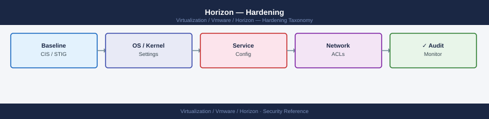

---
tags:
  - horizon
  - security
  - vmware
---
# Horizon — Hardening


<div class="kb-summary">
Hardening reference covering Windows Hardening of Connection Server, UAG Hardening, USB Redirection Policy, Clipboard Direction Restriction, Drive Mapping Restriction and 3 more sections.

*Applies to: Horizon 8.x*
</div>



  Hardening Checklist Coverage

---

## Before you begin

- **Access:** vCenter Administrator role
- **Change management:** security changes require CAB approval in most environments
- **Rollback plan:** document current state before any security control change
- **Testing:** validate in a non-production environment first where possible

---

## UAG Hardening

```bash
# UAG Admin UI → Advanced Settings → TLS Settings
  SSL Ciphers: ECDHE-RSA-AES256-GCM-SHA384:ECDHE-RSA-AES128-GCM-SHA256
  TLS Versions: TLSv1.2,TLSv1.3

# UAG Admin UI → Advanced Settings → DoS Mitigation
  Enable DoS protection: Yes
  Max connections per client: 25 (reduce for restrictive environments)

# Restrict UAG admin UI to management IP only
  Admin Interface: bind to management NIC IP only
  Allow access from: management subnet CIDR
```

---

## USB Redirection Policy

```text
Group Policy → Computer Configuration → VMware Horizon Agent
  USB Redirection Enabled: No (disable entirely for highly regulated desktops)
  OR:
  Exclude Device Family: Storage,Bluetooth,SmartCard  (allow only specific devices)
  Include Device: <VID>_<PID>  (explicitly allow CAC reader by VID/PID)
```

---

## Clipboard Direction Restriction

```text
Group Policy → Computer Configuration → VMware Blast → Clipboard
  Clipboard Direction: Client to Agent only
  (Users can paste into the desktop but cannot copy out — prevents data exfiltration)
```

For kiosk or shared-terminal pools: set to Disabled entirely.

---

## Drive Mapping Restriction

```text
Group Policy → Computer Configuration → VMware Horizon Agent
  Client Drive Redirection: Disabled
```

Prevents users from mapping their local drives into the virtual desktop — eliminates a data exfiltration path.

---

## Disable Direct Console Access

Connection Server should not be accessible directly from desktop VMs:

```text
locked.properties:
  checkOrigin=true
  allowedHosts=<management-subnet>
```

Physical server hosting Connection Server should not be on the same VLAN as desktop VMs.

---

## Monitor Admin Events

```bash
Horizon Console → Monitor → Events
  Filter: Role = Administrator, Action = Configuration Change
  Export to CSV for audit trail
```

For automated monitoring, configure Events Database (SQL Server) and query it with scheduled reports.

---

## Security Hardening Checklist

| Control | Status Check |
|---|---|
| TLS 1.0/1.1 disabled on CS | `nmap --script ssl-enum-ciphers -p 443 horizon-cs01.example.local` |
| CA-signed cert on CS | `openssl s_client -connect horizon-cs01:443 \| openssl x509 -issuer` |
| CA-signed cert on UAG | `openssl s_client -connect uag:443 \| openssl x509 -issuer` |
| 2FA enabled for external access | Horizon Console → Settings → CS → Authentication |
| Clipboard restricted | GPO audit — verify policy applied to desktop OUs |
| USB storage blocked | GPO audit — verify Exclude Device Family includes Storage |
| Drive mapping disabled | GPO audit |
| CS admin UI restricted to mgmt VLAN | Test: access `https://horizon-cs01` from desktop VLAN |
| Events DB configured | Monitor → Events: confirm long history available |

## See also

- [Horizon — Access Control](access-control/)
- [Horizon — Authentication](authentication/)
- [VMware Horizon — Health Checks](../operations/health-checks/)
