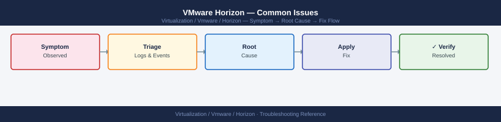
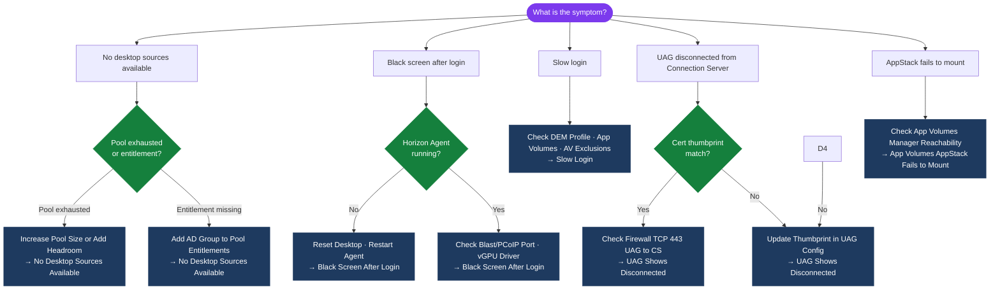

---
tags:
  - horizon
  - troubleshooting
  - vmware
search:
  boost: 1.5
---
# VMware Horizon — Common Issues



```text
   vCenter → Monitor → Tasks — filter by the stuck desktop VM name
   ```

---

```d2
direction: down

symptom: Identify Symptom {shape: diamond}
diagnostic_flow: "Diagnostic Flow" {shape: rectangle}
no_desktop_sources_available: "'No Desktop Sources Available'" {shape: rectangle}
black_screen_after_login: "Black Screen After Login" {shape: rectangle}
slow_login: "Slow Login" {shape: rectangle}
uag_shows_disconnected_from_connecti: "UAG Shows Disconnected from Connection Server" {shape: rectangle}
app_volumes_appstack_fails_to_mount: "App Volumes AppStack Fails to Mount" {shape: rectangle}
resolution: Resolve or Escalate {shape: oval}

symptom -> diagnostic_flow: investigate
symptom -> no_desktop_sources_available: investigate
symptom -> black_screen_after_login: investigate
symptom -> slow_login: investigate
symptom -> uag_shows_disconnected_from_connecti: investigate
symptom -> app_volumes_appstack_fails_to_mount: investigate
diagnostic_flow -> resolution
no_desktop_sources_available -> resolution
black_screen_after_login -> resolution
slow_login -> resolution
uag_shows_disconnected_from_connecti -> resolution
app_volumes_appstack_fails_to_mount -> resolution
```

## Diagnostic Flow



---

## Before you begin

- **Access:** SSH to vCenter Shell and ESXi hosts; vSphere Client read access
- **Gather first:** recent error message text, event timestamps, and affected object names
- **Scope:** confirm whether the issue affects a single object, host, cluster, or site
- **Escalation:** open a vendor support ticket before running any destructive step
- **Logging:** document each command and output — required if escalation is needed

---

## "No Desktop Sources Available"

**Symptoms:** Users get "No desktop sources available" when connecting

1. **Pool is exhausted — all desktops assigned or in use:**
   ```text
   Horizon Console → Inventory → Desktops → [pool]
   Check: Available count — if 0, all desktops are in use or error
   Increase pool size or add headroom
   ```

2. **All desktops in error state:**
   ```powershell
   Get-HVDesktop -PoolName "pool-win10-float" | 
     Group-Object { $_.Base.BasicState } | Select Name, Count
   # If all are ERROR: bulk-delete and let pool reprovision
   Get-HVDesktop -PoolName "pool-win10-float" | 
     Where-Object { $_.Base.BasicState -eq "ERROR" } | 
     Remove-HVDesktop -Confirm:$false
   ```

3. **Entitlement missing:** User is not entitled to the pool
   ```text
   Horizon Console → [pool] → Entitlements → verify user's AD group is listed
   ```

---

## Black Screen After Login

**Symptoms:** User authenticates successfully, session starts, but screen remains black

1. **Horizon Agent not running in the desktop VM:**
   ```powershell
   # From Connection Server:
   $desktop = Get-HVDesktop -VMName "win10-042"
   # Get the VM IP, then check remotely:
   Get-Service -ComputerName <desktop-ip> -Name "VMware Horizon View Agent"
   # If stopped: reset the desktop (reboot)
   Reset-HVMachine -HVMachineName "win10-042"
   ```

2. **Display protocol (Blast/PCoIP) port blocked:** Check NSG or firewall rules between Horizon Client and the UAG/Connection Server

3. **vGPU driver issue (if vGPU pool):** Check vGPU driver status in guest

---

## Slow Login

**Symptoms:** Login takes >60 seconds; users report slow desktop loading

1. **DEM profile migration:** First-time migration of legacy profile to DEM can take minutes — expected behavior
```text
   DEM Management Console → Monitor → check profile migration queue
   ```

2. **AppStack mount failure (App Volumes):** AppStack VMDK attachment is slow or failing
```text
   App Volumes Manager → Activity → check for stuck attach operations
   ```

3. **Antivirus scanning user profile on login:** AV exclusions needed
```sql
   Exclude from scanning: %APPDATA%, %USERPROFILE%, DEM config share (\\server\dem-config)
   ```

4. **Network drive mapping slow:** Group Policy login script timing out on drive mapping
```text
   Enable asynchronous user Group Policy processing to prevent blocking login
   ```

---

## UAG Shows Disconnected from Connection Server

**Symptoms:** UAG Admin UI shows "Connection Server is not connected" or users can authenticate but cannot launch desktops

1. **Certificate mismatch:** Connection Server cert thumbprint in UAG config doesn't match the current CS cert
   ```bash
   # Get current CS cert thumbprint:
   echo | openssl s_client -connect horizon-cs01.example.local:443 2>/dev/null \
     | openssl x509 -fingerprint -sha1 -noout
   # Compare to thumbprint in UAG:
   UAG Admin UI → Edge Service Settings → Horizon → Thumbprint
   # Update if different
   ```

2. **Firewall between UAG and Connection Server:** TCP 443 from UAG backend NIC to Connection Server must be open

---

## App Volumes AppStack Fails to Mount

**Symptoms:** User logs in but application is not available; App Volumes Manager shows failed attachment

1. **App Volumes Manager unreachable from desktop VM:**
```powershell
   # From desktop VM:
   Test-NetConnection appvol-mgr.example.local -Port 443
   # Must succeed — if failed, firewall or DNS issue
   ```

2. **VMDK attachment failure in vCenter:** AppStack VMDK is already attached to another VM (from a previous failed detach)
```sql
   App Volumes Manager → AppStacks → [stack] → Assignments → check for stale attachments
   OR: vCenter → locate AppStack VMDK → detach from any VM it's currently attached to
   ```

---

## See also

- [Horizon — Diagnostics](../diagnostics/)
- [Horizon — Escalation](../escalation/)
- [VMware Horizon — Health Checks](../../operations/health-checks/)

## Verify resolution

- **Alarms cleared:** Home → Alarms — the triggering alarm is no longer active
- **Event log:** confirm no new related error events in the last 5 minutes
- **Functional test:** perform the action that was failing (connect, vMotion, storage I/O) — confirm it succeeds
- **Monitor:** leave the vSphere Client open for 10 minutes and confirm the issue does not recur
