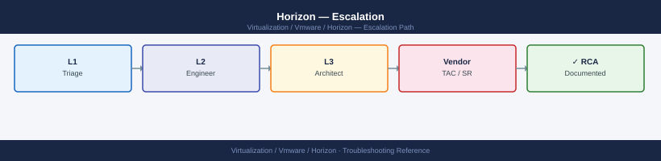

---
tags:
  - horizon
  - troubleshooting
  - vmware
search:
  boost: 1.5
---
# Horizon — Escalation

<div class="kb-summary">
How to escalate VMware Horizon issues to Broadcom support: what data to collect, how to generate the Connection Server support bundle, step-by-step case creation on support.broadcom.com, and the escalation path when progress stalls.

*Applies to: Horizon 8.x*
</div>



---

```d2
direction: down

symptom: Identify Symptom {shape: diamond}
preescalation_selfcheck: "Pre-Escalation Self-Check" {shape: rectangle}
stepbystep_data_collection: "Step-by-Step Data Collection" {shape: rectangle}
how_to_open_the_sr_on_supportbroadco: "How to Open the SR on support.broadcom.com" {shape: rectangle}
escalation_path: "Escalation Path" {shape: rectangle}
what_not_to_do: "What NOT to Do" {shape: rectangle}
useful_commands_for_case_updates: "Useful Commands for Case Updates" {shape: rectangle}
resolution: Resolve or Escalate {shape: oval}

symptom -> preescalation_selfcheck: investigate
symptom -> stepbystep_data_collection: investigate
symptom -> how_to_open_the_sr_on_supportbroadco: investigate
symptom -> escalation_path: investigate
symptom -> what_not_to_do: investigate
symptom -> useful_commands_for_case_updates: investigate
preescalation_selfcheck -> resolution
stepbystep_data_collection -> resolution
how_to_open_the_sr_on_supportbroadco -> resolution
escalation_path -> resolution
what_not_to_do -> resolution
useful_commands_for_case_updates -> resolution
```

## Before you begin

- **Access required:** Horizon Administrator role in Horizon Admin console; RDP access to at least one Connection Server; Broadcom support account at support.broadcom.com with active Horizon support entitlement
- **CS down?** If all Connection Servers are down, the fastest recovery is restoring a recent VM snapshot of a CS. Do this BEFORE opening the case if an active business impact exists. Then open the case to root-cause the original failure
- **Do NOT decommission or uninstall a Connection Server** that failed during the incident — GSS needs the CS logs from that specific host to diagnose the failure
- **Do NOT clear the Horizon event database** — it contains the audit trail and session error logs GSS needs

---

## Pre-Escalation Self-Check

Run these before opening the case.

| Check | Where to look | Expected result |
|---|---|---|
| CS health | Horizon Admin → Settings → Servers → Connection Servers | All CS nodes show green (Connected) |
| CS Windows services | Services on each CS host: `VMware Horizon View Connection Server` | Running |
| Horizon version | Horizon Admin → About | Note full version + build |
| ADAM (Embedded LDAP) | Services on CS host: `VMware ADAM Instance VSphere` | Running |
| Agent connectivity | Horizon Admin → Resources → Desktops | No pool in 100% Error state |
| UAG health | UAG Admin console (port 9443) → Dashboard | All edge services green |
| vCenter connectivity | Horizon Admin → Settings → Servers → vCenter Servers | vCenter shows Connected |
| AD/LDAP connectivity | Horizon Admin → Settings → Domains | Domain shows Connected |
| CS Windows event log | Event Viewer on CS host → Application + System | Note any Critical/Error events |

---

## Step-by-Step Data Collection

### 1. Get the Horizon version and Connection Server count

In Horizon Admin console: click **Help** (gear icon, top right) → **About**. Note:
- **Horizon Version**: e.g. `8.9.0 (build 22710600)`
- Number of Connection Servers in this pod (visible in **Settings → Servers → Connection Servers**)

### 2. Generate the Connection Server support bundle

1. In Horizon Admin console: click the **Help** icon (?) → **Support**.
2. Click **Generate Support Bundle**.
3. Select the **Connection Server** you want to collect from (or `All`).
4. Click **Generate**. The bundle includes CS logs, ADAM replication data, and configuration.
5. Download the resulting ZIP.

**Repeat for every CS in the pod** — if the failure is on one specific CS, collect from all of them.

### 3. Collect Horizon Agent logs from affected desktop VMs

On an affected desktop VM (Windows):

```powershell
# Horizon Agent logs location
$agentlogdir = "C:\ProgramData\VMware\VDM"

# Copy the most recent debug log files
Get-ChildItem "$agentlogdir\debug-*.log" | Sort-Object LastWriteTime -Descending | Select-Object -First 5
Copy-Item "$agentlogdir\debug-*.log" "C:\Temp\agent-logs-$(Get-Date -Format 'yyyyMMdd')"

# Also collect the Windows Event Log for VMware events
Get-EventLog -LogName Application -Source "VMware*" -Newest 100 |
  Out-File "C:\Temp\vdi-app-events-$(Get-Date -Format 'yyyyMMdd').txt"
```

For Linux desktop VMs: logs at `/var/log/vmware/viewagent/debug-*.log`.

### 4. Collect vCenter events for the affected pool

In vSphere Client: navigate to the vCenter → **Monitor** → **Events**. Filter by:
- Time range: from 1 hour before the issue
- Object: the affected desktop pool VMs or the datacenter

Export all events to a CSV file.

Also collect pool provisioning errors from Horizon Admin: **Resources → Desktops → [pool name] → Events**.

### 5. Write the timeline

```text
Horizon version: 8.9.0 (build 22710600)
Connection Servers: 3 (cs01, cs02, cs03 — all Windows Server 2022)
Pool: instant-clone-pool-01 (500 VMs)
Issue first observed: 2026-06-14 08:30 UTC
Last known good login: 2026-06-14 08:00 UTC
Changes in 24h before the issue:
  - 08:00: SSL certificate renewed on all 3 Connection Servers
  - 08:30: All users began receiving "The Connection Server connection could not be established"
  - 08:35: Horizon Admin shows all 3 CS nodes yellow (Warning) with "Trust anchor changed" error
Steps already taken:
  - CS support bundle collected from all 3 CS nodes
  - Windows Event Log: Event ID 4625 (Logon Failure) repeating on all CS hosts
  - Certificate in trust store updated but CS services not restarted yet
  - Did NOT decommission any CS or uninstall agents
Blast radius: All 1,200 VDI users cannot log in; production completely halted
```

---

## How to Open the SR on support.broadcom.com

1. Go to **support.broadcom.com** and sign in with your Broadcom account. Your account must be linked to your Horizon support entitlement (formerly Customer Connect / My VMware).

2. Click **Open a Support Request**.

3. Under **Product Group**, select **VMware Cloud Foundation and Virtualization** → **VMware Horizon**.

4. Under **Version**, select your Horizon version from Step 1.

5. Under **Severity**, select:
   - **Severity 1 — Critical**: All Connection Servers are down; all users cannot log in; production VDI is completely halted; no workaround; business impact is severe
   - **Severity 2 — High**: Most users affected; pool provisioning failing at high rate; one of multiple CS nodes down; reduced capacity but some users can still connect
   - **Severity 3 — Medium**: Single pool in error state; intermittent agent failures; a subset of users affected; workaround exists
   - **Severity 4 — Low**: How-to question, pre-upgrade planning, configuration review, or non-urgent cosmetic issue

6. In the **Summary** field: product + symptom + scope. Example: `Horizon 8.9 — all 3 CS nodes showing "Trust anchor changed" error after cert renewal, 1,200 users cannot log in`.

7. In the **Description** field, paste:
   - Horizon version and CS count from Step 1
   - The Windows Event ID and error message from the CS Windows Event Log
   - The vCenter events summary from Step 4
   - The timeline from Step 5

8. Under **Attachments**, upload:
   - The CS support bundles from Step 2 (one per CS)
   - The agent log files from Step 3

9. Click **Submit**. You will receive a case number by email immediately.

10. **Severity 1 only:** call Broadcom/VMware support after submission:
    - North America: +1 877-486-9273 (24×7 for Severity 1)
    - EMEA: +44 (0)3453 700 100
    - State "Severity 1 — Horizon all users cannot log in, 1,200 users affected" at the start of the call.

---

## Escalation Path

```text
Step 1 — Open case at support.broadcom.com with CS support bundle attached
         ↓
Step 2 — T1 support engineer acknowledges and reviews the bundle (Sev1: < 30 min)
         ↓
Step 3 — If no meaningful progress in 30 minutes for Sev1 or 2 hours for Sev2:
         → Reply in case: "Requesting escalation to Horizon Senior Engineer"
         → State: "[all users cannot log in / CS cluster down / 1,200 users affected]"
         ↓
Step 4 — Horizon T2 Senior Engineer is assigned
         → They will request a Bomgar (remote support) or Teams session
         → Have RDP access to a Connection Server and Horizon Admin console open
         ↓
Step 5 — If issue requires code-level investigation (Horizon bug):
         → T2 escalates to Horizon Engineering (T3)
         → Engineering may provide a hotfix or specific workaround
         ↓
Step 6 — For Sev1 open more than 2 hours with no resolution or sustained business impact:
         → Request CritSit (Critical Situation) escalation
         → Contact your Broadcom TAM or Account Executive to initiate CritSit
```

---

## What NOT to Do

| Do NOT do this | Why | What to do instead |
|---|---|---|
| Decommission a failed Connection Server while the case is open | Destroys the CS log files GSS needs to diagnose the failure | Leave the CS running; collect the bundle first; decommission only after GSS has the data |
| Uninstall and reinstall Horizon Agent across all desktops | Changes the agent state GSS is investigating; agent reinstall may not fix the root cause | Report the agent state to GSS; let them direct the exact agent repair or reinstall |
| Restore a CS from snapshot without GSS guidance mid-investigation | May not fix the root cause; snapshot may restore to a state before the config was captured | Restore only if business impact requires it; then immediately inform GSS of the restore |
| Clear the Horizon event database | Destroys the audit trail and error log GSS uses to trace the session failure sequence | Leave the event DB intact; export events to a file if needed for the case |
| Modify the ADAM LDAP configuration directly | Can corrupt the Horizon configuration database; ADAM is not designed for direct manipulation | Only modify ADAM with explicit GSS direction and the exact vdmimport procedure |
| Reset the CS trust anchor mid-case | Changes the certificate state GSS is diagnosing | Let GSS confirm the exact trust anchor repair procedure for your version |

---

## Useful Commands for Case Updates

```powershell
# Run on each Connection Server host (PowerShell)

# CS service status
Get-Service "VMware Horizon View*" | Select-Object Name, Status

# ADAM (LDAP) service status
Get-Service "VMware ADAM Instance VSphere" | Select-Object Name, Status

# Recent Horizon errors in Windows Event Log
Get-EventLog -LogName Application -Source "VMware*" -EntryType Error,Warning -Newest 50 |
  Select-Object TimeGenerated, EntryType, Source, EventID, Message | Format-List

# Check Horizon LDAP replication status (run on primary CS)
& "C:\Program Files\VMware\VMware View\Server\tools\bin\repadmin.exe" /showrepl

# List all CS nodes and their status (via vdmadmin)
& "C:\Program Files\VMware\VMware View\Server\tools\bin\vdmadmin.exe" -L
```

---

## Support SLA Reference

| Severity | Definition | Initial Response SLA |
|---|---|---|
| Sev 1 — Critical | All CS down; all users cannot log in; production halted | < 30 min (24×7) |
| Sev 2 — High | Most users affected; reduced capacity; one CS down | < 2 hours (24×7) |
| Sev 3 — Medium | Single pool or subset of users affected; workaround exists | < 8 hours |
| Sev 4 — Low | How-to, planning, cosmetic issue | Next business day |

---

## See also

- [Horizon — Diagnostics](diagnostics/)
- [Horizon — Common Issues](common-issues/)

---

## Verify resolution

- In Horizon Admin console: **Settings → Servers → Connection Servers** — all CS nodes show green
- Test a user login from inside the network: confirm session connects and displays successfully
- If UAG is used: test an external login through UAG and confirm it succeeds
- Check Horizon Admin → **Resources → Desktops**: no pools in Error state
- Run `Get-Service "VMware Horizon View*"` on each CS and confirm all services are Running
- Monitor for 15 minutes before closing the case to confirm no new CS errors appear
