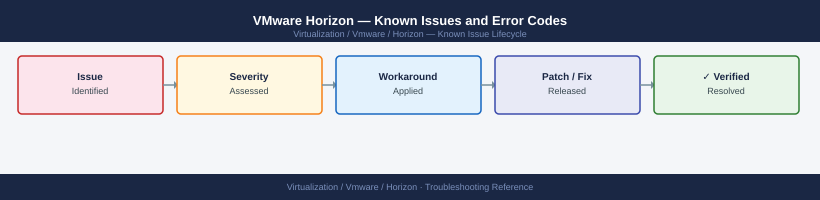

---
tags:
  - troubleshooting
  - horizon
  - vmware
  - known-issues
---
# VMware Horizon — Known Issues and Error Codes

<div class="kb-summary">
Catalog of known Horizon bugs, error codes, and workarounds covering Blast Extreme, PCoIP, Connection Server, and desktop pool issues.

*Applies to: Horizon 8.x (2111+)*
</div>



```d2
direction: down

symptom: Identify Symptom {shape: diamond}
connection_and_authentication: "Connection and Authentication" {shape: rectangle}
display_protocols: "Display Protocols" {shape: rectangle}
desktop_pools_and_provisioning: "Desktop Pools and Provisioning" {shape: rectangle}
connection_server: "Connection Server" {shape: rectangle}
resolution: Resolve or Escalate {shape: oval}

symptom -> connection_and_authentication: investigate
symptom -> display_protocols: investigate
symptom -> desktop_pools_and_provisioning: investigate
symptom -> connection_server: investigate
connection_and_authentication -> resolution
display_protocols -> resolution
desktop_pools_and_provisioning -> resolution
connection_server -> resolution
```

## Before you begin

- Horizon error codes appear in the Horizon Console event log and the Horizon Administrator → Events tab.
- Client-side error codes (e.g., `BLST_*`) are logged in `%APPDATA%\VMware\Horizon Client\logs\`.
- For Blast Extreme issues, collect `vmware-viewagent-*.log` from the desktop VM.

## Connection and Authentication

| Error / Symptom | Affected Versions | Cause | Workaround / Fix | Fixed In |
|---|---|---|---|---|
| `Error 1306` — Cannot connect to desktop | Horizon 8.x | Blast Extreme port 22443 blocked between client and UAG | Verify port 22443 TCP/UDP open on all firewalls between client and UAG | N/A |
| `Smart card authentication not working` | Horizon 8.x | Card reader driver not present in agent VM or smart card redirection disabled | Enable smart card redirection in pool policy; install middleware on agent | N/A |
| Repeated `Authenticating...` loop with SAML IdP | Horizon 8.x | SAML assertion clock skew >5 minutes | Sync NTP on Connection Server and IdP; ensure clocks match within 5 seconds | N/A |
| `Cannot connect — Connection Server unreachable` for remote clients | Horizon 8.x | UAG not configured or IP pool for Blast routing incorrect | Check UAG external URL configuration; verify Blast External URL matches client-facing address | N/A |

## Display Protocols

| Error / Symptom | Affected Versions | Cause | Workaround / Fix | Fixed In |
|---|---|---|---|---|
| Blast Extreme screen freezes after 30 seconds of inactivity | Horizon 2111 | Blast display timeout misconfiguration | Set `BlastReconnectInterval` in `blast.conf` on agent; or adjust GPO | 2203 |
| PCoIP session drops every 10 minutes | Horizon 8.x | PCoIP session timeout policy too aggressive | Increase `pcoip.disconnected_session_timeout_seconds` in group policy | N/A |
| USB redirection not working | Horizon 8.x | USB arbitrator service not running on agent | Start `VMware USB Arbitration Service` on agent VM | N/A |
| H.264 hardware decode not used on client | Horizon 8.x | Client GPU driver outdated or `H264.Enabled` policy not set | Update client GPU drivers; enable H.264 in Blast policy | N/A |

## Desktop Pools and Provisioning

| Error / Symptom | Affected Versions | Cause | Workaround / Fix | Fixed In |
|---|---|---|---|---|
| Instant clone pool fails provisioning: `CustomizationError` | Horizon 8.x | Sysprep timeout on slow storage | Increase customization timeout in pool advanced settings | N/A |
| `Agent unreachable` on newly provisioned instant clone | Horizon 8.x | DNS not resolving desktop FQDN | Ensure DHCP registers desktop hostname in DNS; verify DNS suffix | N/A |
| Desktop stuck in `Deleting` state | Horizon 8.x | vCenter task hung during VM deletion | Manually cancel vCenter task; run Connection Server refresh pools | N/A |

## Connection Server

| Error / Symptom | Affected Versions | Cause | Workaround / Fix | Fixed In |
|---|---|---|---|---|
| Connection Server event database fills disk | Horizon 8.x | Event archiving not configured | Enable event archiving to external DB; purge `event_data` table | N/A |
| JMS cluster split after network partition | Horizon 8.x | JMS (port 4001/4002) blocked between Connection Servers | Restore JMS connectivity; restart `VMware Horizon View Connection Server` service | N/A |

## See also

- [VMware Horizon — Common Issues](common-issues/)
- [VMware vCenter — Known Issues](../../vcenter/troubleshooting/known-issues.md)
