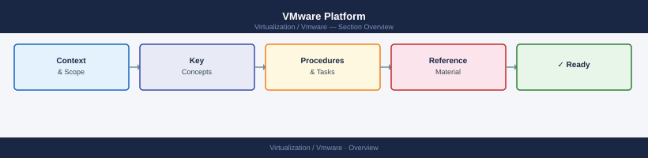

---
tags:
  - vmware
search:
  boost: 2
---
# VMware Platform

VMware platform knowledge base covering the full VMware stack — vCenter, ESXi, vSAN, NSX, VCF, VxRail, Horizon, SRM, vSphere Replication, and the Aria Suite. Includes architecture references, operational procedures, CLI commands, health checks, lifecycle management, and troubleshooting guides.

<a class="kb-card" href="vcenter/">
  <strong>vCenter</strong>
  Management control plane, inventory, RBAC, alarms, vLCM, and SSO.
</a>

<a class="kb-card" href="esxi/">
  <strong>ESXi</strong>
  Type-1 hypervisor, host configuration, networking, and storage.
</a>

<a class="kb-card" href="vsan/">
  <strong>vSAN</strong>
  Software-defined storage, disk groups, storage policies, and health.
</a>

<a class="kb-card" href="nsx/">
  <strong>NSX</strong>
  Software-defined networking, segments, gateways, and distributed firewall.
</a>

<a class="kb-card" href="vmware-cloud-foundation/">
  <strong>VMware Cloud Foundation</strong>
  Full SDDC stack delivery, SDDC Manager lifecycle, and workload domains.
</a>

<a class="kb-card" href="vxrail/">
  <strong>VxRail</strong>
  Dell HCI appliance, VxRail Manager, node expansion, and lifecycle.
</a>

<a class="kb-card" href="aria-operations/">
  <strong>Aria Operations</strong>
  Monitoring, alerting, capacity analytics, and vSAN dashboards.
</a>

<a class="kb-card" href="aria-operations-for-logs/">
  <strong>Aria Operations for Logs</strong>
  Log aggregation, analysis, and alerting across the VMware platform.
</a>

<a class="kb-card" href="aria-operations-for-networks/">
  <strong>Aria Operations for Networks</strong>
  Network visibility, flow analysis, and security posture across NSX and physical.
</a>

<a class="kb-card" href="aria-automation/">
  <strong>Aria Automation</strong>
  IaC blueprints, self-service catalogue, and cloud template deployment.
</a>

<a class="kb-card" href="aria-suite-lifecycle/">
  <strong>Aria Suite Lifecycle</strong>
  Lifecycle orchestrator for deploying, patching, and upgrading the Aria Suite.
</a>

<a class="kb-card" href="horizon/">
  <strong>Horizon</strong>
  Virtual desktop infrastructure, application publishing, and Connection Server.
</a>

<a class="kb-card" href="srm/">
  <strong>Site Recovery Manager</strong>
  DR orchestration, recovery plans, failover, and failback.
</a>

<a class="kb-card" href="vsphere-replication/">
  <strong>vSphere Replication</strong>
  VM replication to secondary sites, RPO configuration, and recovery.
</a>

<a class="kb-card" href="tanzu/">
  <strong>Tanzu</strong>
  Kubernetes workload domains, cluster provisioning, and container platform.
</a>

<a class="kb-card" href="powercli/">
  <strong>PowerCLI</strong>
  VMware PowerShell automation: module reference, scripts, health checks, RBAC, and vSphere API access.
</a>

<a class="kb-card" href="topics/">
  <strong>Topics</strong>
  Deep-dive references on cluster behavior, HA/DRS edge cases, storage latency, scenarios, and learning paths.
</a>

<a class="kb-card" href="internals/">
  <strong>Internals</strong>
  How vSphere works internally — cluster services, DRS scoring, HA math, VCHA, NSX data plane, vSAN health, certificate chain, vLCM, networking, and storage architecture.
</a>

<a class="kb-card" href="certifications/">
  <strong>Certifications</strong>
  VMware certification study notes — VCP-DCV, VCAP, exam tracking, practice notes, and review plans.
</a>

<a class="kb-card" href="operations/"><strong>Operations</strong>Cross-platform VMware operational procedures, health check sequences, and runbooks.</a>

<a class="kb-card" href="reference/">
  <strong>Reference</strong>
  Design decisions with rationale, operational gotchas, and licensing — edition structure, per-core pricing, and legacy migration.
</a>

