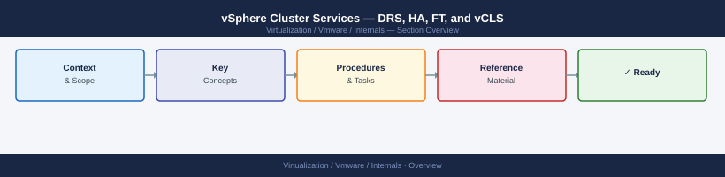
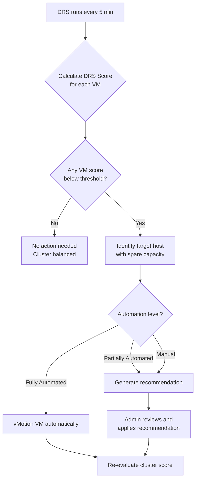

---
tags:
  - internals
  - vmware
---
# vSphere Cluster Services — DRS, HA, FT, and vCLS



vSphere cluster services are the group of features that collectively make a cluster of ESXi hosts behave as a resilient, self-managing compute platform. vSphere High Availability (HA), Distributed Resource Scheduler (DRS), Fault Tolerance (FT), and vSphere Cluster Services (vCLS) are complementary — each addresses a different failure scenario or resource management goal. Understanding how they interact is essential for both day-to-day administration and for the VCP-DCV 8 exam.

---

## Overview — How the Services Relate


| Feature | What it solves | Recovery time | Workload impact |
|---|---|---|---|
| HA | Host or VM failure | Minutes (VM restart) | Brief outage |
| DRS | Resource imbalance | None (live vMotion) | Zero (fully automated) |
| FT | Continuous availability | Zero (instant failover) | Small overhead always |
| vCLS | vCenter unavailability | N/A (preventive) | Minimal (agent VMs) |

> **VCP-DCV Exam Note:** HA and DRS are cluster-level settings configured on the cluster object in vCenter. FT is configured per VM. vCLS is automatic and cannot be completely disabled in vSphere 7.0+.

---

## vSphere HA

vSphere HA monitors ESXi hosts and VMs in a cluster and automatically restarts VMs on surviving hosts when a host fails. It is the foundational resilience feature for any vSphere cluster.

### Failure Detection — Heartbeats

HA uses two heartbeat mechanisms to determine whether a host has failed:

**Network heartbeats** — HA master host sends and receives heartbeats to/from slave hosts every second on the management network. If a slave misses heartbeats for a configurable period (default 10 seconds), the master declares it unreachable.

**Datastore heartbeats** — HA writes heartbeat data to datastores shared between hosts. This secondary mechanism differentiates between a host that is truly down and one that has lost its management network connection (isolation). HA selects up to two datastores automatically but you can pin specific datastores.

```text
Master Host
    │
    ├── Network heartbeat (every 1s) ──► Slave Host A  ✓ alive
    ├── Network heartbeat            ──► Slave Host B  ✗ no response
    │                                        │
    └───────────────────────────────────────────────────────────────────────────────────────────────────────┘
            If no datastore HB either → Host declared FAILED
            If datastore HB present   → Host ISOLATED (not failed)
```

### Admission Control

Admission control reserves cluster capacity to guarantee that HA can restart VMs after a host failure. vCenter will block VM power-ons that would exceed reserved capacity.

**Policy options:**

| Policy | How it works | Best for |
|---|---|---|
| Host failures cluster tolerates | Reserves capacity equivalent to N hosts | Homogeneous clusters |
| Percentage of cluster resources | Reserves X% of total CPU and memory | Mixed-size host clusters |
| Dedicated failover hosts | Named hosts held in reserve, not used for VMs | Regulatory requirements |

**Slot-based calculation (legacy, still tested):**

A slot = the worst-case VM resource demand in the cluster:
- Slot CPU = highest VM CPU reservation (or 256 MHz default)
- Slot Memory = highest VM memory reservation + memory overhead

Total slots = sum of slots available on all hosts. HA admission control uses this to enforce a minimum number of free slots.

> **VCP-DCV Exam Note:** The slot size is set by the LARGEST reservation across all VMs in the cluster. A single VM with a large reservation inflates the slot size and reduces available slots for all others. You can cap the slot size via an advanced HA setting (`das.slotCpuInMHz`, `das.slotMemInMB`).

### Restart Priority and VM Monitoring

**Restart priority** controls which VMs HA restarts first when host capacity is limited:

- Highest → High → Medium → Low → Disabled
- Disabled means HA will NOT restart that VM

**VM Monitoring** — HA can also restart individual VMs that have crashed (without the host failing):
- Monitors VMware Tools heartbeats from within the guest
- If heartbeats stop for a configurable period → VM restart
- **VM and Application Monitoring** — goes further; custom heartbeats from inside the application

### Network Partitions and Isolation Response

**Partition** — the cluster splits into two groups that cannot communicate with each other. Each partition elects its own master. VMs are managed by the master of their partition. This is not a failure state — it is a degraded state.

**Isolation** — a host can reach the datastore but not the management network. The host is alive but cut off.

**Isolation response** options:

| Setting | Behavior |
|---|---|
| Power off and restart VMs | VMs powered off immediately; master restarts them on other hosts |
| Shut down and restart VMs | Clean guest OS shutdown; takes longer |
| Leave powered on | VMs stay running on isolated host; risk of split-brain |

> **VCP-DCV Exam Note:** The default isolation response is "Leave powered on". This avoids unnecessary downtime if it is a transient network blip, but can cause split-brain if VMs are also restarted elsewhere. Change this to "Power off" or "Shut down" in environments where split-brain is unacceptable.

---

## vSphere DRS

DRS balances CPU and memory load across the hosts in a cluster by live-migrating (vMotion) VMs to less-loaded hosts. DRS runs every five minutes by default and applies a migration recommendation if the cluster imbalance exceeds the configured threshold.

### Automation Levels

| Level | What happens | Admin action required |
|---|---|---|
| Manual | DRS generates recommendations only | Admin must apply each recommendation |
| Partially Automated | DRS automatically places VMs at power-on; recommendations for running VMs | Admin applies running-VM recommendations |
| Fully Automated | DRS automatically places and migrates VMs | None |

> **VCP-DCV Exam Note:** "Partially Automated" only auto-places VMs at initial power-on. Once running, it still requires manual approval for migrations. Fully Automated is the recommended setting for most production clusters.

### DRS Score and Migration Threshold

**DRS Score** (vSphere 7.0+) — each VM is assigned a score from 1-100 representing how well its resource needs are being met on its current host. A score of 100 means ideal placement.

- Cluster DRS score = average of all VM DRS scores
- DRS tries to maximise the cluster score with each migration decision

**Migration threshold** — a slider from 1 (Conservative) to 5 (Aggressive):
- Conservative → DRS only moves VMs when the imbalance is severe (large benefit)
- Aggressive → DRS moves VMs for smaller improvements



### Affinity and Anti-Affinity Rules

**VM-VM rules** — define whether two VMs should run on the same host or different hosts:
- "Keep together" (affinity) — useful for latency-sensitive VM pairs
- "Separate" (anti-affinity) — used for HA pairs (e.g., two domain controllers should never be on the same host)

**VM-Host rules** — define which hosts a group of VMs can run on:
- "Must run on" — hard rule; DRS enforces it and HA respects it
- "Should run on" — soft rule; DRS tries to comply but HA can override on failover

> **VCP-DCV Exam Note:** Hard rules ("Must") are enforced even at the cost of leaving a VM powered off if no compliant host is available. Soft rules ("Should") are a preference — HA can violate them to restart a VM. Prefer soft rules unless there is a strict licensing or security requirement.

### Resource Pool Hierarchy

Resource pools allow you to partition cluster resources and apply them to groups of VMs. They sit in a tree below the cluster root resource pool.

```text
Cluster Root Pool
├── Production Pool  (High shares, 16 GHz reservation)
│   ├── Web VMs
│   └── DB VMs
├── Dev Pool         (Normal shares, no reservation)
│   └── Dev VMs
└── DMZ Pool         (Low shares, 100 MHz limit)
    └── Bastion VMs
```

**Resource pool attributes:**

| Attribute | Purpose |
|---|---|
| Shares | Relative priority when there is contention; Low/Normal/High or custom |
| Reservation | Guaranteed minimum CPU/memory; carved from parent pool |
| Limit | Hard cap; VM cannot use more even if resources are idle |
| Expandable reservation | Whether child pools can draw from parent's unreserved capacity |

> **VCP-DCV Exam Note:** Limits are dangerous on VMs because they prevent the VM from using idle host resources. Use limits on resource pools, not individual VMs, unless you have a specific reason. Reservations on child pools reduce the parent pool's available capacity even when not used.

### Proactive HA

Proactive HA integrates with hardware monitoring (via vSphere APIs for Health / IPMI) to detect degraded hardware (failed PSU, failing disk controller) before the host goes down. When degradation is detected, DRS evacuates VMs from that host before the failure occurs.

Requires:
- A monitoring solution that exposes hardware state via vCenter (e.g., Dell OMIVV, HP OneView)
- DRS Fully Automated or admin approval

---

## Fault Tolerance (FT)

FT provides zero-downtime protection for individual VMs by running a live shadow copy (secondary VM) on a separate host. If the primary host fails, the secondary takes over instantly with no VM restart.

### How vLockstep Works

```text
Primary Host                          Secondary Host
┌───────────────────────────────────────── ┐                 ┌ ─────────────────────────────────────────┐
│  Primary VM       │  FT Logging NIC │  Secondary VM                                                   │
│  (runs normally)  │ ─────────────── │  (mirrors primary)                                              │
│                   │ All CPU instr.  │                                                                 │
│  Executes + logs  │ + I/O + DMA     │  Replays log;                                                   │
│  all non-determ.  │ ──────────────► │  stays in sync                                                  │
│  events           │                 │                                                                 │
└───────────────────────────────────────────────────────────────────────────────────────────────────────┘
        │                                      │
        │  Primary host fails                  │
        ▼                                      ▼
  Secondary promoted instantly         New secondary found
  (zero restart, no data loss)         by HA on another host
```

vLockstep records all non-deterministic CPU events (timer interrupts, I/O completions) on the primary and replays them on the secondary, keeping both VMs in lock-step.

### FT Requirements and Limitations

| Requirement | Detail |
|---|---|
| Maximum vCPUs | 4 vCPUs per FT-protected VM |
| Maximum memory | 128 GB per FT-protected VM |
| Snapshots | Not supported on FT-protected VMs |
| Dedicated NIC | A dedicated 10 Gb NIC for FT logging traffic is strongly recommended |
| Storage | VM must not use physical RDMs |
| vSphere replication | Cannot be used alongside FT |
| vSAN | Supported |

> **VCP-DCV Exam Note:** FT does not support snapshots. If you need a snapshot, you must first disable FT, take the snapshot, then re-enable FT. This is a common exam distractor — FT and snapshots are mutually exclusive.

### FT vs HA — When to Use Each

| Scenario | Use HA | Use FT |
|---|---|---|
| Most production VMs | Yes | No (too much overhead) |
| Stateful transaction processing (payments, PBX) | No | Yes |
| Small, well-defined critical VM (≤4 vCPU) | No | Yes |
| Large VM (>4 vCPU or >128 GB RAM) | Yes | Cannot use FT |
| VMs requiring snapshots | Yes | No |
| Application-level clustering (Oracle RAC, WSFC) | Yes | Not needed |

---

## vSphere Cluster Services (vCLS)

vCLS was introduced in vSphere 7.0 Update 1 to decouple HA and DRS operation from vCenter availability. Before vCLS, if vCenter went offline, DRS stopped making placement decisions and HA could not perform new calculations — the cluster "coasted" on its last known state. vCLS solves this by running small agent VMs inside the cluster itself.

### Agent VMs

vCLS automatically deploys up to three small agent VMs per cluster (one per host, up to three). These VMs:
- Run on the cluster's datastores (selected automatically or configured manually)
- Provide the control plane services that DRS and HA need
- Cannot be managed like normal VMs (they are system VMs)
- Consume minimal resources (~1 vCPU, 128 MB RAM each)

```text
vCenter (may be offline)
         │
         │  Initial config only
         ▼
  ┌───────────────────────────────────────────────────────────────────────────────────────────────────────┐
  │           vSphere Cluster            │
  │                                      │
  │  ┌──────────┐ ┌──────────┐ ┌──────┐  │
  │  │ Host A   │ │ Host B   │ │ HostC│  │
  │  │          │ │          │ │      │  │
  │  │ [vCLS-1] │ │ [vCLS-2] │ │      │  │
  │  └──────────┘ └──────────┘ └──────┘  │
  │                                      │
  │  vCLS agents maintain HA/DRS         │
  │  even when vCenter is unavailable    │
  └───────────────────────────────────────────────────────────────────────────────────────────────────────┘
```

### Retreat Mode

If vCLS agent VMs cannot run (e.g., all datastores are unavailable), vCLS enters **retreat mode**. In retreat mode:

- DRS reverts to manual recommendations only (no automatic vMotions)
- HA **Optimal Placement** (the enhanced placement logic that uses DRS) is disabled
- Basic HA restart functionality continues to work
- The cluster still functions but at reduced capability

> **VCP-DCV Exam Note:** Retreat mode does NOT mean HA stops working. VMs still restart after host failures. What stops is DRS-driven optimisation and HA's use of DRS for initial placement (called "HA Optimal Placement"). The cluster degrades gracefully, it does not fail.

### Managing vCLS Agent VMs

You cannot delete vCLS VMs through normal vCenter UI actions — they are automatically re-created. To relocate them (e.g., to a specific datastore):

```text
vSphere Client:
  Cluster → Configure → vSphere Cluster Services → Datastores
  → Select allowed datastores for vCLS VMs
```

To temporarily disable vCLS (for troubleshooting only — not recommended in production):

```text
# Via vCenter MOB or PowerCLI — set the cluster's DAS config
# This is done via the cluster's advanced settings:
# das.ignoreRedundantNetWarning  ← unrelated
# vCLS disable is via cluster config UUID in ClusterConfigSpec
# Consult VMware KB 80565 for the supported procedure
```

> **VCP-DCV Exam Note:** Disabling vCLS entirely is an advanced troubleshooting step supported only via the cluster's configuration UUID. On the exam, know that vCLS agent VMs are system-managed, cannot be deleted through normal means, and exist to maintain HA/DRS independence from vCenter.

---

## Resource Pools — Detailed Reference

### Shares Explained

Shares only matter during contention. When the cluster has idle resources, all VMs get what they need regardless of shares. When resources are scarce:

```text
Pool A: High shares (4000)   → gets 4000/(4000+2000+1000) = 57% of contested resources
Pool B: Normal shares (2000) → gets 2000/7000 = 29%
Pool C: Low shares (1000)    → gets 1000/7000 = 14%
```

### Sample Resource Pool Configuration

```text
Cluster: PROD-CLUSTER-01
  Resource Pool: PROD-CRITICAL
    Shares: High
    CPU Reservation: 20 GHz
    CPU Limit: Unlimited
    Mem Reservation: 64 GB
    Mem Limit: Unlimited
    Expandable: No
    ├── VM: DB-01 (8 vCPU, 32 GB)
    └── VM: APP-01 (4 vCPU, 16 GB)

  Resource Pool: PROD-STANDARD
    Shares: Normal
    CPU Reservation: 0
    CPU Limit: Unlimited
    Mem Reservation: 0
    Mem Limit: Unlimited
    Expandable: Yes
    └── VM: WEB-01 (2 vCPU, 4 GB)

  Resource Pool: DEV
    Shares: Low
    CPU Reservation: 0
    CPU Limit: 8 GHz
    Mem Reservation: 0
    Mem Limit: 32 GB
    Expandable: Yes
    └── VM: DEV-01 (4 vCPU, 8 GB)
```

> **VCP-DCV Exam Note:** An Expandable Reservation on a child pool means it can borrow from its parent pool's unreserved capacity when its own reservation is exhausted. Setting Expandable to "No" strictly caps the child pool at its own reservation. The root resource pool's reservation is the total cluster capacity.

### Over-Commitment Risks

Over-committing CPU is usually acceptable (VMs rarely use 100% simultaneously). Over-committing **memory** is riskier because:
- ESXi must use balloon driver, swap, or transparent page sharing (TPS) to reclaim memory
- Ballooning causes guest OS pressure and can trigger swap-to-disk in the guest
- Swap-to-disk in the hypervisor (host-level swap) causes severe I/O latency

Always monitor the cluster memory utilization metric `mem.usage.average` and the balloon/swap counters in vCenter performance charts.

---

## HA vs DRS vs FT — Use Case Comparison

| Scenario | HA | DRS | FT |
|---|---|---|---|
| Host loses power unexpectedly | Restarts VMs on surviving hosts | Cannot prevent failure | Secondary takes over instantly |
| Cluster is imbalanced (one host at 90% CPU) | No action | Migrates VMs to less-loaded host | No action |
| VM OS crashes or hangs | VM Monitoring restarts VM | No action | No action (secondary also in same state) |
| Host hardware degrades (PSU failure) | Reacts after failure | Proactive HA evacuates before failure | Secondary takes over if primary fails |
| Need zero RPO and zero RTO | Not sufficient | Not applicable | Yes, this is FT's purpose |
| Application uses multiple large VMs | Yes | Yes | Cannot (max 4 vCPU per FT VM) |
| vCenter goes offline | Continues (vCLS maintains) | Continues (vCLS maintains) | Continues independently |

---

## Quick Reference — Key Settings and Defaults

| Setting | Default | Location |
|---|---|---|
| HA heartbeat interval | 1 second | Fixed |
| HA host failure declaration time | 10 seconds | `das.failureDetectionTime` advanced option |
| DRS run interval | 5 minutes | Fixed |
| DRS migration threshold | 3 (middle) | Cluster DRS settings |
| FT max vCPU | 4 | Fixed (product limit) |
| FT max RAM | 128 GB | Fixed (product limit) |
| vCLS agent VMs per cluster | Up to 3 | Automatic |
| HA isolation response default | Leave powered on | Cluster HA settings |
| Admission control default policy | Host failures cluster tolerates: 1 | Cluster HA settings |
