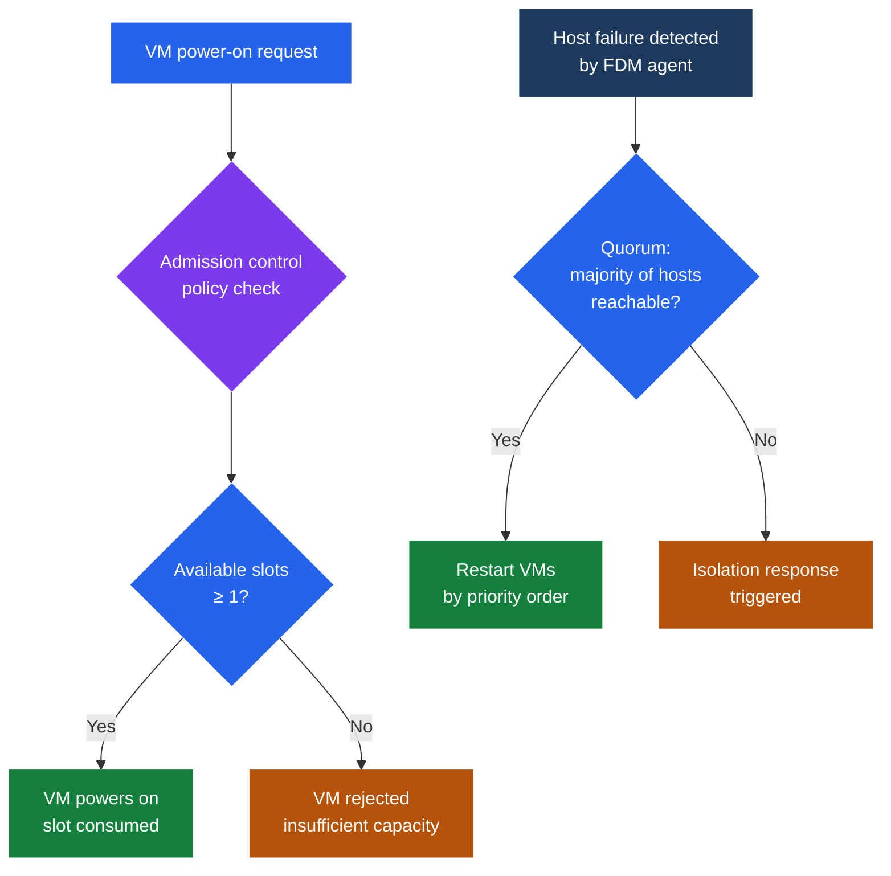

---
tags:
  - internals
  - vmware
---
# HA Deep Dive

<div class="kb-summary">
vSphere HA uses slot-based or percentage-based admission control to guarantee capacity for VM restarts after host failure. Restart priority, network isolation response, and APD/PDL handling are configurable per cluster.
</div>



## Slot-Based Admission Control

A **slot** is the atomic unit of capacity reserved per potential host failure. HA calculates slot size from the highest reservations in the cluster.

**Slot size formula:**

```text
CPU slot size  = max(all VM CPU reservations)  OR  default 32 MHz if no reservations set
Memory slot size = max(all VM memory reservations + per-VM memory overhead)  OR  default 0 MB + overhead
```

Memory overhead is VMkernel-computed per VM based on vCPU count, memory size, and VMX settings — not configurable by the admin but visible in VM advanced settings.

**Available slots per host:**

```text
CPU slots per host    = floor(host total CPU MHz / CPU slot size)
Memory slots per host = floor(host total memory MB / memory slot size)
Slots per host        = min(CPU slots per host, memory slots per host)
```

**Cluster available slots:**

```text
Total slots = sum of slots across all hosts
Failover slots reserved = slots on N largest hosts (where N = configured failover host count)
Available slots = total slots − failover slots reserved
```

### Slot Math Worked Example

Cluster: 4 hosts × 32 GHz CPU, 256 GB RAM each. 100 VMs; largest CPU reservation = 2000 MHz; average VM memory overhead = 250 MB; no memory reservations set.

```text
CPU slot size  = 2000 MHz
Mem slot size  = 0 MB + 250 MB (overhead) = 250 MB

CPU slots per host  = floor(32,000 / 2000) = 16
Mem slots per host  = floor(256,000 / 250) = 1024
Slots per host      = min(16, 1024) = 16   ← CPU-constrained

Total slots         = 4 × 16 = 64
Failover (1 host)   = 16
Available slots     = 64 − 16 = 48
```

With 100 VMs and only 48 available slots, HA cannot power on all VMs if a host fails (48 < 100). To fix: lower the CPU reservation on the largest VM, or switch to percentage-based admission control.

## Resource Fragmentation Problem

If a single VM has a disproportionately large CPU reservation (e.g., 8000 MHz for a database VM), the slot size bloats across the entire cluster:

```text
CPU slot = 8000 MHz
CPU slots per 32 GHz host = floor(32,000 / 8000) = 4 per host
4 hosts × 4 slots = 16 total slots
Failover (1 host) = 4
Available = 12 slots for 100 VMs → immediate admission control failure
```

**Resolution options:**
- Use percentage-based admission control (avoids slot fragmentation entirely).
- Remove the large reservation and rely on shares/limits instead.
- Create a specific failover host policy for the DB VM using VM-level HA settings.

## Admission Control Policies

| Policy | Mechanism | Best for |
|--------|-----------|----------|
| Cluster resource percentage | Reserve X% of cluster CPU and memory | Most clusters; avoids slot fragmentation |
| Slot-based (legacy) | Slot calculation as above | Homogeneous clusters with consistent reservations |
| Dedicated failover hosts | Specific hosts reserved exclusively for failover | Compliance requirements; DR standby hosts |
| Disabled | No admission control | Dev/test only; production not recommended |

**Percentage policy**: HA computes cluster totals, subtracts the configured percentage, and uses the remainder as the usable pool. No slot calculation. Recommended for heterogeneous clusters or clusters with wide reservation variance.

## HA Restart Priority

When HA restarts VMs after a host failure, it processes VMs in priority order:

| Priority | Label | Behavior |
|----------|-------|----------|
| 0 | Disabled | HA does not restart this VM |
| 1 | Lowest | Last to be restarted |
| 2 | Low | After medium and high |
| 3 | Medium (default) | Standard restart ordering |
| 4 | High | Restarted before medium and low |
| 5 | Highest | First to be restarted; used for critical infra VMs |

**Restart ordering with dependencies:**
VM-VM restart dependencies can be configured via **VM Overrides → VM Dependencies**. HA waits for a prerequisite VM to heartbeat before restarting dependent VMs. Use this for: database before application server, AD before file server.

**Restart process per VM:**
1. HA selects target host using admission control (checks available capacity).
2. VM registered on target host.
3. VM powered on.
4. VMware Tools heartbeat monitored (if configured); VM marked "ready" when heartbeat received.
5. Next dependent VM in restart chain released.

## Network Isolation Response

A host becomes **isolated** when it loses management network connectivity to all other hosts but is still running VMs.

| Isolation response | Behavior | Recommended use |
|--------------------|----------|----------------|
| Leave powered on (default) | VMs continue running on isolated host | Preferred; avoids double-restart if network recovers |
| Power off | VMs immediately powered off | Use when storage path loss accompanies isolation |
| Shut down (graceful) | VMware Tools-initiated guest shutdown | Use when data integrity on shutdown matters |

HA uses **datastore heartbeats** as a secondary isolation detection mechanism. If a host loses management network but can still write to a heartbeat datastore, it is considered isolated (not failed). HA waits to restart VMs until isolation is confirmed via both network and datastore heartbeat loss.

## APD vs PDL

Storage path loss has two distinct states with different HA behaviors:

| State | Name | Trigger | HA response |
|-------|------|---------|-------------|
| APD | All Paths Down (transient) | Storage not responding but not confirmed dead | Wait for APD timeout (default 140 s); then optional VM restart |
| PDL | Permanent Device Loss | Storage controller sends SCSI sense code confirming device gone | Immediate VM restart on surviving hosts; do not wait |

**APD configuration:**
- `das.config.fdm.apd.timeoutSec` — default 140 s; time HA waits in APD before acting.
- `das.config.fdm.apd.vmsToProtect` — which VMs to restart on APD timeout (none, conservative, aggressive).

**PDL configuration:**
- `das.config.fdm.pdl.vmsToProtect` — which VMs to restart immediately on PDL (none, conservative, aggressive).

## HA Events and Triggers Reference

| Event | Trigger | HA action |
|-------|---------|-----------|
| Host failure | FDM loses heartbeat from host; no datastore heartbeat | Restart all VMs from failed host |
| Host isolation | Management network lost; datastore heartbeat present | Apply isolation response per policy |
| Network partition | Cluster splits into two groups, each with majority | Dominant partition manages VMs; minority awaits |
| VM failure | VMware Tools heartbeat lost; VM OS crashed | Restart VM if VM monitoring enabled |
| APD timeout | Storage APD exceeds configured timeout | Restart VMs per APD protection policy |
| PDL detected | Storage returns PDL SCSI sense code | Restart VMs immediately per PDL policy |
| Admission control violation | Insufficient capacity to restart all VMs | HA logs warning; restarts highest-priority VMs first |

---

## See also

- [DRS Mechanics — Internals](../drs-mechanics/)
- [Cluster Services — Internals](../cluster-services/)
- [Scenarios — VM Inaccessible / HA Failover](../../topics/scenarios/vm-inaccessible-ha-failover/)
