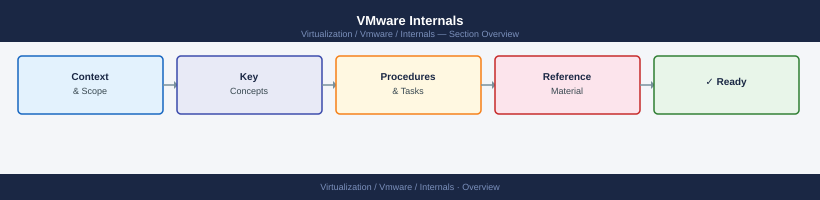

---
tags:
  - internals
  - vmware
---
# VMware Internals

Deep-dive articles on how core vSphere components work internally — cluster services, compute scheduling, networking, storage, security, lifecycle, and cross-product mechanisms. Use these pages to build the mental model before working on procedures or troubleshooting.

*Applies to: vSphere 7.x / 8.x*

<a class="kb-card" href="cluster-services/">
  <strong>Cluster Services</strong>
  DRS, HA, FT, and vCLS — how vSphere cluster services interact and when each applies.
</a>

<a class="kb-card" href="vsphere-lifecycle/">
  <strong>vSphere Lifecycle</strong>
  vLCM, patch baselines, firmware management, and the ESXi host upgrade flow.
</a>

<a class="kb-card" href="vsphere-monitoring/">
  <strong>vSphere Monitoring</strong>
  Performance charts, alarms, events, and integration with Aria Operations.
</a>

<a class="kb-card" href="vsphere-networking/">
  <strong>vSphere Networking</strong>
  vSS vs vDS, portgroups, uplinks, MTU, and network I/O control concepts.
</a>

<a class="kb-card" href="vsphere-permissions/">
  <strong>vSphere Permissions</strong>
  RBAC model, roles, privileges, permission propagation, and SSO identity sources.
</a>

<a class="kb-card" href="vsphere-resource-management/">
  <strong>Resource Management</strong>
  CPU/memory reservations, limits, shares, resource pools, and admission control.
</a>

<a class="kb-card" href="vsphere-security/">
  <strong>vSphere Security</strong>
  ESXi lockdown mode, encrypted VMs, TLS policy, and certificate management concepts.
</a>

<a class="kb-card" href="vsphere-storage/">
  <strong>vSphere Storage</strong>
  VMFS, NFS, vVols, storage policies, SPBM, and datastore cluster concepts.
</a>

<a class="kb-card" href="vcha-internals/">
  <strong>vCenter HA Internals</strong>
  3-node topology, DB replication, failover triggers, split-brain prevention, RTO tuning.
</a>

<a class="kb-card" href="drs-mechanics/">
  <strong>DRS Mechanics</strong>
  Imbalance scoring, migration priority bands, predictive DRS, initial placement, EVC edge cases.
</a>

<a class="kb-card" href="ha-deep-dive/">
  <strong>HA Deep Dive</strong>
  Slot calculation math, admission control policies, restart priority, APD vs PDL, isolation response.
</a>

<a class="kb-card" href="vsphere-networking-internals/">
  <strong>Networking Internals</strong>
  DVS architecture, PVLAN, NIOC traffic pools, LBT/LACP teaming, VMkernel adapters, CDP/LLDP.
</a>

<a class="kb-card" href="vsan-cluster-health/">
  <strong>vSAN Cluster Health</strong>
  Component state machine, rebuild triggers, resync throttle, disk group failure domains, proactive rebalance.
</a>

<a class="kb-card" href="certificate-chain/">
  <strong>Certificate Chain</strong>
  VMCA hierarchy, STS signing cert, custom CA / hybrid mode, VECS stores, renewal order, STS recovery.
</a>

<a class="kb-card" href="nsx-data-plane/">
  <strong>NSX Data Plane</strong>
  N-VDS, TEP, Geneve encapsulation, BFD, Distributed Router fast path, DFW, Edge N-S topology.
</a>

<a class="kb-card" href="vlcm-mechanics/">
  <strong>vLCM Mechanics</strong>
  Image vs baseline, cluster image drift, depot types, rolling remediation, vendor add-ons, staging.
</a>

