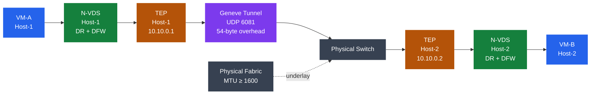

---
tags:
  - internals
  - nsx
  - nsx-4
  - vmware
---
# NSX Data Plane

NSX-T data plane consists of per-host kernel modules — N-VDS, Distributed Router, and Distributed Firewall — connected via Geneve-encapsulated tunnels between TEPs. Edge nodes handle N-S traffic. All forwarding is in fast path, bypassing the host TCP/IP stack.

*Applies to: vSphere 7.x / 8.x*

## N-VDS: NSX Virtual Distributed Switch

N-VDS (NSX-managed Virtual Distributed Switch) is a per-host kernel module that replaces VDS uplinks for NSX-managed traffic.

| Component | Location | Function |
|-----------|----------|----------|
| `nsx-vswitch` kernel module | Each ESXi/KVM host | Data-plane forwarding; replaces VDS for overlay traffic |
| N-VDS config | Pushed from NSX Manager | Port group, uplink, and TEP configuration |
| Host TEP adapter | VMkernel on N-VDS | Originates/terminates Geneve tunnels |
| Uplink profiles | NSX Manager | Teaming policy, active/standby uplinks, MTU, VLAN for TEP |

**VDS as N-VDS (NSX 3.2+):**
From NSX 3.2, VDS version 7.0 can act as the N-VDS without migrating vmnics. The NSX datapath module overlays the VDS. This preserves existing VDS port group configurations and reduces migration risk.

## TEP: Tunnel Endpoint

Each transport node (ESXi host or Edge node) has one or more TEP IP addresses used as tunnel source/destination.

**TEP requirements:**

| Requirement | Value |
|-------------|-------|
| TEP VLAN | Dedicated VLAN; separate from management and VM VLANs |
| IP addressing | Static or DHCP; static strongly recommended for ESXi hosts |
| MTU | Physical fabric must support at least 1600 bytes (TEP VLAN interface to interface) |
| Routing | TEPs must be L3-routable to each other (same subnet or routed across racks) |
| BFD | Enabled by default between TEP pairs for sub-second failure detection |

TEP IP is assigned to the VMkernel adapter created during host transport node preparation. Multiple TEPs per host (multi-TEP) are supported for uplink redundancy; each uplink can have its own TEP IP.

## Geneve Encapsulation

NSX uses Geneve (Generic Network Virtualization Encapsulation, RFC 8926) for overlay tunnels.

**Encapsulation overhead breakdown:**

| Header | Size |
|--------|------|
| Outer Ethernet header | 14 bytes |
| Outer IP header | 20 bytes |
| Outer UDP header | 8 bytes |
| Geneve header + VNI | 12 bytes |
| **Total overhead** | **54 bytes** |

With a standard 1500-byte inner frame, the outer frame is 1554 bytes. Physical fabric MTU must be ≥ 1600 bytes on all paths between TEPs (allowing headroom for Q-in-Q or MPLS labels in some fabrics).

**Geneve VNI (Virtual Network Identifier):**
- 24-bit field — supports up to 16 million logical segments.
- Maps to NSX Segment (logical switch) ID; determines which segment a frame belongs to after decapsulation.

## BFD: Bidirectional Forwarding Detection

BFD detects TEP-to-TEP path failures in sub-second time, enabling fast reroute via the remaining active uplink or TEP.

| Parameter | Default | Notes |
|-----------|---------|-------|
| BFD timer (min interval) | 500 ms | Time between BFD control packets |
| BFD multiplier | 3 | Number of missed packets before declaring failure |
| Effective dead-time | ~1.5 s | 3 × 500 ms |
| BFD mode | Asynchronous | Both endpoints send; either can declare failure |

BFD sessions are established per TEP pair; if a physical link fails, BFD detects the failure in ~1.5 s and N-VDS reroutes to the standby uplink.

## Distributed Router (DR)

The Distributed Router is a per-host kernel module implementing first-hop routing for east-west VM traffic.

**DR characteristics:**

| Characteristic | Value |
|----------------|-------|
| Forwarding mode | Fast path (kernel data path; no user-space context switch) |
| Location | Per-host; instantiated when a VM on that host belongs to the connected segment |
| E-W routing | VM-A → DR on Host-1 → Geneve tunnel → DR on Host-2 → VM-B; no Edge node involved |
| Routing table | Populated by NSX Manager from logical topology; each host has an identical copy |
| ARP suppression | DR answers ARP locally using ARP/ND suppression table; suppresses broadcast |
| Connected routes | Each logical segment subnet is a directly connected route in the DR |

ARP suppression reduces broadcast overhead in large segments by having the DR answer ARP requests locally without flooding to all hosts.

## Edge Nodes: N-S Traffic

Edge nodes handle traffic that must leave the NSX overlay — northbound to physical network, internet, or external services.

| Edge function | Description |
|---------------|-------------|
| BGP/OSPF peering | Edge Tier-0 gateway peers with physical routers; redistributes NSX routes |
| NAT | Source NAT (SNAT) for VM outbound; destination NAT (DNAT) for inbound |
| Load Balancer | Layer 4 (TCP/UDP) and Layer 7 (HTTP/HTTPS) load balancing |
| VPN | IPsec site-to-site; L2 VPN for extending segments to remote sites |
| Tier-0 SR (Service Router) | Centralized services run on Edge; N-S traffic always hairpins through Edge |

Edge nodes are deployed as VMs or bare-metal appliances and configured as **Edge Transport Nodes** in NSX. Multiple Edges form an **Edge Cluster** for redundancy; Tier-0 active-active or active-standby failover across Edge cluster members.

## DFW: Distributed Firewall

The Distributed Firewall is a stateful, kernel-level per-vNIC firewall implemented in fast path.

| Characteristic | Value |
|----------------|-------|
| Enforcement point | Per-vNIC on source host; traffic is inspected before leaving the vNIC |
| State | Stateful connection tracking (TCP, UDP, ICMP); connection table maintained per host |
| Scale | Up to 100,000 rules per cluster (aggregate across all DFW instances) |
| Rule categories | Ethernet, Emergency, Infrastructure, Environment, Application (processed in order) |
| Grouping | Workloads grouped by Security Group (tags, IP sets, VM names, logical port criteria) |
| Fast path | Kernel data-path module; no context switch to user space for rule evaluation |

**DFW rule processing order:**
Rules are evaluated top-to-bottom within each category. Category order (highest to lowest priority):
1. Ethernet (Layer 2)
2. Emergency (high-priority block rules)
3. Infrastructure (management traffic allow)
4. Environment (zone-to-zone rules)
5. Application (micro-segmentation rules)
6. Default (default allow or deny at bottom)

## NSX Component Reference

| Component | Layer | Per-host or centralized | Failure domain |
|-----------|-------|------------------------|----------------|
| N-VDS | Data plane (L2) | Per-host | Host — failure takes N-VDS offline for that host only |
| TEP | Tunnel endpoint (L3) | Per-host | Host — TEP loss isolates that host's overlay traffic |
| Distributed Router (DR) | Data plane (L3) | Per-host | Host — E-W routing for VMs on that host |
| Distributed Firewall (DFW) | Data plane (L4–L7) | Per-host (per-vNIC) | vNIC — DFW failure isolated to individual VM connection |
| NSX Manager | Control + management plane | 3-node cluster | Manager node — cluster tolerates one node failure |
| Edge Transport Node | Service plane (NAT/BGP/LB/VPN) | Per-Edge VM/BM | Edge node — Edge cluster provides failover |
| Tier-0 SR | Service Router | Per-Edge node | Edge node — active-standby or active-active per cluster |
| Tier-1 DR | Distributed Router (Tier-1) | Per-host | Host — instantiated per host with connected VMs |
