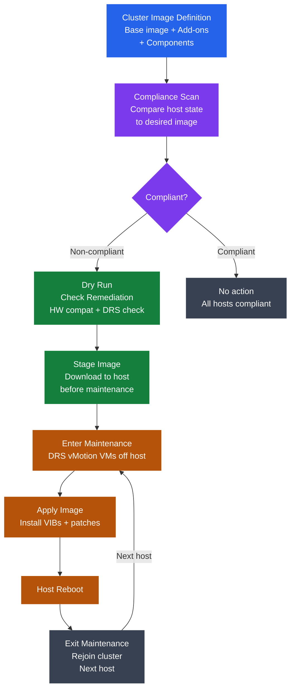

---
tags:
  - internals
  - vmware
---
# vLCM Mechanics

<div class="kb-summary">
vSphere Lifecycle Manager (vLCM) introduces image-based management as the replacement for VUM baselines. A cluster image defines the complete ESXi software bill of materials; drift detection, compliance scanning, and rolling remediation are coordinated with DRS for zero-disruption patching.

*Applies to: vSphere 7.x / 8.x*
</div>



## Image-Based vs Baseline-Based Management

| Aspect | vLCM Image (recommended) | VUM Baseline (legacy) |
|--------|--------------------------|----------------------|
| Scope | Complete ESXi software bill of materials | List of patches/extensions |
| Consistency | All hosts in cluster run identical software | Hosts may diverge on add-on versions |
| Vendor add-ons | Integrated as versioned components in image | Separate extension baselines; harder to coordinate |
| Drift detection | Per-host diff against desired image | Compliance scan against baseline attach |
| Air-gap support | UMDS or manual depot import | UMDS or manual download |
| Migration path | One-way: switch cluster to image management; cannot revert to baselines | Available in all vSphere versions |

A cluster can be managed by vLCM image OR VUM baselines — not both simultaneously. Switching to image management is done at the cluster level in **Cluster → Updates → Image**.

## Cluster Image Components

A vLCM cluster image has four layers:

| Layer | Description | Example |
|-------|-------------|---------|
| Base image | VMware ESXi ISO; specifies exact ESXi version and build number | ESXi 8.0 Update 2 build 23305546 |
| Add-ons | OEM vendor bundles containing multiple VIBs | Dell VxRail add-on 8.0.212, HPE OEM add-on |
| Vendor add-ons | Additional OEM-specific drivers or firmware tools | Dell OpenManage, HPE AMS/CIM provider |
| Components | Individual VIBs, drivers, or NSX/vSAN VIBs | nsx-vswitch 4.1.0.2, vSAN witness component |

The image is a declarative specification. vLCM resolves compatibility between all layers before allowing remediation.

## Depot Configuration

vLCM downloads image content from configured depots.

| Depot type | Configuration | Use case |
|-----------|--------------|----------|
| Remote depot (My VMware) | Default; requires outbound HTTPS to vmwaresaas.com | Internet-connected environments |
| UMDS (Update Manager Download Service) | On-prem proxy downloads from VMware, exposes local depot | Partially air-gapped; single external connection |
| Local depot | Admin uploads content manually (ZIP/depot bundles) | Fully air-gapped environments |
| OEM depot | Vendor-hosted; added as custom depot URL | Dell, HPE, Cisco add-on bundles |

```powershell
# PowerCLI: list configured depots
Get-DeployRuleSet  # not applicable; use vCenter UI or REST API for depot management
```

Depot configuration: **vCenter → Lifecycle Manager → Settings → Patch Setup → Add depot**.

## Compliance Scan and Drift Detection

A compliance scan compares the installed software on each host against the cluster image definition.

**Scan output per host:**

| Status | Meaning |
|--------|---------|
| Compliant | Host matches cluster image exactly |
| Non-compliant | One or more components differ from image (version mismatch, missing component, extra component) |
| Incompatible | Host hardware does not support the image (driver missing, HW not on HCL) |
| Unknown | Scan has not run or host is not connected |

Scans run automatically on a schedule (default daily) and on-demand. Force a scan: **Cluster → Updates → Hosts → Check Compliance**.

## Remediation Coordination with DRS

vLCM uses DRS to evacuate VMs before putting a host into maintenance mode:

1. vLCM signals DRS to evacuate the target host.
2. DRS vMotions all running VMs to other cluster hosts (respects DRS rules, reservations, and anti-affinity constraints).
3. Host enters maintenance mode; vSAN resync (if applicable) completes or is deferred.
4. vLCM stages and applies the image.
5. Host reboots.
6. Host exits maintenance mode; DRS may rebalance VMs back.

**Failure during remediation:**
If DRS cannot evacuate all VMs (e.g., anti-affinity prevents it, admission control violation), vLCM pauses and reports the error. Admin must resolve the blocking condition before retrying.

## Rolling Remediation

By default, vLCM remediates one host at a time (sequential). Parallelism is configurable:

```text
Cluster → Updates → Settings → Remediation → Max concurrent hosts
```

| Setting | Behavior | Risk |
|---------|----------|------|
| 1 (default) | Sequential; safest | Longer total window |
| 2–3 | Parallel; faster | Less cluster capacity during remediation |
| All at once | Entire cluster simultaneously | Not recommended; HA cannot protect if cluster is in MM |

HA admission control limits parallelism automatically: if putting N hosts into maintenance would violate admission control, vLCM will not proceed beyond N−1 hosts concurrently.

## Staging

Staging downloads the image to the host's local storage before the maintenance window. During the actual maintenance window, only installation and reboot occur — no download needed.

```bash
# Staging reduces maintenance window duration
# Stage: downloads ESXi image bits to /scratch on host
# Apply: installs staged image; much faster
```

Staging is optional but strongly recommended for large base image updates (full ESXi ISO). Incremental updates (patch-only) are small enough that staging provides minimal benefit.

**Configure staging:**
Enable **Pre-stage image** toggle in the remediation wizard, or set it as a cluster default in **Cluster → Updates → Settings → Remediation → Stage patches/extensions before remediation**.

## Dry Run: Check Remediation

Before applying changes, run a dry-run check: **Cluster → Updates → Hosts → Check Remediation**.

The check validates:

| Check | What it verifies |
|-------|----------------|
| Hardware compatibility | All host hardware is on HCL for the target image version |
| VIB acceptance level | No VIBs in the image below cluster's minimum acceptance level |
| DRS adequacy | DRS can evacuate each host without violating admission control |
| vSAN compliance | vSAN configuration will remain valid post-upgrade |
| Cluster resource headroom | Enough CPU/memory to absorb evacuated VMs |
| NSX compatibility | N-VDS and NSX versions compatible with new ESXi version |

Fix all issues reported by Check Remediation before starting the actual remediation.

## Vendor Add-On Compatibility

Vendor add-ons (OEM bundles) must be explicitly tested and certified against the target ESXi base image version. This is the most common source of remediation failures on OEM hardware.

| Scenario | Symptom | Resolution |
|----------|---------|-----------|
| Add-on not certified for target ESXi version | vLCM blocks remediation with compatibility error | Upgrade vendor add-on to certified version, or wait for certification |
| Add-on not in depot | vLCM cannot download component | Add vendor depot URL or manually import add-on bundle |
| Multiple add-ons conflict | VIB dependency conflict between add-ons | Contact vendor; may require one add-on to be updated |
| ESXi base image newer than add-on max support | Compatibility matrix violation | Downgrade target ESXi version or use newer add-on |

Dell VxRail clusters use the VxRail Manager to compose the cluster image — do not modify the VxRail-managed cluster image directly via vLCM.

## Key vLCM Terms

| Term | vLCM equivalent | VUM/legacy equivalent |
|------|----------------|----------------------|
| Cluster image | Desired software state for the cluster | N/A (no cluster-level concept in VUM) |
| Base image | ESXi installer ISO version | ESXi patch baseline |
| Add-on | OEM bundle (multiple VIBs + metadata) | Host extension baseline |
| Component | Individual VIB | Individual patch/bulletin |
| Depot | Content repository | VUM download source |
| Staging | Pre-download to host | Patch download stage in VUM |
| Compliance scan | Check against cluster image | Scan against attached baselines |
| Remediation | Apply image to host | Remediate against baselines |
| Dry run | Check Remediation pre-flight | Pre-check in VUM remediation wizard |
| UMDS | Update Manager Download Service | Update Manager Download Service (same concept) |
