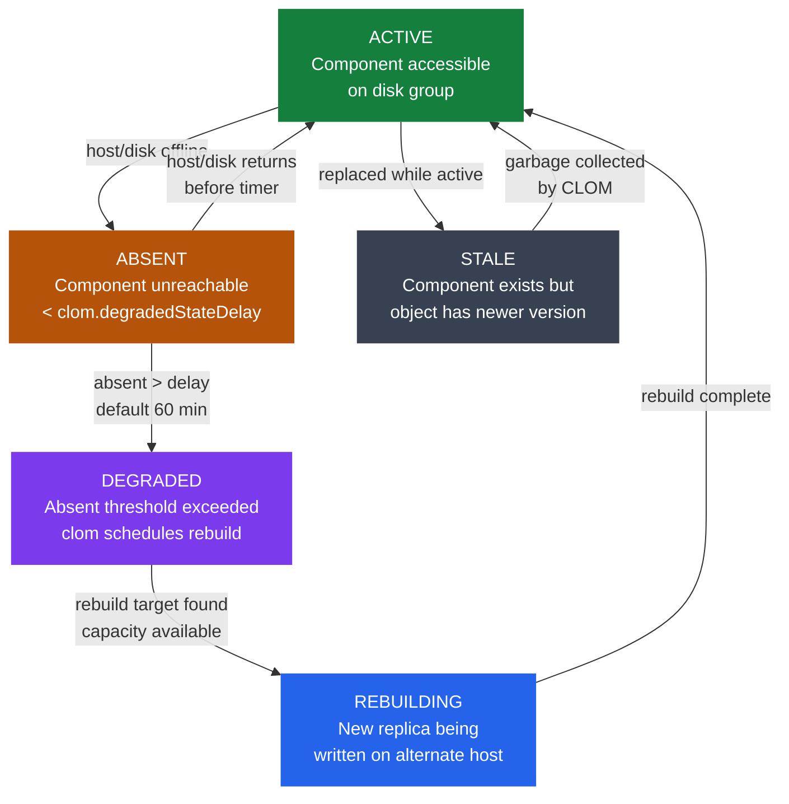

---
tags:
  - internals
  - vmware
  - vsan
  - vsphere-8
---
# vSAN Cluster Health

<div class="kb-summary">
vSAN health is tracked at the component level through a state machine: ACTIVE → ABSENT → DEGRADED → REBUILDING → ACTIVE. CLOM manages rebuild scheduling; resync throttle and proactive rebalance are tunable for operational control.

*Applies to: vSphere 7.x / 8.x*
</div>



## Health Checks Taxonomy

vSAN Health Service categorizes checks across five domains, accessible via **vSAN → Monitor → Health Service**:

| Domain | Example checks | Action on failure |
|--------|---------------|-------------------|
| Hardware compatibility | HCL compliance, driver version, firmware version | Update driver/firmware or replace hardware |
| Network | MTU consistency, multicast connectivity, vmknic configuration | Fix MTU mismatch, check switch multicast config |
| Data | Object health, component health, resync status | Rebuild degraded objects, expand capacity |
| Performance | Latency, throughput, IOPS per disk group | Identify hot disks, rebalance, add capacity |
| Limits | Host count, disk count, object count vs. maximums | Scale out or redistribute objects |

All health check results are also available via PowerCLI:

```powershell
Get-VsanCluster | Get-VsanHealthSummary
Get-VsanCluster | Get-VsanHealthSummary -FetchFromCache:$false  # force refresh
```

## Component State Machine

Each vSAN object (VMDK, swap, namespace) is decomposed into **components** distributed across disk groups according to the storage policy (e.g., FTT=1 with RAID-1 = 2 data components + 1 witness).

| State | Meaning | Object accessibility |
|-------|---------|---------------------|
| ACTIVE | Component on-disk and accessible | Object fully accessible if quorum met |
| ABSENT | Component host or disk temporarily offline | Object accessible if quorum met; watch timer |
| DEGRADED | ABSENT exceeded `clom.degradedStateDelay`; CLOM rebuilding | Object accessible but not fully protected |
| REBUILDING | New component being written on alternate disk group | Object accessible; protection restoring |
| STALE | Component replaced; old copy pending GC | Not part of active quorum; will be deleted |

**Quorum rule**: a vSAN object is accessible when more than 50% of its votes are from ACTIVE or ABSENT (within delay) components. The witness component counts as 1 vote to break ties.

## Rebuild Trigger: `clom.degradedStateDelay`

CLOM (Cluster Level Object Manager) monitors component absence and triggers rebuild after the configurable delay:

```bash
# View current setting (per-host; check on one host)
esxcli system settings advanced list -o /VSAN/ClomRepairDelay

# Change delay to 30 minutes (value in minutes)
esxcli system settings advanced set -o /VSAN/ClomRepairDelay -i 30
```

| Parameter | Default | Range | Notes |
|-----------|---------|-------|-------|
| `ClomRepairDelay` | 60 min | 0–1440 min | 0 = immediate rebuild; 1440 = 24 h delay |

Setting a shorter delay increases rebuild traffic but reduces exposure window. Setting a longer delay is appropriate when hosts undergo scheduled maintenance within the delay period.

## Resync Throttle

Rebuild and rebalance operations compete for disk and network I/O with VM workloads. Throttle resync via:

```bash
# View current resync IOPS limit
esxcli vsan cluster get | grep -i resync

# Set resync IOPS limit to 1000 IOPS (0 = unlimited)
esxcli vsan cluster set --resync-iops-limit 1000

# Per host via advanced config
esxcli system settings advanced set -o /VSAN/ResyncIopsLimit -i 1000
```

| Setting | Default | Recommended during production peak |
|---------|---------|-------------------------------------|
| ResyncIopsLimit | 0 (unlimited) | 500–2000 IOPS depending on workload sensitivity |

Monitor resync progress in **vSAN → Monitor → Resyncing Objects** or:

```bash
esxcli vsan debug object list | grep -i resync
```

## Object Health Inspection

Inspect per-object component placement and health:

```bash
# List all objects with health state
esxcli vsan debug object list

# Filter for non-healthy objects
esxcli vsan debug object list | grep -v "^Component\|ACTIVE"

# Get detail on a specific object UUID
esxcli vsan debug object list -u <OBJECT_UUID>
```

```powershell
# PowerCLI: get all degraded objects
Get-VsanObject -Cluster (Get-Cluster "cluster-name") | Where-Object {$_.HealthState -ne "Healthy"}
```

## Disk Group Health

vSAN disk groups consist of one cache disk + one or more capacity disks. Failure domains differ by component type:

| Failure type | Impact | Recovery |
|-------------|--------|----------|
| Cache disk failure | Entire disk group goes offline (all capacity disks in that group lose cache path) | Replace cache disk; disk group re-joins automatically after replacement |
| Capacity disk failure | Single component loss per affected object | CLOM rebuilds affected components on other disk groups |
| Host failure | All disk groups on that host go ABSENT | CLOM rebuilds all affected components after `ClomRepairDelay` |
| Disk group full | New objects cannot be placed on that disk group | Proactive rebalance, delete orphaned objects, or add capacity |

All-flash vSAN uses the cache disk exclusively for write buffering (100% write cache). Disk group failure on an all-flash cluster does not cause read cache loss (capacity disks are read directly).

## Proactive Rebalance

Proactive rebalance redistributes components to equalize disk space utilization across disk groups without waiting for degraded state.

```bash
# Trigger proactive rebalance
esxcli vsan storage rebalance start

# Check rebalance status
esxcli vsan storage rebalance status

# Stop rebalance
esxcli vsan storage rebalance stop
```

Rebalance triggers automatically if any disk group exceeds **80% full** while the cluster average is significantly lower. Threshold configurable in advanced settings.

## vSAN Health Check Procedure

**1. UI health check:**

1. Navigate to **vSAN Cluster → Monitor → Health Service**.
2. Click **Retest** to force a fresh evaluation.
3. Review any red or yellow items; expand for remediation guidance.
4. Check **Resyncing Objects** tab for in-progress rebuilds.

**2. PowerCLI health check:**

```powershell
Connect-VIServer -Server vcenter.corp.local
$cluster = Get-Cluster "vSAN-Cluster"
$health = Get-VsanHealthSummary -Cluster $cluster -FetchFromCache:$false
$health | Where-Object {$_.OverallHealthState -ne "green"} | Format-Table -AutoSize
```

**3. ESXi CLI health check:**

```bash
# Component health from ESXi host
esxcli vsan health cluster list

# Disk health
esxcli vsan storage list

# Network partition check
esxcli vsan cluster get
```

## Common Health Check Failures

| Health Check | Failure Cause | Remediation |
|--------------|--------------|-------------|
| MTU check failed | vmknic or physical switch MTU mismatch | Set all vSAN VMkernel adapters and switch ports to 9000 MTU |
| vSAN HCL DB up to date | Offline cluster cannot reach HCL server | Download HCL DB offline, upload via VCSA VAMI |
| No disk format upgrade | Cluster upgraded but on-disk format not updated | Upgrade on-disk format from vSAN Configuration UI |
| vSAN cluster health alarm | Object count ≥ component limit | Delete stale snapshots, consolidate VMDKs, add hosts |
| Performance degraded | Hot disk (single disk serving disproportionate I/O) | Proactive rebalance; check VM storage policy compliance |
| Resync bandwidth capped | Rebuild taking too long | Temporarily increase ResyncIopsLimit or schedule maintenance window |
