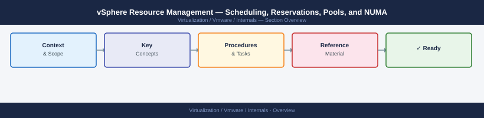

---
tags:
  - internals
  - vmware
---
# vSphere Resource Management — Scheduling, Reservations, Pools, and NUMA

<div class="kb-summary">
vSphere resource management controls how CPU and memory are allocated to VMs competing for physical capacity. This page covers the full scheduling model: shares, reservations, limits, resource pools, NUMA topology, memory reclamation techniques (ballooning, swapping, compression, TPS), and the operational patterns that prevent noisy-neighbor and capacity cliff problems in production clusters.

*Applies to: vSphere 7.x / 8.x*
</div>



---

```d2
direction: right

center: "Vsphere Resource Management" {shape: hexagon}
the_resource_scheduling_model: "The Resource Scheduling Model" {shape: rectangle}
cpu_reservations_limits_and_overhead: "CPU Reservations, Limits, and Overhead" {shape: rectangle}
memory_reservations_and_overhead: "Memory Reservations and Overhead" {shape: rectangle}
resource_pools: "Resource Pools" {shape: rectangle}
numa_topology_and_vnuma: "NUMA Topology and vNUMA" {shape: rectangle}
drs_and_resource_management_integrat: "DRS and Resource Management Integration" {shape: rectangle}

center -> the_resource_scheduling_model
center -> cpu_reservations_limits_and_overhead
center -> memory_reservations_and_overhead
center -> resource_pools
center -> numa_topology_and_vnuma
center -> drs_and_resource_management_integrat
```

## The Resource Scheduling Model

vSphere uses a proportional-share scheduler for CPU and memory. Every VM has three control knobs per resource:

| Control | What it does | Default |
|---|---|---|
| **Reservation** | Hard guarantee — the VM always gets at least this much, even under contention | 0 (none) |
| **Limit** | Hard cap — the VM never gets more than this, even if resources are idle | Unlimited |
| **Shares** | Relative priority when resources are *over-committed*. Only apply under contention | Normal (1000 CPU / 1000 mem) |

Key operational insight: **shares only matter when the host is overcommitted**. On an idle host all VMs get what they request regardless of share values. Shares become the scheduling currency the moment demand exceeds capacity.

### Share Levels

| Level | CPU shares per vCPU | Memory shares per MB |
|---|---|---|
| Low | 500 | 5 |
| Normal | 1000 | 10 |
| High | 2000 | 20 |
| Custom | User-specified | User-specified |

A 4-vCPU VM at High shares has 4 × 2000 = 8000 CPU shares. A 2-vCPU VM at Normal has 2000. Under contention the 4-vCPU VM receives 4× as much CPU time as the 2-vCPU VM.

---

## CPU Reservations, Limits, and Overhead

### Reservations

A CPU reservation is expressed in MHz (or GHz). When you set a reservation of 2000 MHz on a VM, vCenter will only power on that VM on a host where 2000 MHz of unreserved capacity is available. The reservation is held even when the VM is idle.

```bash
# PowerCLI — set CPU reservation
Get-VM "DB-PROD01" | Get-VMResourceConfiguration | `
  Set-VMResourceConfiguration -CpuReservationMhz 2000

# View current allocations
Get-VM | Get-VMResourceConfiguration | `
  Select-Object VM, CpuReservationMhz, CpuLimitMhz, CpuSharesLevel
```

**Operational concern:** Excessive reservations fragment capacity. If you reserve 8 GHz across 20 VMs on a 48 GHz host, you have committed 33 % of capacity even when all those VMs are idle. DRS cannot migrate a VM away from a host unless the destination has enough unreserved capacity to satisfy the reservation.

### Limits

CPU limits create hard caps. A VM with a 1000 MHz limit will not run faster than 1000 MHz even if the physical host has spare cycles. Limits are almost never appropriate except for:

- Dev/test VMs that must not impact production
- VMs billing by the CPU-hour where a cap is contractually required
- Throttling a batch job that is known to saturate CPUs

> **Never set CPU limits on production VMs without deliberate intent.** A VM that hits its CPU limit is identical (from an application's perspective) to a host that is 100 % CPU saturated. You will see Ready time spike, application latency increase, and the root cause will be invisible unless you specifically check CPU limit counters.

### CPU Ready and %RDY

CPU Ready (%RDY) is the percentage of time a vCPU was ready to run but could not be scheduled onto a physical core. It is the primary indicator of CPU contention.

| %RDY value | Interpretation |
|---|---|
| < 5 % | Normal |
| 5–10 % | Moderate contention — investigate |
| > 10 % | Significant contention — remediate |

```bash
# esxtop — view CPU ready per VM
# Launch esxtop → press 'c' for CPU view
# Column: %RDY per vCPU, %CSTP (co-stop for SMP VMs)
esxtop

# vSphere CLI — CPU readiness for all VMs on a host
esxcli vm process list
# Use performance manager via PowerCLI for historical RDY data:
Get-Stat -Entity (Get-VM "APP-01") -Stat cpu.ready.summation `
  -Start (Get-Date).AddHours(-2) -IntervalMins 5
```

**Co-Stop (%CSTP):** For multi-vCPU VMs, the scheduler must find N free physical cores simultaneously. If it cannot, all vCPUs wait (co-stop). VMs with unnecessary vCPU counts suffer more co-stop. Right-size vCPU counts — a 2-vCPU VM almost always outperforms a 16-vCPU VM for single-threaded workloads.

---

## Memory Reservations and Overhead

### Memory Overhead

Every VM has a memory overhead that is consumed by ESXi on behalf of the VM — not visible inside the guest OS. This overhead grows with vCPU count and enabled features (vTPM, 3D video, FT).

Approximate overhead for a 4-vCPU / 16 GB VM:

| Component | Approximate size |
|---|---|
| VMkernel overhead | ~250 MB |
| Video device | ~4 MB |
| vTPM | ~4 MB |
| Total | ~258 MB above configured memory |

Capacity planning must account for overhead. On a host with 512 GB RAM, usable VM memory is approximately 512 GB minus (overhead × number of running VMs).

### Memory Balloon Driver (vmmemctl)

When a host's physical memory is over-committed, ESXi uses four reclamation techniques in order of preference:

```text
Memory pressure increasing →
  1. TPS (Transparent Page Sharing) — passive; deduplicates identical pages
  2. Balloon driver (vmmemctl) — active; reclaims guest memory cooperatively
  3. Memory compression — ESXi compresses cold pages to a compressed cache
  4. Host swap — ESXi swaps VM pages to disk (vmx-vmname.vswp) — severe latency
```

The **balloon driver** is a VMware Tools kernel module installed inside each guest. ESXi inflates the balloon by asking the driver to allocate memory inside the guest OS. The guest OS is forced to page out its own least-used pages to guest-level swap (pagefile/swapfile). ESXi then reclaims the physical pages holding the balloon and gives them to another VM.

**Key operational points:**

- Ballooning is cooperative — the guest OS chooses what to page out
- A VM with no VMware Tools has no balloon driver — ESXi must use compression or host swap instead (much worse)
- Monitor with `mem.vmmemctl` counter; sustained inflation indicates the host is over-committed
- Guest applications will see memory pressure (page faults) during ballooning — it is not transparent

### Host Swap (vswp File)

When ballooning is insufficient, ESXi swaps VM pages directly to a `.vswp` file on the datastore. This is the worst-case reclamation path:

- Latency: DRAM access ~100 ns → datastore swap ~100,000+ ns
- A VM hitting host swap will see severe performance degradation
- The `.vswp` file size equals the VM's configured memory minus its memory reservation (reason to set reservations on critical VMs)

```bash
# esxtop — memory view
# Press 'm' in esxtop
# MCTLSZ = balloon size, SWCUR = current swap usage
esxtop

# PowerCLI — check balloon and swap stats
Get-Stat -Entity (Get-VM "DB-PROD01") `
  -Stat mem.vmmemctl.average, mem.swapped.average `
  -Start (Get-Date).AddHours(-1) -IntervalMins 1
```

### Transparent Page Sharing (TPS)

TPS scans VM memory pages and deduplicates identical content. Identical pages are merged into a single copy-on-write page, freeing the duplicates. Historically TPS was aggressive; since vSphere 6.0 inter-VM TPS is disabled by default for security reasons (side-channel attacks).

**Current behaviour:**

| TPS scope | Default state | Override |
|---|---|---|
| Intra-VM (within one VM) | Enabled | Always active |
| Inter-VM (across VMs) | Disabled (salted pages) | `Mem.ShareForcedSalting = 0` (not recommended for production) |

---

## Resource Pools

Resource pools allow you to partition cluster or host compute resources into a hierarchy. Each pool has its own shares, reservation, and limit, which apply to the aggregate of all VMs and nested pools within it.

```text
Cluster: PROD-CLUSTER  (total: 96 GHz CPU, 768 GB RAM)
  │
  ├── Resource Pool: GOLD           (reservation: 40 GHz, High shares)
  │     ├── VM: DB-PROD01
  │     └── VM: DB-PROD02
  │
  ├── Resource Pool: SILVER         (reservation: 20 GHz, Normal shares)
  │     ├── VM: APP-PROD01
  │     └── VM: APP-PROD02
  │
  └── Resource Pool: DEV            (reservation: 0, Low shares, limit: 10 GHz)
        ├── VM: DEV-01
        └── VM: DEV-02
```

### Resource Pool Inheritance

- A VM inside a pool cannot receive more than the pool's limit allows, even if the pool has spare capacity
- A pool's reservation is drawn from its parent (cluster or parent pool) — it must not exceed parent available
- Shares at pool level compete with sibling pools; shares at VM level compete within the pool

### Expandable Reservations

Each pool has an **expandable reservation** toggle:

- **Enabled (default):** If a VM in the pool needs more than the pool's reservation, it can borrow from the parent pool's unreserved capacity
- **Disabled:** The pool is strictly limited to its own reservation — VMs cannot burst beyond it

> Disable expandable reservations when you need strict capacity isolation between business units or tenants sharing a cluster.

```powershell
# PowerCLI — create a resource pool
New-ResourcePool -Name "GOLD" `
  -Location (Get-Cluster "PROD-CLUSTER") `
  -CpuSharesLevel High `
  -CpuReservationMhz 40000 `
  -MemSharesLevel High `
  -MemReservationMB 204800 `
  -MemExpandableReservation $false

# Move a VM into a resource pool
Move-VM -VM "DB-PROD01" -Destination (Get-ResourcePool "GOLD")
```

### The "Resource Pool Death Star" Anti-Pattern

Nesting resource pools more than two levels deep creates unpredictable scheduling behaviour and makes capacity planning nearly impossible. Flat or two-level hierarchies (cluster → pool → VMs) are the operational standard.

---

## NUMA Topology and vNUMA

Modern multi-socket servers have a Non-Uniform Memory Access (NUMA) topology: each CPU socket has its own local memory bank. Accessing local memory is ~2× faster than accessing remote memory (across the QPI/UPI interconnect).

```text
NUMA Node 0                    NUMA Node 1
┌───────────────────────────────────────────── ┐         ┌ ─────────────────────────────────────────────┐
│  CPU Socket 0      │  QPI/   │  CPU Socket 1                                                          │
│  24 cores          │ ──────► │  24 cores                                                              │
│  Local RAM: 384 GB │         │  Local RAM: 384 GB                                                     │
└───────────────────────────────────────────────────────────────────────────────────────────────────────┘

VM-A (16 vCPU, 256 GB)
  → Spans both NUMA nodes → 50% of memory accesses are remote
  → NUMA penalty applies unless vNUMA is configured correctly
```

### How vSphere Handles NUMA

ESXi's NUMA scheduler attempts to fit each VM entirely within a single NUMA node. If the VM is too large, it splits the VM across nodes and uses **vNUMA** to expose virtual NUMA topology to the guest OS.

With vNUMA enabled (automatic for VMs > 8 vCPUs), the guest OS NUMA-aware scheduler can optimise memory allocation within each virtual NUMA node, matching the physical layout.

```bash
# Check NUMA topology on a host
esxcli hardware memory get
# Returns: total, NUMA node count, size per node

# vNUMA — check VM's virtual NUMA config
# vSphere Client: VM → Edit Settings → VM Options → Advanced → vNUMA topology
# Or check via VMX parameter:
grep -i numa /vmfs/volumes/<datastore>/<vm>/<vm>.vmx
```

### NUMA-Aware VM Sizing Guidelines

| Guideline | Reason |
|---|---|
| Size VMs to fit within one NUMA node | Eliminates remote memory access penalty |
| Avoid oversized VMs on 2-socket hosts | A 48-vCPU VM on a 2×24-core host always spans both nodes |
| Enable vNUMA for VMs > 8 vCPUs | Lets guest OS NUMA scheduler optimise placement |
| Set vNUMA topology to match physical | `numa.nodeAffinity` advanced parameter for pinned VMs |
| Monitor NUMA migrations in esxtop | Column `N%L` shows % of memory accesses that are local |

```bash
# esxtop NUMA view
# Press 'm' → then 'f' to add NUMA fields
# N%L = % local NUMA memory accesses (higher is better, > 90% target)
```

---

## DRS and Resource Management Integration

DRS (Distributed Resource Scheduler) uses the share/reservation/limit values to make migration decisions. Key interactions:

- DRS calculates **demand** vs **entitlement** for each VM. Entitlement = what a VM is owed based on its shares and the cluster's total capacity
- A VM with high shares and high demand gets migrated to a less-loaded host
- Reservations affect DRS placement: a VM cannot migrate to a host that cannot satisfy its reservation
- **DRS automation levels** control whether migrations are recommendations or automatic

```powershell
# PowerCLI — check DRS recommendations
Get-DrsRecommendation -Cluster "PROD-CLUSTER" | `
  Select-Object VirtualMachine, Reason, Priority | `
  Format-Table -AutoSize

# Force DRS to recalculate and apply recommendations
Invoke-DrsRecommendation -Cluster "PROD-CLUSTER"
```

### DRS Threshold (Migration Aggressiveness)

| Level | Behaviour |
|---|---|
| 1 (Conservative) | Only migrates for severe imbalance (priority 1 recommendations) |
| 3 (Default) | Migrates for priorities 1–3 |
| 5 (Aggressive) | Migrates for any imbalance (priorities 1–5) |

---

## Memory Counters Reference

| Counter | Meaning | Threshold to watch |
|---|---|---|
| `mem.active.average` | Memory actively used by guest (working set) | — |
| `mem.consumed.average` | Total host memory used by VM (incl. overhead) | — |
| `mem.overhead.average` | ESXi overhead for this VM | — |
| `mem.vmmemctl.average` | Balloon driver inflation (guest-reclaimed pages) | > 0 indicates host pressure |
| `mem.swapped.average` | Pages currently in host swap | > 0 is critical |
| `mem.compressed.average` | Pages in ESXi compression cache | > 0 indicates host pressure |
| `mem.llSwapInRate.average` | Rate of swap-in from disk | Any value is a problem |

---

## Operational Checklist — Resource Management Health

```bash
# 1. Identify VMs with CPU Ready > 5%
# esxtop → 'c' view → sort by %RDY (press 'F' → select RDY)

# 2. Find VMs hitting CPU limits (Ready is low but performance is poor)
# Look for %MLMTD > 0 in esxtop CPU view (% time limited by CPU limit)

# 3. Check for host memory pressure
# esxtop → 'm' view → look for MCTLSZ > 0 (balloon) or SWCUR > 0 (swap)

# 4. Review resource pool entitlements vs demand
Get-ResourcePool | Get-VMResourceConfiguration | `
  Select-Object ResourcePool, CpuReservationMhz, CpuLimitMhz | `
  Sort-Object CpuReservationMhz -Descending

# 5. Check NUMA efficiency
# esxtop 'm' view → N%L column; values < 80% warrant investigation

# 6. Find VMs with no memory reservation on critical workloads
Get-VM | Get-VMResourceConfiguration | `
  Where-Object {$_.MemReservationMB -eq 0} | `
  Select-Object VM | Sort-Object VM
```

---

## Quick Reference — Key Values

| Parameter | Default / Threshold | Notes |
|---|---|---|
| CPU Ready warning threshold | 5 % | > 10 % requires immediate action |
| Memory balloon counter | `mem.vmmemctl` > 0 | Any sustained balloon = host over-committed |
| Memory swap counter | `mem.swapped` > 0 | Critical — disk swap is active |
| Share levels (CPU) | Low 500 / Normal 1000 / High 2000 per vCPU | Relative, not absolute MHz |
| Host swap file location | Same datastore as VM | Size = configured RAM minus reservation |
| vNUMA auto-enable threshold | VMs with > 8 vCPUs | Exposes virtual NUMA to guest OS |
| DRS default aggressiveness | Level 3 | Applies priority 1–3 recommendations |
| Expandable reservation default | Enabled | Pools can borrow from parent |

---

## Related Pages

- [Cluster Services — DRS, HA, and vSAN](../cluster-services/)
- [vSphere Monitoring](../vsphere-monitoring/)
- [vSphere Storage Concepts](../vsphere-storage/)
