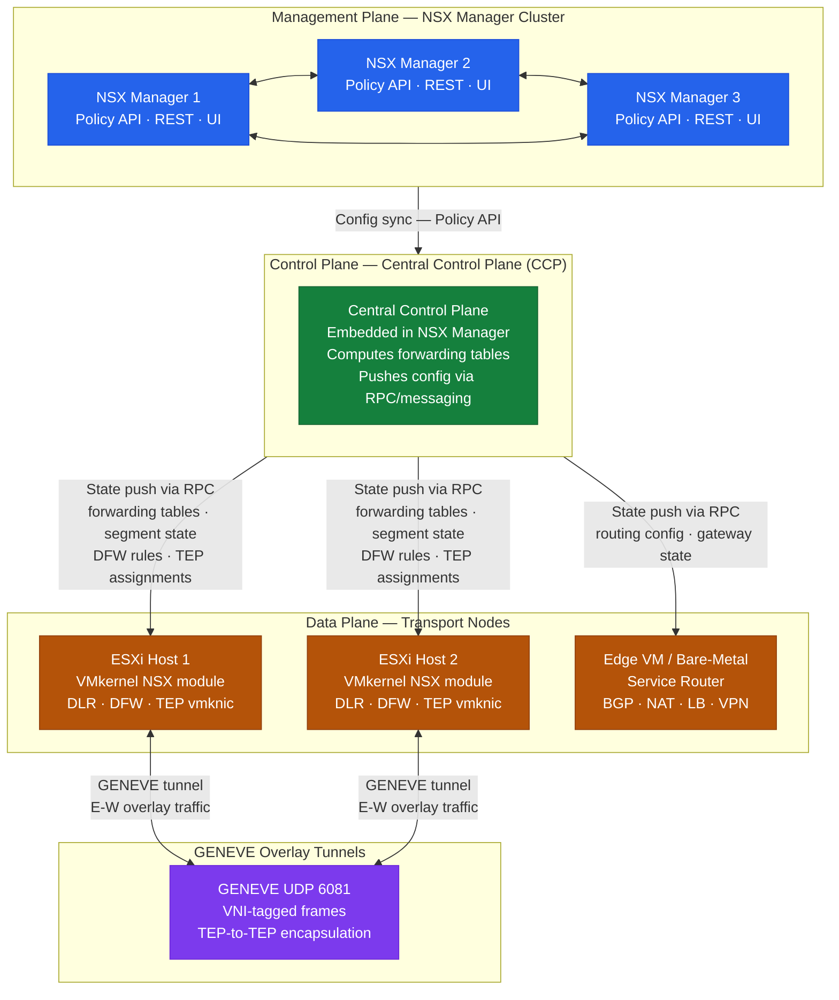

---
tags:
  - architecture
  - nsx
  - nsx-4
  - vmware
---
# NSX — How It Works


<div class="kb-summary">
How It Works reference covering API Surfaces, Transport Nodes, Geneve Encapsulation, Transport Zones, Gateway Architecture — T0 and T1 and 7 more sections.

*Applies to: NSX-T 3.x · NSX 4.x*
</div>

```text
┌─────────────────────────────────── NSX Architecture — How It Works ───────────────────────────────────┐
│                                                                                                       │
│   ┌───────────────────────────────────────────────────────────────────────────────────────────────┐   │
│   │       NSX separates control, management, and data planes; overlay runs on each ESXi host      │   │
│   │      Control plane: NSX Manager (3-node cluster) pushes config to Transport Nodes via RPC     │   │
│   │        Data plane: DLR runs on each host; Geneve encapsulates E-W traffic between TEPs        │   │
│   │          North-South: SR on Edge Node routes to physical; BGP peers with ToR switches         │   │
│   └───────────────────────────────────────────────────────────────────────────────────────────────┘   │
│                                                                                                       │
│    NSX Manager config → Transport Node kernel modules → Geneve overlay → Edge SR → physical           │
│                                                                                                       │
│                  ▼                                ▼                                ▼                  │
│                                                                                                       │
│   ┌─────────────────────────────┐  ┌─────────────────────────────┐  ┌─────────────────────────────┐   │
│   │        Control Plane        │  │       Data Plane (E-W)      │  │          Edge (N-S)         │   │
│   │       NSX Manager × 3       │  │       DLR on each host      │  │        Service Router       │   │
│   │       Config RPC push       │  │        Geneve VNI tag       │  │          BGP to ToR         │   │
│   │       TEP pool assign       │  │         TEP src/dst         │  │         SNAT / DNAT         │   │
│   │        DFW rule push        │  │         DFW at vNIC         │  │          LB service         │   │
│   │        Segment create       │  │       BUM replication       │  │        GRE/IPsec VPN        │   │
│   └─────────────────────────────┘  └─────────────────────────────┘  └─────────────────────────────┘   │
│                                                                                                       │
│    VM-to-VM same host: no Geneve; DFW filters and DLR forwards in-kernel directly                     │
│                                                                                                       │
│                  ▼                                ▼                                ▼                  │
│                                                                                                       │
│   ┌───────────────────────────────────────────────────────────────────────────────────────────────┐   │
│   │   Traffic type   │   Entry point    │        Path       │    Exit point    │     Protocol     │   │
│   │  E-W same host   │     VM vNIC      │     DFW → DLR     │    Target VM     │  None/in-kernel  │   │
│   │  E-W diff host   │     VM vNIC      │      DFW→TEP      │    TEP→DFW→VM    │ Geneve/UDP 6081  │   │
│   │   N-S outbound   │    VM → T1 DR    │   T1 SR → T0 SR   │   ToR→upstream   │     BGP ECMP     │   │
│   │   N-S inbound    │   ToR → T0 SR    │     T0 → T1 SR    │    DNAT → VM     │    BGP + SNAT    │   │
│   └───────────────────────────────────────────────────────────────────────────────────────────────┘   │
│                                                                                                       │
│    Physical: ESXi hosts · N-VDS/VDS with TEP vmknic · Edge VMs on bare-metal or VM form               │
│                                                                                                       │
│    Key terms:                                                                                         │
│                                                                                                       │
│    DLR           = Distributed Logical Router; runs as kernel module on every ESXi host               │
│    SR            = Service Router; runs on Edge Node; handles stateful N-S services                   │
│    TEP           = Tunnel End Point; vmknic IP used as Geneve encap src/dst per host                  │
│    Geneve        = Generic Network Virtualization Encapsulation; NSX overlay protocol                 │
│    VNI           = Virtual Network Identifier; 24-bit segment ID in Geneve header                     │
│    DFW           = Distributed Firewall; stateful L4-L7 kernel-level filter at each vNIC              │
│    BUM           = Broadcast/Unknown-unicast/Multicast; replicated via head-end or multicast          │
│    T0 gateway    = Tier-0 Logical Router; provider-level; BGP peers with physical fabric              │
│    T1 gateway    = Tier-1 Logical Router; tenant-level; connects segments to T0                       │
│    BGP ECMP      = T0 uses ECMP over multiple Edge uplinks for active-active North-South              │
│    N-VDS         = NSX-managed vSwitch; hosts TEP vmknic and overlay traffic                          │
│    ToR           = Top-of-Rack physical switch; BGP peer for T0 gateway uplinks                       │
│                                                                                                       │
└───────────────────────────────────────────────────────────────────────────────────────────────────────┘
```

```text
┌──────────────────────────── NSX — Distributed Firewall Packet Processing ─────────────────────────────┐
│                                                                                                       │
│    DFW enforces policy at every vNIC on every ESXi host. Rules are kernel-level;                      │
│    no external firewall appliance is in the data path for east-west traffic.                          │
│                                                                                                       │
│   ┌──────────────────────────────────────────────┐  ┌─────────────────────────────────────────────┐   │
│   │       Ingress (arriving at dest vNIC)        │  │         Egress (leaving source vNIC)        │   │
│   │       Packet arrives from network/TEP        │  │        Guest OS sends TCP/UDP packet        │   │
│   │       DFW intercepts before guest recv       │  │       DFW intercepts at vNIC in kernel      │   │
│   │     Connection table: established → pass     │  │     Connection table: established → pass    │   │
│   │        New flow → evaluate rule table        │  │        New flow → evaluate rule table       │   │
│   │         Permit → deliver to guest OS         │  │          Permit → send to DLR / TEP         │   │
│   │       Drop → discard (silent / logged)       │  │       Drop → discard (silent / logged)      │   │
│   └──────────────────────────────────────────────┘  └─────────────────────────────────────────────┘   │
│                                                                                                       │
│    Rule table is evaluated top-down; first match wins; implicit deny at the bottom.                   │
│                                                                                                       │
│                          ▼                                                 ▼                          │
│                                                                                                       │
│   ┌──────────────────────────────────────────────┐  ┌─────────────────────────────────────────────┐   │
│   │             Rule Table Structure             │  │             Connection Tracking             │   │
│   │       Applied-to: VM / group / segment       │  │    5-tuple key: src IP:port, dst IP:port,   │   │
│   │      Match: src group + dst group + svc      │  │         proto → connection table entry      │   │
│   │        Actions: allow · drop · reject        │  │      ESTABLISHED flow: fast path bypass     │   │
│   │     Per-rule logging: optional (costly)      │  │     TCP FIN/RST: removes entry promptly     │   │
│   │       Default rule: deny all (bottom)        │  │       UDP: idle timeout removes entry       │   │
│   └──────────────────────────────────────────────┘  └─────────────────────────────────────────────┘   │
│                                                                                                       │
│    Physical Infrastructure (the hardware everything above runs on):                                   │
│    ESXi hosts with N-VDS · NSX Manager cluster (×3) · TEP vmknic on each host                         │
│                                                                                                       │
│    Key terms:                                                                                         │
│                                                                                                       │
│    DFW rule table    = ordered list of rules pushed by NSX Manager to each ESXi host                  │
│    Applied-to        = scope of the rule: individual VM, group, segment, or cluster                   │
│    Connection table  = per-host stateful table; avoids rule re-eval for open flows                    │
│    Group             = dynamic or static set of VMs/IPs used as src/dst in DFW rules                  │
│    Reject            = drop packet AND send TCP RST or ICMP unreachable to sender                     │
│    N-VDS             = NSX-managed vSwitch; required for DFW to function on a host                    │
│    Fast path         = established flow matched in connection table, skips rule table                 │
│                                                                                                       │
└───────────────────────────────────────────────────────────────────────────────────────────────────────┘
```

### NSX 3-Plane Architecture



### Edge Node Transport Nodes

Edge nodes are NSX-deployed VMs or bare-metal appliances hosting north-south gateway functions.

| Interface | Name | Purpose |
|---|---|---|
| Management | eth0 | SSH, NSX Manager communication |
| Uplink 0 | fp-eth0 | Physical router-facing (BGP peer) |
| Uplink 1 | fp-eth1 | Second physical path (HA or ECMP) |
| Overlay | nsx-geneve | Geneve encap for overlay within Edge |

```bash
# SSH to Edge node
get interfaces
get service dataplane   # Confirm dataplane is running
get service router      # Confirm routing engine is running
```

---

## Geneve Encapsulation

NSX uses Geneve (port 6081) — not VXLAN. The VNI identifies which logical segment a packet belongs to.

```text
[Outer ETH][Outer IP: TEP-src → TEP-dst][UDP 6081][Geneve VNI=5001][Inner ETH][Inner IP: VM-src → VM-dst][Payload]
```

Geneve carries extensible metadata (security group tags, service chain IDs) inline — not possible with VXLAN.

```bash
# Verify tunnel health from NSX Manager CLI
nsxcli
get tunnel status
get tunnel status <remote-tep-ip>
```

---

## Transport Zones

Transport Zones define which transport nodes can host VMs on a given segment.

| Zone Type | Encapsulation | Hosts |
|---|---|---|
| Overlay TZ | Geneve (VNI-based) | ESXi hosts + Edge nodes |
| VLAN TZ | 802.1Q VLAN tagging | Edge nodes (uplinks to physical routers) |

A transport node can participate in multiple zones. ESXi hosts typically join one overlay TZ; Edge nodes join both overlay and VLAN TZs.

---

## Gateway Architecture — T0 and T1

### Tier-1 Gateway (Distributed Routing)

T1 gateways perform routing at the ESXi host level — east-west traffic between subnets on the same T1 never leaves the host.

- Runs as a logical router instance on every ESXi transport node
- Connects to segments via downlink interfaces (default gateway for VMs)
- Connects upward to T0 via an auto-created internal transit link

Route advertisement from T1 to T0 (configure in T1 settings):

| Route Type | Advertises |
|---|---|
| `TIER1_CONNECTED` | Subnets of directly connected segments |
| `TIER1_STATIC` | Static routes on the T1 |
| `TIER1_LB_VIP` | Load balancer VIP addresses |
| `TIER1_NAT` | NAT'ed addresses |

### Tier-0 Gateway (North-South Routing)

T0 gateways run on Edge nodes and peer with physical routers via BGP or static routes.

| HA Mode | Behaviour |
|---|---|
| Active/Standby | One Edge node active; other is hot standby |
| Active/Active | ECMP across all Edge nodes; requires equal-cost uplinks |

```bash
# Check HA state from Edge node
get edge-cluster status
set edge-cluster failover   # Force failover from active Edge
```

### Routing Flow — VM to External

```text
VM → vNIC → DFW filter → T1 distributed instance (same ESXi host)
  → T0 Service Router (Edge node) → Physical router (BGP peer) → Internet
```

---

## Edge Cluster

Edge clusters group Edge nodes for HA and gateway service assignment. Any T0 or T1 with services (NAT, LB, VPN) must reference an Edge cluster.

| Size | vCPU | Memory | Throughput | Use |
|---|---|---|---|---|
| Small | 2 | 8 GB | ~5 Gbps | Lab only |
| Medium | 4 | 16 GB | ~40 Gbps | Dev/test |
| Large | 8 | 32 GB | ~100 Gbps | Production |
| Bare Metal | Physical | 256 GB | Line rate | High-throughput edge |

Edge VMs must be deployed on hosts **separate** from compute workload hosts.

---

## Distributed Firewall (DFW)

The DFW runs as a kernel-level stateful firewall at every VM vNIC on every ESXi host. Traffic is intercepted before it enters or leaves the vNIC — even between two VMs on the same host.

### DFW Categories (evaluated top to bottom)

| Category | Priority | Typical Use |
|---|---|---|
| Ethernet | 1 | L2 / MAC-based rules |
| Emergency | 2 | Break-glass blocks |
| Infrastructure | 3 | Management, backup, monitoring allow rules |
| Environment | 4 | Inter-zone segmentation (prod/dev, PCI boundary) |
| Application | 5 | Application-specific micro-segmentation |

Default rule (65535): **DROP** — do not change.

### DFW Inspection on ESXi Host

```bash
# List all DFW filters (one per VM vNIC)
summarize-dvfilter

# Show rules applied to a vNIC filter
vsipioctl getrules -f nic-12345-eth0-vmware-sfw.2

# Show rule hit counts
vsipioctl getstats -f nic-12345-eth0-vmware-sfw.2

# Show security groups (address sets) in use
vsipioctl getaddrsets -f nic-12345-eth0-vmware-sfw.2
```

---

## Segments

Segments are NSX Layer 2 logical networks. VMs on the same segment communicate without crossing a gateway, regardless of physical host.

| Type | Backing | Use Case |
|---|---|---|
| Overlay | Geneve (VNI) | VM workload networking |
| VLAN-backed | Physical VLAN | Management networks, Edge uplinks |

```bash
# Find the VNI of a segment
nsxcli
get logical-switch <segment-id> | grep VNI
```

---

## IPAM and DHCP

NSX includes built-in IPAM for IP pool management and a distributed DHCP server running on ESXi hosts — no dedicated DHCP VM required.

```bash
# List IP pools
curl -sk -u 'admin:password' \
  "https://<nsx-manager>/api/v1/pools/ip-pools"

# Check pool allocations
curl -sk -u 'admin:password' \
  "https://<nsx-manager>/api/v1/pools/ip-pools/<pool-id>/ip-allocations"
```

---

## VPN Services

NSX supports IPsec site-to-site VPN and L2 VPN on Edge nodes (T0 or T1 with Edge cluster).

```bash
# Check IPsec sessions from Edge CLI
get vpn ipsec session list

# Check L2 VPN sessions
get vpn l2vpn session list
```

| IKE Setting | Recommended Value |
|---|---|
| IKE Version | IKEv2 |
| Encryption | AES-256 |
| Digest | SHA-256 |
| DH Group | Group 14 or Group 20 |

---

## NSX-T vs NSX-V

| Feature | NSX-T (current) | NSX-V (end-of-life) |
|---|---|---|
| Overlay protocol | Geneve | VXLAN |
| Control plane | Embedded in Manager cluster | Separate Controller VMs |
| Multi-hypervisor | Yes (ESXi, KVM) | ESXi only |
| VDS requirement | vDS 7.0+ | vDS 6.x |
| EoL status | Supported | **End-of-life — no security patches** |

NSX-V migrations are critical — NSX-V receives no patches.

---

## Ports and Logs

| Use | Protocol | Port |
|---|---|---|
| NSX Manager UI / API | HTTPS | 443 |
| Geneve overlay encapsulation | UDP | 6081 |
| BFD (path failure detection) | UDP | 3784 |
| BGP (T0 to physical router) | TCP | 179 |
| NSX Manager SSH | TCP | 22 |
| Syslog (TLS) | TCP | 6514 |

**Key log paths (NSX Manager):**

- `/var/log/vmware/nsx-manager/` — manager and policy service logs
- `/var/log/vmware/nsx-manager/audit.log` — admin actions, role changes
- `/var/log/vmware/nsx-controller/` — control plane logs

**Edge node logs (SSH):**

```bash
get log-file syslog follow   # live tail
get log-file auth.log        # authentication events
```

## See also

- [NSX — Design Standards](design-standards/)
- [NSX — Deploy](../deploy/)
- [NSX — Integrations](integrations/)
