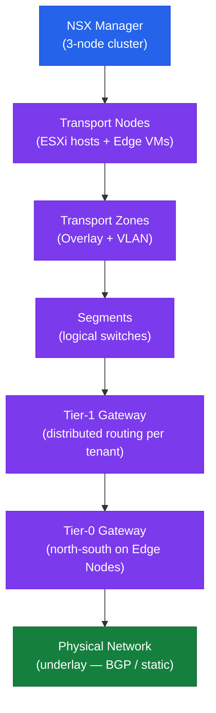

# NSX — Architecture Overview

## NSX Overlay Architecture



## Key Concepts

- **NSX Manager cluster** (3 nodes) provides the management and control plane
- **Transport Nodes** are ESXi hosts and Edge VMs prepared with NSX kernel modules (TEPs)
- **TEP (Tunnel Endpoint)** is the VMkernel interface used for Geneve overlay encapsulation
- **Segments** are logical Layer 2 networks — equivalent to VLANs but overlay-based
- **Tier-1 Gateways** provide distributed routing per tenant; run on all ESXi hosts
- **Tier-0 Gateways** handle north-south routing; run on Edge Nodes and peer with physical underlay via BGP or static routes
- **DFW (Distributed Firewall)** enforces micro-segmentation statefully at the vNIC level on every ESXi host

---

## Control Plane vs Data Plane

Understanding how NSX separates its planes is critical for troubleshooting:

| Plane | Components | Failure Impact |
|---|---|---|
| Management plane | NSX Manager cluster, API, UI | Cannot create or modify config; existing data plane continues |
| Control plane | NSX Manager controller (embedded) | Transport nodes lose updates; existing tunnels continue until state drifts |
| Data plane | ESXi VMkernel, Edge node FP (Fast Path) | VM traffic affected; management plane unaffected |

This separation means that if all three NSX Manager nodes fail, VM-to-VM traffic on the overlay **continues** — VMs keep communicating until the next change would require a control-plane update. The failure becomes visible when new policies or routes cannot be pushed.

---

## Geneve Encapsulation

NSX-T uses Geneve (Generic Network Virtualization Encapsulation) as its overlay protocol. Traffic between VMs on the same segment but different hosts is encapsulated as follows:

```
[Physical Ethernet]
  [Outer IP: TEP src → TEP dst]
    [UDP: dst port 6081]
      [Geneve Header: VNI=<segment-id>, version, options]
        [Inner Ethernet: VM src MAC → VM dst MAC]
          [Inner IP: VM src → VM dst]
            [VM Payload]
```

The VNI (Virtual Network Identifier) in the Geneve header identifies which logical segment the traffic belongs to. Different segments have different VNIs, even on the same physical infrastructure.

**Why Geneve over VXLAN?** Geneve supports extensible metadata in the options header, allowing NSX to carry security group tags, service chain identifiers, and telemetry data inline with packets — not possible with VXLAN.

---

## Transport Zones

Transport Zones define the scope of a segment — which transport nodes can host VMs connected to that segment.

| Zone Type | Encapsulation | Hosts in Zone |
|---|---|---|
| Overlay TZ | Geneve (VNI-based) | ESXi hosts + Edge nodes |
| VLAN TZ | 802.1Q VLAN tagging | Edge nodes (for uplinks to physical routers) |

A transport node can participate in multiple transport zones. ESXi hosts typically join one overlay TZ and may also join a VLAN TZ if they host Edge VMs.

---

## Gateway Architecture — T0 and T1

### Tier-1 Gateway (Distributed Routing)

T1 gateways perform routing at the ESXi host level. When a VM sends traffic to another subnet on the same T1, the routing decision happens in the VMkernel on the sending host — no hairpin to a centralised router.

- T1 runs as a logical router instance on every ESXi transport node
- T1 connects to segments via downlink interfaces (one IP per connected segment — the default gateway for VMs)
- T1 connects upward to T0 via an internal transit link

### Tier-0 Gateway (North-South Routing)

T0 gateways run on Edge nodes and handle traffic leaving or entering the NSX overlay. T0 peers with physical routers via BGP (typically) or static routes.

- T0 in `ACTIVE_STANDBY` mode: one Edge node is active for all traffic; other is hot standby
- T0 in `ACTIVE_ACTIVE` mode: all Edge nodes forward (ECMP); requires equal-cost uplinks

### Routing Flow — VM to External

```
VM (10.0.1.10) → vNIC → DFW filter (security) → T1 distributed instance on same host
  → T0 SR (Service Router on Edge node) → Physical router (BGP peer) → Internet
```

For east-west traffic within the same T1, the packet never leaves the ESXi host — it routes locally.

---

## Distributed Firewall Architecture

The DFW is the most powerful security feature in NSX. It runs as a kernel-level stateful firewall attached to every VM vNIC on every ESXi host.

### Why It Matters

Traditional firewalls see only traffic that crosses a physical boundary. The DFW intercepts traffic:
- Before it enters or leaves any VM vNIC
- Even between two VMs on the same host (traffic never reaches the physical network)
- Even between two VMs on the same segment (no gateway crossing required)

This enables true micro-segmentation — each VM can have a unique security policy regardless of its network topology.

### DFW Rule Evaluation

Rules are evaluated top-down within each category, then across categories in order:

```
Category: Ethernet → Emergency → Infrastructure → Environment → Application
  ↓
Within each category: rules evaluated top to bottom
  ↓
First matching rule wins — subsequent rules are not evaluated
  ↓
Default rule (65535): DROP (if not changed)
```

---

## NSX-T vs NSX-V

NSX-T (NSX-T Data Center, now just "NSX") replaced NSX-V (NSX for vSphere). Key differences:

| Feature | NSX-T (current) | NSX-V (end-of-life) |
|---|---|---|
| Overlay protocol | Geneve | VXLAN |
| Control plane | Embedded in Manager cluster | Separate Controller VMs |
| Management | Policy API + MP API | REST API (vShield) |
| Multi-hypervisor | Yes (ESXi, KVM) | ESXi only |
| VDS requirement | vDS 7.0+ | vDS 6.x |
| Edge type | VM or Bare Metal | VM only |
| EoL status | Supported | End-of-life |

NSX-V is no longer supported. All deployments must be on NSX-T (referred to as NSX in current Broadcom documentation). If a migration from NSX-V is still pending, treat it as critical — NSX-V receives no security patches.

---

## Supported Platforms

| Platform | Support Level |
|---|---|
| VMware vSphere (ESXi) | Full — primary platform |
| Bare Metal (physical servers) | Via NSX Agent on Linux/Windows |
| Public Cloud (AWS, Azure, GCP) | Via NSX Cloud (separate product) |
| VMware Cloud on AWS | Managed NSX included |
| VCF (VMware Cloud Foundation) | NSX is a required component |
| Tanzu (Kubernetes) | NSX integrates with NSX Container Plugin (NCP) |

In standard vSphere environments, NSX manages ESXi hosts as transport nodes and Edge VMs as the north-south gateway layer. No additional hypervisors or cloud integration is required for a standard on-premises deployment.

---

## In this section

<div class="kb-grid kb-grid-3">
<a class="kb-card" href="components/"><strong>Components</strong><span>Core components, services, and technical specifications.</span></a>
<a class="kb-card" href="integrations/"><strong>Integrations</strong><span>Integration with other platforms and external systems.</span></a>
<a class="kb-card" href="standards/"><strong>Standards</strong><span>Sizing guidelines, design standards, and best practices.</span></a>
</div>
