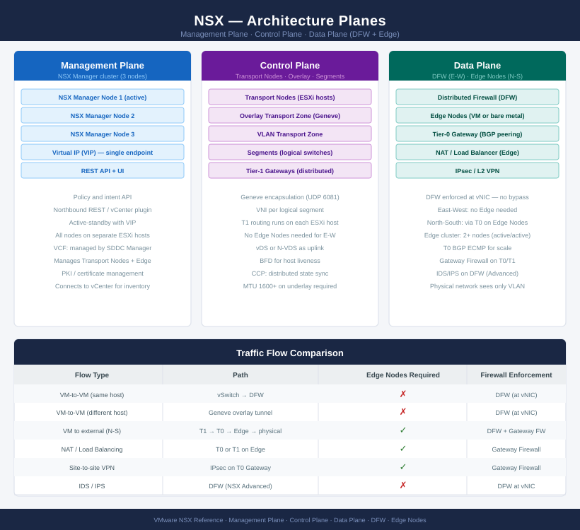

# NSX — Architecture

<div class="kb-summary">
NSX virtualises the network layer and enforces distributed security at the hypervisor. The 3-node NSX Manager cluster manages control and policy; Transport Nodes run the data plane; Edge Nodes handle north-south routing, NAT, and VPN.
</div>

| Component | Location | Role |
|---|---|---|
| NSX Manager (3-node cluster) | Management VMs | Management, control, and policy plane |
| Transport Nodes (ESXi hosts) | Every vSphere host | Data plane — overlay networking and DFW |
| Edge Nodes | Dedicated VMs or bare metal | North-south routing, NAT, LB, VPN |
| Tier-0 Gateway | Edge nodes | Physical network peering (BGP / static) |
| Tier-1 Gateway | ESXi hosts (distributed) | Per-tenant routing; no Edge required for L3 |

<div class="kb-grid kb-grid-3">
<a class="kb-card" href="how-it-works/"><strong>How It Works</strong><span>Manager cluster, transport nodes, Geneve encapsulation, T0/T1 gateways, DFW, segments, and VPN.</span></a>
<a class="kb-card" href="integrations/"><strong>Integrations</strong><span>vCenter, VCF, physical underlay, BGP, Active Directory, vDS, and SIEM.</span></a>
<a class="kb-card" href="design-standards/"><strong>Design Standards</strong><span>Naming conventions, overlay design rules, firewall design, baselines, and version compatibility.</span></a>
</div>

## NSX Architecture Planes



---

## NSX Overlay Architecture

```
┌───────────────────────────────────────── NSX — Architecture ──────────────────────────────────────────┐
│                                                                                                       │
│   ┌───────────────────────────────────────────────────────────────────────────────────────────────┐   │
│   │VMware NSX — software-defined networking; overlay fabric via GENEVE encapsulation on ESXi hosts│   │
│   │       Manager cluster (3 nodes active/active) controls the control plane and policy API       │   │
│   │       Transport nodes: ESXi/KVM hosts and Edge nodes form the GENEVE overlay data plane       │   │
│   │  Tier-0 provides BGP/static routing to the physical network; Tier-1 connects tenant segments  │   │
│   │     Distributed Firewall (DFW) enforces microsegmentation at the vNIC level on every host     │   │
│   └───────────────────────────────────────────────────────────────────────────────────────────────┘   │
│                                                                                                       │
│    How-it-works defines overlay mechanics · integrations connect physical network · standards govern s│
│                                                                                                       │
│                  ▼                                ▼                                ▼                  │
│                                                                                                       │
│   ┌─────────────────────────────┐  ┌─────────────────────────────┐  ┌─────────────────────────────┐   │
│   │         How It Works        │  │         Integrations        │  │       Design Standards      │   │
│   │     Manager: 3-node AAA     │  │       vCenter: plugin       │  │      Manager: L sizing      │   │
│   │     Transport: ESXi/KVM     │  │        BGP: ToR peers       │  │      Edge: L/XL sizing      │   │
│   │      Edge: routing + FW     │  │       AD/LDAP for auth      │  │      MTU: ≥1600 overlay     │   │
│   │       T0: physical BGP      │  │      vSAN: storage intg     │  │       BFD: keepalives       │   │
│   │     DFW: per-vNIC rules     │  │       SIEM: syslog API      │  │     IP plan: overlay/T0     │   │
│   └─────────────────────────────┘  └─────────────────────────────┘  └─────────────────────────────┘   │
│                                                                                                       │
│    How-it-works defines overlay and routing · integrations connect physical fabric · standards enforce│
│                                                                                                       │
│                  ▼                                ▼                                ▼                  │
│                                                                                                       │
│   ┌───────────────────────────────────────────────────────────────────────────────────────────────┐   │
│   │   How It Works   │   Integrations   │    Design Stds    │    Deployment    │     Key Stds     │   │
│   │  GENEVE overlay  │  vCenter plugin  │   Manager 3-node  │    Greenfield    │    MTU ≥1600     │   │
│   │  T0/T1 routing   │  BGP ToR peers   │  Edge cluster HA  │    Brownfield    │    BFD timers    │   │
│   │  DFW vNIC rules  │   AD/LDAP auth   │    ECMP uplinks   │    Multi-site    │   IP addr plan   │   │
│   │   Edge cluster   │   SIEM syslog    │     Overlay TZ    │    Federation    │  VLAN trunk std  │   │
│   └───────────────────────────────────────────────────────────────────────────────────────────────┘   │
│                                                                                                       │
│  Physical Infrastructure (the hardware everything above runs on):                                     │
│  x86 servers (ESXi hosts) · ToR switches (BGP peers) · Physical NICs (uplinks) · Network fabric       │
│                                                                                                       │
│  Key terms:                                                                                           │
│                                                                                                       │
│  GENEVE        = Generic Network Virtualization Encapsulation; NSX overlay protocol; encapsulates L2 i│
│  Transport node = ESXi host or Edge VM prepared for NSX; carries overlay traffic via GENEVE           │
│  Manager cluster = 3-node NSX Manager in active/active/active; hosts control plane and Policy API     │
│  Tier-0 (T0)   = NSX logical router with physical connectivity; BGP/static to ToR switches            │
│  Tier-1 (T1)   = NSX logical router for tenant segments; connected to T0 for north-south routing      │
│  DFW           = Distributed Firewall; stateful L4 firewall enforced at vNIC on every ESXi host       │
│  Edge cluster  = Pool of NSX Edge nodes providing services: routing, NAT, load balancing, VPN         │
│  TEP           = Tunnel End Point; VMkernel port on each transport node used for GENEVE encapsulation │
│  BFD           = Bidirectional Forwarding Detection; fast failure detection for BGP keepalives        │
│  ECMP          = Equal-Cost Multi-Path; load-balances T0 uplinks across multiple ToR switch paths     │
│  Microsegmentation = DFW policies that restrict lateral VM-to-VM traffic within the same VLAN/segment │
│  Transport Zone = NSX scope definition for overlay or VLAN segments; limits which hosts can connect   │
│                                                                                                       │
└───────────────────────────────────────────────────────────────────────────────────────────────────────┘
```
