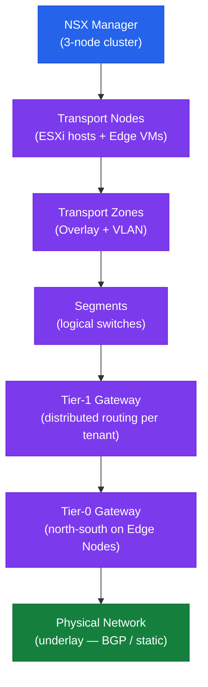

# NSX — Architecture Overview

NSX is VMware's software-defined networking and security platform. It virtualises the network layer and enforces security at the hypervisor, decoupling networking from physical infrastructure.

| Component | Location | Role |
|---|---|---|
| NSX Manager (3-node cluster) | Management VMs | Management, control, and policy plane |
| Transport Nodes (ESXi hosts) | Every vSphere host | Data plane — overlay networking and DFW |
| Edge Nodes | Dedicated VMs or bare metal | North-south routing, NAT, LB, VPN |
| Tier-0 Gateway | Edge nodes | Physical network peering (BGP / static) |
| Tier-1 Gateway | ESXi hosts (distributed) | Per-tenant routing; no Edge required for L3 |

<a class="kb-card" href="how-it-works/"><strong>How It Works</strong>Manager cluster, transport nodes, Geneve encapsulation, T0/T1 gateways, DFW, segments, and VPN.</a>
<a class="kb-card" href="integrations/"><strong>Integrations</strong>vCenter, VCF, physical underlay, BGP, Active Directory, vDS, and SIEM.</a>
<a class="kb-card" href="design-standards/"><strong>Design Standards</strong>Naming conventions, overlay design rules, firewall design, baselines, and version compatibility.</a>

---

## NSX Overlay Architecture

