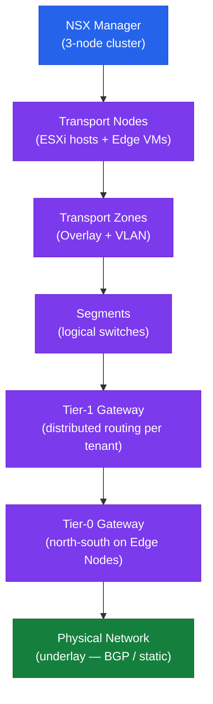

# NSX — Architecture Overview

## NSX Overlay Architecture

## Key Concepts

- **NSX Manager cluster** (3 nodes) provides the management and control plane
- **Transport Nodes** are ESXi hosts and Edge VMs prepared with NSX kernel modules (TEPs)
- **TEP (Tunnel Endpoint)** is the VMkernel interface used for GENEVE overlay encapsulation
- **Segments** are logical Layer 2 networks — equivalent to VLANs but overlay-based
- **Tier-1 Gateways** provide distributed routing per tenant; run on all ESXi hosts
- **Tier-0 Gateways** handle north-south routing; run on Edge Nodes and peer with physical underlay via BGP or static routes
- **DFW (Distributed Firewall)** enforces micro-segmentation statefully at the vNIC level on every ESXi host
