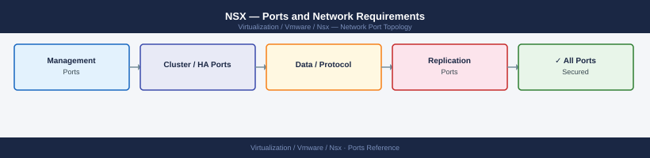

---
tags:
  - nsx
  - networking
  - firewall
  - ports
  - overlay
  - nsx-3
  - nsx-4
---
# NSX — Ports and Network Requirements

<div class="kb-summary">
Firewall port reference for VMware NSX-T / NSX. Covers NSX Manager API, management plane to transport nodes, Geneve overlay (TEP), BGP/BFD, IPsec, and NSX Federation. Required for any firewall boundary in the NSX control or data plane.

*Applies to: NSX-T 3.x / NSX 4.x*
</div>


## Before you begin

- NSX Manager runs as a 3-node cluster — all three manager IPs and the cluster VIP must be reachable on 443 from admin clients and from ESXi/Edge nodes
- TEP (Tunnel Endpoint) networks are overlay-only — size and route the TEP VLAN/subnet to reach all transport nodes and Edge TEPs
- BGP and BFD ports apply only if NSX T0 Gateway has external BGP uplinks configured
- IPsec ports apply only if NSX Gateway VPN is in use

---

## Inbound — Client / vCenter to NSX Manager

| Port | Protocol | Source | Purpose |
|---|---|---|---|
| 443 | TCP | Admin workstations, vCenter, Aria Operations, automation | NSX Manager UI, REST API, OVF deployment |
| 22 | TCP | Jump hosts | SSH — disable in production when not needed |

---

## NSX Manager to Transport Nodes (ESXi and Bare Metal)

The Management Plane Agent (MPA) on each transport node connects **outbound** to NSX Manager. These ports are initiated from transport nodes, but open them bidirectionally on any perimeter firewall.

| Port | Protocol | Source | Destination | Purpose |
|---|---|---|---|---|
| 443 | TCP | ESXi / Edge management IP | NSX Manager cluster IPs and VIP | MPA — Management Plane Agent connection |
| 1234 | TCP | NSX Manager | ESXi / Edge management IP | Controller ↔ transport node channel |
| 1235 | TCP | NSX Manager | ESXi / Edge management IP | Controller ↔ transport node channel (backup) |
| 5671 | TCP | ESXi management IP | NSX Manager | RabbitMQ — messaging bus (MPA config sync) |

---

## NSX Manager Cluster (Internal)

NSX Manager nodes communicate with each other on the management network:

| Port | Protocol | Between | Purpose |
|---|---|---|---|
| 443 | TCP | Manager nodes | Cross-manager REST API |
| 9092 | TCP | Manager nodes | Kafka message bus (internal configuration events) |
| 9443 | TCP | Manager nodes | Manager cluster control plane |
| 2380 | TCP | Manager nodes | etcd peer communication |
| 12345 | TCP | Manager nodes | NSX messaging |

---

## Geneve Overlay — TEP to TEP

All transport nodes (ESXi hosts and NSX Edge nodes) use Geneve encapsulation for overlay traffic. TEP VMkernel adapters communicate on a dedicated TEP VLAN.

| Port | Protocol | Between | Purpose |
|---|---|---|---|
| 6081 | UDP | ESXi TEP vmk ↔ ESXi TEP vmk | Geneve — VM-to-VM overlay traffic |
| 6081 | UDP | ESXi TEP vmk ↔ Edge TEP interface | Geneve — northbound traffic via Edge |
| 6081 | UDP | Edge TEP ↔ Edge TEP | Geneve — Edge cluster inter-node |

TEP MTU must be ≥1600 bytes to accommodate Geneve header overhead on a 1500-byte inner frame.

---

## BGP (T0 Gateway External Uplinks)

When NSX T0 Gateway peers with physical routers via BGP:

| Port | Protocol | Between | Purpose |
|---|---|---|---|
| 179 | TCP | Edge uplink IP ↔ Physical router IP | BGP session |
| 3784 | UDP | Edge uplink IP ↔ Physical router IP | BFD control (fast failover detection) |
| 4784 | UDP | Edge uplink IP ↔ Physical router IP | BFD echo |

---

## NSX Gateway VPN (IPsec)

When NSX Gateway VPN is configured for site-to-site connectivity:

| Port | Protocol | Between | Purpose |
|---|---|---|---|
| 500 | UDP | NSX Edge public IP ↔ remote gateway | IKEv2 key exchange |
| 4500 | UDP | NSX Edge public IP ↔ remote gateway | IKEv2 NAT traversal |
| 50 | IP (ESP) | NSX Edge public IP ↔ remote gateway | IPsec Encapsulating Security Payload |

---

## NSX Federation (Global / Local Manager)

| Port | Protocol | Between | Purpose |
|---|---|---|---|
| 443 | TCP | Global Manager → Local Manager | Federation configuration sync |
| 443 | TCP | Local Manager → Global Manager | Registration and heartbeat |

---

## Load Balancer Health Checks

NSX Service Router (Edge SR) initiates health checks to backend servers. No specific fixed port — the port is the application port configured on the pool member.

---

## Outbound — NSX Manager to External Services

| Port | Protocol | Destination | Purpose |
|---|---|---|---|
| 443 | TCP | Broadcom / VMware | License check, CEIP, call-home |
| 123 | UDP | NTP servers | Time synchronisation (required for certificate validity) |
| 514 | UDP/TCP | Syslog server | Log forwarding |

---

## Firewall Zone Summary

| From | To | Ports | Notes |
|---|---|---|---|
| Admin clients | NSX Manager VIP + nodes | 443 | API and UI |
| vCenter | NSX Manager VIP | 443 | vCenter plugin and integration |
| ESXi management IP | NSX Manager | 443, 5671 | MPA and RabbitMQ |
| NSX Manager | ESXi management IP | 1234, 1235 | Controller channel |
| NSX Manager nodes | NSX Manager nodes | 443, 9092, 2380 | Cluster internal |
| ESXi TEP vmk | ESXi TEP vmk | 6081 UDP | Geneve overlay — dedicated TEP VLAN |
| ESXi TEP vmk | Edge TEP interface | 6081 UDP | North-south overlay traffic |
| Edge uplink | Physical router | 179 TCP, 3784/4784 UDP | BGP + BFD (if BGP configured) |
| Edge public IP | Remote gateway | 500/4500 UDP, ESP | IPsec VPN (if configured) |
| Global Manager | Local Manager | 443 | Federation (if multi-site) |

---

## Verify

```bash
# From admin workstation — test NSX Manager API
curl -sk -o /dev/null -w "%{http_code}" https://<nsx-manager-vip>/api/v1/cluster/status

# From ESXi SSH — test MPA connectivity to NSX Manager
nc -zv <nsx-manager-ip> 443
nc -zv <nsx-manager-ip> 5671

# From ESXi SSH — check TEP VMkernel adapter
esxcli network ip interface list | grep -i tep
esxcli network ip interface ipv4 get -i <tep-vmk>

# From ESXi SSH — verify Geneve connectivity (ping remote TEP IP)
vmkping -d -s 1572 -I <tep-vmk> <remote-tep-ip>
# -d = do-not-fragment; -s 1572 = checks jumbo frame path

# From NSX Manager — check transport node status
# Via API:
curl -sk -u admin:<pass> https://<nsx-mgr>/api/v1/transport-nodes | python3 -m json.tool | grep -A3 '"state"'
```

---

## See also

- [vCenter — Ports](../../vcenter/architecture/ports.md)
- [ESXi — Ports](../../esxi/architecture/ports.md)
- [NSX — Architecture](how-it-works/)
- [NSX — Deploy](../../nsx/deploy/)
- [NSX — Operations](../../nsx/operations/)
