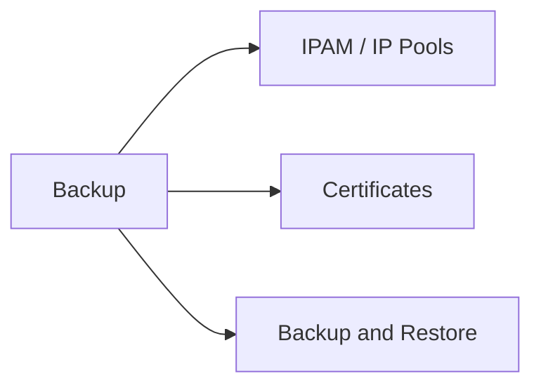

# IPAM, Certificates & Backup

> Part of the [NSX-T CLI Reference](../).



---

## IPAM / IP Pools

```bash
get ip-pools
get ip-pool <id>
get ip-pool <id> allocations
```

---

## Certificates

```bash
get certificates
get certificate <id>
get trust-objects
```

---

## Backup & Restore

```bash
get backup status
set backup schedule daily time 02:00
backup manual
get backup history
```
