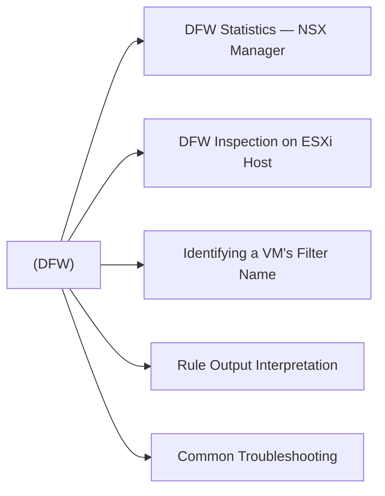

# Distributed Firewall (DFW)

> Part of the [NSX-T CLI Reference](../).



## DFW Statistics — NSX Manager

```bash
# Connect to NSX Manager CLI
nsxcli

# Firewall rule statistics (hit counts, bytes)
get firewall stats

# DFW summary across all transport nodes
get dfw stats
```

## DFW Inspection on ESXi Host

The DFW is enforced on each ESXi host via `vsipioctl`. All commands run as root on the ESXi host.

```bash
# List all DFW filters attached to VMs on this host
summarize-dvfilter

# Output format shows: vmname -> vnic -> filter_name
# Example filter name: nic-12345-eth0-vmware-sfw.2
```

```bash
# Get DFW rules applied to a specific filter
vsipioctl getrules -f <filter_name>

# Show address sets (IP groups, security groups) used in rules
vsipioctl getaddrsets -f <filter_name>

# Per-rule hit statistics for a filter
vsipioctl getstats -f <filter_name>

# Show service / port-protocol objects
vsipioctl getservices -f <filter_name>
```

## Identifying a VM's Filter Name

```bash
# Step 1 — find the VM's world ID
esxcli vm process list | grep -A5 <vm_name>

# Step 2 — list filters and match to VM
summarize-dvfilter | grep -A3 <vm_name>

# Step 3 — inspect rules for that filter
vsipioctl getrules -f <filter_name_from_step2>
```

## Rule Output Interpretation

```text
# Sample getrules output:
ruleset domain-c12:500  {
  rule 1234 at 1 inout protocol any from any to any accept;
  rule 1235 at 2 inout protocol tcp from addrset sg-web to addrset sg-db port {3306} accept;
  rule 65535 at 99 inout protocol any from any to any drop;
}
```

| Field | Meaning |
|---|---|
| `rule <id>` | NSX DFW rule ID — matches Policy > Security > Rules |
| `inout` | Applies to both ingress and egress |
| `addrset` | References a security group or IP set |
| `drop` | Packet silently dropped |
| `reject` | TCP RST / ICMP unreachable sent |
| `accept` | Traffic permitted |

## Common Troubleshooting

```bash
# Confirm DFW is enforced on a VM (filter count > 0)
summarize-dvfilter | grep -c <vm_name>

# Check if a rule is being hit (non-zero pkt count)
vsipioctl getstats -f <filter_name> | grep -v " 0 pkts"

# Temporarily check connectivity without DFW:
# In NSX Manager — Policy → Security → Gateway Firewall → disable rule
# Note: disabling DFW globally is a major security change — use exclusion list instead

# Add VM to DFW exclusion list (NSX Manager only, not CLI)
# System → Fabric → Nodes → Host Transport Nodes → DFW Exclusion List
```
