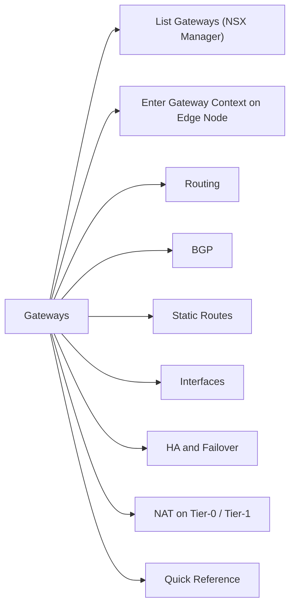

# Tier-0 and Tier-1 Gateways

> Part of the [NSX-T CLI Reference](../).



## List Gateways (NSX Manager)

```bash
# List all logical routers (Tier-0 and Tier-1)
nsxcli
get logical-routers
```

Output includes: UUID, VRF ID, type (TIER0 / TIER1), and Edge cluster.

## Enter Gateway Context on Edge Node

SSH to the Edge node, then:

```bash
# List all router VRFs on this Edge
get logical-routers

# Enter a specific router's VRF
vrf <vrf_id>

# Exit VRF context
exit
```

## Routing

```bash
# Show routing table (all protocols)
vrf <vrf_id>
get route

# Detailed route table (next-hop, preference, metric)
get route detail

# Filter for a specific prefix
get route <prefix>/<mask>

# Forwarding information base (FIB)
get forwarding
```

## BGP

```bash
# BGP neighbor summary (all peers, state, prefixes)
get bgp neighbor summary

# Detailed view of a specific neighbor
get bgp neighbor <neighbor_ip>

# Routes received from a neighbor
get bgp neighbor <neighbor_ip> routes

# Routes advertised to a neighbor
get bgp neighbor <neighbor_ip> advertised-routes

# BGP configuration summary
get bgp config
```

## Static Routes

```bash
# Static routes on this gateway
get route static
```

## Interfaces

```bash
# All interfaces (uplinks, downlinks, loopback)
get interfaces

# Specific interface detail
get interface <name>

# Interface counters (tx/rx bytes, drops)
get interface <name> counters
```

## HA and Failover

```bash
# HA state (Active/Standby)
get edge-cluster status

# Force failover to standby (Active→Standby)
# Only run on Active Edge node
set edge-cluster failover

# Edge high availability info
get high-availability channels
get high-availability status
```

## NAT on Tier-0 / Tier-1

```bash
# List NAT rules on this gateway
vrf <lr_id>
get nat rules

# NAT rule statistics (hit counters)
get nat rule stats
```

## Quick Reference

| Task | Command |
|---|---|
| Find gateway VRF ID | `get logical-routers` |
| Check BGP sessions | `vrf <id>` → `get bgp neighbor summary` |
| Verify route exists | `vrf <id>` → `get route <prefix>` |
| Check interface status | `vrf <id>` → `get interfaces` |
| Check HA state | `get edge-cluster status` |
| Force failover | `set edge-cluster failover` |
