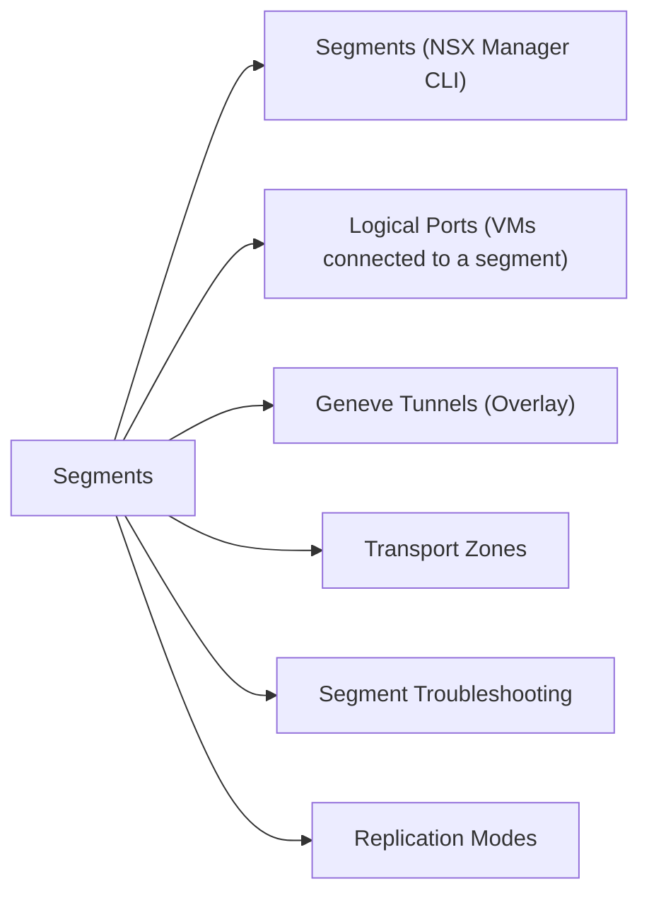

# Logical Switches & Segments

> Part of the [NSX-T CLI Reference](../).



## Segments (NSX Manager CLI)

```bash
nsxcli

# List all logical switches / segments
get logical-switches

# Detail for a specific segment (VNI, replication mode, transport zone)
get logical-switch <id>

# Operational status (UP/DOWN)
get logical-switch <id> status

# Traffic statistics for a segment
get logical-switch <id> stats
```

## Logical Ports (VMs connected to a segment)

```bash
# List all logical ports
get logical-ports

# Detail for a specific port
get logical-port <id>

# Port operational state
get logical-port <id> status

# Traffic stats on a specific port
get logical-port <id> stats
```

## Geneve Tunnels (Overlay)

Segments use Geneve encapsulation over the underlay. Verify tunnel health from NSX Manager CLI:

```bash
# List tunnel endpoints (TEPs) — shows VTEP IPs and state
get tunnel endpoints

# Tunnel status between all TEP pairs
get tunnel status

# Tunnel for a specific remote TEP
get tunnel status <remote_tep_ip>
```

## Transport Zones

```bash
# List transport zones (overlay and VLAN)
get transport-zone

# Transport zone detail (type, associated segments)
get transport-zone <name>
```

## Segment Troubleshooting

```bash
# Is the segment UP?
get logical-switch <id> status

# Find the VNI of a segment (needed for packet analysis)
get logical-switch <id> | grep VNI

# Which hosts have TEPs in this transport zone?
get transport-nodes

# Is the Geneve tunnel UP between two hosts?
get tunnel status <remote_tep_ip>

# On the ESXi host — confirm Geneve encap
esxcli network ip interface ipv4 get | grep vmk   # find vmk with vSAN/TEP tag
esxcli network ip route ipv4 list | grep <tep_subnet>
```

## Replication Modes

| Mode | Use Case |
|---|---|
| `MTEP` (Head-End Replication) | BUM traffic replicated by ingress TEP — simpler, higher bandwidth |
| `HIERARCHICAL_TWO_TIER` | Uses designated replicator — better for large environments |

```bash
# Check replication mode for a segment
get logical-switch <id> | grep -i replication
```
