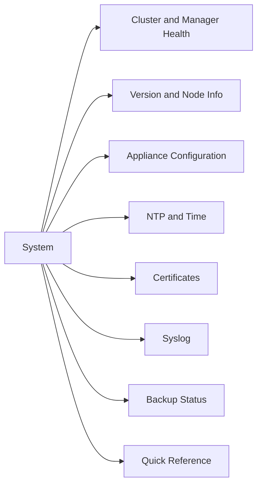

# NSX Manager — System

> Part of the [NSX-T CLI Reference](../).



## Cluster and Manager Health

```bash
nsxcli

# NSX Manager cluster members and status
get managers
get clusters
get cluster status

# Service status on this node
get services

# Specific service status
get service http
get service manager
get service controller
```

## Version and Node Info

```bash
# NSX version string
get version

# Cluster nodes and their roles
get nodes

# Node network interfaces
get node interfaces

# A specific interface
get node interface eth0
```

## Appliance Configuration

```bash
# Add a static route on the appliance (out-of-band management)
set appliance gw-route <prefix>/<mask> <gateway_ip>

# Check current appliance routes
get appliance routes

# Start or stop the NSX Manager UI
set appliance ui start
set appliance ui stop

# Set hostname
set appliance hostname <new_hostname>
```

## NTP and Time

```bash
# Check NTP status
get service ntp
get ntp servers

# Set NTP server
set service ntp server <ntp_ip>
```

## Certificates

```bash
# List installed certificates
get certificate api
get certificate cluster

# Thumbprint of the API cert (used for trust verification)
get certificate api thumbprint
```

## Syslog

```bash
# Show configured syslog exporters
get service syslog exporters

# Add a syslog target
set service syslog exporter <name> level info protocol UDP server <syslog_ip> port 514

# Remove an exporter
del service syslog exporter <name>
```

## Backup Status

```bash
# View backup configuration
get service manager backup

# Trigger a manual backup (NSX Manager UI is preferred)
# API: POST /api/v1/node/backups/create
```

## Quick Reference

| Task | Command |
|---|---|
| Cluster health | `get cluster status` |
| All services up? | `get services` |
| NSX version | `get version` |
| Node IPs | `get node interfaces` |
| BGP peer state | `vrf <id>` → `get bgp neighbor summary` |
| Corfu DB health | `get corfu-cluster status` |
| Syslog targets | `get service syslog exporters` |
