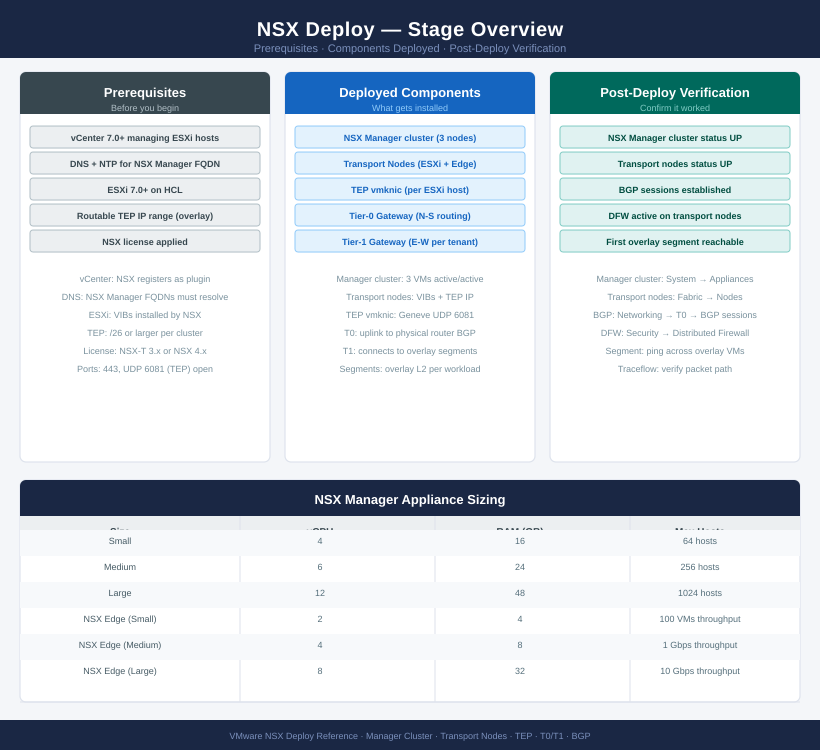
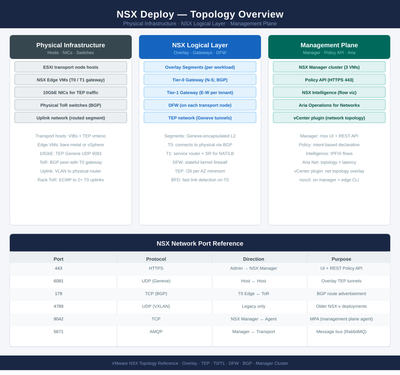

---
tags:
  - deployment
  - nsx
  - nsx-4
  - vmware
search:
  boost: 2
---
# NSX — Deploy

<div class="kb-summary">
End-to-end deployment guide for VMware NSX network virtualisation. Phases 1–2 establish prerequisites and the NSX Manager cluster; Phases 3–4 prepare transport zones, TEP profiles, and ESXi host transport nodes; Phases 5–6 deploy Edge nodes, configure T0/T1 gateways and overlay segments, then validate the full data path.

*Applies to: NSX-T 3.x / NSX 4.x*
</div>





---

## Before you begin

- **Access:** vCenter Administrator role and SSH access to VCSA/ESXi hosts
- **Environment:** DNS, NTP, and network connectivity verified before starting
- **Change management:** change request approved; maintenance window scheduled
- **Rollback:** snapshot or backup taken immediately before deployment begins
- **Time estimate:** 30–90 minutes — do not start if less than 2 hours are available

---

!!! warning "DFW enforcement change"
    Deploying or reconfiguring NSX affects distributed firewall policy across all hosts. Validate in monitor mode before enforcing. A misconfigured rule can block application traffic immediately.

## Phase 1 — Prerequisites

**Exit criterion:** DNS, NTP, MTU, and vCenter connectivity confirmed on all hosts; IP allocation plan documented.

### Infrastructure Readiness

| Check | Required Value | Notes |
|---|---|---|
| DNS forward + reverse | Resolves for all 3 Manager FQDNs + VIP | Required before OVA deploy |
| NTP | Same source as vCenter, drift < 500 ms | `esxcli system ntp get` |
| MTU on ToR switches | 9000 (all ports carrying TEP traffic) | Geneve encapsulation overhead |
| vCenter version | 7.0 U2+ for NSX 4.x | Verify interop matrix |
| Host NIC firmware | On NSX HCL | Check Broadcom HCL portal |

### IP Allocation Plan

Reserve before deployment (document in runbook):

```text
NSX Manager node 1:  10.10.0.11/24   nsx-mgr01.example.local
NSX Manager node 2:  10.10.0.12/24   nsx-mgr02.example.local
NSX Manager node 3:  10.10.0.13/24   nsx-mgr03.example.local
NSX Manager VIP:     10.10.0.10/24   nsx-manager.example.local  (DNS A-record → VIP)

TEP subnet (compute): 192.168.100.0/24   pool: .10–.254
TEP subnet (edge):    192.168.101.0/24   pool: .10–.30
Edge uplink 1:        10.10.10.1/30
Edge uplink 2:        10.10.10.5/30
BGP ASN (NSX):        65100
BGP ASN (ToR):        65200
```

### MTU Verification (Pre-Deploy)

```bash
# From each ESXi host — confirm jumbo frames to the ToR before NSX install
vmkping -I vmk0 -d -s 8972 <tor-switch-ip>
# 0% loss = MTU 9000 path confirmed
# Any loss = fix switch port MTU before proceeding
```

---

## Phase 2 — NSX Manager Cluster

**Exit criterion:** Three NSX Manager nodes deployed, clustered, VIP configured, and vCenter registered as compute manager.

### Deploy NSX Manager Node 1

In vCenter: **Actions → Deploy OVF Template**, select the NSX Manager OVA:

```text
Deployment size: Medium (production) — 4 vCPU / 16 GB RAM / 200 GB disk
Thick Eager-Zeroed provisioning for production
Network: Management portgroup

Customise template:
  Hostname:       nsx-mgr01.example.local
  IPv4 address:   10.10.0.11
  Netmask:        255.255.255.0
  Gateway:        10.10.0.1
  DNS:            10.10.0.5, 10.10.0.6
  NTP:            ntp1.example.local, ntp2.example.local
  Admin password: <20+ char, upper+lower+special+digit>
  Audit password: <separate audit account password>
```

Repeat for nodes 2 and 3 (10.10.0.12, 10.10.0.13).

### Form the Cluster

```bash
# SSH to node 2, join to node 1
nsxcli

# Get node 1's API certificate thumbprint from node 1 first
get certificate api thumbprint
# Copy the thumbprint string

# On node 2
join management-plane 10.10.0.11 username admin thumbprint <node1-thumbprint>

# Repeat on node 3
join management-plane 10.10.0.11 username admin thumbprint <node1-thumbprint>

# Verify cluster health from any node
get cluster status
# Expected: "STABLE" with 3 members
```

### Configure the Cluster VIP

```bash
# From NSX Manager UI: System → Appliances → Set Virtual IP
# Or via API:
curl -sk -u 'admin:<password>' -X PUT \
  "https://10.10.0.11/api/v1/cluster/api-virtual-ip?action=set_virtual_ip&ip_address=10.10.0.10"

# Verify VIP is reachable
ping 10.10.0.10
# UI accessible at https://nsx-manager.example.local
```

### Register vCenter as Compute Manager

**System → Fabric → Compute Managers → Add**

```text
Display name:  vCenter-Prod
FQDN:          vcenter.example.local
Username:      administrator@vsphere.local
Password:      <password>
Accept SSL thumbprint when prompted
```

Status must reach `Registered` before proceeding.

### Configure SFTP Backup

**System → Backup & Restore → Configure**

```text
Protocol:    SFTP
Host:        backup-server.example.local
Port:        22
Directory:   /backups/nsx/
Username:    nsx-backup
Passphrase:  <encrypt passphrase — store in vault>
Schedule:    Daily 02:00
Retain:      14 copies
```

Test the connection before saving.

---

## Phase 3 — Transport Zones and Profiles

**Exit criterion:** Overlay and VLAN transport zones created; uplink profile and TEP IP pools configured.

### Create Transport Zones

**System → Fabric → Transport Zones → Add**

| Name | Type | Purpose |
|---|---|---|
| `tz-overlay-compute` | Overlay (Geneve) | Compute workload segments |
| `tz-vlan-edge` | VLAN | Edge node uplinks to physical routers |

### Create TEP IP Pools

**Networking → IP Management → IP Address Pools → Add**

```yaml
# Compute TEP pool
Name:    pool-tep-compute
Subnet:  192.168.100.0/24
Gateway: 192.168.100.1
Ranges:  192.168.100.10–192.168.100.254

# Edge TEP pool
Name:    pool-tep-edge
Subnet:  192.168.101.0/24
Gateway: 192.168.101.1
Ranges:  192.168.101.10–192.168.101.30
```

### Create Uplink Profile

**System → Fabric → Profiles → Uplink Profiles → Add**

```text
Name:             uplink-profile-compute
Active uplinks:   uplink-1, uplink-2
Standby uplinks:  (empty — use active/active teaming or LACP)
Transport VLAN:   <TEP VLAN ID — e.g. 100>
MTU:              9000
```

### Create Host Transport Node Profile

**System → Fabric → Profiles → Host Transport Node Profiles → Add**

```text
Name:             tn-profile-compute
vDS:              select production vDS
Transport zones:  tz-overlay-compute
Uplink profile:   uplink-profile-compute
IP pool:          pool-tep-compute
Uplink mapping:   uplink-1 → vmnic2, uplink-2 → vmnic3
```

---

## Phase 4 — Host Transport Node Preparation

**Exit criterion:** All ESXi hosts in the cluster show `Success` in the transport node config state; TEP-to-TEP pings pass between all hosts.

### Apply Transport Node Profile to Cluster

**System → Fabric → Hosts → [cluster] → Configure NSX**

```text
Select: tn-profile-compute
Apply to entire cluster
Monitor: Configuration column — each host progresses from "In Progress" → "Success"
```

### Verify Transport Nodes

```bash
# From NSX Manager CLI
nsxcli
get transport-nodes
get transport-node-status
# All hosts: state = UP

# Verify TEP IP assignment
get logical-switch port
```

### TEP-to-TEP Connectivity Test

```bash
# SSH to each ESXi host — ping all other TEP IPs
# TEP vmkernel is typically vmk10 after NSX preparation
vmkping -I vmk10 -d -s 1500 192.168.100.11
vmkping -I vmk10 -d -s 1500 192.168.100.12
vmkping -I vmk10 -d -s 1500 192.168.100.13
# 0% loss required on all tests
# If loss: check TEP VLAN tagging on uplink profile and switch trunk config
```

---

## Phase 5 — Edge Cluster and T0 Gateway

**Exit criterion:** Edge cluster deployed, T0 BGP sessions established with ToR switches, routes advertised.

### Deploy Edge Transport Nodes

Deploy Edge VMs via **System → Fabric → Edge Transport Nodes → Add**:

```text
Name:           edge-node-01
Form factor:    Large (8 vCPU / 32 GB — production)
Host:           dedicated-edge-esxi-host-01  (NOT on compute hosts)
Management IP:  10.10.0.21/24
DNS:            10.10.0.5
NTP:            ntp1.example.local

Transport configuration:
  Overlay TZ:  tz-overlay-compute
  VLAN TZ:     tz-vlan-edge
  Uplink profile: uplink-profile-edge
  TEP pool:    pool-tep-edge
  fp-eth0 → edge-uplink portgroup 1 (ToR VLAN)
  fp-eth1 → edge-uplink portgroup 2 (ToR VLAN — second path)
```

Repeat for edge-node-02 on a different host.

```bash
# Verify Edge transport node status
nsxcli
get transport-nodes | grep edge
# Both Edge nodes: state = UP
```

### Create Edge Cluster

**System → Fabric → Edge Clusters → Add**

```text
Name:          edge-cluster-prod
Edge nodes:    edge-node-01, edge-node-02
BFD:           enabled (fast failure detection, 300 ms)
```

### Create T0 Gateway

**Networking → Tier-0 Gateways → Add**

```text
Name:          T0-Prod
HA Mode:       Active/Standby
Edge cluster:  edge-cluster-prod

Interfaces → Add:
  Type:         External
  Name:         T0-uplink-edge01
  IP:           10.10.10.2/30
  Connected to: edge-node-01 / fp-eth0 (VLAN-backed segment)

  Type:         External
  Name:         T0-uplink-edge02
  IP:           10.10.10.6/30
  Connected to: edge-node-02 / fp-eth0
```

### Configure BGP on T0

```text
Networking → T0-Prod → Routing → BGP
  Local AS:     65100
  Graceful restart: Enabled

BGP Neighbor 1:
  Neighbor IP:  10.10.10.1   (ToR 1)
  Remote AS:    65200
  BFD:          Enabled

BGP Neighbor 2:
  Neighbor IP:  10.10.10.5   (ToR 2)
  Remote AS:    65200
  BFD:          Enabled
```

```bash
# Verify BGP from Edge node CLI
get bgp neighbor summary
# Both neighbors: State = Established

# Verify routes received from physical fabric
get route
# Physical fabric prefixes should appear in routing table
```

---

## Phase 6 — Logical Networking and Validation

**Exit criterion:** T1 gateway, overlay segment, and DFW baseline policy in place; east-west and north-south traffic tested.

### Create T1 Gateway

**Networking → Tier-1 Gateways → Add**

```text
Name:          T1-Tenant-01
Linked T0:     T0-Prod
Edge cluster:  edge-cluster-prod  (required for stateful services: NAT, LB)

Route advertisement:
  Connected segments: Enabled
  Static routes:      Enabled (if applicable)
```

### Create Overlay Segment

**Networking → Segments → Add**

```text
Name:          seg-web-tier
Transport zone: tz-overlay-compute
Connected gateway: T1-Tenant-01 / routed
Subnets:       192.168.50.1/24
```

Attach test VMs to `seg-web-tier` and verify:

```bash
# From a VM on seg-web-tier — verify gateway reachability
ping 192.168.50.1

# From NSX Manager — check segment VNI assignment
nsxcli
get logical-switch seg-web-tier | grep VNI
```

### DFW Baseline Policy

**Security → Distributed Firewall → Add Policy**

```text
Category:  Infrastructure
Policy name: Allow-Management

Rules:
  1. Allow SSH from mgmt subnet (10.10.0.0/24) → ANY, port 22
  2. Allow monitoring from monitoring subnet → ANY, ICMP + ports 161, 9100
  3. Allow backup traffic → backup subnet, port 22
  4. Deny ALL (default rule 65535 — do not modify, remains DROP)
```

```bash
# Verify DFW rules pushed to hosts
# SSH to any ESXi host
summarize-dvfilter
# Each VM vNIC should have a vmware-sfw filter listed

vsipioctl getrules -f <filter-name>
# Infrastructure allow rules should appear
```

### End-to-End Validation

```bash
# East-West: VM on seg-web-tier pings VM on a second segment via T1
ping <vm2-ip>

# North-South: VM reaches external IP via T0 BGP path
ping 8.8.8.8

# NSX Manager route table
nsxcli
get route
# Default route via T0 uplinks should be present

# BGP summary from both Edge nodes
get bgp neighbor summary
# All peers: Established, Prefixes Received > 0
```

### Post-Deployment Checklist

| Check | Command / Location | Pass Criterion |
|---|---|---|
| NSX Manager cluster | `get cluster status` | STABLE — 3 members |
| vCenter compute manager | System → Fabric → Compute Managers | Status: Registered |
| All transport nodes UP | `get transport-node-status` | All hosts: UP |
| TEP connectivity | `vmkping -I vmk10 -d -s 1500 <peer-TEP>` | 0% loss |
| Edge cluster health | `get edge-cluster status` | Active/Standby confirmed |
| BGP sessions | `get bgp neighbor summary` (Edge CLI) | All peers: Established |
| T0 route table | `get route` (Edge CLI) | Default + fabric routes present |
| T1 route advertisement | Networking → T1 → Route Advertisement | Connected segments: Enabled |
| Overlay segment | VM ping to T1 gateway IP | Reachable |
| DFW rule push | `summarize-dvfilter` (ESXi host) | vmware-sfw filter on all vNICs |
| NSX backup | System → Backup & Restore | Last backup: successful |

---

## See also

- [NSX — How It Works](../architecture/how-it-works/)
- [NSX — Health Checks](../operations/health-checks/)
- [NSX — Common Issues](../troubleshooting/common-issues/)

## Verify

- **Manager cluster:** NSX UI → System → Overview — all nodes Active, cluster Stable
- **Transport nodes:** Fabric → Nodes → Host Transport Nodes — all nodes Configured/Success
- **Edge cluster:** Fabric → Nodes → Edge Transport Nodes — all edges Up
- **Connectivity test:** NSX UI → Tools → Traceflow — send a packet between two VMs on different segments
